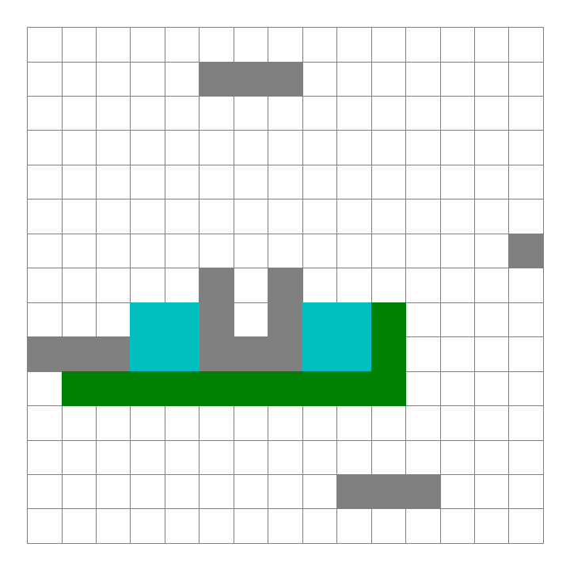

---
date:
    created: 2024-10-04
    updated: 2024-11-16
readtime: 45
categories:
    - AI
tags: 
    - Algorithm
    - Math
---
# A*算法概述及其Python实现

A*算法是一种图形路径中寻找最短路径的算法，它属于启发式搜索算法。
<!-- more -->

## 概述

输入为：图结构 Graph

输出为：最短路

利用当前代价 $g(n)$ + 预估代价 $h(n)$，即两者之和总代价 $f(n)$ 最低值的方向进行探索。

$$
f(n) = g(n) + h(n)
$$

当前代价：从起点到当前方块的步数

预估代价：下述距离计算得出的值，也就是A*算法的启发函数

最常用的预估代价计算方式：

- 欧拉距离（Euler Distance）也就是两点直线距离，如果可以朝向任何方向移动
- 曼哈顿距离（Manhattan Distance）也就是两点在竖直方向和水平方向上的距离总和，最适合在上下左右四个方向移动

A*算法在运算过程中，每次从优先队列中选取$f(n)$值最小（优先级最高）的节点作为下一个待遍历的节点。


## 伪代码

```python
- 初始化open_set和close_set；
- 将起点加入open_set中，并设置优先级为0（优先级最高）；
- 如果open_set不为空，则从open_set中选取优先级最高的节点n：
    - 如果节点n为终点，则：
        - 从终点开始逐步追踪parent节点，一直达到起点；
        - 返回找到的结果路径，算法结束；
    - 如果节点n不是终点，则：
        - 将节点n从open_set中删除，并加入close_set中；
        - 遍历节点n所有的邻近节点：
            - 如果邻近节点m在close_set中，则：
                - 跳过，选取下一个邻近节点
            - 如果邻近节点m也不在open_set中，则：
                - 设置节点m的parent为节点n
                - 计算节点m的优先级
                - 将节点m加入open_set中
```

## 流程图


## 算法实现

`point.py`

````python
# -*- coding: utf-8 -*-
"""
@author: 俞晨聪

point.py
"""

import sys 

class Point:
    """描述图中的点"""
    def __init__(self, x, y):
        self.x = x
        self.y = y
        self.g = 0
        
        self.cost = sys.maxsize

````

`random_map.py`

```python
# -*- coding: utf-8 -*-
"""
Created on Wed Oct 16 09:53:51 2024

@author: 俞晨聪
random_map
"""

import numpy as np
import point

class RandomMap:
    def __init__(self, size=15):    # 默认大小为30X30
        self.size = size
        self.obstacle = size//2
        self.GenerateObstacle()
        self.start_point = None
        self.end_point = None
        self.SetStartPoint()
        self.SetEndPoint()
        
    def GenerateObstacle(self):
        self.obstacle_point = []
        # add two fixed points in the center of the grid
        self.obstacle_point.append(point.Point(self.size//2, self.size//2))
        self.obstacle_point.append(point.Point(self.size//2, self.size//2-1))
        
        # Generate an obstacle in the middle
        # for i in range(self.size//2-4, self.size//2): 
            # self.obstacle_point.append(point.Point(i, self.size-i))
            # self.obstacle_point.append(point.Point(i, self.size-i-1))
            # self.obstacle_point.append(point.Point(self.size-i, i))
            # self.obstacle_point.append(point.Point(self.size-i, i-1))
            
        for i in range(self.obstacle - 1):
            x = np.random.randint(0, self.size)
            y = np.random.randint(0, self.size)
            self.obstacle_point.append(point.Point(x, y))

            if (np.random.rand() > 0.5): # Random boolean
                for l in range(self.size//4):
                    self.obstacle_point.append(point.Point(x, y+l))
                    pass
            else:
                for l in range(self.size//4):
                    self.obstacle_point.append(point.Point(x+l, y))
                    pass
                
    
    def IsObstacle(self, i, j):
        for p in self.obstacle_point:
            if i == p.x and j == p.y:
                return True
        return False
    
    def SetStartPoint(self):
        while True:
            x = np.random.randint(0, self.size)
            y = np.random.randint(0, self.size)
            if not self.IsObstacle(x, y):
                self.start_point = point.Point(x, y)
                self.start_point.cost = 0
                self.start_point.g = 0
                break

    def SetEndPoint(self):
        while True:
            x = np.random.randint(0, self.size)
            y = np.random.randint(0, self.size)
            if not self.IsObstacle(x, y) and (x, y) != (self.start_point.x, self.start_point.y):
                self.end_point = point.Point(x, y)
                break
```

`a_star.py`

```python
# -*- coding: utf-8 -*-
"""
Created on Wed Oct 16 10:07:04 2024

@author: 俞晨聪
a_star
"""

import sys
import time


from matplotlib.patches import Rectangle

import point

class AStar:
    def __init__(self, map):
        self.map = map
        self.open_set = []
        self.close_set = []
        
        self.start = map.start_point
        self.end = map.end_point
        
    
    def BaseCost(self, p):
        """当前代价"""
        return p.g
    
    def HeuristicCost(self, p, end):
        """预估代价，启发函数"""
        x_dis = abs(p.x - end.x)
        y_dis = abs(p.y - end.y)
        return x_dis + y_dis
    
    def TotalCost(self, p, s, e):
        """总代价"""
        return self.BaseCost(p) + self.HeuristicCost(p, e)

    def IsValidPoint(self, x, y):
        """判断点是否有效，不在地图内部或者障碍物所在点都是无效的。"""
        if x < 0 or y < 0:
            return False
        if x >= self.map.size or y >= self.map.size:
            return False
        return not self.map.IsObstacle(x, y)

    def IsInPointList(self, p, point_list):
        """判断是否在某个集合中"""
        for i in point_list:
            if i.x == p.x and i.y == p.y:
                return True
        return False
    
    def IsInOpenList(self, p):
        """判断是否在open_set中"""
        return self.IsInPointList(p, self.open_set)

    def IsInCloseList(self, p):
        """判断点是否在close_set中。"""
        return self.IsInPointList(p, self.close_set)  
    
    def IsStartPoint(self, p):
        """判断点是否是起点。"""
        return p.x == self.start.x and p.y == self.start.y

    def IsEndPoint(self, p):
        """判断点是否是终点。"""
        return p.x == self.end.x and p.y == self.end.y
    
    def RunAndSaveImage(self, ax, plt):
        start_time = time.time()
        start_point = self.start
        self.open_set.append(start_point)
        
        while True:
            index = self.SelectPointInOpenList()
            if index < 0:
                print('No path found')
                return
            p = self.open_set[index]
            rec = Rectangle((p.x, p.y), 1, 1, color='c')
            ax.add_patch(rec)
            self.SaveImage(plt)
            
            if self.IsEndPoint(p):
                return self.BuildPath(p, ax, plt, start_time)
            
            del self.open_set[index]
            self.close_set.append(p)
            
            # Process all neighbors
            x = p.x
            y = p.y
            self.ProcessPoint(x-1, y, p)
            self.ProcessPoint(x, y-1, p)
            self.ProcessPoint(x+1, y, p)
            self.ProcessPoint(x, y+1, p)
        
    def SaveImage(self, plt):
        """将当前状态保存到图片中，图片以当前时间命名。"""
        millis = int(round(time.time() * 1000))
        filename = './picture_processing/' + str(millis) + '.png'
        plt.savefig(filename)
    
    def SelectPointInOpenList(self):
        """从open_set中找到优先级最高的节点，返回其索引。"""
        index = 0
        selected_index = -1
        min_cost = sys.maxsize
        for p in self.open_set:
            cost = self.TotalCost(p, self.start, self.end)
            if cost < min_cost:
                min_cost= cost
                selected_index = index
            index += 1
        return selected_index
    
    def ProcessPoint(self, x, y, parent):
        """
        针对每一个节点进行处理：
        如果是没有处理过的节点，则计算优先级设置父节点，并且添加到open_set中。
        """
        if not self.IsValidPoint(x, y):
            return
        
        p = point.Point(x, y)
        
        if self.IsInCloseList(p):
            return
    
        # 如果点已经在open_set中，并且新的路径更短，则更新
        if self.IsInOpenList(p):
            current_g = parent.g + 1
            if current_g < p.g:
                p.g = current_g
                p.parent = parent
            return
        
        # 如果点不在开放列表中，添加它，并设置其g值和父节点
        if not self.IsInOpenList(p):
            p.g = parent.g + 1
            p.parent = parent
            p.cost = self.TotalCost(p, self.start, self.end)
            print('Process Point [', p.x, ',', p.y, ']', ', cost: ', p.cost)
            self.open_set.append(p)
    
    def BuildPath(self, p, ax, plt, start_time):
        """
        从终点往回沿着parent构造结果路径。
        然后从起点开始绘制结果，结果使用绿色方块，每次绘制一步便保存一个图片。
        """
        path = []
        while True:
            path.insert(0, p)
            if self.IsStartPoint(p):
                break
            else:
                p = p.parent
        
        for p in path:
            rec = Rectangle((p.x, p.y), 1, 1, color='g')
            ax.add_patch(rec)
            plt.draw()
            self.SaveImage(plt)
            end_time = time.time()
        print('===== Algorithm finish in', int(end_time-start_time), ' seconds')
        """判断点是否是终点"""
        return p.x == self.end.x and p.y == self.end.y
```

## 测试

`main.py`

```python
# -*- coding: utf-8 -*-
"""
Created on Wed Oct 16 11:00:23 2024

@author: 俞晨聪
"""

import matplotlib.pyplot as plt

from matplotlib.patches import Rectangle

import random_map
import a_star


plt.figure(figsize=(10, 10))

map = random_map.RandomMap() 

ax = plt.gca()
ax.set_xlim([0, map.size]) 
ax.set_ylim([0, map.size])

for i in range(map.size): 
    for j in range(map.size):
        if map.IsObstacle(i,j):
            rec = Rectangle((i, j), width=1, height=1, color='gray')
            ax.add_patch(rec)
        else:
            rec = Rectangle((i, j), width=1, height=1, edgecolor='gray', facecolor='w')
            ax.add_patch(rec)

rec = Rectangle((map.start_point.x, map.start_point.y), width = 1, height = 1, facecolor='b')
ax.add_patch(rec) 

rec = Rectangle((map.end_point.x, map.end_point.y), width = 1, height = 1, facecolor='r')
ax.add_patch(rec) 

plt.axis('equal') 
plt.axis('off')
plt.tight_layout()
#plt.show()

a_star = a_star.AStar(map)
a_star.RunAndSaveImage(ax, plt) 
```




## 资料参考

[路径规划之 A* 算法](https://paul.pub/a-star-algorithm/#id-%E5%AF%B9%E8%A7%92%E8%B7%9D%E7%A6%BB)

[Introduction to the A* Algorithm](https://www.redblobgames.com/pathfinding/a-star/introduction.html)

[Introduction to A*](https://theory.stanford.edu/~amitp/GameProgramming/AStarComparison.html)

[Implementation of A*](https://www.redblobgames.com/pathfinding/a-star/implementation.html)

[A*寻路算法详解](https://www.bilibili.com/video/BV1bv411y79P/)
