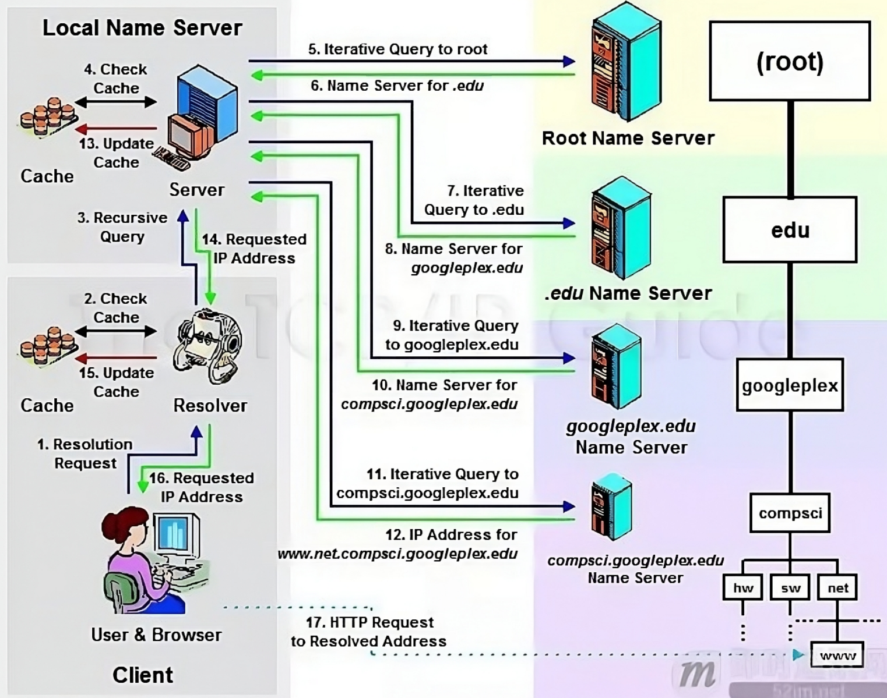
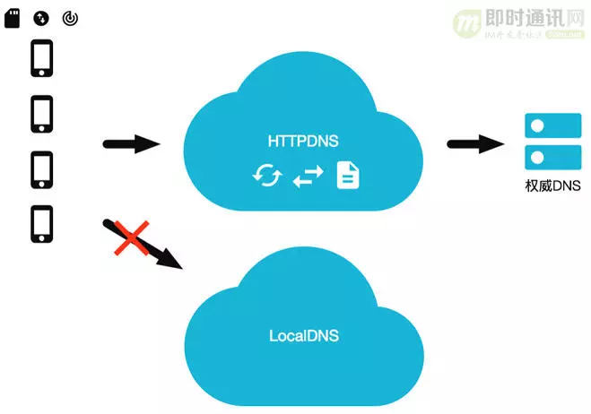

---
date:
    created: 2024-12-26
    updated: 2024-12-30
categories:
    - ComputerNetwork
tags:
    - ComputerNetwork
    - DNS
    - HTTPDNS
    - 短地址
---

# DNS、HTTPDNS和短地址讲解

简单的介绍一下DNS、HTTPDNS和短地址。

<!--more-->

## DNS

这里有一个讲解DNS的有趣的图片，简单的描述了DNS的作用：

### 什么是DNS

域名系统 (DNS) 是互联网电话簿。人们通过例如 nytimes.com 或 espn.com 等域名在线访问信息。Web 浏览器通过 互联网协议 （IP） 地址进行交互。DNS 将域名转换为 IP 地址，以便浏览器能够加载互联网资源。

连接到互联网的每个设备都有一个唯一 IP 地址，其他计算机可使用该 IP 地址查找此设备。DNS 服务器使人们无需存储例如 192.168.1.1（IPv4 中）等 IP 地址或更复杂的较新字母数字 IP 地址，例如 2400:cb00:2048:1::c629:d7a2（IPv6 中）。

!!! note "维基百科中DNS的定义"

    域名系统（英语：Domain Name System，缩写：DNS）是互联网的一项服务。它作为将域名和IP地址相互映射的一个分布式数据库，能够使人更方便地访问互联网。DNS使用TCP和UDP端口53。当前，对于每一级域名长度的限制是63个字符，域名总长度则不能超过253个字符。

### 域名解析过程

下面的图片比较详细的描述了域名解析的过程：

1.浏览器中輸入`www.linkedkeeper.com`,发出解析请求。

2.本机的域名解析器 resolver 程序查询本地缓存和host文件中是否为域名的映射关系，如果有则调用这个IP地址映射，完成解析。

3.如果hosts与本地解析器缓存都没有相应的网址映射关系，则本地解析器会向TCP/IP参数中设置的首选DNS服务器（我们叫它 **Local DNS服务器** ）发起一个 **递归的查询请求**。

4.服务器收到查询时，如果要查询的域名由本机负责解析，则返回解析结果给客户机，完成域名解析，此解析具有权威性。如果要查询的域名，不由Local DNS服务器解析，但该服务器已缓存了此网址映射关系，则调用这个P地址映射，完成域名解析，此解析不具有权威性。

5.如果Local DNS服务器本地区域文件与缓存解析都失效，则根据Local DNS服务器的设置（是否递归）进行查询，如果未用开启模式，Local DNS就把请求发至13台Root DNS。如果用的是递归模式，此DNS服务器就会把请求转发至上一级DNS服务器，由上一级服务器进行解析，上一级服务器如果不能解析，或找根DNS或把转请求转至上上级，以此循环。

6.Root DNS服务器收到情求后会判断这个域名是谁来授权管理，并会返回一个负责该顶级域名服务器的一个IP。

7.Local DNS服务器收到IP信息后，将会联系负责`.com`域的这台服务器。

8.负责`.com`域的服务器收到情求后，如果自己无法解析，它就会找一个管理`.com`域的下一级DNS服务器地址给本地DNS服务器。

9.当Local DNS服务器收到这个地址后，就会找`linkedkeeper.com`域服务器，10、11重复上面的动作，进行查询。

10.最后`www.linkedkeeper.com`返回需要解析的域名的IP地给Local DNS服务器。

11.Local DNS服务器缓存这个解析结果(同时也会缓存，6、8、10返回的结果)。

12.Local DNS服务器同时将结果返回给本机域名解析器。

13.本机缓存解析结果。

14.本机解析器将结果返回给浏览器。

15.浏览器通过返回的IP地址发起请求。

### 涉及到的 DNS 服务器分类

DNS 解析器：该解析器可被视为被要求去图书馆的某个地方查找特定图书的图书馆员。DNS 解析器是一种服务器，旨在通过 Web 浏览器等应用接收客户端计算机的查询。然后，解析器一般负责发出其他请求，以便满足客户端的 DNS 查询。

根域名服务器：根域名服务器是将人类可读的主机名转换（解析）为 IP 地址的第一步。可将其视为指向不同书架的图书馆中的索引 - 一般其作为对其他更具体位置的引用。

TLD 名称服务器：顶级域名服务器（TLD），可看做是图书馆中一个特殊的书架。这个域名服务器是搜索特定 IP 地址的下一步，其上托管了主机名的最后一部分（例如，在 example.com 中，TLD 服务器为 “com”）。

权威性域名服务器：可将这个最终域名服务器视为书架上的字典，其中特定名称可被转换成其定义。权威性域名服务器是域名服务器查询中的最后一站。如果权威性域名服务器能够访问请求的记录，则其会将已请求主机名的 IP 地址返回到发出初始请求的 DNS 解析器（图书管理员）。

本地域名服务器：当一个主机发出 DNS 查询的时候，首先就是发送给本地域名服务器。每一个互联网提供者 ISP ,或者一个大学都可以有自己的本地域名服务器。如果是通过DHCP配置，本地 DNS 由你的网络服务商（ISP），如电信、移动等自动分配，它通常就在你网络服务商的某个机房。

### 递归查询和迭代查询

递归查询：如果主机所询问的本地域名服务器不知道被查询域名的P地址，那么本地域名服务器就以DNS客户的身份，向其他根域名服务器继续发出查询请求报文，而不是让该主机自己进行下步的查询。 请别人帮忙完成查询

迭代查询：当根域名服务器收到本地域名服务器发出的迭代查询请求报文时，要么给出所要查询的IP地址，要么告诉本地域名服务器：你下步应当向哪一个域名服务器进行查询。然后让本地域名服务器进行后续的查询，而不是替本地域名服务器进行后续的查询。 自己主动去完成查询

由此可见，客户端到Local DNS服务器，Local DNS与上级DNS服务器之间属于递归查询；DNS服务器与根DNS服务器之前属于迭代查询。

实际环境中，因为采用递归模式会导致DNS服务器流量很大，所以现在大多数的DNS都是迭代模式。

### 传统DNS存在的问题

1.域名缓存问题

2.域名转发问题

3.出口 NAT 问题

4.DNS 域名更新问题

5.解析延迟问题

6.运营商劫持问题

## HTTPDNS

HTTPNDS 其实就是，不走传统的 DNS 解析，而是自己搭建基于 HTTP 协议的 DNS 服务器集群，分布在多个地点和多个运营商。当客户端需要 DNS 解析的时候，直接通过 HTTP 协议进行请求这个服务器集群，得到就近的地址。

同时因为默认的域名解析都是走 DNS 的，使用 HTTPDNS 需要绕过默认的 DNS 路径，所以使用 HTTPDNS 的，大多数是手机应用，需要在手机端嵌入支持 HTTPDNS 的客户端 SDK。

### 主要解决的问题

Local DNS 劫持：由于 HttpDns 是通过 IP 直接请求 HTTP 获取服务器 A 记录地址，不存在向本地运营商询问 domain 解析过程，所以从根本避免了劫持问题。

平均访问延迟下降：由于是 IP 直接访问省掉了一次 domain 解析过程，通过智能算法排序后找到最快节点进行访问。

用户连接失败率下降：通过算法降低以往失败率过高的服务器排序，通过时间近期访问过的数据提高服务器排序，通过历史访问成功记录提高服务器排序。

## 短地址

短地址（Short URL）是一种将长网址转换为短网址的技术。短地址通常由一个简短的字符串组成，指向原始的长网址。

### 解决的痛点

长网址：长网址通常包含大量的信息，如完整的 URL、查询参数、协议类型等，这些信息在某些场景下可能不必要，或者不便于直接展示。比如下面的长网址：`https://plogin.m.jd.com/login/login?appid=300&returnurl=http%3A%2F%2Fwq.jd.com%2Fpassport%2FLoginRedirect%3Fstate%3D1162758085_1281903627_286524_45213656%26returnurl%3Dhttp%253A%252F%252Fwjorder-http.jd.com%252Fscan%252Fnp%253FencodePrcode%253D2hP_lwNr%2526encodeShcode%253D2-S83%2526businessSource%253D1%2526scanSkuType%253D2%2526ec%253D1%2526salerId%253D167916%2526discountsUrl%253D%25252F%25252Fcoupon.m.jd.com%25252Fcoupons%25252Fshow.action%25253FlinkKey%25253DAAROH_xIpeffAs_-naABEFoePLd7eC4GJgwsPUkFtDqklu805DO1cEqFyTHVT7fbD12AHD7DElAKgh0pfvQpX-E5PbgwLQ%2526unionId%253D1001465750&source=wq_passport`，共计 300 多个字符，在短信和许多平台（如微博）中，无法发布出去，而且其生成的二维码图片也非常复杂，导致手机扫描识别困难。

使用短网址服务缩短上面长网址后的短网址（`3.cn/1jK-CDAE`），仅有13个字符，在微博、短信等场景中发送十分容易，而且简洁清晰，用户体验极好，生成二维码图片也非常简单。

### 短网址的原理

短网址服务是如何将那么多的长网址对应到相应的短网址呢？
短网址通常结构如下：域名／短网址id。
短网址 id  其通常由 26 个大写字母 + 26 小写字母 +10 个数字 即 62 种字符组成，随机生成 6 到 7 个，然后组成对应一个 短网址 id，并存入相应的数据存储服务中。
当短网址被访问的时候，短网址的解析服务，会根据 id 查询到对应页面从而实现相应的跳转。
原理：打开短链接的时候，通过 302 的方式，即临时重定向的方式进行跳转
为什么要用62进制转换？

62进制转换是因为62进制转换后只含数字+小写+大写字母。而64进制转换会含有/,+这样的符号（不符合正常URL的字符）
10进制转62进制可以缩短字符，如果我们要6位字符的话，已经有560亿个组合了。

示例：将以下长网址转换为对应的短网址：`http://localhost:8080/rabbitmq/delayMsg?msg=sendLongMsg&delayTime=10000`

1. **主键ID**：假设这个长网址在数据库中的主键ID为100000。

2. **转换为62进制**：为了生成短网址，我们将主键ID（100000）转换为62进制。62进制使用的字符包括26个大写字母（A-Z）、26个小写字母（a-z）和10个数字（0-9）。经过转换，100000的62进制表示为`q0U`。

3. **生成短网址**：短网址的结构通常是域名加上短网址ID。在这个例子中，假设我们的域名是`www.iamwawa.cn`，因此生成的短网址为`http://www.iamwawa.cn/q0U`。

4. **存储映射关系**：在数据库中，我们将长网址和生成的短网址ID（`q0U`）之间的映射关系保存下来，以便后续查询。

5. **重定向**：当用户访问短网址`http://www.iamwawa.cn/q0U`时，系统会查找数据库，找到对应的长网址（`http://localhost:8080/rabbitmq/delayMsg?msg=sendLongMsg&delayTime=10000`），然后通过HTTP 302重定向将用户引导到这个长网址。

通过这种方式，短网址不仅节省了字符长度，还能方便地进行跟踪和分析。

### 如何保证短网址id不重复

事实上，如果短网址id为6位，那么可以生成$2^{62}$个短网址id，这个数量已经足够大了，所以短网址id不重复的问题基本上可以忽略，但是为了保证短网址id不重复，我们还是需要进行一些处理。

大多数短网址服务商都会采用自增id的方式来保证短网址id不重复，即可以使用MySQL的自增id来保证不冲突，但是大的短网址服务商，比如微博，会采用分布式id来保证不冲突。

那么分布式id如何保证不冲突呢？

假如我们有 5 台机器来实现短网址服务，我们可以根据机器的id按一定的步长进行自增：

1. 机器1的id为1，步长为5，那么机器1的id为1，6，11，16...
2. 机器2的id为2，步长为5，那么机器2的id为2，7，12，17...
3. 机器3的id为3，步长为5，那么机器3的id为3，8，13，18...
4. 机器4的id为4，步长为5，那么机器4的id为4，9，14，19...
5. 机器5的id为5，步长为5，那么机器5的id为5，10，15，20...

这样，我们就可以保证每台机器的id不重复，并且每台机器的id都是自增的。

## 参考资料

[计算机网络-DNS和HTTPDNS了解](https://www.cnblogs.com/ricklz/p/16627380.html)

[HttpDns 原理是什么](https://blog.51cto.com/u_15284125/5191938)

[全面了解移动端DNS域名劫持等杂症：原理、根源、HttpDNS解决方案等](https://cloud.tencent.com/developer/article/1367850)

[京东短网址高可用提升最佳实践 | 京东云技术团队](https://juejin.cn/post/7232088054763880509)

[短信短链接在项目中的实践](https://juejin.cn/post/7156842803060817927#heading-12)
