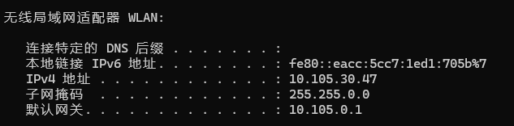
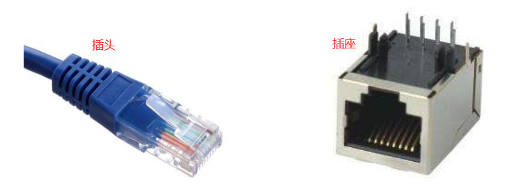
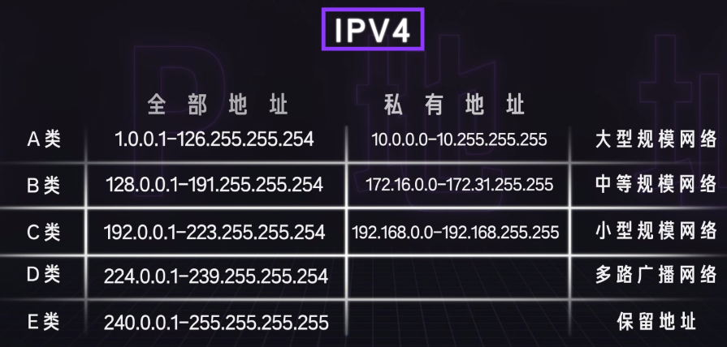
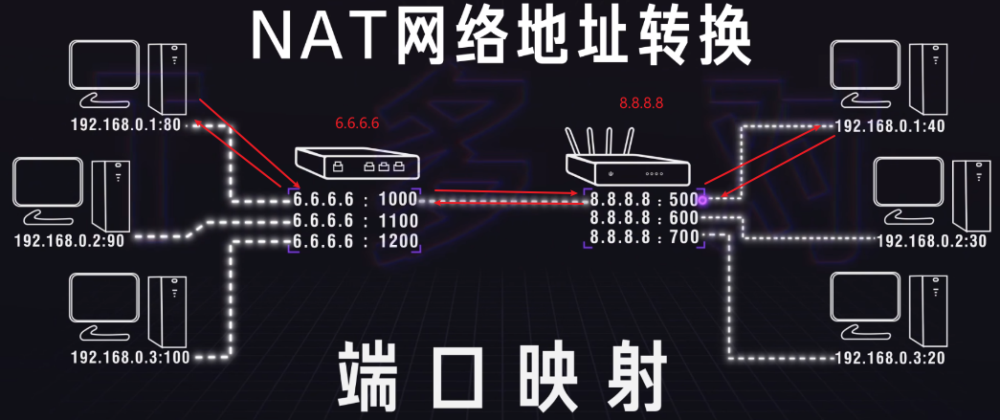
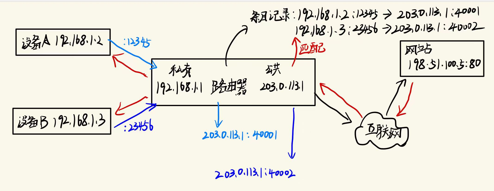
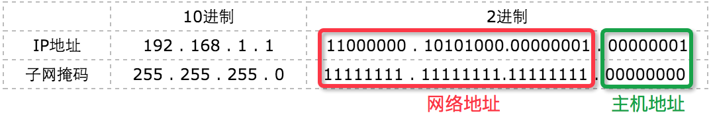

---
date:
    created: 2024-12-30
    updated: 2024-12-31
categories:
    - ComputerNetwork
tags:
    - ComputerNetwork
    - IP地址
    - 子网掩码
    - 网关
---

# IP地址、子网掩码、网关详解

IP地址、子网掩码、网关是计算机网络中的重要概念，它们在网络通信中起着至关重要的作用。本文将详细介绍IP地址、子网掩码和网关的概念、作用以及它们在网络通信中的应用。

<!--more-->

## IP地址

IP地址是网络通信中的重要概念，它是网络中每个设备在网络中的唯一标识。IP地址由32位二进制数组成，通常以点分十进制表示，例如192.168.1.1。

当我们的计算机需要进行网络通讯时，不必连接网线，而是只需要“邮件”的方式，寄给对方，而该邮件的地址就是IP地址。

IP地址分为IPv4和IPv6两种，IPv4地址由32位二进制数组成，IPv6地址由128位二进制数组成。

!!! note "IPv6的由来"
    **为什么会有IPv6？**
    随着互联网的发展，IPv4地址已经不够用了，IPv4地址只有32位，所以只有42亿个地址，为了避免IP地址资源枯竭，因此推出IPv6，而IPv6地址有128位，所以有2^128个地址，这个数量非常非常大。

!!! note "0.0.0.0与127.0.0.1"
    127.0.0.1即为主机地址，它不能连接互联网或是局域网，只能自身独立使用；只要使用这个地址发送数据，则数据包不会出现在网络传输过程中，常用于屏蔽软件官网对正版的校验。
    0.0.0.0表示所有地址，常用于广播。

## 局域网、广域网、以太网、互联网

局域网（Local Area Network，LAN）：局域网是指在一定范围内的网络，通常是指在一个建筑物或一个校园内的网络。局域网是一个局部范围的计算计组，比如家庭网络就是一个小型的局域网，里面包含电脑、手机和平板等，他们共同连接到你家的路由器上。又比如学校的机房就是一个局域网，里面有几百几千台电脑，当机房无法上外网时，但是电脑之间仍可以通信，你们可以通过这个局域网来打CS 、玩红警。

广域网（Wide Area Network，WAN）：广域网是指在一定范围内的网络，通常是指在一个城市或一个国家内的网络，可以看成是很多个局域网通过路由器等相互连接起来，而这些需要大量的资金成本和后期维护成本，牵头做这些的通常是运营商，叫做ISP（Internet Service Provider）互联网服务提供商，例如中国移动、中国联通、中国电信等。

以太网（Ethernet）：以太网是一种局域网技术，一种实现局域网通信的技术协议，它使用CSMA/CD（载波侦听多路访问/冲突检测）协议来实现网络通信。以太网的运行速率有10Mbps、100Mbps、1Gbps、10Gbps等等，它的传输介质是网线，网线有双绞线、同轴电缆、光纤等。简单来说，以太网就是在局域网中，把附近的设备连接起来，实现设备之间的通信。

互联网（Internet）：互联网是指全球范围内的网络，它是由许多局域网和广域网组成的。可以看成是局域网、广域网等组成的一个最大的网络，它可以把世界上各个地方的网路都连接起来，个人、政府、学校、企业，只要你能想到的，都包含在内。互联网是一种宽泛的概念，是一个极其庞大的网络。

接下来探讨下，它们三者之间的区别

以太网是一种局域网，而局域网不一定是以太网。只是由于目前大多数的局域网是以太网，所以一般说局域网，大家都默认为以太网。

互联网则是由大大小小的运营商、公司、机构、用户连接起来网络的总称，里面包含以太网、ATM网、还有其它接口协议的网络。

以太网是一种局域网，只能连接附近的设备，因特网是广域网，例如我们可以通过因特网连接到美国去获取消息。

生活化一点，以太网就是把你家的电脑，笔记本连接到猫上，然后再通过猫连接到因特网上去，这样你才能和国外的朋友Skype。因此，你家的电脑，笔记本和猫就组成了一个以太网。可以想象，世界上有成千上万个以太网。商业上应用以太网，将他们所有的电脑连接到主服务器上。

## 缓解IP地址紧缺

在前面中提到，IPv4地址只有32位，所以只有42亿个地址，为了避免IP地址资源枯竭，因此推出IPv6，但是在IPv6推出之前，为了缓解IP地址紧缺，计算机科学家有哪些方法呢？接下来我们就来探讨下。

### ABC类地址的划分

划分只是为了较为规范化的管理，就像软件框架一样进行约定，负责的功能模块及条理也清晰了许多；但这类规范并不是强制性要求，只是有效合理的划分可以节省更多的ip资源，也可缓解IP地址紧缺

- A类保留政府机构
- B类分配给中等规模公司
- C类分配给需要的任何人
- D类地址用于网管专业配置地址
- E类地址用于研发人员的科研实验

D、E类IP普及受众范围小，普众的实际使用率低，因此非重点述说。

私有地址属于非注册地址，专门为组织机构内部使用（局域网）。

!!! note "网络地址与广播地址"
    网络地址：网络地址是识别网络ID用的 ，如192.168.1.0 ，说明该网段属于192.168.1的段 ，属于不可用IP；
    广播地址：用于进行广播的通用地址 ，如192.168.1.255。PC在询问网关时，把信息发往192.168.1.255，于是192.168.1.1-192.168.1.254的所有机器都可以接收到它发来的信息，信息会问谁是网关你的MAC地址是多少，如果有一台机器是网关他就会回应。

### 网络地址转换（NAT）技术

为了缓解IPV4地址紧缺，网络地址转换（NAT，Network Address Translation）技术应运而生。

NAT技术允许一个私有网络使用少量IP地址来连接到互联网，通过NAT技术，私有网络中的设备可以共享一个公共IP地址，从而节省了IP地址资源。

#### 什么是NAT？

NAT是一种网络技术，用于将内部网络的私有IP地址转换为公共IP地址，从而使局域网内的设备能够与外部互联网通信。NAT主要应用于路由器或防火墙设备中，它通过修改数据包的IP地址信息，实现内外网之间的通信。

#### NAT工作原理

当一个内部网络的设备需要访问外部互联网时，数据包会首先发送到NAT设备（通常是路由器）。NAT设备会将源IP地址从私有IP转换为公共IP，并记录这种转换关系。响应数据包返回时，NAT设备会根据记录将目标IP地址转换回原来的私有IP，并将数据包转发给内部设备。

下面的图就是一个简单的例子：

#### NAT的类型

NAT技术根据实现方式和应用场景，可以分为以下几种类型：

静态NAT（Static NAT）： 静态NAT是将一个私有IP地址映射为一个固定的公共IP地址。这种方式适用于需要从外部网络访问内部网络的场景，例如内部服务器需要提供Web服务。

动态NAT（Dynamic NAT）： 动态NAT使用一个公共IP地址池，将内部网络的私有IP地址动态映射为可用的公共IP地址。这种方式适用于内部网络设备需要访问外部互联网，但不需要外部设备访问内部设备的场景。

端口地址转换（PAT，Port Address Translation）： PAT，也称为NAT Overload，是最常用的NAT类型。它通过使用不同的端口号，将多个私有IP地址映射为一个公共IP地址。这种方式极大地提高了公共IP地址的利用率，适用于大多数家庭和企业网络。

#### NAT的优势

- 节省IP地址资源：通过NAT技术，私有网络中的设备可以共享一个公共IP地址，从而节省了IP地址资源。
- 提高网络安全性：NAT设备可以隐藏内部网络的结构，从而提高网络的安全性。
- 简化网络管理：NAT设备可以简化网络管理，从而提高网络的可靠性。

#### NAT的应用场景

- 家庭和小型企业网络：在家庭和小型企业网络中，NAT技术可以节省IP地址资源，同时提高网络的安全性和可靠性。
- 大型企业网络：在大型企业网络中，NAT技术可以简化网络管理，提高网络的可靠性，使得内部设备能够访问互联网，同时保护内部网络不被外部直接访问。
- 数据中心：在数据中心中，NAT技术可以提高网络的可靠性和安全性，利用NAT来管理和隔离虚拟机和服务器，使得它们能够共享有限的公共IP地址资源。

#### NAT的缺点（局限性）

- 降低了网络的灵活性：NAT设备可能会限制网络的灵活性，从而降低网络的可靠性。
- 增加了网络的复杂性：NAT设备可能会增加网络的复杂性，从而降低网络的可靠性。
- 降低了网络的性能：由于NAT需要维护大量的连接状态表，当连接数量非常大时，NAT设备可能会降低网络的性能，从而降低网络的可靠性。

#### NAT技术工作原理

## 子网掩码

### 什么是子网掩码

什么是子网掩码？子网掩码不能单独存在，它必须结合IP地址一起使用。子网掩码只有一个作用，就是将某个IP地址划分成网络地址和主机地址两部分。子网掩码的设定必须遵循一定的规则。与IP地址相同，子网掩码的长度也是32位，左边是网络位，用二进制数字“1”表示；右边是主机位，用二进制数字“0”表示。

它是一种用来指明一个IP地址的哪些位标识的是主机所在的网络地址以及哪些位标识的是主机地址的位掩码。 一个IP地址的网络部分被称为网络号或者网络地址，子网掩码根据逻辑与运算，得出的结果是相同的网络号，则说明这两台计算机是处于同一个子网络上的，可以进行直接与具有相同的网络号的设备通讯。

### 子网掩码的规则

长度 为 4 * 8bit（1字节），由 连续的1 以及 连续的0 两部分组成，

例如：`11111111.11111111.11111111.00000000`，对应十进制：`255.255.255.0`

假设，局域网中 计算机A 的IP地址为 `192.168.1.1`，子网掩码为 `255.255.255.0`， 如下图所示：

`192.168.1.1`和子网掩码为`255.255.255.0`的二进制对照。其中，“1”有24个，代表与此相对应的IP地址左边24位是网络号；“0”有8个，代表与此相对应的IP地址右边8位是主机号。

`255.255.255.0`这个子网掩码将网络化分为一个子网，这个子网的容量是254（$2^8-2$）台主机 + 一个网络地址（`255.255.255.0`） + 一个广播地址（`255.255.255.255`）

对于ABC类地址，子网掩码的规则是：

- A类地址：`255.0.0.0`
- B类地址：`255.255.0.0`
- C类地址：`255.255.255.0`

### 子网掩码的表示方式

#### 点分十进制

二进制转换十进制，每8位用点号隔开

例如：子网掩码二进制`11111111.11111111.11111111.00000000`，表示为`255.255.255.0`

#### CIDR斜线记法

CIDR斜线记法，是子网掩码的另一种表示方式，它将子网掩码的长度表示为斜线后的数字，

例1：`192.168.1.100/24`，其子网掩码表示为`255.255.255.0`，二进制表示为`11111111.11111111.11111111.00000000`

例2：`172.16.198.12/20`，其子网掩码表示为`255.255.240.0`，二进制表示为`11111111.11111111.11110000.00000000`

### 网络地址计算

网络地址计算，是根据IP地址和子网掩码计算出网络地址，

将IP地址与子网掩码转换成二进制数。

将二进制形式的 IP 地址与子网掩码做“与&”运算。

将得出的结果转化为十进制，便得到网络地址（每个子网的第一个地址）。

例如：

IP地址：`192.168.1.100`，子网掩码：`255.255.255.0`，IP地址二进制表示为`11000000.10101000.00000001.01100100`，子网掩码二进制表示为`11111111.11111111.11111111.00000000`
·
将二进制形式的 IP 地址与子网掩码做“与&”运算：`11000000.10101000.00000001.01100100` & `11111111.11111111.11111111.00000000` = `11000000.10101000.00000001.00000000`

将得出的结果转化为十进制，便得到网络地址（每个子网的第一个地址）：`192.168.1.0`

## 网关

连接两个不同的网络的设备都可以叫网关设备；网关的作用就是实现两个网络之间进行通讯与控制。

网关设备可以是 交互机（三层及以上才能跨网络）、路由器、启用了路由协议的服务器、代理服务器、防火墙等

网关地址就是网关设备的IP地址。

例1： PC1为`192.168.1.3/26`，PC2为`192.168.1.70/26`，这两台PC能否进行通信？

可知，两者的子网掩码为`255.255.255.192`，计算网络地址：

- PC1的网络地址：`192.168.1.0`
- PC2的网络地址：`192.168.1.64`

PC1和PC2的网络地址不同，所以不能进行通信。

那么如何让PC1和PC2，两台不同网址地址的PC进行通信呢？

答：需要配置各自的网关，并向路由添加各自的网关地址，这样PC1和PC2就可以进行通信了。

默认网关：一台主机可以有多个网关。默认网关的意思是一台主机如果找不到可用的网关，就把数据包发给默认指定的网关，由这个网关来处理数据包。现在主机使用的网关，一般指的是默认网关。

自动设置默认网关：

自动设置就是利用DHCP（Dynamic Host Configuration Protocol, 动态主机配置协议）服务器来自动给网络中的计算机分配IP地址、子网掩码和默认网关 。

一旦网络的默认网关发生了变化时，只要更改了DHCP服务器中默认网关的设置，那么网络中所有的计算机均获得了新的默认网关的IP地址。这种方法适用于网络规模较大、TCP/IP参数有可能变动的网络。

另外一种自动获得网关的办法是通过安装代理服务器软件（如MS Proxy）的客户端程序来自动获得，其原理和方法和DHCP有相似之处。

一台电脑的默认网关是不可以随随便便指定的，必须 **正确指定**，否则一台电脑就会将数据包发给不是网关的电脑，从而无法与其他网络的电脑通信。

> 正确指定的前提： 根据主机已有IP地址类型（A、B、C类）的当前具体的网段所容纳的可用最大主机数范围，进行的一个IP的设定。

1.计算出当前主机网络最大可用容纳范围主机数

公式：$2^n-2$，其中n是主机位数，-2是因为主机位数不能全为0或全为1，所以需要减去2。

这里为 $2^6-2=62$，所以当前主机网络最大可用容纳范围主机数为62。

2.求出当前主机IP的所在子网划分范围，当前IP地址的子网划分范围也就是当前网关设置的范围

| 网络地址        | 子网掩码          | 子网划分范围 | 广播地址        |
|-----------------|-------------------|---------------|-----------------|
| 192.168.1.0     | 255.255.255.192   | 1~62          | 192.168.1.63    |
| 192.168.1.64    | 255.255.255.192   | 65~126        | 192.168.1.127   |
| 192.168.1.128   | 255.255.255.192   | 129~190       | 192.168.1.191   |
| 192.168.1.192   | 255.255.255.192   | 193~254       | 192.168.1.255   |

由上表可得出公式：

- 子网划分从第二网段开始的网络地址 = 广播地址 + 1
- 子网划分从第二网段开始的可容纳主机范围最小值 = 广播地址 + 2
- $Num+2^n-2-1=$ 子网划分从第二网段开始的可容纳主机范围最大值（$Num$ 是子网划分可容纳主机范围最小值）
- 广播地址 = 子网划分可容纳主机数范围最大值 + 1

## 资料参考

[【硬核科普】IP地址是什么东西？IPV6和IPV4有什么区别？公网IP和私有IP又是什么？](https://www.bilibili.com/video/BV1DD4y127r4/)

[干货！什么是互联网、以太网、广域网、局域网？](https://cloud.tencent.com/developer/article/1825132)

[接口协议（四）：以太网（Ethernet）学习（一）：协议](https://blog.csdn.net/qq_40483920/article/details/108262953)

[网络地址转换 (NAT) 技术详解](https://www.yanfukun.com/read/deep-tcpip/nat?wd=c)

[对ip，子网掩码和网关的理解](https://blog.nnwk.net/article/152)
