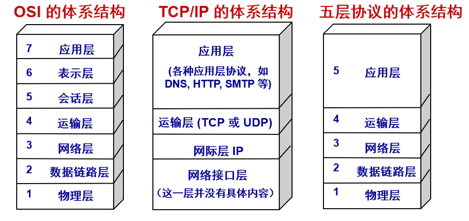
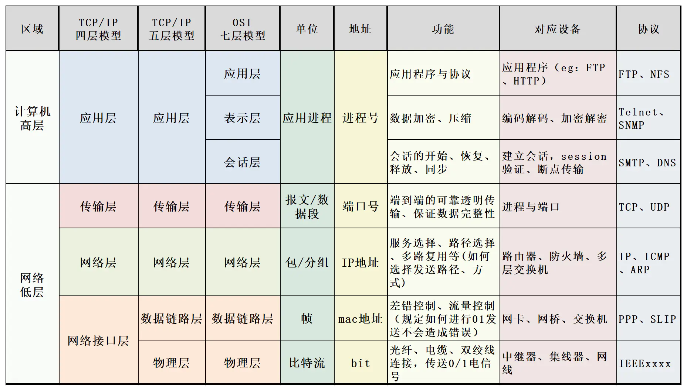
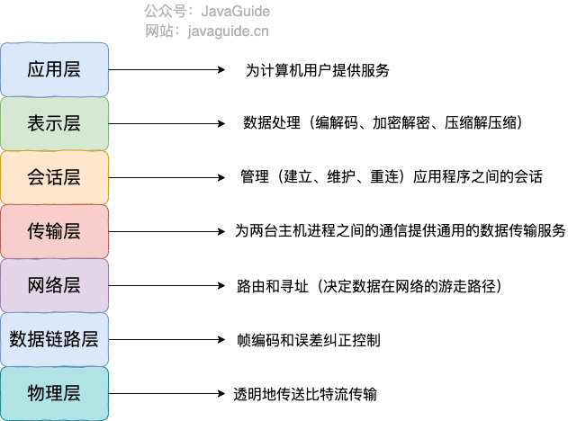
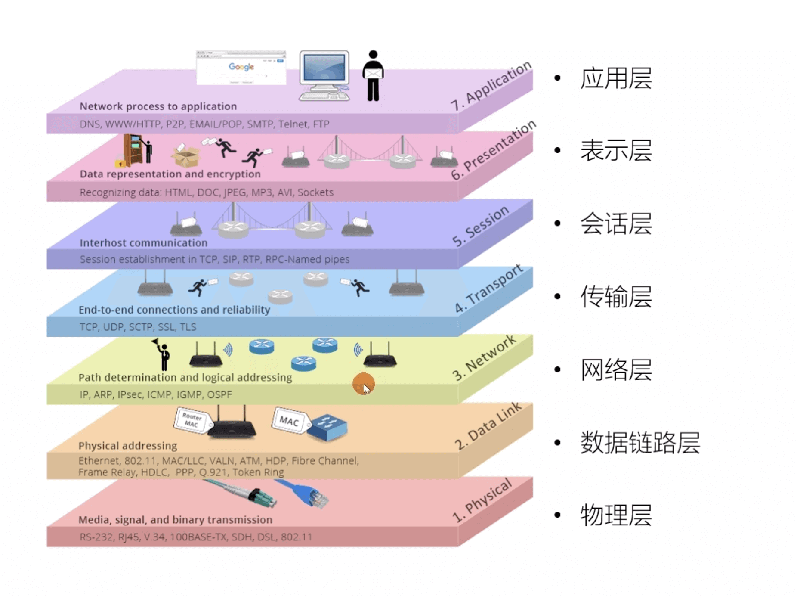
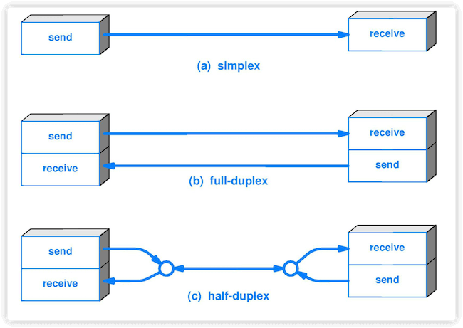
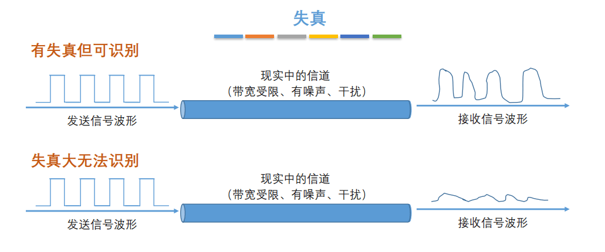
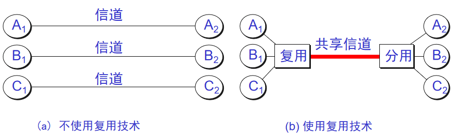
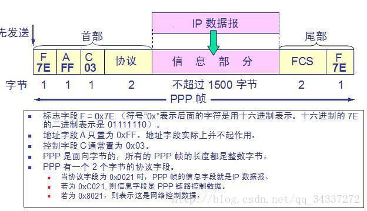
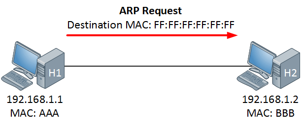

---
date:
    created: 2024-12-31
categories:
    - ComputerNetwork
tags:
    - ComputerNetwork
    - 计算机网络
    - 网络架构
---

# 计算机网络的架构

计算机网络体系结构主流的分为三种：OSI体系结构（七层）、TCP/IP体系结构（四层）、五层体系结构，接下来我们来详细讲解认识这三种结构。

<!-- more -->

- OSI体系结构: 概念清楚，理论也比较完整，但是它既复杂又不实用。

- TCP/IP体系结构:TCP/IP是一个四层体系结构，得到了广泛的运用。

- 五层体系结构:为了方便学习，折中OSI体系结构和TCP/IP体系结构，综合二者的优点，这样既简洁，又能将概念讲清楚

TCP/IP与OSI最大的不同在于：OSI是一个理论上的网络通信模型，而TCP/IP则是实际运行的网络协议。

## OSI体系结构

虽然在实际应用中，TCP/IP 协议族更为广泛地被使用，但 OSI 体系结构作为网络通信的经典模型，仍具有重要的参考价值。

OSI（Open System Interconnection）体系结构，即开放系统互连参考模型，是国际标准化组织（ISO）制定的一个用于计算机或通信系统间互联的标准体系。

OSI 模型将网络通信的功能划分为七个层次，从下到上分别是物理层、数据链路层、网络层、传输层、会话层、表示层和应用层。

物理层

主要负责在物理介质上传输原始的比特流，定义了设备之间的物理连接标准，如电缆的类型、接口的形状、信号的传输方式等。

涉及到的硬件设备有网线、光纤、网卡、集线器等，其传输的单位是比特（bit）。

数据链路层

负责将物理层接收到的比特流组织成数据帧，并进行差错检测和纠正，以确保数据在物理链路上的可靠传输。

该层还负责介质访问控制，即决定在同一时刻哪个设备可以访问传输介质，常见的协议有以太网协议等，传输单位是帧（frame）。

网络层

主要功能是进行路由选择和分组转发，将数据从源节点传输到目标节点。

它根据网络地址（如 IP 地址）来确定数据的传输路径，实现不同网络之间的互联，传输单位是分组（packet），常见的协议有 IP 协议等。

传输层

负责在源主机和目标主机的应用程序之间提供端到端的可靠通信服务。

它可以实现数据的分段和重组、流量控制、差错控制等功能，传输单位是段（segment），常见的协议有 TCP 协议和 UDP 协议等。

会话层

主要负责建立、维护和管理会话，即两个应用程序之间的通信连接。

它可以实现会话的同步、令牌管理等功能，确保会话的顺利进行。

表示层

负责处理数据的表示和转换问题，如数据的加密、解密、压缩、解压缩等。

它使得不同的系统能够正确地理解和处理数据，确保数据在不同的表示形式之间进行转换。

应用层

是 OSI 模型的最高层，直接为用户的应用程序提供网络服务。

它包含了各种应用协议，如 HTTP 协议用于网页浏览、FTP 协议用于文件传输、SMTP 协议用于电子邮件传输等。

总结下来，如下图所示：

虽然OSI体系结构七层模型比较复杂，但是它的架构体系十分清晰，但是为什么现在很少使用OSI而是使用TCP/IP体系结构呢？

- OSI 的专家缺乏实际经验，他们在完成 OSI 标准时缺乏商业驱动力
- OSI 的协议实现起来过分复杂，而且运行效率很低
- OSI 制定标准的周期太长，因而使得按 OSI 标准生产的设备无法及时进入市场（20 世纪 90 年代初期，虽然整套的 OSI 国际标准都已经制定出来，但基于 TCP/IP 的互联网已经抢先在全球相当大的范围成功运行了）
- OSI 的层次划分不太合理，有些功能在多个层次中重复出现。

## 五层网络体系结构

五层网络体系结构是TCP/IP体系结构和OSI体系结构的一种折中，它将OSI体系结构中的会话层、表示层和应用层合并为应用层，将数据链路层和物理层合并为网络接口层，也就是五层网络体系结构包括物理层、数据链路层、网络层、运输层和应用层。

### 物理层（Physical Layer）

#### 基本术语

数据（data）：运送消息的实体。

信号（signal）：数据的电气的或电磁的表现。或者说信号是适合在传输介质上传输的对象。

码元（ code）：在使用时间域（或简称为时域）的波形来表示数字信号时，代表不同离散数值的基本波形。

单工（simplex ）：只能有一个方向的通信而没有反方向的交互。

半双工（half duplex ）：通信的双方都可以发送信息，但不能双方同时发送(当然也就不能同时接收)。

全双工（full duplex）：通信的双方可以同时发送和接收信息。

失真：失去真实性，主要是指接受到的信号和发送的信号不同，有磨损和衰减。
影响失真程度的因素：1.码元传输速率 2.信号传输距离 3.噪声干扰 4.传输媒体质量

奈氏准则：在任何信道中，码元的传输的效率是有上限的，传输速率超过此上限，就会出现严重的码间串扰问题，使接收端对码元的判决（即识别）成为不可能。

香农定理：在带宽受限且有噪声的信道中，为了不产生误差，信息的数据传输速率有上限值。

基带信号（baseband signal）：来自信源的信号。指没有经过调制的数字信号或模拟信号。

带通（频带）信号（bandpass signal）：把基带信号经过载波调制后，把信号的频率范围搬移到较高的频段以便在信道中传输（即仅在一段频率范围内能够通过信道），这里调制过后的信号就是带通信号。

调制（modulation ）：对信号源的信息进行处理后加到载波信号上，使其变为适合在信道传输的形式的过程。

信噪比（signal-to-noise ratio ）：指信号的平均功率和噪声的平均功率之比，记为$S/N$。
信噪比（dB）=$10*log_{10}(S/N)$。

复用（multiplexing）：共享信道的方法。

信道复用（channel multiplexing ）：指多个用户共享同一个信道。（并不一定是同时）。

比特率（bit rate ）：单位时间（每秒）内传送的比特数。

波特率（baud rate）：单位时间载波调制状态改变的次数。针对数据信号对载波的调制速率。

ADSL（Asymmetric Digital Subscriber Line ）：非对称数字用户线。

光纤同轴混合网（HFC 网）：在目前覆盖范围很广的有线电视网的基础上开发的一种居民宽带接入网

#### 重要知识点总结

物理层的主要任务就是确定与传输媒体接口有关的一些特性，如机械特性，电气特性，功能特性，过程特性。

一个数据通信系统可划分为三大部分，即源系统，传输系统，目的系统。源系统包括源点（或源站，信源）和发送器，目的系统包括接收器和终点。

通信的目的是传送消息。如话音，文字，图像等都是消息，数据是运送消息的实体。信号则是数据的电气或电磁的表现。

根据信号中代表消息的参数的取值方式不同，信号可分为模拟信号（或连续信号）和数字信号（或离散信号）。在使用时间域（简称时域）的波形表示数字信号时，代表不同离散数值的基本波形称为码元。

根据双方信息交互的方式，通信可划分为单向通信（或单工通信），双向交替通信（或半双工通信），双向同时通信（全双工通信）。

来自信源的信号称为基带信号。信号要在信道上传输就要经过调制。调制有基带调制和带通调制之分。最基本的带通调制方法有调幅，调频和调相。还有更复杂的调制方法，如正交振幅调制。

要提高数据在信道上的传递速率，可以使用更好的传输媒体，或使用先进的调制技术。但数据传输速率不可能任意被提高。

传输媒体可分为两大类，即导引型传输媒体（双绞线，同轴电缆，光纤）和非导引型传输媒体（无线，红外，大气激光）。

为了有效利用光纤资源，在光纤干线和用户之间广泛使用无源光网络 PON。无源光网络无需配备电源，其长期运营成本和管理成本都很低。最流行的无源光网络是以太网无源光网络 EPON 和吉比特无源光网络 GPON。

#### 思考

##### 物理层主要来干什么？

物理层主要做的事情就是 **透明地传送比特流**。也可以将物理层的主要任务描述为确定与传输媒体的接口的一些特性，即：机械特性（接口所用接线器的一些物理属性如形状和尺寸），电气特性（接口电缆的各条线上出现的电压的范围），功能特性（某条线上出现的某一电平的电压的意义），过程特性（对于不同功能的各种可能事件的出现顺序）。

**物理层考虑的是怎样才能在连接各种计算机的传输媒体上传输数据比特流，而不是指具体的传输媒体**。 现有的计算机网络中的硬件设备和传输媒体的种类非常繁多，而且通信手段也有许多不同的方式。物理层的作用正是尽可能地屏蔽掉这些传输媒体和通信手段的差异，使物理层上面的数据链路层感觉不到这些差异，这样就可以使数据链路层只考虑完成本层的协议和服务，而不必考虑网络的具体传输媒体和通信手段是什么。

##### 几种常用的信道复用技术

频分复用(FDM)：所有用户在同样的时间占用不同的带宽资源。

时分复用（TDM）：所有用户在不同的时间占用同样的频带宽度（分时不分频）。

统计时分复用 (Statistic TDM)：改进的时分复用，能够明显提高信道的利用率。

码分复用(CDM)：用户使用经过特殊挑选的不同码型，因此各用户之间不会造成干扰。这种系统发送的信号有很强的抗干扰能力，其频谱类似于白噪声，不易被敌人发现。

波分复用( WDM)：波分复用就是光的频分复用。

### 数据链路层（Data Link Layer）

#### 基本术语

链路（link）：一个结点到相邻结点的一段物理链路。

数据链路（data link）：把实现控制数据运输的协议的硬件和软件加到链路上就构成了数据链路。

循环冗余检验 CRC（Cyclic Redundancy Check）：为了保证数据传输的可靠性，CRC 是数据链路层广泛使用的一种检错技术。

帧（frame）：一个数据链路层的传输单元，由一个数据链路层首部和其携带的封包所组成协议数据单元。

MTU（Maximum Transfer Uint ）：最大传送单元。帧的数据部分的的长度上限。

误码率 BER（Bit Error Rate ）：在一段时间内，传输错误的比特占所传输比特总数的比率。

PPP（Point-to-Point Protocol ）：点对点协议。即用户计算机和 ISP 进行通信时所使用的数据链路层协议。以下是 PPP 帧的示意图：

MAC 地址（Media Access Control 或者 Medium Access Control）：意译为媒体访问控制，或称为物理地址、硬件地址，用来定义网络设备的位置。在 OSI 模型中，第三层网络层负责 IP 地址，第二层数据链路层则负责 MAC 地址。因此一个主机会有一个 MAC 地址，而每个网络位置会有一个专属于它的 IP 地址 。地址是识别某个系统的重要标识符，“名字指出我们所要寻找的资源，地址指出资源所在的地方，路由告诉我们如何到达该处。”

网桥（bridge）：一种用于数据链路层实现中继，连接两个或多个局域网的网络互连设备。

交换机（switch ）：广义的来说，交换机指的是一种通信系统中完成信息交换的设备。这里工作在数据链路层的交换机指的是交换式集线器，其实质是一个多接口的网桥

#### 重要知识点总结
