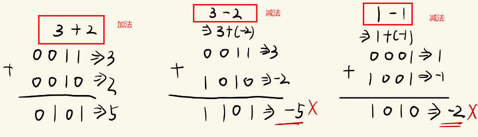
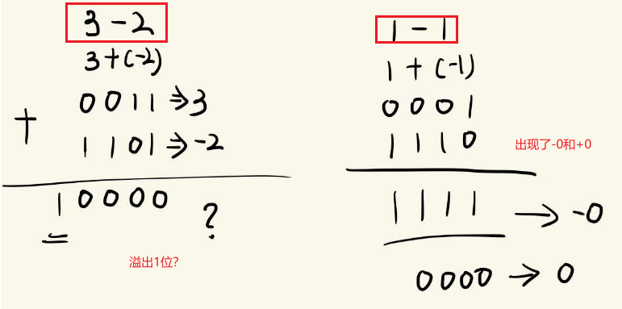
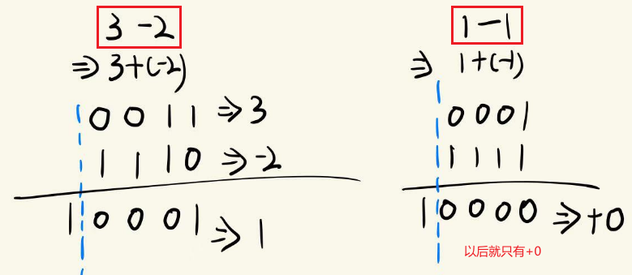

---
date:
    created: 2025-01-01
draft: true
tags:
    - 计算机系统
    - 二进制
categories:
    - 计算机系统
---

# 计算机二进制

这篇文章主要介绍计算机二进制相关知识，包括原码、反码、补码、位运算等。

<!-- more -->

## 二进制

二进制由0和1组成，逢二进一。

举个栗子：

- 10进制：10 -> 二进制：1010
- 10进制：7 -> 二进制：111

数字由正数和负数组成，而为了表示正数和负数，计算机中使用符号位来表示。

- 无符号（unsigned）：只能表示整数
- 有符号（signed）：可以表示正数和负数

> C/C++中，有有符号和无符号之分，Java中只有有符号。

有符号数，即既要表示正数又要表示负数，所以需要使用符号位来表示，用最高位代表符号位，0表示正数，1表示负数，所谓的最高位，就是最左边的位。

## 原码、反码、补码

### 原码

原码就是符号位加上真值的绝对值, 即用第一位表示符号, 其余位表示值。

举个栗子：

- 10进制：7 -> 二进制：0111
- 10进制：-6 -> 二进制：1110



可以看到，原码可以处理加法问题，但是不能处理减法问题。

因此我们引入了反码。

### 反码

反码的定义是：正数的反码是其本身，负数的反码是在其原码的基础上，符号位不变，其余各位取反。

举个栗子：

- 10进制：7 -> 二进制：0111 -> 反码：0111
- 10进制：-6 -> 二进制：1110 -> 反码：1001



但是，反码还是无法解决减法问题。

因此，我们引入了最终的解决方案，即补码。

### 补码

补码的定义是：正数的补码是其本身，负数的补码是在其反码的基础上，符号位不变，其余各位取反，最后加1。

> 对负数的补码再求一次补码，就得到了原码。

举个栗子：

- 10进制：7 -> 二进制：0111 -> 反码：0111 -> 补码：0111
- 10进制：-6 -> 二进制：1110 -> 反码：1001 -> 补码：1010



所以现在，`1111`代表的不再是-0，而是-1，相应的，由于消除-0，负数多出来一个可以表示的数（`1000`拿去表示-8了），那么此时4bit位能够表示的范围是：$-8~+7$。

## 溢出

在前面中，我们看到了在计算过程中，多出了一位，那么就将多出的位舍去，这就是溢出。

计算机中数字的表示需要使用内存空间，不同类型的数据占用内存空间的大小不同，比如int类型占用4个字节，即32位，而long类型占用8个字节，即64位。

举例来说，Java中 `short` 类型占用2个字节， `int` 类型占用4个字节， `long` 类型占用8个字节。

> 一个字节等于8位。

既然空间大小是有限制的，所以计算机中的数字也是有范围的，即上限和下限，如果数字超出限制，就会产生溢出。超出上限叫上溢出，超出下限叫下溢出。而 **溢出的部分会直接被舍去**。

由于溢出的部分会被舍去，那么最大值加1，将发生上溢出，变为最小值；最小值减1，将发生下溢出，变为最大值。

这里我们用Java的`int`类型来举例。

- 最大值（`Integer.MAX_VALUE`）：`2147483647`
- 最小值（`Integer.MIN_VALUE`）：`-2147483648`

```java
System.out.println("Integer.MAX_VALUE: " + Integer.MAX_VALUE);
System.out.println("Integer.MIN_VALUE: " + Integer.MIN_VALUE);
System.out.println("Integer.MAX_VALUE + 1: " + (Integer.MAX_VALUE + 1));
System.out.println("Integer.MIN_VALUE - 1: " + (Integer.MIN_VALUE - 1));
```

输出结果：

```text
Integer.MAX_VALUE: 2147483647
Integer.MIN_VALUE: -2147483648
Integer.MAX_VALUE + 1: -2147483648
Integer.MIN_VALUE - 1: 2147483647
```

可以看到，`Integer.MAX_VALUE + 1` 变成了 `-2147483648`，而 `Integer.MIN_VALUE - 1` 变成了 `2147483647`，这就是溢出。

所以，在计算机中，只要一个整数的类型确定了，那么它所能占用的内存空间大小也就确定了，从而它所能表示的数字范围也就确定了。那么不管给这个整数加多大的数字，或者减多大的数字，最终的结果都只能在这个范围内旋转。

就像表盘一样，当表针走过最大值的时候，就变成了最小值。

同样，这也等同于数学中的 **取余运算**。只要分母确定了，不管分子是多大，或者多小的数字，最终的结果也都是在一个确定的范围之内。

## 参考

[计算机二进制中的原码，反码，补码](https://www.cnblogs.com/codeshell/p/14023387.html)
