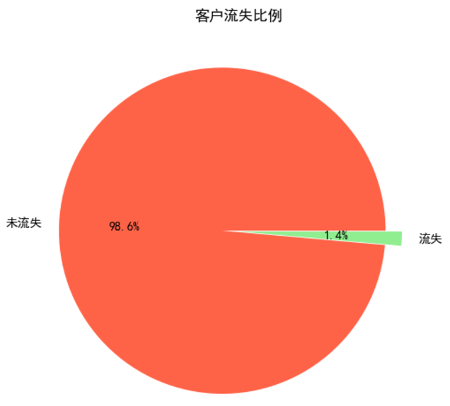

---
date:
    created: 2024-11-30
draft: True
categories:
    - DM
tags:
    - Homework
---
# 使用分类算法实现客户流失预测

某通信企业想要依据所有的客户信息预测客户是否会流失。该企业拥有一份 **客户信息** 表，其中在"流失类型"属性中，0表示未流失，1表示已流失。 

目前进度：只是进行了简单的模型预测，其召回率不是很高，还需要进行一定的复杂处理来提高。

<!-- more -->

要求：

选择合适的算法进行建模步骤

1.划分训练数据和测试数据

2.建立模型

3.对模型进行训练

4.采用训练后的模型对客户是否会流失进行预测

所给数据集：`user_info_screen.csv`

首先先进行简单的了解数据集结构

## 数据探索

首先导入导入数据，查看基本信息：

```python
import pandas as pd
data = pd.read_csv('./data/user_info_screen.csv', encoding='gbk')
# 查看数据集的原始数据
print(data.info())
```
其一共有103256条记录，一共45个字段（特征）。

经过简单调查，可以发现该数据无缺失集，是一个非常完整的数据集。

接下来将简单做一个特征字典，了解数据集的各个字段：

```python
# 创建特征字典
features = {
    'MONTH_ID': '月份编号，用于表示数据记录的月份',
    'USER_ID': '客户的唯一标识符',
    'INNET_MONTH': '客户已使用通信服务的月份数',
    'IS_AGREE': '是否同意协议，1表示同意，0表示未同意',
    'AGREE_EXP_DATE': '协议或条款的过期日期',
    'CREDIT_LEVEL': '客户的信用等级',
    'VIP_LVL': '客户的VIP等级',
    'ACCT_FEE': '账户的月费或服务费用',
    'CALL_DURA': '客户本月的通话时长',
    'NO_ROAM_LOCAL_CALL_DURA': '本地通话时长（不涉及漫游）',
    'NO_ROAM_GN_LONG_CALL_DURA': '本地长途电话时长',
    'GN_ROAM_CALL_DURA': '国内漫游通话时长',
    'CDR_NUM': '通话记录的数量',
    'NO_ROAM_CDR_NUM': '本地通话记录数量',
    'NO_ROAM_LOCAL_CDR_NUM': '本地通话记录中不涉及漫游的数量',
    'NO_ROAM_GN_LONG_CDR_NUM': '本地长途电话记录数量',
    'GN_ROAM_CDR_NUM': '国内漫游通话记录数量',
    'P2P_SMS_CNT_UP': '客户发送的P2P短信数量',
    'TOTAL_FLUX': '客户本月的总流量',
    'LOCAL_FLUX': '客户本月的本地流量',
    'GN_ROAM_FLUX': '客户的国内漫游流量',
    'CALL_DAYS': '客户本月通话的天数',
    'CALLING_DAYS': '客户本月发起电话的天数',
    'CALLED_DAYS': '客户本月接听电话的天数',
    'CALL_RING': '客户通话的呼叫次数',
    'CALLING_RING': '客户发起呼叫的次数',
    'CALLED_RING': '客户接听呼叫的次数',
    'CUST_SEX': '客户的性别, 1、2、3三种类型',
    'CERT_AGE': '客户的年龄',
    'CONSTELLATION_DESC': '客户的星座',
    'MANU_NAME': '客户使用的手机品牌名称',
    'MODEL_NAME': '客户手机的型号',
    'OS_DESC': '客户手机的操作系统类型',
    'TERM_TYPE': '客户使用的终端类型',
    'IS_LOST': '客户是否流失，0表示未流失，1表示已流失'
}

# 将字典转换为 DataFrame
features_df = pd.DataFrame(list(features.items()), columns=['Feature', 'Description'])

# 保存到 CSV 文件
features_df.to_csv('./tmp/features_description.csv', index=False, encoding='gbk')

# 查看保存的内容
print(features_df)
```
接下来，将一些对客户流失预测没有帮助的字段进行删去：

- 删除标识符字段，比如用户ID
- 删除与预测流失无关的字段，比如设备信息、星座
- 由于数据集的月份都来自2016-03月，也可以将月份相关信息删除

```python
# 选择需要删除的字段
fields_to_drop = [
    'USER_ID', 'MONTH_ID', 'AGREE_EXP_DATE', 'MANU_NAME', 'MODEL_NAME', 'OS_DESC', 
    'NO_ROAM_LOCAL_CALL_DURA', 'NO_ROAM_GN_LONG_CALL_DURA', 'GN_ROAM_CALL_DURA', 
    'CDR_NUM', 'NO_ROAM_CDR_NUM', 'NO_ROAM_LOCAL_CDR_NUM', 'NO_ROAM_GN_LONG_CDR_NUM', 
    'CONSTELLATION_DESC'
]

# 删除所选字段
data_filtered = data.drop(columns=fields_to_drop)

# 查看过滤后的数据
print(data_filtered.head())
```

接下来简单的查看流失客户和未流失客户之间的比例数据。

```python
data_filtered['IS_LOST'].value_counts()
```
结果为：
```
IS_LOST
0.0    101808
1.0      1448
Name: count, dtype: int64
```

可以看到该数据集，是非常不平衡的，再用可视化更加直观的观察。

```python
import matplotlib.pyplot as plt
from pylab import rcParams

# 设置中文显示
plt.rcParams['font.sans-serif'] = 'SimHei'  # 如果SimHei无法显示，可以尝试使用'Arial Unicode MS'等
plt.rcParams['axes.unicode_minus'] = False  # 解决负号显示问题
# 查看流失客户占比
lost_value = data_filtered['IS_LOST'].value_counts()
labels = ['未流失', '流失']  # 添加清晰的标签
sizes = lost_value.values  # 获取流失和未流失的数量

# 设置饼图的颜色
colors = ['#FF6347', '#90EE90']  # 可以选择更具区分度的颜色

# 绘制饼图
plt.rcParams['figure.figsize'] = (6, 6)  # 设置图表大小
plt.pie(sizes, labels=labels, colors=colors, explode=(0.1, 0), autopct='%1.1f%%')

# 设置标题
plt.title('客户流失比例')

# 显示图形
plt.show()
```

可以看出，所给出的数据集中只有1.4%是流失的，占非常小的比例。这也意味着数据是高度 **不平衡** 的（流失客户远远小于未流失客户）。

因此如何划分训练集和测试集十分重要，或者采取相关方法来补偿该悬殊比例。

## 模型初处理
首先采用分层抽样，尽量保持原比例，进行模型测试。

```python
from sklearn.model_selection import train_test_split

# 划分训练集和测试集，保持流失标签的比例
X = data_filtered.drop(columns=['IS_LOST'])  # 特征数据
y = data_filtered['IS_LOST']  # 目标变量（是否流失）

X_train, X_test, y_train, y_test = train_test_split(X, y, test_size=0.3, stratify=y, random_state=42)
```

而由于数据不平衡，准确率不适合用来评估模型效果，因此用 **召回率(Recall)** 进行评估模型，在客户流失预测中，漏掉一个真正会流失的客户（漏报），可能会导致公司失去这个客户，从而损失收入。

### 随机森林模型

```python
from sklearn.ensemble import RandomForestClassifier
from sklearn.metrics import recall_score

# 创建随机森林模型
model = RandomForestClassifier(class_weight='balanced', random_state=42)
model.fit(X_train, y_train)

# 获取预测值
y_pred = model.predict(X_test)

recall = recall_score(y_test, y_pred)
print(f"随机森林召回率：{recall}")
```
结果：

```
随机森林召回率：0.2626728110599078
```
这个结果说明模型是完全不能够进行精准预测的，十分差。

### XGBoost

```python
import numpy as np
from collections import Counter
import xgboost as xgb


counter = Counter(y_train)

# 获取多数类和少数类的数量
majority_class_count = max(counter.values())
minority_class_count = min(counter.values())

# 计算比例
ratio_of_majority_to_minority_class = majority_class_count / minority_class_count

print(f"Majority to Minority class ratio: {ratio_of_majority_to_minority_class}")

# 使用XGBoost
model = xgb.XGBClassifier(scale_pos_weight=ratio_of_majority_to_minority_class, random_state=42)
model.fit(X_train, y_train)

# 获取预测值
y_pred = model.predict(X_test)

recall = recall_score(y_test, y_pred)
print(f"XGBoost召回率：{recall}")
```
输出结果：

```
XGBoost召回率：0.5368663594470046
```
比随机森林稍微好看些，但是还是差。

### 逻辑回归

```python
from sklearn.linear_model import LogisticRegression

# 使用逻辑回归，设置类权重
model = LogisticRegression(class_weight='balanced', random_state=42)
model.fit(X_train, y_train)
# 获取预测值
y_pred = model.predict(X_test)

recall = recall_score(y_test, y_pred)
print(f"逻辑回归召回率：{recall}")
```

结果为：

```
逻辑回归召回率：0.8433179723502304
```
该概率说明该模型还是不错的，适合该数据集进行预测。

## 欠采样后模型拟合

前面的模型预测时，仅仅采用分层抽样后就直接进行训练学习和测试预测，接下来用 **欠采样** 的方法，用 **SMOTE** 来增加流失客户的数量。

```python
from imblearn.over_sampling import SMOTE
# 使用SMOTE进行过采样
smote = SMOTE(random_state=42)
X_train_resampled, y_train_resampled = smote.fit_resample(X_train, y_train)
```

其余的基本不变，再使用上面的模型进行测试预测。

最后结果是随机森林提高了将近20%的召回率，而XGBoost则波动，或提高或降低，逻辑回归则提高了1%的召回率。


## 总代码
以下是该客户流失预测的所有代码汇总，进行了一定的处理。

```python
import pandas as pd
import matplotlib.pyplot as plt
from pylab import rcParams
from sklearn.model_selection import train_test_split
from sklearn.ensemble import RandomForestClassifier, RandomForestRegressor
from sklearn.metrics import recall_score
import numpy as np
from collections import Counter
import xgboost as xgb
from sklearn.linear_model import LogisticRegression
from imblearn.over_sampling import SMOTE
from sklearn.preprocessing import StandardScaler, MinMaxScaler


data = pd.read_csv('./data/user_info_screen.csv', encoding='gbk')
# 查看数据集的原始数据
print(data.info())

# 创建特征字典
features = {
    'MONTH_ID': '月份编号，用于表示数据记录的月份',
    'USER_ID': '客户的唯一标识符',
    'INNET_MONTH': '客户已使用通信服务的月份数',
    'IS_AGREE': '是否同意协议，1表示同意，0表示未同意',
    'AGREE_EXP_DATE': '协议或条款的过期日期',
    'CREDIT_LEVEL': '客户的信用等级',
    'VIP_LVL': '客户的VIP等级',
    'ACCT_FEE': '账户的月费或服务费用',
    'CALL_DURA': '客户本月的通话时长',
    'NO_ROAM_LOCAL_CALL_DURA': '本地通话时长（不涉及漫游）',
    'NO_ROAM_GN_LONG_CALL_DURA': '本地长途电话时长',
    'GN_ROAM_CALL_DURA': '国内漫游通话时长',
    'CDR_NUM': '通话记录的数量',
    'NO_ROAM_CDR_NUM': '本地通话记录数量',
    'NO_ROAM_LOCAL_CDR_NUM': '本地通话记录中不涉及漫游的数量',
    'NO_ROAM_GN_LONG_CDR_NUM': '本地长途电话记录数量',
    'GN_ROAM_CDR_NUM': '国内漫游通话记录数量',
    'P2P_SMS_CNT_UP': '客户发送的P2P短信数量',
    'TOTAL_FLUX': '客户本月的总流量',
    'LOCAL_FLUX': '客户本月的本地流量',
    'GN_ROAM_FLUX': '客户的国内漫游流量',
    'CALL_DAYS': '客户本月通话的天数',
    'CALLING_DAYS': '客户本月发起电话的天数',
    'CALLED_DAYS': '客户本月接听电话的天数',
    'CALL_RING': '客户通话的呼叫次数',
    'CALLING_RING': '客户发起呼叫的次数',
    'CALLED_RING': '客户接听呼叫的次数',
    'CUST_SEX': '客户的性别, 1、2、3三种类型',
    'CERT_AGE': '客户的年龄',
    'CONSTELLATION_DESC': '客户的星座',
    'MANU_NAME': '客户使用的手机品牌名称',
    'MODEL_NAME': '客户手机的型号',
    'OS_DESC': '客户手机的操作系统类型',
    'TERM_TYPE': '客户使用的终端类型',
    'IS_LOST': '客户是否流失，0表示未流失，1表示已流失'
}

# 将字典转换为 DataFrame
features_df = pd.DataFrame(list(features.items()), columns=['Feature', 'Description'])

# 保存到 CSV 文件
features_df.to_csv('./tmp/features_description.csv', index=False, encoding='gbk')

# 查看保存的内容
print(features_df)

# 选择需要删除的字段
fields_to_drop = [
    'USER_ID', 'MONTH_ID', 'AGREE_EXP_DATE', 'MANU_NAME', 'MODEL_NAME', 'OS_DESC',
    'NO_ROAM_LOCAL_CALL_DURA', 'NO_ROAM_GN_LONG_CALL_DURA', 'GN_ROAM_CALL_DURA',
    'CDR_NUM', 'NO_ROAM_CDR_NUM', 'NO_ROAM_LOCAL_CDR_NUM', 'NO_ROAM_GN_LONG_CDR_NUM',
    'CONSTELLATION_DESC'
]

# 删除所选字段
data_filtered = data.drop(columns=fields_to_drop)

# 查看过滤后的数据
print(data_filtered.head())

data_filtered['IS_LOST'].value_counts()

# 划分训练集和测试集，保持流失标签的比例
X = data_filtered.drop(columns=['IS_LOST'])  # 特征数据
y = data_filtered['IS_LOST']  # 目标变量（是否流失）

X_train, X_test, y_train, y_test = train_test_split(X, y, test_size=0.3, stratify=y, random_state=42)

# 使用SMOTE进行过采样
smote = SMOTE(random_state=42)
X_train_resampled, y_train_resampled = smote.fit_resample(X_train, y_train)

def recall_of_model(X_train, y_train, X_test, y_test, model_type='RandomForest'):
    random_state = 42
    model = None
    if model_type == 'RandomForest':  # 随机森林模型
        model = RandomForestClassifier(class_weight='balanced', random_state=random_state)

    elif model_type == 'XGB':   # XGBoost模型
        counter = Counter(y_train)
        # 获取多数类和少数类的数量
        majority_class_count = max(counter.values())
        minority_class_count = min(counter.values())
        # 计算比例
        ratio_of_majority_to_minority_class = majority_class_count / minority_class_count
        model = xgb.XGBClassifier(scale_pos_weight=ratio_of_majority_to_minority_class, random_state=random_state)
    elif model_type == 'Logistic':  # 逻辑回归模型
        model = LogisticRegression(class_weight='balanced', random_state=random_state)
    if model is None:
        return

    model.fit(X_train, y_train)

    # 获取预测值
    y_pred = model.predict(X_test)
    recall = recall_score(y_test, y_pred)
    print(f'{model_type}\'s recall is: {recall} ')


# 随机森林模型
recall_of_model(X_train, y_train, X_test, y_test, model_type='RandomForest')
recall_of_model(X_train_resampled, y_train_resampled, X_test, y_test, model_type='RandomForest')
print('-------------------')
# XGBoost模型
recall_of_model(X_train, y_train, X_test, y_test, model_type='XGB')
recall_of_model(X_train_resampled, y_train_resampled, X_test, y_test, model_type='XGB')
print('-------------------')
# 逻辑回归模型
recall_of_model(X_train, y_train, X_test, y_test, model_type='Logistic')
recall_of_model(X_train_resampled, y_train_resampled, X_test, y_test, model_type='Logistic')
print('-------------------')
```
