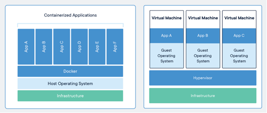
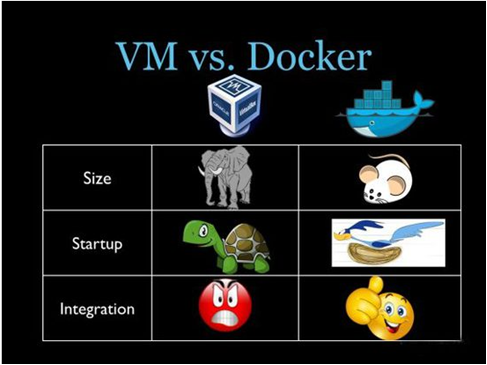
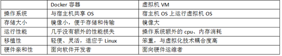
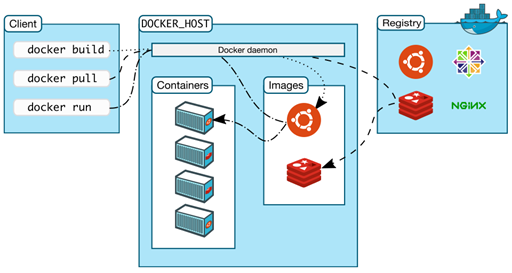

---
date:
    created: 2024-12-14

draft: True
categories:
    - Docker

tags:
    - Docker
---

# 专题1 Docker介绍与安装

介绍一下Docker以及讲解该如何安装Docker

<!-- more -->

## Docker简介

### 什么是 Docker

Docker 是基于Go语言实现的开源容器项目。利用操作系统本身已有的机制和特性，可以实现远超传统虚拟机的轻量级虚拟化（通俗解释：Docker内嵌极小型系统，例如Linux只有5M多，windows也是）。它是内核级的虚拟化。期望达到使项目运行环境“一次封装，到处运行的目的”。

在Docker里面可以设置使用Windows还是Linux系统，默认是用Linux系统，基于Ubuntu的，只有5M多，包含了最基本功能。

利用docker创建的运行环境叫做docker容器，容器是通过docker镜像创建的，docker镜像文件可以放在私有仓库中也可以放在共有仓库中。

官网地址：<https://www.docker.com>

总结：

学习Docker主要做两件事情：

- 在Docker安装软件
- 把项目部署到Docker

### Docker 和 VM 的对比

Docker和VM（虚拟机）的功能特别像。

#### 结构区别

Infrastructure：基础设置（个人电脑，数据中心的服务器）

Host Operating System：主操作系统，如Windows/LInux

#### 应用区别

Docker：面向内核、软件，docker是秒级别的
虚拟机：面向硬件的，分钟级别

### Docker 特点

- 效率高

用户只需要几分钟，就可以把自己的程序“Docker化”。Docker依赖于“写时复制”（copy-on-write）模型，使修改应用程序也非常迅速，可以说达到“随心所致，代码即改”的境界。

随后，就可以创建容器来运行应用程序了。大多数Docker容器只需要不到1秒中即可启动。由于去除了管理程序的开销，Docker容器拥有很高的性能，同时同一台宿主机中也可以运行更多的容器，使用户尽可能的充分利用系统资源。

- 职责明确

使用Docker，开发人员只需要关心容器中运行的应用程序，而运维人员只需要关心如何管理容器。Docker设计的目的就是要加强开发人员写代码的开发环境与应用程序要部署的生产环境一致性。从而降低那种“开发时一切正常，肯定是运维的问题（测试环境都是正常的，上线后出了问题就归结为肯定是运维的问题）”

- 结构完整

Docker的目标之一就是缩短代码从开发、测试到部署、上线运行的周期，让你的应用程序具备可移植性，易于构建，并易于协作。（通俗一点说，Docker就像一个盒子，里面可以装很多物件，如果需要这些物件的可以直接将该大盒子拿走，而不需要从该盒子中一件件的取。）

- 契合微服务架构

Docker还鼓励面向服务的体系结构和微服务架构。Docker推荐单个容器只运行一个应用程序或进程，这样就形成了一个分布式的应用程序模型，在这种模型下，应用程序或者服务都可以表示为一系列内部互联的容器，从而使分布式部署应用程序，扩展或调试应用程序都变得非常简单，同时也提高了程序的内省性。（当然，可以在一个容器中运行多个应用程序）

### Docker 架构（重点）

- Docker daemon（Docker守护进程）

Docker daemon是一个运行在宿主机（DOCKER_HOST）的后台进程。我们可通过它让Docker客户端与Docker通信

- Client（Docker客户端）

Docker客户端是Docker的用户界面，它可以接受用户命令和配置标识，并与Docker daemon通信。图中，docker build等都是Docker的相关命令。

- Images（Docker镜像）

Docker镜像是一个只读模板，它包含创建Docker容器的说明。

和虚拟机中快照是类似的。在虚拟机中根据快照克隆一台虚拟机中。

在Docker中根据Images创建容器。

- Container（容器）

容器是镜像的可运行实例。
容器就相当于VMware中每一个克隆出来的虚拟机。但是容器要比虚拟机体积小很多。

- Registry（仓库）

Docker Registry是一个集中存储与分发镜像的服务。我们构建完Docker镜像后，就可在当前宿主机上运行。但如果想要在其他机器上运行这个镜像，我们就需要手动拷贝。此时，我们可借助Docker Registry来避免镜像的手动拷贝。
一个Docker Registry可包含多个Docker仓库；每个仓库可包含多个镜像标签；每个标签对应一个Docker镜像。这跟Maven的仓库有点类似，如果把Docker Registry比作Maven仓库的话，那么Docker仓库就可理解为某jar包的路径，而镜像标签则可理解为jar包的版本号。

## Docker安装
