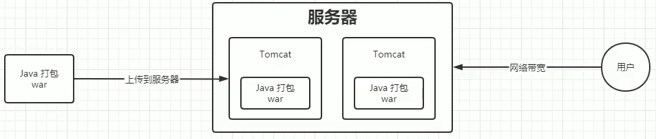
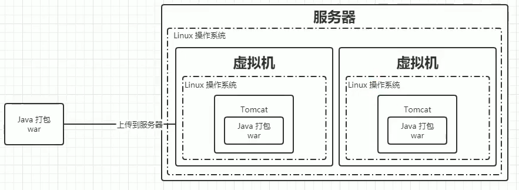
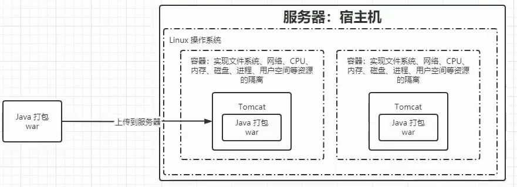

---
date:
    created: 2024-12-24
    updated: 2024-12-25
draft: true
categories:
    - K8S
tags:
    - K8S
---

# Kubernetes(K8S)笔记01

记录下Kubernetes学习笔记01，主要讲解什么是K8S，为什么需要K8S，以及企业级容器调度平台：Mesos、Swarm、K8S。

<!-- more -->

前置学习：

必须

- Linux基础
- Docker基础

可选

- Java 微服务开发
- Redis
- Elasticsearch
- Prometheus
- Jenkins

## 什么是K8S？

Kubernetes（简称K8S）是一个开源的容器编排平台，用于自动化应用程序的部署、扩展和管理。它提供了一个强大的框架，用于构建和管理容器化应用程序的集群。K8S的主要目标是简化容器化应用程序的部署、扩展和管理，同时提供高可用性、可伸缩性和可管理性。

Kubernetes 这个名字源于希腊语，意为舵手"或飞行员"。k8s这个缩写是因为k和s之间有八个字符的关系。Google在2014年开源了Kubernetes项目。Kubernetes建立在Google大规模运行生产工作负载十几年经验的基础上，结合了社区中最优秀的想法和实践。

## 为什么需要K8S？

### 应用部署的三大阶段

#### 传统部署

在传统部署时代，组织通常在物理服务器上运行应用程序。无法为物理服务器中的应用程序定义资源边界，这会导致 **资源分配问题**。例如，如果在物理服务器上运行多个应用程序，则可能会出现一个应用程序占用大部分资源的情况，结果可能导致其他应用程序的性能下降。一种解决方案是在不同的物理服务器上运行每个应用程序，但是由于资源利用不足而无法扩展，并且维护许多物理服务器的成本很高。

主要特点：

- 直接将应用程序部署在物理机上
- **应用程序之间不隔离，可能相互影响**
- 资源分配不合理，利用率低
- 维护成本高，扩展困难
- 应用程序迁移困难

#### 虚拟化部署

虚拟化部署时代，组织开始使用虚拟机来运行应用程序。虚拟机提供了一个完整的操作系统环境，可以为应用程序提供资源隔离和资源分配。虚拟机可以轻松地在不同的物理服务器之间迁移，并且可以为每个应用程序分配特定的资源。

主要特点：

- 使用虚拟机来运行应用程序
- **应用程序之间隔离，相互影响小**
- 资源分配合理，利用率高
- 维护成本低，扩展容易
- 应用程序迁移容易
- **资源利用率低，占用资源过多**

#### 容器化部署

容器化部署时代，组织开始使用容器来运行应用程序。容器提供了一个轻量级的操作系统环境，可以为应用程序提供资源隔离和资源分配。容器可以轻松地在不同的物理服务器之间迁移，并且可以为每个应用程序分配特定的资源。

主要特点：

- 使用容器来运行应用程序
- **应用程序之间隔离，相互影响小**
- 资源分配合理，利用率高
- 维护成本低，扩展容易
- 应用程序迁移容易

### k8s的特点

自我修复

弹性伸缩

自动部署和回滚

服务发现和负载均衡

机密和配置管理

存储编排

批处理

## 企业级容器调度平台：Mesos、Swarm、K8S

### Apache Mesos

Mesos是一个分布式调度系统内核，早于Docker产生，Mesos作为资源管理器，从DC/OS数据中心操作系统的角度提供资源视图。主/从结构工作模式，主节点分配任务，并用从节点上的Executor负责执行，通过Zookeeper给主节点提供服务注册、服务发现功能。通过Framework Marathon提供容器调度的能力。

经过时间的检验，作为资源管理器的Apache Mesos在容器之前就已经出现很久了，支持运行容器化化和非容器化的工作负载。可以支持应用程序的健康检查，开放的架构。支持多个框架和多个调度器，通过不同的Framework可以运行Haddop/Spark/MPI等多种不同的任务。支持超大型规模的节点管理，模拟测试支持超过5w+节点，在大规模上拥有较大优势。

### Docker Swarm

Docker Swarm是一个由Docker开发的调度框架。由Docker自身开发的好处之一就是标准Docker API的使用，Swarm由多个代理(Agent)组成，把这些代理称之为节点(Node)。这些节点就是主机，这些主机在启动Docker Daemon的时候就会打开相应的端口，以此支持Docker远程APl。这些机器会根据Swarm调度器分配给它们的任务，拉取和运行不同的镜像。

从Docker1.12版本开始，Swarm随Docker一起默认安装发布。由于随Docker引擎一起发布，无需额外安装，配置简单。支持服务注册、服务发现，内置Overlay Network以及Load Balancer。与Docker CLI非常类似的操作命令，对熟悉 Docker 的人非常容易上手学习。

入门门槛、学习成本较低，使用更便捷，适用于中小型系统。

### Kubernetes

Kubernetes是基于Google在过去十五年来大量生产环境中运行工作负载的经验。Kubernetes的实现参考了Google内部的资源调度框架，但并不是Borg的内部容器编排系统的开源，而是借鉴Google从运行Borg获得的经验教训，形成了Kubernetes项目。

它使用Label和Pod的概念将容器划分为逻辑单元。Pods是同地协作(co-located)容的集合，这些容器被共同部和调度，形成了一个服务，这是Kubernetes和其他两个框架的主要区别。相比于基于相似度的容器调度方式（就像Swarm和Mesos）,这个方法简化了对集群的管理。

最流行等容器编排解决方案框架，基于Google庞大的生态圈及社区产生的产品。通过Pod5这一抽象的概念，解决Container之间的依赖于通信问题。Pods,Services,Deployments是独立部雪的部分，可以通过Selector提供更多的灵活性。内置服务注册表和负载平衡。

适用度更广，功能更强大，相较于Mesos来说节点规模较小。
