---
date:
    created: 2024-12-25
    updated: 2024-12-28
draft: true
tags:
    - K8S
categories:
    - K8S
---

# Kubernetes(K8S)笔记02

记录下Kubernetes学习笔记02，方便以后复习，具体参考网络资料[Kubernetes 手册](https://jimmysong.io/book/kubernetes-handbook/)。
<!-- more -->

## 集群架构与组件

### Borg对比K8S架构

#### Borg

Borg 是谷歌内部的大规模集群管理系统，负责对谷歌内部很多核心服务的调度和管理。Borg 的目的是让用户能够不必操心资源管理的问题，让他们专注于自己的核心业务，并且做到跨多个数据中心的资源利用率最大化。

Borg 主要由 BorgMaster、Borglet、borgcfg 和 Scheduler 组成，如下图所示

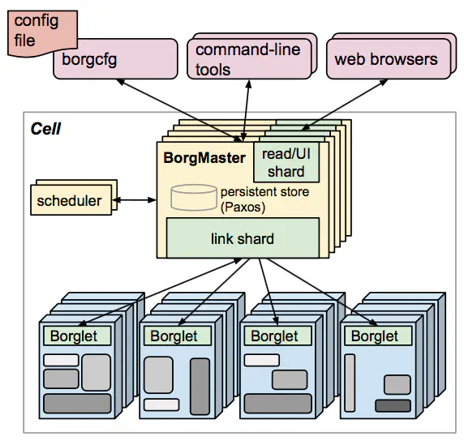

- BorgMaster 是整个集群的大脑，负责维护整个集群的状态，并将数据持久化到 Paxos 存储中；
- Scheduer 负责任务的调度，根据应用的特点将其调度到具体的机器上去；
- Borglet 负责真正运行任务（在容器中）；
- borgcfg 是 Borg 的命令行工具，用于跟 Borg 系统交互，一般通过一个配置文件来提交任务。

#### K8S

K8S 是 Borg 的开源版本，它继承了 Borg 的很多优秀特性，并且提供了更多的功能和更好的扩展性。K8S 主要由 Master 和 Node 组成，如下图所示

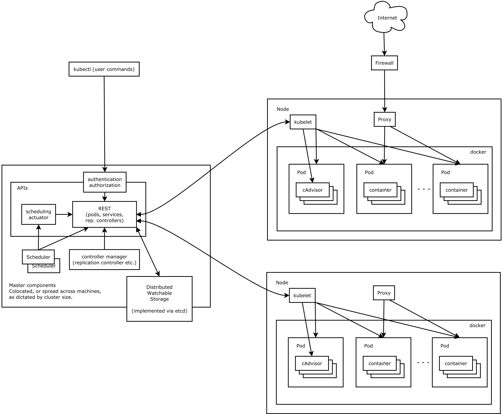

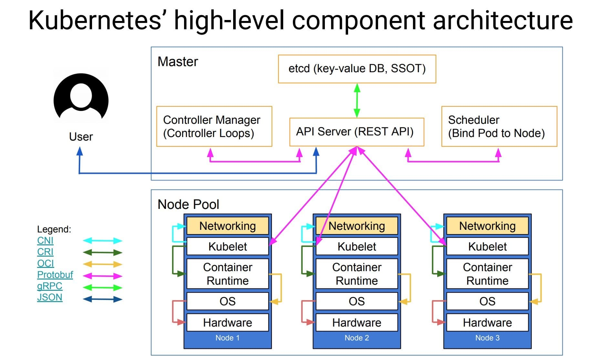

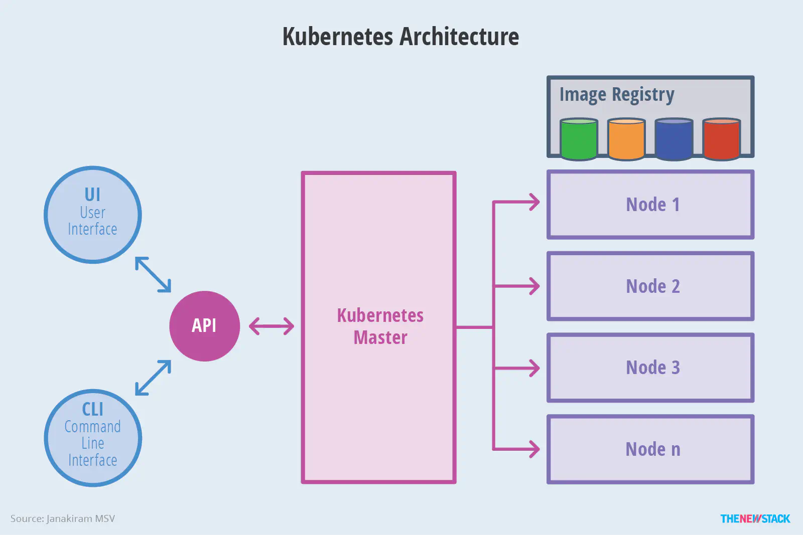

### 核心组件与分层架构

Kubernetes 主要由以下几个核心组件组成：

- etcd 保存了整个集群的状态；
- apiserver 提供了资源操作的唯一入口，并提供认证、授权、访问控制、API 注册和发现等机制；
- controller manager 负责维护集群的状态，比如故障检测、自动扩展、滚动更新等；
- scheduler 负责资源的调度，按照预定的调度策略将 Pod 调度到相应的机器上；
- kubelet 负责维护容器的生命周期，同时也负责 Volume（CSI）和网络（CNI）的管理；
- Container runtime 负责镜像管理以及 Pod 和容器的真正运行（CRI）；
- kube-proxy 负责为 Service 提供 cluster 内部的服务发现和负载均衡；

除了核心组件，还有一些推荐的插件，其中有的已经成为 CNCF 中的托管项目：

- CoreDNS 负责为整个集群提供 DNS 服务
- Ingress Controller 为服务提供外网入口
- Prometheus 提供资源监控
- Dashboard 提供 GUI
- Federation 提供跨可用区的集群

#### 相关组件

##### 控制面板组件（Master）

etcd

分布式键值存储系统，用于存储 k8s 集群的配置数据。

kube-apserver

接口服务，基于REST风格开放的 k8s 接口的服务

kube-controller-manager

kube-controller-manager是控制面板的组件，负责运行控制器进程。
从逻辑上讲，每个控制器都是一个独立的进程，但是为了降低复杂度，它们都被编译到同一个可执行文件中，并在一个进程中运行。
这些控制器包括：

- Node Controller：负责管理节点状态，包括节点的添加、删除、更新等。
- Replication Controller：负责管理 Pod 的副本数，确保 Pod 的数量与期望值一致。
- Endpoints Controller：负责将 Service 和 Pod 关联起来，形成一个 Endpoint 列表。
- Service Account Controller：负责管理 ServiceAccount 资源，包括创建、删除、更新等。
- Volume Controller：负责管理 Volume 资源，包括创建、删除、挂载等。
- Namespace Controller：负责管理 Namespace 资源，包括创建、删除、更新等。
- Service Controller：负责管理 Service 资源，包括创建、删除、更新等。
- Job Controller：负责管理 Job 资源，包括创建、删除、更新等。

cloud-controller-manager

云控制器管理器，第三方云平台提供的控制器API对接管理功能

kube-scheduler

调度器，负责将Pod调度到合适的节点（服务器）上

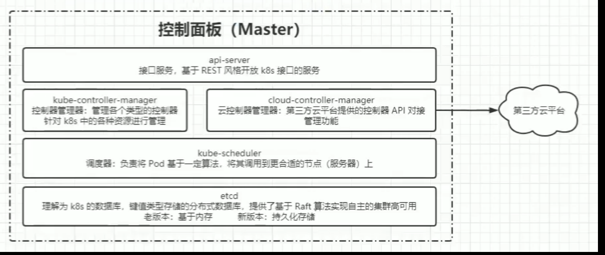

##### 节点组件

kubelet

kubelet，负责维护容器的生命周期，同时也负责 Volume（CSI）和网络（CNI）的管理。

kube-proxy

kube-proxy，负责为 Service 提供 cluster 内部的服务发现和负载均衡。

container-runtime

container-runtime，负责镜像管理以及 Pod 和容器的真正运行（CRI）。

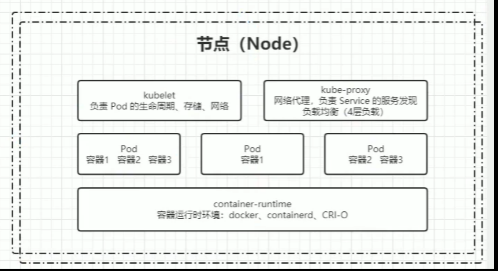

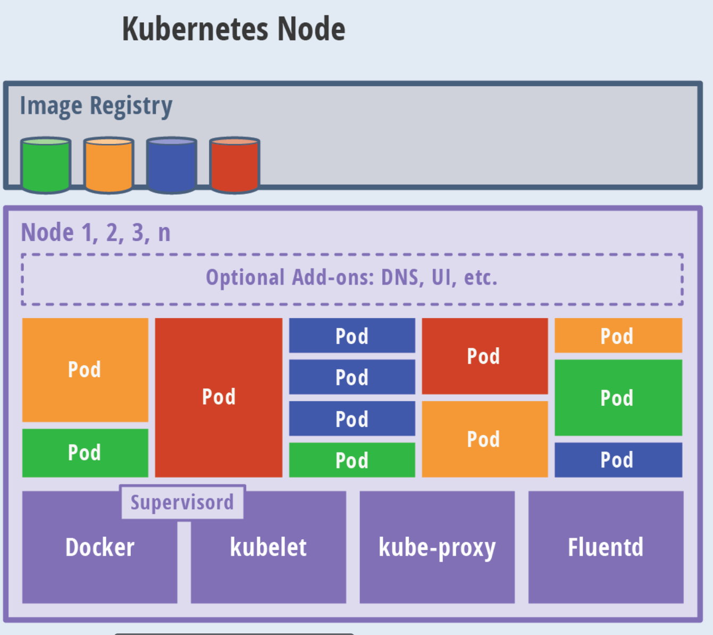

##### 附加组件

kube-dns

kube-dns，负责为整个集群提供 DNS 服务。

ingress-controller

ingress-controller，为服务提供外网入口。

Heapster

Heapster，负责监控集群的资源使用情况。

Prometheus

Prometheus，提供资源监控。

Dashboard

Dashboard，提供 GUI。

Federation

Federation，提供跨可用区的集群。

Fluentd-elasticsearch

Fluentd-elasticsearch，负责日志的收集、存储和查询。

#### 分层架构

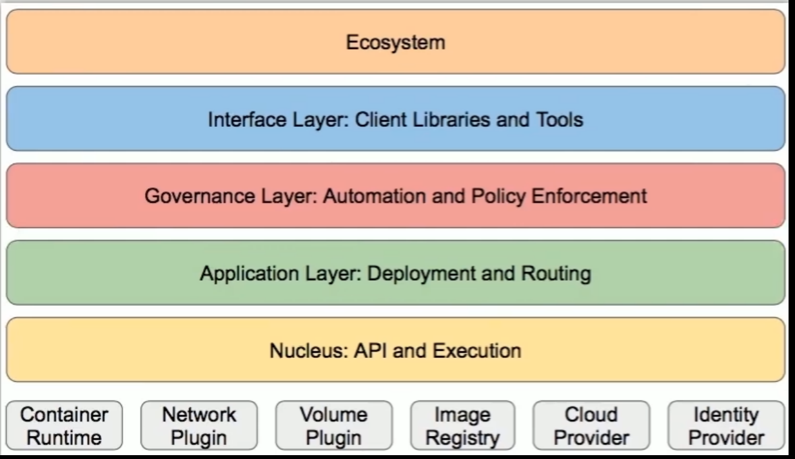

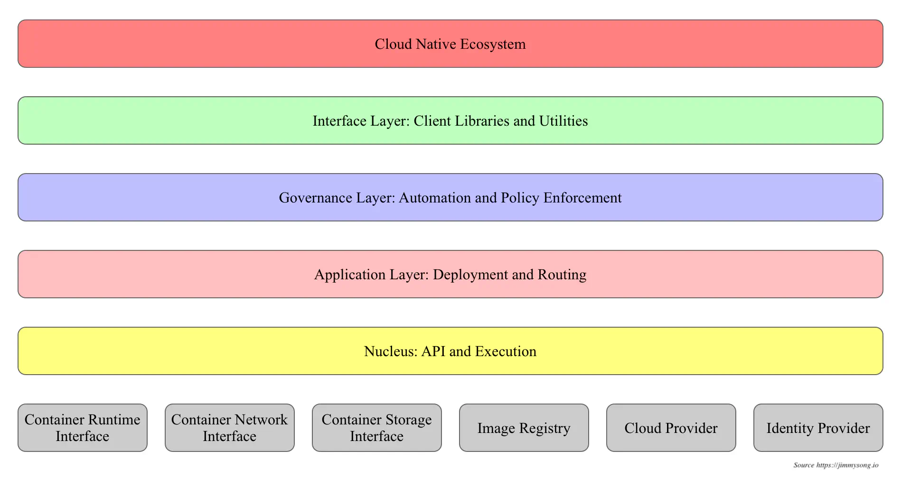

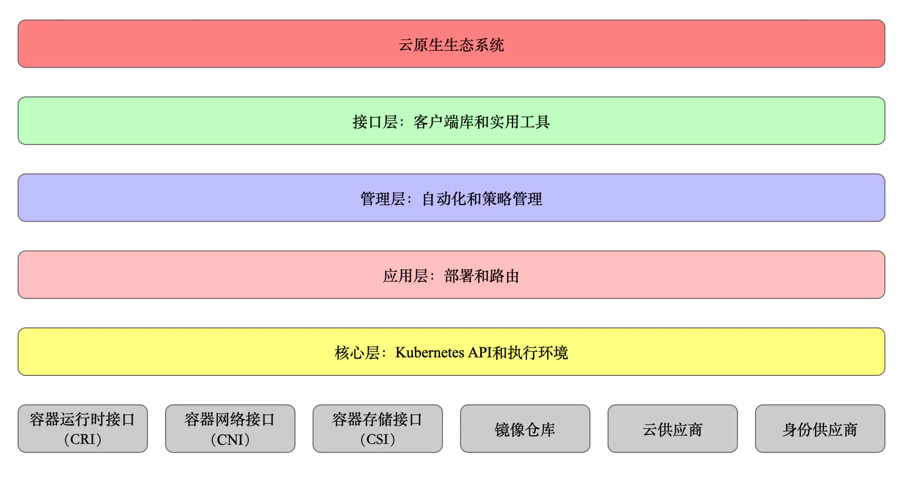

核心层：Kubernetes 最核心的功能，对外提供 API 构建高层的应用，对内提供插件式应用执行环境

应用层：部署（无状态应用、有状态应用、批处理任务、集群应用等）和路由（服务发现、DNS 解析等）、Service Mesh（部分位于应用层）

管理层：系统度量（如基础设施、容器和网络的度量），自动化（如自动扩展、动态 Provision 等）以及策略管理（RBAC、Quota、PSP、NetworkPolicy 等）、Service Mesh（部分位于管理层）

接口层：kubectl 命令行工具、客户端 SDK 以及集群联邦

生态系统：在接口层之上的庞大容器集群管理调度的生态系统，可以划分为两个范畴

- Kubernetes 外部：日志、监控、配置管理、CI/CD、Workflow、FaaS、OTS 应用、ChatOps、GitOps、SecOps 等
- Kubernetes 内部：CRI、CNI、CSI、镜像仓库、Cloud Provider、集群自身的配置和管理等

## 核心概念

### 服务的分类：有状态与无状态

无状态

- 代表应用：Nginx、Apache
- 优点：对客户端透明，无依赖关系，可以高效实现扩容、迁移
- 缺点：不能存储数据，需要额外的数据服务支撑

有状态

- 代表应用：MySQL、Redis
- 优点：可以独立存储数据，实现数据管理
- 缺点：集群环境下需要实现主从、数据同步、备份、水平扩容复杂

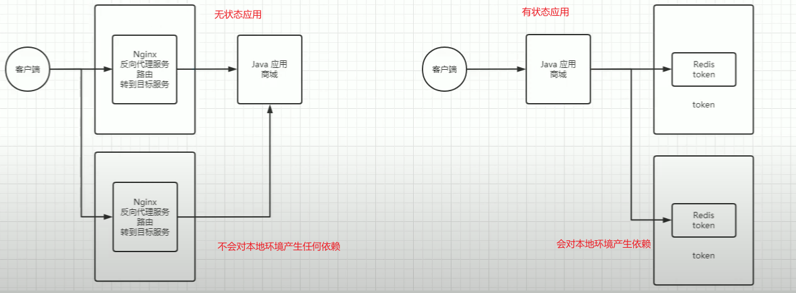

### 资源对象

Kubernetes中的所有内容都被抽象为资源，如Pod、Service、Node等是资源。对象就是资源的实例，是持久化的实体。如某个具体的Pod、某个具体的Node.Kubernetes使用这些实体去表示整个集群的状态。

对象的创建、删除、修改都是通过"Kubernetes API",也就是"Api Server组件提供的AP接口，这些是RESTful风格的Api,与k8s的万物对象理念相符。命令行工具kubectl,实际上也是调用kubemnetes api。

K8s中的资源类别有很多种，kubectl可以通过配置文件来创建这些对象，配置文件更像是描述对象属性的文件，配置文件格式可以是JSON或YAML，常用YAML。

#### 对象规约和状态

对象规约（Spec）：描述对象的期望状态（Desired State），期望达到的目标。当创建 Kubernetes 对象时，必须提供一个描述对象规约的配置文件，用来描述对象的期望状态，以及关于对象的一些基本信息。

对象状态（Status）：描述对象的当前状态，实际运行状态，该状态由 Kubernetes 系统维护，k8s 会通过一些列的控制器对对应对象进行管理，以确保对象的实际状态与期望状态尽可能一致。

#### 资源的分类详解

资源的分类：元数据型、集群级、命名空间级。

元数据型资源：

- Horizontal Pod Autoscaler（HPA）：Pod 自动扩容，可以自动根据 CPU 使用率、内存使用率等指标来扩容或缩容 Pod。
- PodTemplate：Pod 模板，用于定义 Pod 的配置。
- LimitRange：限制命名空间中资源的使用量。
- 等等

集群级资源：

- Namespace：命名空间，用于隔离资源。
- Node：节点，表示集群中的工作机器。
- ClusterRole：集群角色，用于定义集群级别的权限。
- ClusterRoleBinding：集群角色绑定，将集群角色绑定到用户或服务账户。
- 等等

接下来，我们详细讲解一下命名空间级资源。

#### 详细讲解Pod及原理

工作负载型：Pod

Pod（容器组）是Kubernetes中最小的可部署单元，它是可以支持多个容器的。一个Pod（容器组）包含了一个应用程序容器（可能多个容器）、存储资源、一个唯一的IP地址以及一些确定容器该如何运行的选项。Pod容器组代表了Kubernetes 中一个独立的应用程序运行实例，该实例可能由单个容器或者几个紧耦合在一起的容器组成。

Pod 的设计理念是支持多个容器在一个 Pod 中共享网络地址和文件系统，可以通过进程间通信和文件共享这种简单高效的方式组合完成服务。Pod 对多容器的支持是 K8S 最基础的设计理念。比如你运行一个操作系统发行版的软件仓库，一个 Nginx 容器用来发布软件，另一个容器专门用来从源仓库做同步，这两个容器的镜像不太可能是一个团队开发的，但是他们一块儿工作才能提供一个微服务；这种情况下，不同的团队各自开发构建自己的容器镜像，在部署的时候组合成一个微服务对外提供服务。

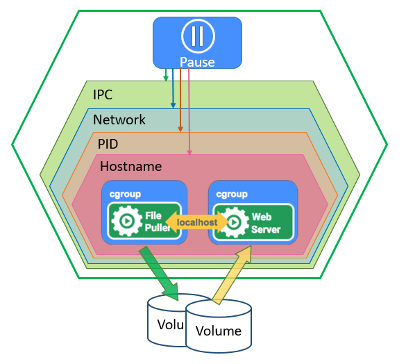

Docker 是 Kubemetes Pod 中使用最广泛的容器引擎；Kubemetes Pod同时也支持其他类型的容器引擎。

在 Kubernetes 集群中 Pod 有如下两种使用方式：

- 一个 Pod 中运行一个容器。“每个 Pod 中一个容器”的模式是最常见的用法；在这种使用方式中，你可以把 Pod 想象成是单个容器的封装，kuberentes 管理的是 Pod 而不是直接管理容器。

- 在一个 Pod 中同时运行多个容器。一个 Pod 中也可以同时封装几个需要紧密耦合互相协作的容器，它们之间共享资源。这些在同一个 Pod 中的容器可以互相协作成为一个 service 单位 ———— 一个容器共享文件，另一个“sidecar”容器来更新这些文件。Pod 将这些容器的存储资源作为一个实体来管理。

#### RC、RS与Deployment

适用于无状态的应用，有状态的应用不适合使用RC、RS、Deployment。

Replication Controller（RC）：Replication Controller 是 Kubernetes 中用于管理 Pod 副本数量的控制器。它确保在任何时候都有指定数量的 Pod 副本在运行。RC 通过监控 Pod 的运行状态，并根据需要创建或删除 Pod 来保持副本数量的一致性。

但是现在RC已经被废弃，转为ReplicaSet（RS）来替代RC进行部署，RS是RC的升级版，支持标签选择器，可以更灵活地选择要管理的Pod。

但是RS也有局限性，比如无法实现滚动更新，所以又出现了Deployment，Deployment是RS的升级版，支持滚动更新，可以更灵活地管理Pod。

Deployment

- 创建 Replica Set/Pod
- 滚动升级/回滚
- 平滑扩容和缩容
- 暂停与恢复 Deployment

#### StatefulSet有状态服务控制器

适用于有状态的服务，比如MySQL、Redis等。

主要特点：

- 稳定的持久化存储
- 稳定的网络标志
- 有序的部署和扩展
- 有序收缩，有序删除

组成

- Headless Service
- volumeClaimTemplate

注意事项

- kubernetes v1.5 以上版本支持
- 所有Pod的Volume必须使用PersistentVolume或者是管理员事先创建好
- 为了保证数据安全，删除StatefulSet时不会删除Volume
- StatefulSet需要一个Headless Service来定义DNS domain，需要在StatefulSet之前创建好

#### DaemonSet 守护进程与任务

DaemonSet：DaemonSet 是 Kubernetes 中用于管理守护进程的控制器。它确保在每个节点上都运行一个或多个守护进程的副本。守护进程通常用于执行系统级别的任务，如日志收集、监控、网络配置等。

典型的应用包括：

- 日志收集：fluentd，logstash
- 系统监控：Prometheus Node Exporter，collectd，New Relic agent，Ganglia gmond
- 系统程序，kube-proxy，kube-dns，glusterd，ceph

任务/定时任务

Job：一次性任务，运行完成后Pod销毁，不再重新启动新容器

CronJob：在Job的基础上加上了定时功能

#### Service与Ingress服务发现控制器

Service：Service 是 Kubernetes 中用于管理服务发现和负载均衡的控制器。它为一组 Pod 提供一个统一的访问接口，通过 Service 可以实现 Pod 的负载均衡、服务发现和流量路由。

Ingress：Ingress 是 Kubernetes 中用于管理外部访问的控制器。它为外部访问提供了一个统一的入口，通过 Ingress 可以实现外部访问的负载均衡、SSL 终止、URL 重写等功能。

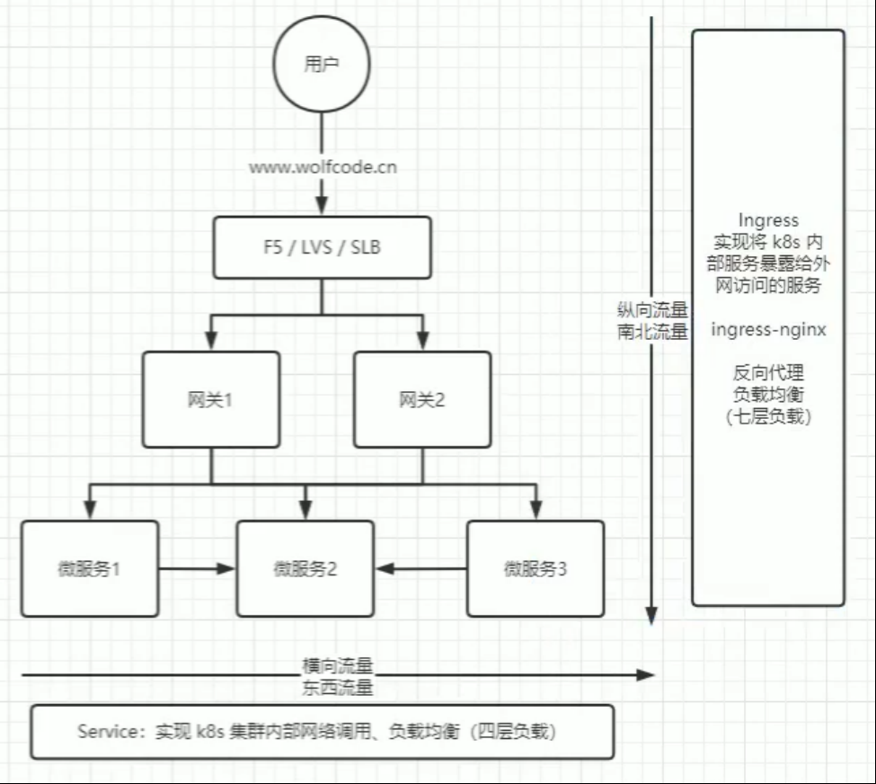

应用示例：

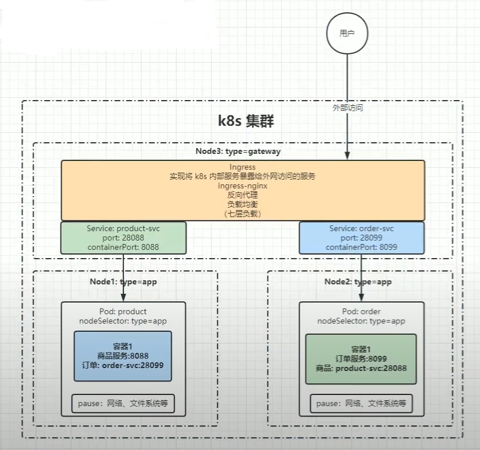

#### 存储、配置与角色

存储：

Volume：Volume 是 Kubernetes 中用于管理存储的控制器，数据卷。它为 Pod 提供了一个统一的存储接口，通过 Volume 可以实现 Pod 的持久化存储和数据共享。

CSI：Container Storage Interface，容器存储接口，是Kubernetes中用于管理存储的接口，通过CSI可以实现Pod的持久化存储和数据共享。

配置：

ConfigMap：ConfigMap 是 Kubernetes 中用于管理配置的控制器。它为 Pod 提供了一个统一的配置接口，通过 ConfigMap 可以实现 Pod 的配置管理。

Secret：Secret 是 Kubernetes 中用于管理敏感信息的控制器。它为 Pod 提供了一个统一的敏感信息接口，通过 Secret 可以实现 Pod 的敏感信息管理。

Downward API：Downward API 是 Kubernetes 中用于管理 Pod 信息的控制器。它为 Pod 提供了一个统一的 Pod 信息接口，通过 Downward API 可以实现 Pod 的信息管理。

其他：

Role：Role 是 Kubernetes 中用于管理权限的控制器。它为 Pod 提供了一个统一的权限接口，通过 Role 可以实现 Pod 的权限管理。

RoleBinding：RoleBinding 是 Kubernetes 中用于管理权限绑定的控制器。它为 Pod 提供了一个统一的权限绑定接口，通过 RoleBinding 可以实现 Pod 的权限绑定。
