---
date:
    created: 2024-12-28
draft: true
tags:
    - K8S
categories:
    - K8S
---

# Kubernetes(K8S)笔记03

记录下Kubernetes学习笔记03，方便以后复习，具体参考网络资料[Kubernetes 手册](https://jimmysong.io/book/kubernetes-handbook/)。
<!-- more -->

## 搭建k8s集群

搭建Kubernetes集群

搭建方案

- minikube
- kubeadm
- 二进制安装
- 命令行工具

命令行工具

- kubectl

API概述

- 类型
  - Alpha
  - Beta
  - Stable
- 访问控制
  - 认证
  - 授权
- 废弃 api 说明

这里使用kubeadm搭建k8s集群

服务器要求

- 3台服务器
  - k8s-master：`192.168.64.134`
  - k8s-node1：`192.168.64.135`
  - k8s-node2：`192.168.64.136`
- 最低配置：2核、2G内存、20G硬盘
- 最好能联网

软件环境

- 操作系统：Ubuntu 24.04
- Docker：20+
- k8s：1.23.6

安装部署

- 初始操作
- 安装基础软件（所有节点）
  - 安装 Docker
  - 添加阿里云 yum 源
  - 安装 kubeadm、kubelet、kubectl
- 部署 kubernetes master
- 加入 kubernetes node
- 部署 CNI 网络插件
- 测试 kubernetes 集群

### 前置步骤

#### 关闭防火墙

查看当前的防火墙状态：`sudo ufw status`

关闭防火墙：`sudo ufw disable`

#### 关闭swap

暂时关闭：`sudo swapoff -a`

永久关闭：先关闭swap，再删除Swap分区文件：`sudo rm /swap.img`，然后编辑`/etc/fstab`文件，注释或者删除`/swap.img none swap sw 0 0`这一行。

总的命令：

```bash
sudo swapoff -a
sudo rm /swap.img
sudo vim /etc/fstab
```

#### 开启网络转发等配置

overlay 是文件系统。由于Docker是分层的，上层的文件会覆盖下层的文件，使用到了overlay文件系统。

br_netfilter 网络转发。br_netfilter模块可以使 iptables 规则可以在 Linux Bridges 上面工作，用于将桥接的流量转发至iptables链。如果没有加载br_netfilter模块，那么并不会影响不同node上的pod之间的通信，但是会影响同node内的pod之间通过service来通信。

1.加载两个内核模块

```bash
sudo modprobe overlay
sudo modprobe br_netfilter
```

持久化上述的两个模块：

```bash
cat <<EOF | sudo tee /etc/modules-load.d/k8s.conf
overlay
br_netfilter
EOF
```

通过运行 `lsmod | grep br_netfilter` 和 `lsmod | grep overlay` 来检查模块是否已加载。

2.设置内核参数，确保二层的网桥在转发包时也会被iptables的forward规则所过滤

```bash
cat <<EOF | sudo tee /etc/sysctl.d/k8s.conf
net.bridge.bridge-nf-call-ip6tables = 1
net.bridge.bridge-nf-call-iptables = 1
net.ipv4.ip_forward = 1
EOF
```

3.应用sysctl配置

```bash
sudo sysctl --system
```

总的命令：

```bash
sudo modprobe overlay
sudo modprobe br_netfilter
cat <<EOF | sudo tee /etc/modules-load.d/k8s.conf
overlay
br_netfilter
EOF
cat <<EOF | sudo tee /etc/sysctl.d/k8s.conf
net.bridge.bridge-nf-call-ip6tables = 1
net.bridge.bridge-nf-call-iptables = 1
net.ipv4.ip_forward = 1
EOF
sudo sysctl --system
```

#### 设置主机名

查看当前主机名Check the Current Hostname：`hostname`

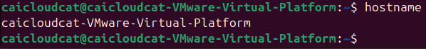

临时更改主机名：`sudo hostname linuxconfig`

永久更改主机名：`sudo hostnamectl set-hostname linuxconfig`,再重启

使用命令检查主机名更改：`hostnamectl`

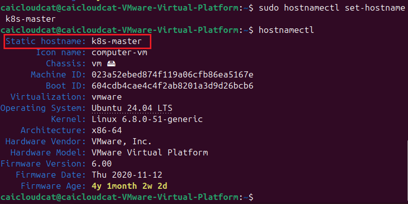

最后修改hosts文件：`sudo vim /etc/hosts`

详见[Setting the Hostname on Ubuntu 24.04](https://linuxconfig.org/setting-the-hostname-on-ubuntu-24-04)

#### 在master节点设置hosts

```bash
sudo sh -c 'cat >> /etc/hosts <<EOF
192.168.64.134 k8s-master
192.168.64.135 k8s-node1
192.168.64.136 k8s-node2
EOF'
```

设置后，可以通过`ping k8s-node1`来测试是否设置成功。

#### 设置远程连接

安装OpenSSH：`sudo apt install openssh-server`

启动OpenSSH：`sudo systemctl start ssh`

设置开机自启：`sudo systemctl enable ssh`

#### 安装Docker

具体详见k8s的官方下载手册[Install Docker Engine on Debian](https://docs.docker.com/engine/install/debian/#install-using-the-repository)

卸载旧版本：`for pkg in docker.io docker-doc docker-compose docker-compose-v2 podman-docker containerd runc; do sudo apt-get remove $pkg; done`

##### 官方文档安装

使用apt存储库安装：

```bash
# Add Docker's official GPG key:
sudo apt-get update
sudo apt-get install ca-certificates curl
sudo install -m 0755 -d /etc/apt/keyrings
sudo curl -fsSL https://download.docker.com/linux/debian/gpg -o /etc/apt/keyrings/docker.asc
sudo chmod a+r /etc/apt/keyrings/docker.asc

# Add the repository to Apt sources:
echo \
  "deb [arch=$(dpkg --print-architecture) signed-by=/etc/apt/keyrings/docker.asc] https://download.docker.com/linux/debian \
  $(. /etc/os-release && echo "$VERSION_CODENAME") stable" | \
  sudo tee /etc/apt/sources.list.d/docker.list > /dev/null
sudo apt-get update
```

安装Docker软件包

安装最新版：`sudo apt-get install docker-ce docker-ce-cli containerd.io docker-buildx-plugin docker-compose-plugin`

要安装特定版本，首先列出存储库中可用的版本：

```bash
# List the available versions:
apt-cache madison docker-ce | awk '{ print $3 }'

5:27.4.0-1~debian.12~bookworm
5:27.3.1-1~debian.12~bookworm
...
```

选择所需的版本安装：

```bash
VERSION_STRING=5:27.4.0-1~debian.12~bookworm
sudo apt-get install docker-ce=$VERSION_STRING docker-ce-cli=$VERSION_STRING containerd.io docker-buildx-plugin docker-compose-plugin
```

##### 国内镜像源安装

当然，考虑到国内网络问题，上面的安装可能会失败，可以参考安装手册[最新安装Docker教程](https://linux.do/t/topic/225745)

具体步骤如下：

```bash
sudo apt-get update
sudo apt-get install ca-certificates curl
sudo install -m 0755 -d /etc/apt/keyrings
sudo curl -fsSL https://mirrors.cloud.tencent.com/docker-ce/linux/ubuntu/gpg -o /etc/apt/keyrings/docker.asc
sudo chmod a+r /etc/apt/keyrings/docker.asc

echo   "deb [arch=$(dpkg --print-architecture) signed-by=/etc/apt/keyrings/docker.asc] https://mirrors.cloud.tencent.com/docker-ce/linux/ubuntu/ \
  $(. /etc/os-release && echo "$VERSION_CODENAME") stable" |   sudo tee /etc/apt/sources.list.d/docker.list > /dev/null
sudo apt-get update

sudo apt-get install docker-ce docker-ce-cli containerd.io docker-buildx-plugin docker-compose-plugin

sudo systemctl start docker
sudo systemctl enable docker

sudo docker version
sudo docker compose version
```

验证安装：`sudo docker run hello-world`

配置Docker镜像源

具体可以用的镜像源可以参考：[Docker镜像源](https://www.coderjia.cn/archives/dba3f94c-a021-468a-8ac6-e840f85867ea)、[容器镜像库](https://dockerhub.icu/)

如果安装上面的验证安装成功，则可以跳过。

第一步：新建或编辑daemon.json：`sudo vim /etc/docker/daemon.json`

第二步：daemon.json中编辑如下：

```json
{
    "registry-mirrors": [
      "https://docker.m.daocloud.io",
      "https://docker.1panel.live"
      ]
}
```

第三步：重启docker：`sudo systemctl restart docker.service`

第四步：执行docker info查看是否修改成功：`docker info`

再次验证安装：`sudo docker run hello-world`

启动Docker，设置开机自启：`sudo systemctl enable docker --now`

#### 安装kubeadm、kubelet、kubectl

```bash
curl -fsSL https://mirrors.aliyun.com/kubernetes/apt/doc/apt-key.gpg | sudo gpg --dearmor -o /etc/apt/keyrings/kubernetes-archive-keyring.gpg
echo "deb [signed-by=/etc/apt/keyrings/kubernetes-archive-keyring.gpg] https://mirrors.aliyun.com/kubernetes/apt/ kubernetes-xenial main" | sudo tee /etc/apt/sources.list.d/kubernetes.list
sudo apt-get update
```

安装最新版本

```bash
sudo apt-get install -y kubelet kubeadm kubectl
sudo apt-mark hold kubelet kubeadm kubectl
```

安装特定版本

查看可用版本

```bash
sudo apt-cache madison kubelet
sudo apt-cache madison kubeadm
sudo apt-cache madison kubectl
```

我们安装的是`kubeadm=1.23.6-00`

```bash
sudo apt-get install kubelet=1.23.6-00
sudo apt-get install kubeadm=1.23.6-00
sudo apt-get install kubectl=1.23.6-00
sudo apt-mark hold kubelet kubeadm kubectl
```

查看安装的版本：

```bash
kubelet --version
kubeadm version
kubectl version
```

设置开机自启：`sudo systemctl enable kubelet --now`

#### 安装cri-dockerd

### 初始化master节点

接下来在master节点上进行初始化操作。

```bash
sudo kubeadm init \
--apiserver-advertise-address=192.168.64.134 \
--../../../PageImage/image20241230004725-repository registry.aliyuncs.com/google_containers \
--kubernetes-version v1.23.6 \
--service-cidr=10.96.0.0/12 \
--pod-network-cidr=10.244.0.0/16
```

讲解：

- `--apiserver-advertise-address=192.168.64.134`：指定API Server的IP地址，这里使用的是master节点的IP地址。
- `--../../../PageImage/image20241230004725-repository registry.aliyuncs.com/google_containers`：指定镜像仓库，这里使用的是阿里云的镜像仓库。
- `--kubernetes-version v1.23.6`：指定Kubernetes的版本，这里使用的是v1.23.6。
- `--service-cidr=10.96.0.0/12`：指定Service的CIDR范围，这里使用的是10.96.0.0/12。
- `--pod-network-cidr=10.244.0.0/16`：指定Pod的CIDR范围，这里使用的是10.244.0.0/16。

最后的输出：

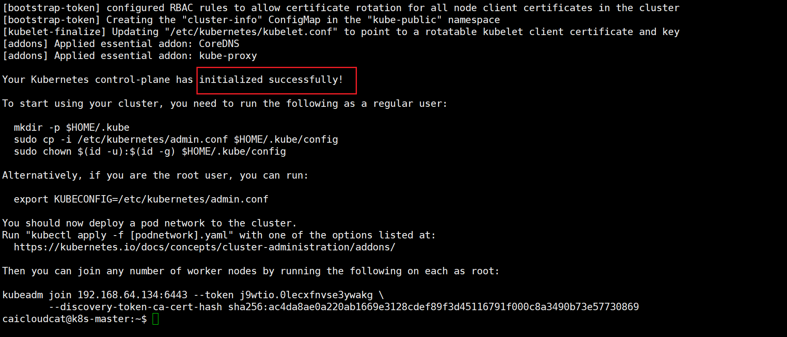

To start using your cluster, you need to run the following as a regular user:

```bash
mkdir -p $HOME/.kube
sudo cp -i /etc/kubernetes/admin.conf $HOME/.kube/config
sudo chown $(id -u):$(id -g) $HOME/.kube/config
```

执行`kubectl get nodes`，可以看到master节点已经加入到集群中。

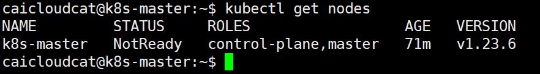

### 加入k8s-node节点

在k8s-node节点（k8s-node1、k8s-node2）上执行：

```bash
sudo kubeadm join 192.168.64.134:6443 --token <master控制台的token> \
--discovery-token-ca-cert-hash sha256:<master控制台的hash值>
```

如果初始化的token不小心清空了，可以通过下面的命令获取或者重新申请：

```bash
kubeadm token list
```

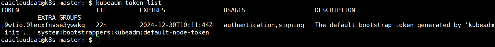

可以看到这个token值为：`j9wtio.0lecxfnvse3ywakg`

如果已经过期，则需要重新申请：

```bash
kubeadm token create
```

接下来获取master节点的hash值：

```bash
openssl x509 -pubkey -in /etc/kubernetes/pki/ca.crt | openssl rsa -pubin -outform der 2>/dev/null | openssl dgst -sha256 -hex | sed 's/^.* //'
```

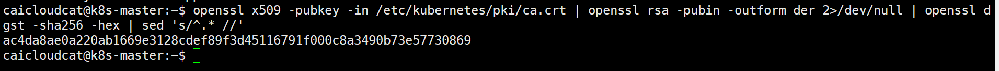

这段命令的作用是从Kubernetes的CA证书中提取公钥，并计算其SHA-256哈希值，以便在加入节点时使用，这里的hash值为`ac4da8ae0a220ab1669e3128cdef89f3d45116791f000c8a3490b73e57730869`。

在Kubernetes中，使用--discovery-token-ca-cert-hash参数时，要求提供的hash值必须以`sha256:`前缀开头。这是因为Kubernetes需要明确知道所提供的hash值是使用SHA-256算法计算的。

因此最后的命令为（在k8s-node节点上执行）：

```bash
sudo kubeadm join 192.168.64.134:6443 --token j9wtio.0lecxfnvse3ywakg \
--discovery-token-ca-cert-hash sha256:ac4da8ae0a220ab1669e3128cdef89f3d45116791f000c8a3490b73e57730869
```

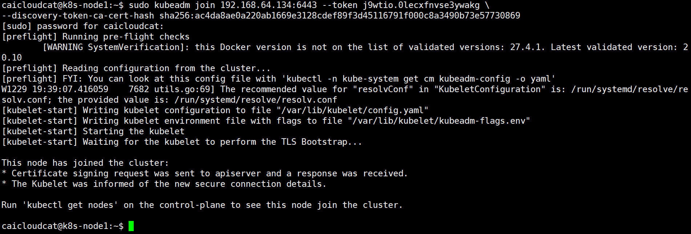

执行`kubectl get nodes`，可以看到k8s-node1、k8s-node2节点已经加入到集群中。

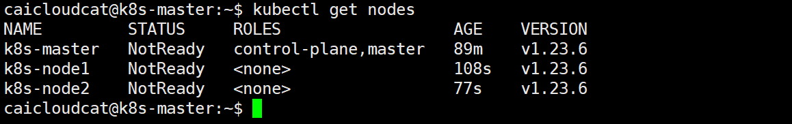

### 部署CNI网络插件

在使用`kubectl get nodes`命令时，如果看到`STATUS`为`NotReady`，则需要部署CNI网络插件。

我们又用`kubectl get pods -n kube-system`命令查看，可以发现有两个pod没有正常运行。

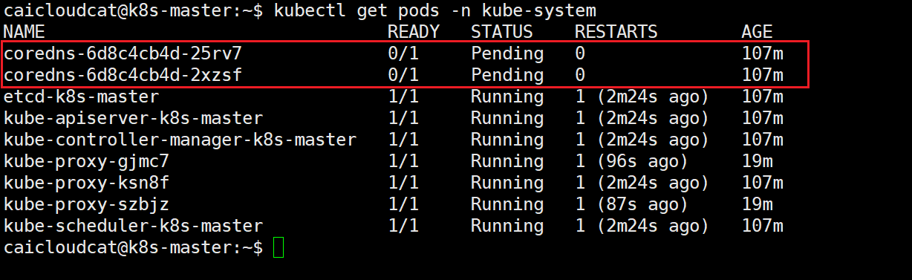

在这里我们使用calico网络插件，在master节点执行命令。

首先创建对应的文件夹进行管理：

```bash
cd /opt
mkdir k8s
cd k8s
```

下载calico的yaml文件：

```bash
sudo wget https://docs.tigera.io/archive/v3.25/manifests/calico.yaml
```

修改calico.yaml文件中的`CALICO_IPV4POOL_CIDR`配置，修改为与初始化的`--pod-network-cidr`相同，具体看[初始化master节点](#初始化master节点)：

```bash
sudo vim calico.yaml
```

`CALICO_IPV4POOL_CIDR`配置，大致在4601行，修改为`10.244.0.0/16`。

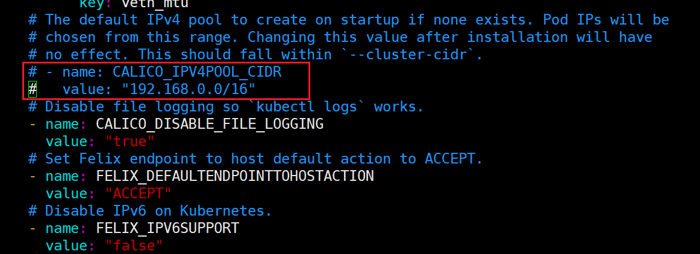

接下来配置`IP_AUTODETECTION_METHOD`。

完毕后，查看下载calico.yaml文件对应需要的镜像`grep ../../../PageImage/image20241230004725 calico.yaml`：

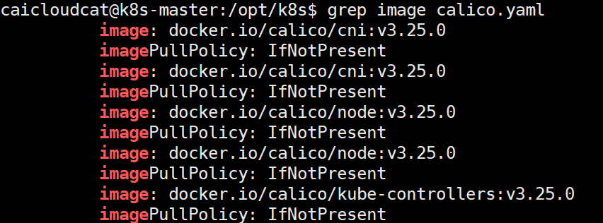

可以看到，镜像前面有`docker.io/`前缀，为避免下载过慢导致失败,因而可以删除该前缀。

```bash
sudo sed -i 's#docker.io/##g' calico.yaml
```

然后下载镜像：

```bash
sudo docker pull calico/cni:v3.25.0
sudo docker pull calico/node:v3.25.0
sudo docker pull calico/kube-controllers:v3.25.0
```

```bash
kubectl apply -f calico.yaml
```

执行`kubectl get pods -n kube-system`，可以看到已经有显示对应的calico的Pod。

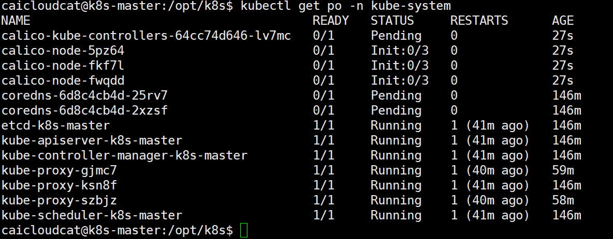

期间可以使用`kubectl describe po xxx -n kube-system`查看对应的Pod的详细信息。

如果遇到`Init:Error../../../PageImage/image20241230004725Pull`，具体可以参考[K8s的Pod出现Init:../../../PageImage/image20241230004725PullBackOff问题的解决(以calico为例)](https://blog.csdn.net/weixin_40444270/article/details/132543441)

### 测试k8s集群

```bash
kubectl create deployment nginx --../../../PageImage/image20241230004725=nginx
kubectl expose deployment nginx --port=80 --type=NodePort
kubectl get pod,svc
```

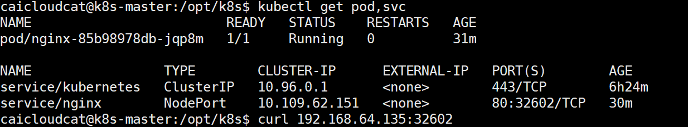

使用`curl 192.168.64.134`，可以看到nginx的页面。

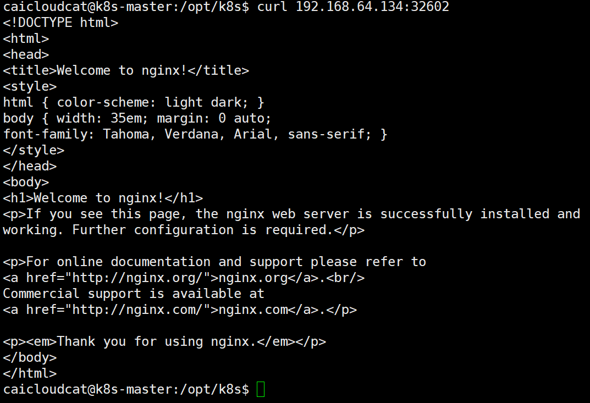

同理，也可以使用`192.168.64.135`、`192.168.64.136`访问到nginx的页面。

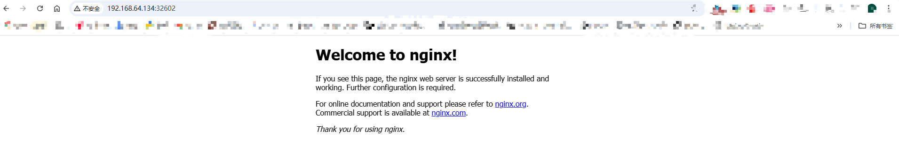

## 参考资料

[k8s集群搭建（基于v1.23.6）](https://juejin.cn/post/7369865018764984354) 2024-05-18

[深入架构原理与实践 8.4.1 Pod](https://www.thebyte.com.cn/kubernetes/pod.html)

[基于Ubuntu下安装kubernetes集群指南](https://blog.csdn.net/zhangzhaokun/article/details/131452979) 2023-08-10

[How Install Kubernetes on Ubuntu 24.04 (Step-by-Step Guide)](https://www.linuxtechi.com/install-kubernetes-on-ubuntu-24-04/)，在csdn上找到一个翻译过得[Ubuntu 24.04 上安装 Kubernetes，超级详细的教程！](https://blog.csdn.net/xiaochong0302/article/details/140217419)，但是标签显示的是“原创”，稍微有点搞笑，所以还是看英文的吧。

[一文讲明白K8S各核心架构组件](https://www.cnblogs.com/ZhuChangwu/p/16441181.html)

[Pod 解析](https://jimmysong.io/kubernetes-handbook/concepts/pod.html)

[k8s版本号说明](https://www.huweihuang.com/kubernetes-notes/setup/k8s-version-release.html) - 个人博客

[Pod控制器](https://k8s.huweihuang.com/project/concepts/pod/pod-scheduler)
