---
date:
    created: 2024-12-02
    updated: 2024-12-12

draft: True
categories:
    - Server
    - Nginx
tags:
    - Linux
    - 服务器
    - Nginx
---

# Nginx

如果我们需要上传一个网站到服务器，需要安装HTTP Server（也称为Web服务器）。常用的Web服务器有nginx和Apache HTTP Server，当然我们常用的Tomcat也集成了Web服务的功能。

Nginx 是开源的轻量级 Web 服务器、反向代理服务器，以及负载均衡器和 HTTP 缓存器。其特点是高并发，高性能和低内存。

Nginx最初由Igor Sysoev为俄罗斯访问量第二的Rambler.ru站点开发，其将源代码以类BSD许可证的形式发布，因它的稳定性、丰富的功能集、简单的配置文件和低系统资源的消耗而闻名。Nginx可以在大多数Unix、Linux OS上编译运行，并有Windows移植版。

<!-- more -->

## 安装Nginx

安装Nginx有几种常见的方法

方法一：通过APT包管理器安装，即使用`apt-get`命令安装

方法二：从源码包安装

详细具体操作看之前的笔记文章：[在Linux中安装Nginx、Tomcat和Mysql服务器](./Nginx、Tomcat和Mysql服务器安装.md)


## 创建Nginx虚拟主机(Virtual Host)

主要参考：[How to Create Nginx Virtual Host (Server Block)](https://linuxiac.com/nginx-virtual-host/#how-to-create-nginx-virtual-hosts-server-blocks)

Nginx旨在处理单个服务器和 IP 地址上的多个域。换句话说，如果您有一台用作Web服务器的服务器并且只分配了一个IP地址，那么您需要使用Nginx虚拟主机来在该服务器上运行多个网站(website)或域(domian)。

### 什么是虚拟主机？

虚拟主机是Apache HTTP 服务器术语；然而，Nginx 用户也常用它。 Nginx 的正确术语是server block，简而言之就是一种在一台服务器上托管多个域名的方法。

相关文章：[Apache vs Nginx: Which Web Server You Should Choose](https://linuxiac.com/apache-vs-nginx/)

### 虚拟主机如何工作？

当您在服务器上启动 Nginx 等 Web 服务器软件时，该 Web 服务器会将自身绑定到一个或多个网络端口。通常，对于 Web 服务器，该端口为 80 和 443 。

当计算机访问网站时，它会通过互联网向服务器发送请求，服务器将接收该请求。但是，首先，服务器将查看请求发送到的目标端口。

接下来，它将使用该目标端口来确定将该信息转发到的应用程序。这意味着您的 Web 服务器只能让一个应用程序接收请求。

但是，如果您想在同一服务器上运行两个网站怎么办？当收到请求网站的数据包时，服务器必须先确定正在请求哪个网站，然后再决定返回哪些信息。

需要注意的是，无论请求哪个网站，服务器都无法根据端口号和目标端口识别客户端尝试访问哪个网站。

所以服务器要做的就是说：“我正在向 Nginx 发送这个请求。”从那里，Nginx 才决定发回什么信息。

这就是服务器块发挥作用的时候。它们可用于根据请求的 IP 地址为其他网站提供服务，或根据所使用的域名为不同的网站提供服务。


因此，当您输入网站名称（例如`www.example.com` ）并且服务器接收到该名称时，Nginx 将查看 HTTP 标头以查看请求的服务器名称。

然后，服务器根据配置的虚拟主机确定网站文件存放在哪个目录，并根据服务器名称向客户端下发正确的响应。

### 如何创建 Nginx 虚拟主机（服务器块）

我们可以在两个目录中创建和存储虚拟主机配置文件。它们都位于`/etc/nginx`目录中。这两个目录的名称是`sites-available`和`sites-enabled`。

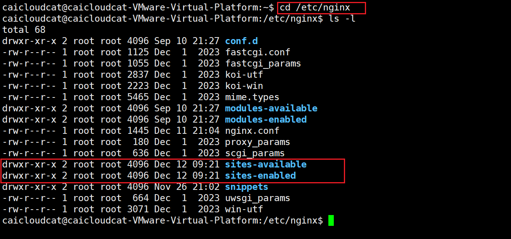

> 这里使用apt包下载安装的Nginx，如果是用源码安装的，可以自行找到自己Nginx对应的配置文件安装在哪里，其目录名称是相同的。

- `/etc/nginx/sites-available` ：定义各个虚拟主机（网站）的目录。请记住，Nginx 不会使用此目录中的配置文件，除非它们 **链接** 到`/etc/nginx/sites-enabled`目录。

- `/etc/nginx/sites-enabled` ：Nginx 主动服务的虚拟主机（网站）列表。

那么为什么我们需要用两个目录来存储虚拟主机文件？

因为通过这种方式，我们可以在 Nginx 服务器上创建许多虚拟主机文件，我们也可以根据我们需求来启用它们。

在本文章中，我们将在 Nginx 服务器中创建虚拟主机文件来托管具有多个域的多个站点。

域名为：`website1.com`和`website2.com`

#### 1.创建目录结构

首先我们要为每个虚拟主机创建一个目录，用于存放不同的网站内容。

我们将这些目录放在`/var/www`中，并以每个域名命名。

运行下面的命令来创建：

```shell
sudo mkdir -p /var/www/website1.com
sudo mkdir -p /var/www/website2.com
sudo mkdir -p /var/www/caicloudcat.publicvm.com
```

#### 2.为每个网站创建测试页面

接下来，我们在域的文档根目录中创建一个`index.html`文件，以便我们可以显示一些测试内容。

可以用vim进行创建和编辑内容：

```shell
sudo vim /var/www/website1.com/index.html
```

或者将相关内容在主机（Windows）中内容先编辑好，然后上传。

```shell
cp -T example.html /var/www/website1.com/index.html
```

对其他的目录也重复上面的操作。

#### 3.创建Nginx虚拟机

要在`sites-available`目录中创建Nginx虚拟主机文件`website1.com`，请执行以下命令：

```shell
sudo vim /etc/nginx/sites-available/website1.com
```

> Nginx 虚拟主机配置文件可以随意命名，但通常最好使用域名。


将以下内容粘贴到虚拟主机文件`website1.com`中：

```bash
server {
    listen 80;
    server_name website1.com www.website1.com;
    root /var/www/website1.com;

    access_log /var/log/nginx/website1-access.log;
    error_log /var/log/nginx/website1-error.log;
}
```

我们来了解各个参数的含义：

`listen`指令

它用于指定 Nginx 服务器监听的端口号。在这里，Nginx 会在服务器的 80 端口上进行监听，等待来自客户端（比如浏览器等）的 HTTP 请求。80 端口是 HTTP 协议默认使用的端口，意味着用户在浏览器中输入网址访问网站时，如果不特别指定端口，就会默认尝试通过 80 端口连接到服务器。

`server_name`指令

用来定义这个服务器块所对应的域名。这里指定了两个域名，即 `website1.com` 和 `www.website1.com`。当客户端通过浏览器访问这两个域名中的任何一个时，Nginx 会根据这个配置知道该请求应该由当前这个服务器块来处理。可以根据实际需要在这里配置多个域名，用空格进行分隔，这样一个 Nginx 服务器实例就能为多个不同域名提供服务。

`root`指令

它定义了服务器的根目录，也就是网站文件存放的基础目录。当 Nginx 接收到针对当前 `server_name` 所配置域名的请求后，会在这个指定的根目录下去查找对应的网页文件来响应请求。例如，如果客户端请求的是 `http://website1.com/index.html`，Nginx 就会去 `/var/www/website1.com` 目录下查找 `index.html` 文件，并将其内容返回给客户端（前提是配置的其他相关规则也允许这样做等情况）。

`access_log`指令

用于指定访问日志的存放路径。Nginx 会把接收到的每个请求的相关信息记录到这个指定的日志文件中，比如客户端的 IP 地址、请求的 URL、请求时间等。通过分析访问日志，可以了解网站的访问情况、用户行为、哪些页面受欢迎等诸多信息，便于进行网站性能分析、流量统计以及故障排查等工作。

`error_log`指令

用来设定错误日志的存放位置。当 Nginx 在运行过程中出现错误，比如配置文件语法错误、无法正确读取网页文件等情况时，相关的错误信息会被记录到这个指定的日志文件中，方便管理员查看具体的错误原因，进而对服务器配置或者网站文件等进行修复和调整。

同样，其余的域名命名操作也是重复上述操作。


#### 4.启用Nginx虚拟主机

在测试之前我们需要做的最后一件事是启用虚拟主机。

我们可以通过创建从文件到`sites-enabled`目录的符号链接来做到这一点：

```shell
sudo ln -s /etc/nginx/sites-available/website1.com /etc/nginx/sites-enabled/
sudo ln -s /etc/nginx/sites-available/website2.com /etc/nginx/sites-enabled/
```

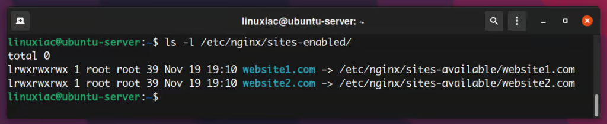

在我们继续之前，让我们仔细检查一下是否有任何拼写错误。测试 Nginx 配置的语法是否正确：

```shell
sudo nginx -t
```

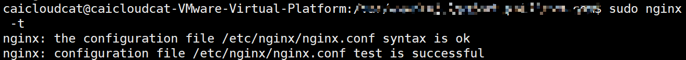

没有问题，则重新启动Nginx服务：

```shell
sudo systemctl restart nginx
```

#### 5.测试虚拟主机

为了测试Nginx虚拟主机，我们首先需要将域名记录指向服务器的IP地址。在我们的例子中，服务器 IP 地址是`192.168.64.10` 。

如果您使用的是Linux ，请使用以下命令打开台式电脑（您将在其中执行测试的电脑）上的`/etc/hosts`文件：

```shell
sudo vim /etc/hosts
```

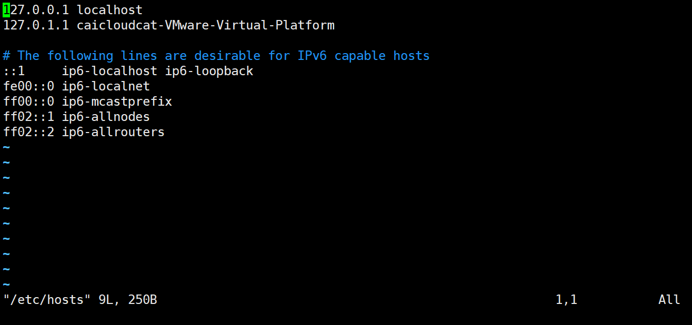

并将虚拟域名一一添加，如下图：

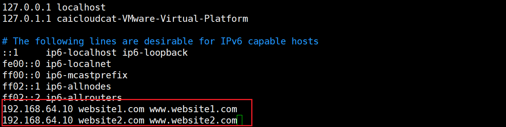

完成后保存并关闭文件。这种方式将允许我们测试我们不拥有的域。

现在打开浏览器并一一输入`www.website1.com`和`www.website2.com` 。您将分别看到两个域的索引页。


这样，就成功使用 Nginx 配置了两个独立的域。

如果想让你的主机（Windows）也同样能够测试，则可以参考[window下配置hosts文件，使虚拟机主机名与IP地址映射](https://blog.csdn.net/mango_ZZY/article/details/109017647)，其`hosts`是在`C:\Windows\System32\drivers\etc`中。


#### 6.禁用Nginx虚拟主机

要在 Nginx 中禁用虚拟主机，我们必须删除在启用虚拟主机文件时创建的符号链接。例如，要禁用`website2.com` ，我们必须执行以下命令：

```shell
sudo rm -rf /etc/nginx/sites-enabled/website2.com
```

要应用更改，我们必须重新启动 Nginx 服务器：

```shell
sudo systemctl restart nginx
```


## 配置SSL

### 什么是SSL？

这里我用chat跑出来，简略的讲解一下。

SSL（Secure Sockets Layer）安全套接层是一种为网络通信提供安全及数据完整性的协议。以下是详细内容：

**一、SSL的基本概念**

1. **历史背景**
   - SSL最初是由网景公司（Netscape）在1994年开发的，目的是为了解决互联网上数据传输的安全问题。随着互联网的发展，它逐渐成为保障网络通信安全的重要技术。后来，SSL协议的版本不断更新，虽然SSL 3.0由于安全漏洞等问题逐渐被弃用，但它为后续更安全的TLS（Transport Layer Security）协议奠定了基础。

2. **工作位置**
   - SSL协议位于TCP/IP协议栈的应用层和传输层之间。它对应用层的数据（如HTTP、SMTP、IMAP等协议传输的数据）进行加密和封装，然后通过传输层（如TCP）进行传输。这样可以在不改变原有应用层协议和网络基础架构的情况下，为应用程序提供安全的通信通道。

3. **主要功能**
   - **加密数据**：通过使用加密算法，如对称加密算法（如AES）和非对称加密算法（如RSA），对传输的数据进行加密。在通信双方建立连接时，首先使用非对称加密算法交换对称加密算法的密钥，然后使用对称加密算法对实际传输的数据进行加密。这样可以防止数据在传输过程中被窃取和篡改。
   - **验证身份**：SSL协议可以通过数字证书来验证通信双方的身份。服务器向客户端发送其数字证书，客户端可以通过验证证书的合法性（如检查证书是否由可信的证书颁发机构颁发、证书是否过期等）来确认服务器的身份。在一些双向认证的场景中，客户端也可以向服务器发送自己的数字证书，以实现双方身份的验证。
   - **保证数据完整性**：使用消息认证码（MAC）等技术来确保数据在传输过程中没有被篡改。发送方在发送数据时会计算数据的MAC值，并将其与数据一起发送。接收方在收到数据后，会重新计算MAC值，并与接收到的MAC值进行比较。如果两者一致，则说明数据没有被篡改。

**二、SSL加密过程**

1. **密钥交换阶段**
   - 采用非对称加密算法进行密钥交换。例如，服务器有一对公私钥，公钥公开，私钥保密。当客户端与服务器建立SSL连接时，服务器将自己的公钥发送给客户端。客户端生成一个随机的对称加密密钥（也称为会话密钥），然后使用服务器的公钥对这个会话密钥进行加密，并发送给服务器。服务器使用自己的私钥解密收到的信息，得到会话密钥。这样，通信双方就共享了一个只有它们知道的对称加密密钥，用于后续的数据加密。
   - 常用的非对称加密算法有RSA和Diffie - Hellman等。RSA算法基于数学难题（如大整数分解问题），其安全性较高，但计算复杂度也相对较高。Diffie - Hellman算法则是通过在不安全的通信信道上交换信息来安全地生成共享密钥，它的主要优势是在密钥交换过程中不涉及密钥的传输，提高了安全性。

2. **数据加密阶段**
   - 一旦双方共享了对称加密密钥，就开始使用对称加密算法对实际传输的数据进行加密。对称加密算法的特点是加密和解密使用相同的密钥，并且加密速度比非对称加密算法快。常见的对称加密算法有AES（Advanced Encryption Standard）、DES（Data Encryption Standard）等。AES是目前广泛使用的对称加密算法，它有多种加密模式，如CBC（Cipher - Block Chaining）、CTR（Counter Mode）等，可以根据具体的应用场景选择合适的模式。
   - 例如，在HTTP通过SSL（即HTTPS）传输数据时，浏览器和服务器之间发送的请求和响应数据都会使用对称加密密钥进行加密。这样，即使数据在传输过程中被截获，攻击者由于没有密钥也无法解密数据。

3. **数字证书验证**
   - 数字证书是SSL协议验证服务器身份的重要工具。数字证书包含了服务器的公钥、服务器的信息（如域名、组织名称等）以及证书颁发机构（CA）的签名。当客户端收到服务器发送的数字证书时，会首先检查证书是否是由可信的CA颁发的。客户端通常会预先安装一些CA的根证书，通过验证服务器证书上CA的签名来确认证书的合法性。
   - 如果证书验证通过，客户端就可以获取服务器的公钥，用于后续的密钥交换等操作。如果证书验证不通过，浏览器通常会显示安全警告，提示用户连接可能不安全。

**三、SSL与TLS的关系**

1. **TLS的出现**
   - 由于SSL协议存在一些安全漏洞，IETF（Internet Engineering Task Force）在SSL 3.0的基础上制定了TLS协议。TLS 1.0在1999年发布，它与SSL 3.0在结构和功能上非常相似，但在加密算法、消息认证码等方面进行了改进，提高了安全性。

2. **版本演进**
   - 随后，TLS协议不断更新，TLS 1.1、TLS 1.2和TLS 1.3相继发布。TLS 1.3相比之前的版本，在性能和安全性方面有了更大的提升。例如，TLS 1.3简化了握手过程，减少了密钥交换和认证过程中的消息数量，从而提高了连接建立的速度；同时，它禁止了一些不安全的加密算法和协议功能，增强了安全性。
   - 在实际应用中，现在大多数网站和网络应用都在逐渐迁移到TLS协议，并且推荐使用TLS 1.2及以上版本。许多浏览器和服务器软件也都对TLS协议提供了很好的支持。

**四、SSL的应用场景**

1. **网站安全（HTTPS）**
   - 这是SSL最常见的应用场景。当网站启用HTTPS（HTTP over SSL/TLS）时，用户与网站服务器之间传输的数据（如登录信息、个人资料、支付信息等）都受到SSL协议的保护。例如，在电子商务网站上，用户的信用卡信息等敏感数据在传输过程中通过SSL加密，防止信息泄露。
2. **电子邮件安全（S/MIME和SSL/TLS for SMTP）**
   - S/MIME（Secure/Multipurpose Internet Mail Extensions）是一种用于电子邮件安全的标准，它基于SSL/TLS协议对电子邮件进行加密和签名。同时，SSL/TLS也可以用于保护SMTP（Simple Mail Transfer Protocol）协议，即邮件传输过程中的安全。这样可以确保电子邮件在发送和接收过程中的隐私性和完整性。
3. **虚拟专用网络（VPN）**
   - 许多VPN（Virtual Private Network）技术也使用SSL协议来建立安全的通信通道。通过SSL - VPN，用户可以在公共网络（如互联网）上建立一个安全的连接，访问企业内部网络或其他受限制的网络资源。SSL - VPN通常具有较好的兼容性，用户可以通过浏览器等多种方式访问，不需要安装专门的客户端软件。


### 如何获取免费的SSL证书？

具体可以参考一下一些文章：

[11种免费获取SSL证书的方式](https://www.toolmao.com/1069.html)，这篇文章年代比较久远2018年的。

[分享几种获取免费SSL证书申请攻略](https://juejin.cn/post/7369132466999836707)，这篇比较新，2024年的。

比较火爆的有`Let's Encrypt`，它最受欢迎的免费SSL证书提供商之一，由非营利组织Internet Security Research Group(ISRG)运营。它提供自动化、开放源代码的证书颁发服务，支持90天有效期的DV（Domain Validation）证书。

这里我们使用`ZeroSSL`来获取免费的SSL证书。

ZeroSSL是一个免费的、自动化的、开放的证书颁发机构，提供SSL证书。它以其用户友好的SSL认证方法而闻名，即使是技术知识有限的人也可以访问它。

与 Let's Encrypt 类似，ZeroSSL 提供 90 天的免费证书，需要在到期前续订。

具体详情可以参考：[从零开始获取和使用免费的SSL证书保护您的网站](https://www.didispace.com/article/richang/20240426-zerossl.html)

我从这篇博客文章中，自己按照他的方法进行下面的步骤。

首先你要有个免费域名，详细可以参考：[免费域名分享，一起将白嫖进行到底](https://linux.do/t/topic/26864)，当然也可以购买一个域名，低级域名花的钱也不多。

这里我使用的是[https://freedomain.one](https://freedomain.one/)。

根据给出的文章，将下载的压缩包上传到虚拟机上，我用的是Xftp，将其上传到`/certs/your-domain.name`。这里的`your-domain.name`是你的域的实际名称。


然后进行解压缩到该文件夹下。

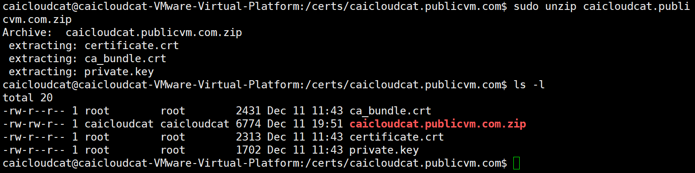

将“ca_bundle.crt”和“certificate.crt”合并到一个文件中，该文件将命名为“zerossl_combined.crt”。

```shell
sudo bash -c 'cat certificate.crt ca_bundle.crt >> zerossl_combined.crt'
```

执行完毕后，就可以配置 Web 服务器来使用新创建的 SSL 证书。

### 在Nginx中配置SSL证书

查看`/usr/local/nginx/conf/nginx.conf`文件（如果是源码安装的话，这个是我用源码安装的位置，具体详情看[在Linux中安装Nginx、Tomcat和Mysql服务器](./Nginx、Tomcat和Mysql服务器安装.md)。如果是用apt包安装的话，其默认配置文件在`/etc/nginx/`目录下，这里我用apt包安装的Nginx来举例。

我们可以发现在：`html`中，存在下面两条内容

```bash
include /etc/nginx/conf.d/*.conf;
include /etc/nginx/sites-enabled/*;
```

我们进入`sites-availables`目录，查看`default`文件。
可以发现这里就有SSL相关配置，默认是注释掉的，我们可以取消注释，并添加我们的路径。

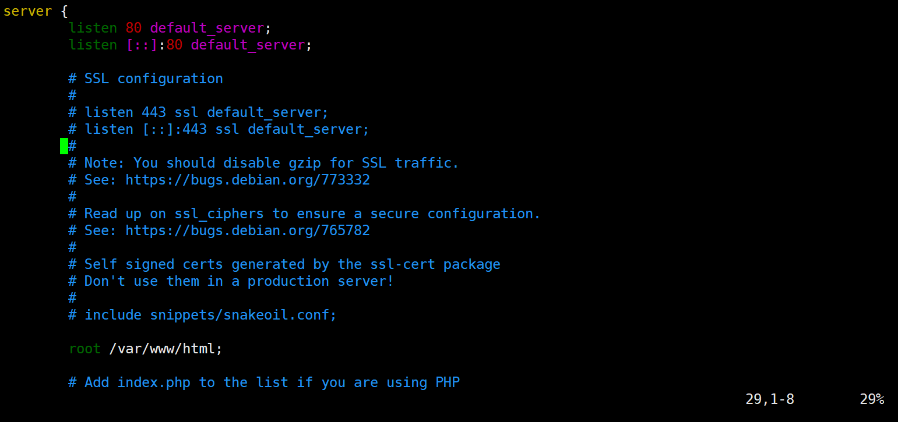

这里我采用的是用虚拟主机文件`caicloudcat.publicvm.com`来配置：


将其修改成这样：

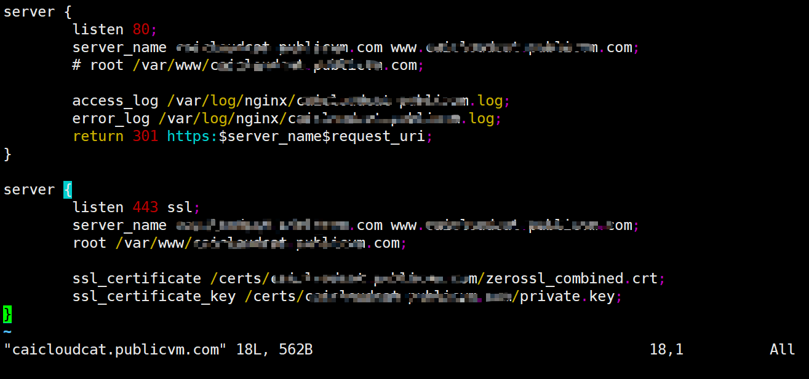

最后测试网站可以看到，连接是安全的：

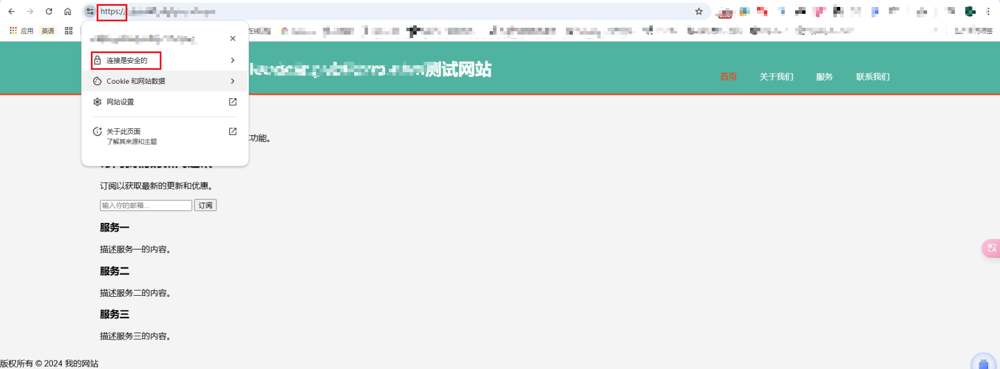


## 核心配置

找到Nginx安装目录下的`nginx.conf`文件，如果是`Ubuntu24.04`版本的用apt包安装的话，应该在`etc/nginx/`下，Nginx 的基本功能配置是由它提供的。

Nginx 的配置文件整体上分为如下几个部分：

| 区域       | 职责                                                   |
| ---------- | ------------------------------------------------------ |
| 全局块     | 配置和Nginx运行相关的全局配置                          |
| events块   | 配置和网络链接相关的配置                               |
| http块     | 配置代理、缓存、日志记录、虚拟主机等配置               |
| server块   | 配置虚拟主机的相关参数，一个http快中可以有多个server块 |
| location块 | 配置请求的路由，以及各种页面的处理情况                 |


### 配置文件示例

一个比较全的配置文件示例如下：

```nginx
# 以下是全局段配置
# user administrator administrators;  #配置用户或者组，默认为nobody nobody。
# worker_processes 2;  #设置进程数，默认为1
# pid /nginx/pid/nginx.pid; #指定nginx进程运行文件存放地址
error_log log/error.log debug;  # 制定日志路径，级别：debug|info|notice|warn|error|crit|alert|emerg

# events段配置信息
events {
    accept_mutex on;   #设置网路连接序列化，防止惊群现象发生，默认为on
    multi_accept on;  #设置一个进程是否同时接受多个网络连接，默认为off
    #use epoll;      #事件驱动模型，select|poll|kqueue|epoll|resig|/dev/poll|eventport
    worker_connections  1024;    #最大连接数，默认为512
}

# http 配置请求信息
http {
    include       mime.types;   # 文件扩展名与文件类型映射表
    default_type  application/octet-stream; # 默认文件类型，默认为text/plain
    # access_log off; # 取消服务日志    
    log_format myFormat '$remote_addr–$remote_user [$time_local] $request $status $body_bytes_sent $http_referer $http_user_agent $http_x_forwarded_for'; # 自定义格式
    access_log log/access.log myFormat;  # combined为日志格式的默认值
    sendfile on;   # 允许sendfile方式传输文件，默认为off，可以在http块，server块，location块。
    sendfile_max_chunk 100k;  # 每个进程每次调用传输数量不能大于设定的值，默认为0，即不设上限。
    keepalive_timeout 65;  # 连接超时时间，默认为75s，可以在http，server，location块。


    upstream mysvr {   
      server 127.0.0.1:7878;
      server 192.168.10.121:3333 backup;  # 热备
    }
    
    error_page 404 https://www.baidu.com; #错误页
    # 第一个Server区块开始，表示一个独立的虚拟主机站点
    server {
        keepalive_requests 120; #单连接请求上限次数。
        listen	4545;   #监听端口
        server_name  127.0.0.1;   #监听地址       
        location  ~*^.+$ {       #请求的url过滤，正则匹配，~为区分大小写，~*为不区分大小写。
           #root path;  #根目录
           #index vv.txt;  #设置默认页
           proxy_pass  http://mysvr;  #请求转向mysvr 定义的服务器列表
           deny 127.0.0.1;  #拒绝的ip
           allow 172.18.5.54; #允许的ip           
        } 
    }
}
```


### locat 路径映射讲解

格式

```nginx
location [ = | ~ | ~* | !~ | !~* | @ ] uri {...}
```

参数解释


- `=` 表示精确匹配，如果找到，立即停止搜索并立即处理此请求。
- `~` 表示执行一个正则匹配，区分大小写匹配
- `~*` 表示执行一个正则匹配，不区分大小写匹配
- `!~` 区分大小写不匹配
- `!~*` 不区分大小写不匹配
- `^~` 即表示只匹配普通字符（空格）。使用前缀匹配，^表示“非”，即不查询正则表达式。如果匹配成功，则不再匹配其他 location。
- `@` 指定一个命名的 location，一般只用于内部重定向请求。例如 error_page, try_files
- `uri` 是待匹配的请求字符串，可以不包含正则表达式，也可以包含正则表达式；


优先级和示例

- `[不加] < [~/~*] < [^~] < [=]`
- 示例如下：

```nginx
location = / {
    # 精确匹配/，主机名后面不能带任何字符串 /
    # 只匹配http://abc.com
    # http://abc.com [匹配成功]
    # http://abc.com/index [匹配失败]
}
location ^~ /img/ {
      # 以 /img/ 开头的请求，都会匹配上
    # http://abc.com/img/a.jpg   [成功]
    # http://abc.com/img/b.mp4  [成功]
    }
location ~* /Example/ {
  # 则会忽略 uri 部分的大小写
  # http://abc.com/test/Example/ [匹配成功]
  # http://abc.com/example/ [匹配成功]
}
location /documents {
    # 如果有正则表达式可以匹配，则优先匹配正则表达式。
    # http://abc.com/documentsabc [匹配成功]
}
location / {
    # http://abc.com/abc [匹配成功]
}
```


## 反向代理

### 概述

首先看正向代理和反向代理的照片：


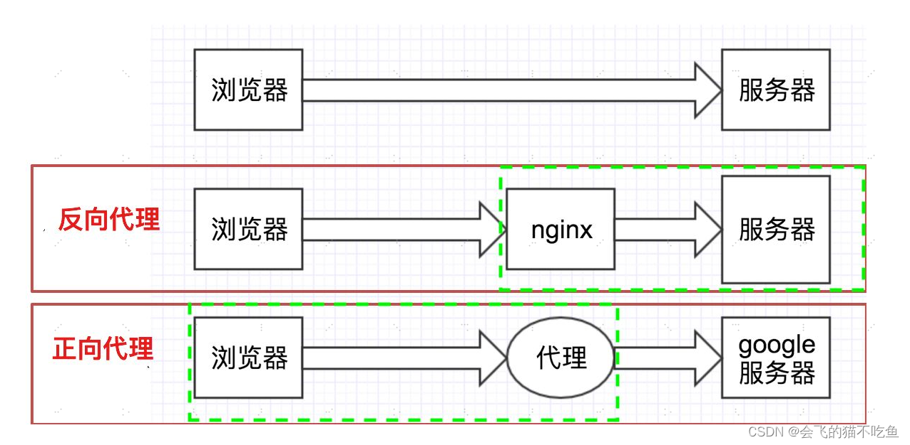

**概念**

正向代理：是一个位于客户端和目标服务器之间的代理服务器，客户端通过正向代理服务器来访问目标服务器，对于目标服务器而言，它 **只知道请求来自代理服务器** ，而不知道真实的客户端。

反向代理：也是位于客户端和目标服务器之间的代理服务器，但它是代理后端的目标服务器来接收客户端的请求，对于客户端而言，它只知道自己访问的是代理服务器，而不知道后端具体的目标服务器。

**应用场景**

- 正向代理

突破访问限制：在一些网络环境中，客户端可能无法直接访问某些外部网站或资源，通过正向代理服务器可以绕过这些限制，访问被封锁的内容。

隐藏客户端身份：客户端可以通过正向代理隐藏自己的真实 IP 地址，提高隐私性和安全性，避免被目标服务器或其他第三方追踪。

- 反向代理

负载均衡：将客户端的大量请求均匀地分发到后端的多台服务器上，实现服务器集群的负载均衡，提高系统的整体性能和可用性。

安全防护：作为客户端和后端服务器之间的中间层，反向代理可以对客户端的请求进行过滤、验证等操作，防止恶意攻击和非法访问，提高后端服务器的安全性。

缓存静态资源：反向代理可以缓存一些经常被访问的静态资源，如图片、脚本、样式表等，当客户端再次请求这些资源时，直接从代理服务器返回，减少后端服务器的压力，提高响应速度。

**实现目的**

- 正向代理：主要是为了满足客户端的特定需求，如访问控制、隐私保护等，帮助客户端更方便、安全地访问外部资源。

- 反向代理：主要是为了优化后端服务器的性能和安全性，提高系统的整体稳定性和可靠性，同时对客户端提供统一的访问入口。

通俗的讲，我们可以这样说：

**正向代理** ：我们平时需要访问国外的浏览器是不是很慢，比如我们要看推特，看GitHub等等。我们直接用国内的服务器无法访问国外的服务器，或者是访问很慢。所以我们需要在本地搭建一个服务器来帮助我们去访问。那这种就是正向代理。（ **浏览器中配置代理服务器** ）

**反向代理** ：那什么是反向代理呢。比如：我们访问淘宝的时候，淘宝内部肯定不是只有一台服务器，它的内部有很多台服务器，那我们进行访问的时候，因为服务器中间session不共享，那我们是不是在服务器之间访问需要频繁登录，那这个时候淘宝搭建一个过渡服务器，对我们是没有任何影响的，我们是登录一次，但是访问所有，这种情况就是反向代理。对我们来说，客户端对代理是无感知的，客户端不需要任何配置就可以访问，我们只需要把请求发送给反向代理服务器，由反向代理服务器去选择目标服务器获取数据后，再返回给客户端，此时反向代理服务器和目标服务器对外就是一个服务器，暴露的是代理服务器地址，隐藏了真实服务器的地址。（ **在服务器中配置代理服务器** ）


### Nginx作为反向代理服务器的优势

高性能：Nginx使用了异步事件驱动架构，能够高效地处理大量的并发连接。通过使用高效的请求处理机制和缓存技术，Nginx可以有效地减轻后端服务器的负载，提高整体性能。

安全性：作为反向代理服务器，Nginx可以隐藏后端服务器的真实地址和信息，增加安全保护层。同时，Nginx还提供了SSL/TLS加密、访问控制、身份验证等安全功能，进一步增强了应用的安全性。

负载均衡：Nginx支持多种负载均衡算法，可以将请求分发到多个后端服务器上，实现分布式部署和负载均衡。这有助于提高系统的可扩展性和可靠性。

静态资源优化：Nginx可以作为静态Web服务器来部署静态资源，如HTML页面、图片、视频等。相对于动态内容，静态资源更加易于缓存和压缩，通过Nginx进行优化可以显著提高Web应用程序的性能。


### 反向代理在Nginx中的配置

要在Nginx中启用反向代理功能，需要在配置文件中进行相应的设置。以下是一个示例：


```nginx
server {
    listen       80;
    server_name  localhost;

    location / {
        # 指定了后端服务器的地址和端口号
        proxy_pass http://localhost:8081;
        # 为请求头添加Host字段，用于指定请求服务器的域名/IP地址和端口号。
        proxy_set_header Host $host:$server_port;  

        # 设置用户ip地址
        # 为请求头添加XFF字段，值为客户端的IP地址。
        proxy_set_header X-Forwarded-For $remote_addr;
        # 当请求服务器出错去寻找其他服务器
        proxy_next_upstream error timeout invalid_header http_500 http_502 http_503;
        
```

当我们访问 localhost 的时候，ngnix 就将我们的请求转到 localhost:8081 了


## 负载均衡

### 什么是负载均衡？

负载均衡建立在现有网络结构之上，它提供了一种廉价有效透明的方法扩展网络设备和服务器的带宽、增加吞吐量、加强网络数据处理能力、提高网络的灵活性和可用性。

负载均衡（Load Balance）其意思就是分摊到多个操作单元上进行执行，例如Web服务器、FTP服务器、企业关键应用服务器和其它关键任务服务器等，从而共同完成工作任务。

其原理就是通过在客户端和服务器集群之间设置负载均衡器，负载均衡器会根据预设的算法和规则，将客户端的请求合理地分配到后端的服务器上，使得每台服务器都能得到相对均衡的工作量，避免出现某些服务器负载过重而其他服务器闲置的情况。

简单来说就是：现有的请求使服务器压力太大无法承受，所有我们需要搭建一个服务器集群，去分担原先一个服务器所承受的压力，那现在我们有A、B、C、D等等多台服务器，我们需要把请求分给这些服务器，但是服务器可能大小也有自己的不同，所以怎么分？如何分配更好？又是一个问题。


### 负载均衡策略

Nginx 目前支持多种复杂均衡策略，这里讲解比较常见的几种。


#### RR（round robin：轮询）

每个请求按时间顺序逐一分配到不同的后端服务器，也就是说第一次请求分配到第一台服务器上，第二次请求分配到第二台服务器上，如果只有两台服务器，第三次请求继续分配到第一台上，这样循环轮询下去，也就是服务器接收请求的比例是 1:1， 如果后端服务器 down 掉，能自动剔除。轮询是 **默认配置** ，不需要太多的配置。

同一个项目分别使用 8081 和 8082 端口启动项目：

```nginx
upstream web_servers {
   server localhost:8081;
   server localhost:8082;
}

server {
    listen       80;
    server_name  localhost;
    # access_log  logs/host.access.log  main;
    location / {
        proxy_pass http://web_servers;
        proxy_set_header Host $host:$server_port;
    }
```


#### 热备

假设有 2 台服务器，当一台服务器发生事故时，才启用第二台服务器给提供服务。服务器处理请求的顺序：AAAAAA 突然 A 挂了，服务器处理请求的顺序：BBBBBBBBBBBBBB.....

```nginx
upstream web_servers {
      server 127.0.0.1:7878; 
      server 192.168.10.121:3333 backup;  # 热备     
    }
```


#### 权重（加权轮询）

跟据配置的权重的大小而分发给不同服务器不同数量的请求，用于后端服务器性能不均的情况下。如果不设置，则默认为 1。下面服务器的请求顺序为：ABBABBABBABBABB....。

```nginx
upstream web_servers {
    server localhost:8081 weight=1;
    server localhost:8082 weight=2;
}
```

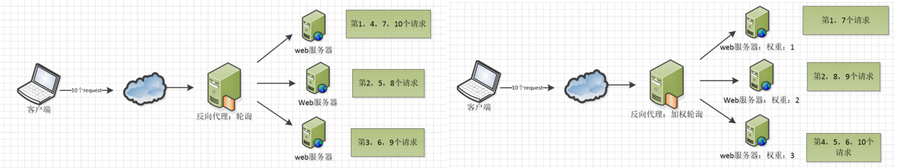

#### ip_hash

这样每个 ip 地址固定访问一个后端服务器，可以解决 session 的问题，具体为什么这么说？

即上面的方式存在一个问题，在负载均衡系统中，假如用户在某台服务器上登录了，那么该用户第二次请求的时候，因为我们是负载均衡系统，每次请求都会重新定位到服务器集群中的某一个，那么已经登录某一个服务器的用户再重新定位到另一个服务器，其登录信息将会丢失，这样显然是不妥的。

我们可以采用`ip_hash`指令解决这个问题，如果客户已经访问了某个服务器，当用户再次访问时，会将该请求通过哈希算法，自动定位到该服务器。每个请求按访问ip的hash结果分配，这样每个访客固定访问一个后端服务器，可以解决session的问题。

```nginx
upstream test {
    ip_hash;
    server localhost:8080;
    server localhost:8081;
}
```
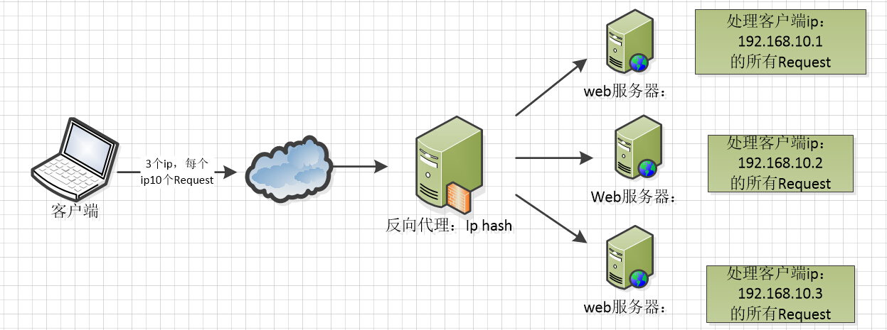


#### fair（第三方）

按后端服务器的响应时间来分配请求，响应时间短的优先分配。这个配置是为了更快的给用户响应。

```nginx
upstream backend {
    fair;
    server localhost:8080;
    server localhost:8081;
}
```


#### url_hash（第三方）

按访问 url 的 hash 结果来分配请求，使每个 url 定向到同一个后端服务器，后端服务器为缓存时比较有效。在 upstream 中加入 hash 语句，hash_method 是使用的 hash 算法

```nginx
upstream backend {
    hash_method crc32;
    hash $request_uri;
    server localhost:8080;
    server localhost:8081;
}
```


以上 6 种负载均衡各自适用不同情况下单独或者混合使用，可以根据实际情况选择使用，fair 和 url_hash 需要安装第三方模块才能使用。


## 动静分离

动静分离指的是将动态资源和静态资源分别部署在不同的服务器或服务器集群上，由不同的处理流程进行处理，从而实现资源的优化配置和高效利用。

动态资源通常指的是需要服务器端动态生成的内容，如动态网页、动态脚本等，一般由应用服务器处理。

静态资源则是指在服务器端不需要动态生成，直接可以提供给客户端的资源，如 HTML、CSS、JavaScript 文件、图片、视频等，通常由专门的静态资源服务器或反向代理服务器来处理。

Nginx的静态处理能力很强，但是动态处理能力不足，因此，在企业中常用动静分离技术。动静分离技术其实是采用代理的方式，在`server{}`段中加入带正则匹配的`location`来指定匹配项针对PHP的动静分离：静态页面交给Nginx处理，动态页面交给PHP-FPM模块或Apache处理。

在Nginx的配置中，是通过`location`配置段配合正则匹配实现静态与动态页面的不同处理方式。

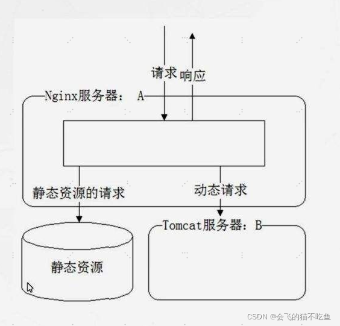


```nginx
upstream web_servers {
       server localhost:8081;
       server localhost:8082;
}
server {
    listen       80;
    server_name  localhost;
    set $doc_root /usr/local/var/www;


    location ~* \.(gif|jpg|jpeg|png|bmp|ico|swf|css|js)$ {
       root $doc_root/img;
    }
    location / {
        proxy_pass http://web_servers;
        proxy_set_header Host $host:$server_port;
    }
    error_page 500 502 503 504  /50x.html;  #出现 500 502 503 504错误时走内部跳转
    location = /50x.html { 
        root $doc_root;
    }
 }
```

结果：访问 `http://localhost/test.jpg` 时直接返回 `/usr/local/var/www/img` 路径下的图片.

访问 `http://localhost/index.html` 就会访问后端服务器(tomcat 等)


## 参考

[How to Use Certbot to Get a Free Let’s Encrypt SSL Certificate](https://linuxiac.com/lets-encrypt-free-ssl-certificate/)

[How to Create Nginx Virtual Host (Server Block)](https://linuxiac.com/nginx-virtual-host/#how-to-create-nginx-virtual-hosts-server-blocks)

[How to Configure Nginx to Work with PHP via PHP-FPM](https://linuxiac.com/how-to-configure-nginx-to-work-with-php-via-php-fpm/)

[nginx配置SSL证书，使用https](https://blog.csdn.net/qq_45846022/article/details/138319186)


[从零开始获取和使用免费的SSL证书保护您的网站](https://www.didispace.com/article/richang/20240426-zerossl.html)中文翻译于[ZeroSSL: How to Secure Your Website with a Free SSL Certificate](https://linuxiac.com/zerossl-how-to-install-ssl-certificate/)

[Ubuntu安装nginx到配置ssl证书](https://blog.csdn.net/daitianjun/article/details/129328986)

[如何在 Ubuntu 上安装和使用 Nginx？](https://blog.gaomeluo.com/archives/UbuntuNginx/)


[Nginx 常用配置及和基本功能讲解](https://xie.infoq.cn/article/bea66421ea6cac09d10f35d7a)

[Nginx详解（一文带你搞懂Nginx](https://blog.csdn.net/hyfsbxg/article/details/122322125)

[一篇就够了—NGINX配置详解 ](https://www.cnblogs.com/AllenWongFly/p/17323718.html)

[Nginx配置详解](https://www.runoob.com/w3cnote/nginx-setup-intro.html)


[nginx 一把梭！（超详细讲解+实操）](https://juejin.cn/post/7306041273822527514)

[「云原生 | Nginx」手把手教你通过源码构建 Nginx](https://blog.csdn.net/sl285720967/article/details/125363481)

[Nginx 从入门到实践，万字详解！](https://juejin.cn/post/6844904144235413512)