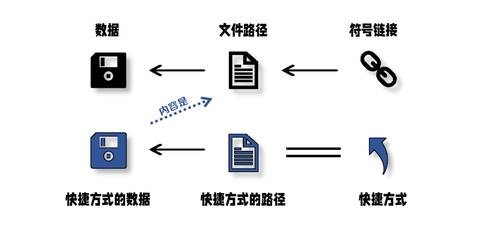

---
date:
    created: 2024-11-19
readtime: 30
categories:
    - Linux
---
# 专题06-Ubuntu文件和目录权限

简单介绍了Ubuntu文件和目录的权限，也比较详细的讲解了软链接（符号链接）和硬链接，是课上的学习。
<!-- more -->

## 6.1 引言

本专题主要介绍了Linux文件和目录权限，包括使用chmod、chown和chgrp命令更改文件或目录的权限、所有者和所属组的方法，并详细介绍了软链接和硬链接的知识。


!!! note "参考"
     [Linux（inode + 软硬链接 图片+大白话）](https://blog.csdn.net/aabbdnsm/article/details/143439575)

     [【Linux】—— 详解软硬链接](https://blog.csdn.net/m0_56069910/article/details/133408213)


## 6.2 文件和目录权限

### 6.2.1 目录权限

首先创建一个范例目录 

```shell
mkdir demo
```

按照长格式（long format）显示文件和目录信息

```shell
ls -l
```


可以看到刚创建的`demo`目录是下列格式（其他文件和目录是以前实验创建的）：

```
drwxrwxr-x 2 caicloudcat caicloudcat 4096 Nov 13 21:23 demo
```

该格式说明如下：

- `d` 表示目录（directory）
- `rwxrwxr-x` 是目录的权限部分，其中：
  - r（read） 表示读取权限，允许用户列出目录中的文件列表
  - w（write） 表示写入权限，允许用户对目录创建、删除、修改等
  - x（execute） 表示执行权限，允许用户进入目录并访问其中的文件和子目

这个分为三个部分：

- 第一个`rwx`是目录所有者（owner）的权限，表示具有读取、写入和执行权限
- 第二个`rwx`是目录所属组（group）的权限，表示具有读取、写入和执行权限
- 第三个`r-x`是其他用户（others）的权限，表示只具有读取和执行权限，没有写入权限

2 是文件的<mark>硬链接数</mark>，表示该目录有2个硬链接。ubuntu创建日录时，默认会生成两个硬连接："."（一个点） 和".."（连个点）。前者的inode号码就是当前日录的inode号码，等同于当前日录的“硬链接“；后者的inode号码就是当前目录的父目录的inode号码，等同于父日录的“硬链接“。所以，除了根目录外，任何一个日录的"硬链接"总数，总是等于2加上它的子目录总数（含隐藏目录）。

第一个caicloudcat是目录的所有者，即创建该目录的用户

第二个caicloudcat是目录的所属组， 即该目录所属的用户组

4096 是文件的大小，表示该目录占用的磁盘空间为 4096 字节

11月 13 21:23 是该目录最后一次被修改的日期和时间

demo 创建的目录名称


### 6.2.2 文件权限

首先创建一个范例文件，`touch example.txt`。


可以看到刚创建的`example.txt `文件是下列格式：

```
-rw-rw-r-- 1 caicloudcat caicloudcat 0 Novc 13 21:34 example.txt
```

 `- ` 表示普通文件。


## 6.3 硬链接和软链接

### 6.3.1 软链接

**软链接（Symbolic Link，也称为符号链接或符号连接）** 是计算机文件系统中的一种特殊类型的链接。与硬链接不同，软链接是一个指向另一个文件或目录的引用，类似于一个快捷方式或别名。它包含指向目标文件或目录的路径信息，而不是直接引用相同的数据块和inode。


创建软链接是在文件系统中创建一个指向目标文件或目录的符号链接。软链接类似于Windows系统中的 **快捷方式** ，它提供了一种方便的方式来引用目标文件或目录。

软链接原理图：


!!! note "注意"
    回忆一下，在Windows系统中，创建了一个文件的快捷方式后：

        （1）如果删除该快捷方式，文件本身是否也被删除？

        （2）如果删除了文件本身，该快捷方式是否还有效？

输入ln命令，创建软链接（符号链接）：

```shell
ln -s example.txt symbolicLink.txt     
```

`ln`是指`link`，`-s`是指`symbolic`，即符号链接。可以看到，我们成功为`example.txt`创建了一个软链接`symbolicLink.txt` 。  


我们在`symbolicLink.txt `输入一些文字，打开`example.txt`后可以看到内容。这意味着对`symbolicLink.txt`所做的更改将反映在`example.txt`中。

在CLI环境下，软链接显示为浅蓝色。链接的权限模式通常显示为`lrwxrwxrwx`，其中`l`表示该文件是一个 **软链接**。软链接的大小通常会显示链接路径的字符数，在这里大小为11。请注意，这里的大小指的是链接本身的大小，而不是目标文件的大小。

删除`example.txt`文件后，在桌面环境下`symbolicLink.txt `显示失效了，双击后会提示Broken Link。

原因可以看原理图：


这个失效的软链接在CLI环境下显示为红色：


软链接提供了一种灵活和便捷的方式来引用目标文件或目录，但需要注意的是，当目标文件或目录被删除时，软链接将指向一个无效的目标。因此确保在使用软链接时，目标文件或目录的存在性和有效性是至关重要的。

### 6.3.2 硬链接

**硬链接（Hard Link）** 是计算机文件系统中的一种链接方式，用于将一个文件与另一个文件或目录关联起来，使它们共享相同的数据块和inode（索引节点）。其次硬链接允许一个文件在文件系统中存在多个入口点，这意味着对一个硬链接文件的更改将反映在所有与之相关联的硬链接上，因为它们实际上都指向相同的数据。


创建硬链接是在文件系统中创建一个指向目标文件的硬链接，硬链接与目标文件共享相同的 inode 和数据块，它们在文件系统中被视为同一实体，即使使用不同的文件名。

硬链接原理图：


输入ln命令，创建硬链接：

```shell
ln example.txt hardLink.txt
```

ln是指`link`，可以看到，我们成功为`example.txt`创建了一个硬链接`hardLink.txt`。注意：如果上一步操作时已经把`example.txt`删除了，请重新创建一下。或者使用Ctrl+z键撤销删除操作。


我们在`hardLink.txt `输入一些文字，打开`example.txt`后可以看到内容。这意味着对`hardLink.txt`所做的更改将反映在`example.txt`中


在CLI环境下，硬链接显示和原来文件的所有信息是一样的，因为本来就是同一个文件。

删除`example.txt`文件后，在桌面环境下`harLink.txt `依然有效，双击后正常显示。

原因可以看原理图：


说明：Linux系统上的文件名是存储在父目录的Block里面的，并指向了这个文件的Inode节点，这个文件的Inode节点再标记指向存放这个文件的Block的数据块。

我们删除一个文件时，实际上并不会清除Inode节点和Block的数据。只是在这个文件的父目录中的Block里，删除这个文件的名字，从而使这个文件名消失，并且无法指向这个文件的Inode节点。

当没有文件名指向这个Inode节点的时候，释放Inode节点和存放这个文件数据的Block块会同时进行，并且会更新Inode MAP和Block MAP，以便让这些位置用于放置其他文件数据。

在CLI环境下硬链接也没有问题，但是软链接变红了。


### 6.3.3 总结

硬链接（Hard Links）和软链接（Symbolic Links，也称为 **符号链接**）是两种在文件系统中创建文件链接的不同方法，它们有一些重要的区别：

1、**链接的类型**

硬链接：硬链接是文件系统中的多个文件项，它们都指向同一个inode（磁盘上的数据块和元数据）。这意味着硬链接之间没有所谓的原始和副本，它们都是相等的。删除任何一个硬链接都不会影响其他硬链接，只有当所有硬链接都被删除后，文件的内容才会被释放。

软链接：软链接是一个特殊类型的文件，其中包含了指向另一个文件或目录的路径。软链接本身是一个独立的文件，它存储了目标文件的路径信息。如果原始文件或目录被删除，软链接仍然存在，但它会成为一个"死链接"，指向一个不存在的目标。

2、**跨文件系统**

硬链接：通常只能在同一文件系统内创建硬链接，因为硬链接与inode相关，而不同文件系统的inode不会关联。

软链接：软链接可以跨越文件系统边界，因为它们只是包含目标路径的文本文件。

3、**文件类型**

硬链接：只能链接到文件，不支持链接到目录。

软链接：可以链接到文件或目录，也可以链接到其他软链接。

4、**大小和性能**

硬链接：硬链接几乎没有大小，因为它们共享相同的inode和磁盘块。由于硬链接不需要额外的磁盘空间，因此通常更高效。

软链接：软链接的大小通常比硬链接大，因为它们需要存储目标路径信息。软链接需要解析目标路径，这可能会引入微小的性能开销。

5、**修改和权限**

硬链接：硬链接的修改会反映在所有硬链接上，因为它们都共享相同的inode。硬链接之间没有权限区别。

软链接：软链接的修改不会影响目标文件或目录，因为它们只是指向目标的路径。软链接和目标之间可能具有不同的权限设置。

6、**用途**

硬链接：常用于备份工具和版本控制系统，可以减少磁盘占用，因为它们共享相同的数据块。

软链接：常用于创建快捷方式或引用其他位置的文件或目录，也用于跨文件系统的链接。

总之，硬链接和软链接都有各自的用途和限制，选择哪种链接类型取决于您的需求和文件系统结构。硬链接更适合共享相同数据的文件，而软链接更适合创建引用或跨越文件系统的链接。


场景一：有一个文件/目录放在文件系统很深的位置，我们需要在桌面快速找到该文件/目录，用硬链接还是软链接？

使用软链接

场景二：百度云盘可以设置同步文件，在设置时，需要选择本地同步文件夹所在位置（只能选择一个位置）。我需要同步很多目录，因为我创建了一个BaiduSyncdisk目录用于同步，用硬链接还是软链接还是直接把所有需要同步的文件拷贝到这个目录中？

1.可以直接把所有需要同步的文件拷贝到这个目录中

2.使用硬链接

### 6.3.4 Windows中的链接方式

首先了解一下Windows中的文件。

在一台 Windows 电脑中，硬盘被分割为卷用以保存数据，在每一个卷上，数据对象被 NTFS 文件系统赋予了独一无二的 **文件 ID** 以及 **与之对应的文件路径**，文件路径和文件 ID 对应，文件 ID 和数据对象绑定，最终才呈现为可供用户打开、编辑的文件。

!!! info "NTFS"
    NTFS（New Technology File System） 是Microsoft公司开发的专用文件系统，从Windows NT 3.1 开始成为WIndows NT家族的默认文件系统。它提供了一整套功能，包括安全描述符、加密、磁盘配额和丰富的元数据。 它可以和聚类共享卷 (CSV) 一起使用，以提供可以从故障转移聚类的多个节点同时访问的连续可用卷。

因此可以说，我们所看到的文件并非数据本身，而是由文件路径指向数据对象的链接。

Windows和Linux一样可以创建链接，其中使用的是`mklink`命令，可以创建硬链接(Hard Link)、目录联接(Junciton Point)、符号链接(Symbolic Link)以及快捷方式(Shortcut)。

```powershell
mklink [[/D] | [/H] | [/J]] Link Target
```

|   参数   |                 含义                 |
| :------: | :----------------------------------: |
|   `/D`   | 创建目录符号链接。默认为文件符号链接 |
|   `/H`   |        创建硬链接而非符号链接        |
|   `/J`   |             创建目录联接             |
|  `Link`  |         指定新的符号链接名称         |
| `Target` | 指定新链接引用的路径（相对或者绝对） |

**快捷方式与符号链接的区别**

快捷方式的工作原理

当用户双击快捷方式时，系统会尝试解析该快捷方式：首先它会用快捷方式指向的路径检查引用对象是否能直接找到；如果路径的目标无对象，资源管理器接下来会使用名为 分布式链接跟踪 的技术，依靠对象原来的大小，名称，创建日期等信息进行检索，成功找到目标后 Windows 会自动更新快捷方式的目标属性；若无法找到则会提示用户删除快捷方式。

链接跟踪技术的应用给快捷方式带来了硬链接一样的解析效果：引用对象删除后恢复、重命名、移动位置都不会导致快捷方式失效。由于它也像符号链接一样依靠文件路径定位，所以只要路径正确，无论引用对象是否是原来的文件，快捷方式都会将其打开。

具体区别

同样可以链接到文件的路径，同样由系统提供支持，快捷方式和 符号链接 却有本质上的区别。快捷方式仍然是一个文件，它有自己的后缀名，有对应的数据（一个地址）和大小（几 KB），还有自己的图标和属性。但符号链接没有对应的数据对象，因而也没有大小可言，它没有后缀名，不具有完整文件结构。



以一个房子为例，每一个房子都有坐标。给别人一个符号链接，相当于为他开了一个直通房屋所在的传送门，他不需要知道房子实际在什么地方；而快捷方式只是一张写有地址的小纸条，他需要自己摸索才能到达房子。资源管理器可以读取纸条内容后找到房屋所在，但其他程序未必有这个能力。

## 6.4 使用 chmod


### 6.4.1 符号模式


chmod（change mode 表示更改 change 文件模式 mode）命令可以用来设置文件或目录的权限。

在符号模式下，u（user）指所有者, g（group）指所属组, o（others）指其他用户。

r（read）指读取权限, w（write）指写入权限, x（execute）指执行权限。

首先使用`touch example.txt`命令重新创建`example.txt`。


可以看到刚创建的`example.txt`文件是上述画框格式。

文件所有者用户caicloudcat对example.txt有rw权限。现在我们改变一下用户caicloudcat对文件的权限：

```shell
chmod u=r example.txt
```


可以看到修改后，用户caicloudcat对该文件只有r权限。

其他用户对example.txt有r权限。输入下列命令，把其他用户对该文件的权限全部清空（不设置任何权限）：

```shell
chmod o= example.txt
```


可以看到修改后其他用户对example.txt文件具有---权限（即无任何权限）。

输入下列命令，把所有用户对该文件的权限全部清空（不设置任何权限），其中a代表all，即所有用户：

```shell
chmod a= example.txt
```


而使用`cat example.txt`查看该文件的时候，会提示权限不够：


输入下列命令，为文件所有者、所属用户组、其他用户设置对example.txt文件的相关权限：

```shell
chmod u=rw,g=rw,o=r example.txt
```


重新查看该文件，就可以正常打开，由于该文件没有输入任何东西，所以没有内容。


此外，还可以使用”+“和”-“来增加或者减少权限。

输入下列命令，减少文件所有者、所属用户组对example.txt文件的相关权限：

```shell
chmod ug-w example.txt
```


可以看到文件所有者、所属用户组对文件example.txt的w权限被移除了，还剩r权限。

输入下列命令，增加文件所有者、所属用户组对example.txt文件的相关权限：

```shell
chmod ug+wx example.txt
```


可以看到文件所有者、所属用户组对文件example.txt的wx权限被增加了，原来还有r权限，所以现在是wrx权限了。

### 6.4.2 数字模式

在数字模式下， r=4, w=2, x=1。所以，下面的数字代表这些权限：


| 数字 | 权限         |
| ---- | ------------ |
| 7    | rwx          |
| 6    | rw           |
| 5    | rx           |
| 4    | r            |
| 3    | wx           |
| 2    | w            |
| 1    | x            |
| 0    | 没有任何权限 |

输入下列命令，为所有用户对`example.txt`文件设置读取r、写入w、执行x 权限：

```shell
chmod 777 example.txt
```


可以看到所有对文件`example.txt`的拥有了wrx权限。为文件/目录设置777是Linux中一个很常见的操作！


输入下列命令，为文件所有者设置读取r和写入w 权限，所属用户组、其他用户设置读取r 权限：

```shell
chmod 644 example.txt
```


有时候我们需要为一个目录下所有的子目录和文件设置777权限，可以使用-R参数（recursive，递归）进行递归设置。

输入下面的命令，创建范例的目录和文件：

```shell
mkdir -p web/images
cd web
touch 1.txt
ls -l
```


返回Desktop目录并输入下列命令，为web下的所有子目录和文件设置777权限：

```shell
sudo chmod -R 777 web
```


可以看到web下的所有子目录和文件权限均为wrx了。为了避免执行命令时权限不够，经常在前面加上sudo去执行，在本例中不加sudo也没有问题。

```shell
sudo chmod -R 777 路径
```

上面的这条命令很常用，要记住！


## 6.5 更改文件或目录的所有者和所属组 

### 6.5.1 更改文件或目录的所有者

chown（change owner）命令更改文件或目录的所有者。

首先切换到 root 用户，并创建范例文件example2.txt：

```shell
su - root
touch example2.txt
ls -l
```


可以看到example2.txt的所属用户为root用户，所属组为root组


输入下列命令，改变文件example2.txt的所属用户

```shell
chown caicloudcat example2.txt
```


可以看到example2.txt的所属用户变为caicloudcat，所属组仍然为root组。


输入下列命令，创建范例的目录和文件：

```shell
mkdir -p web2/images
ls -l
```


可以看到目录web2的所属用户是root，输入下列命令，改变目录web2的所属用户：

```shell
chown caicloudcat web2
```


可以看到目录web2的所属用户变为caicloudcat，所属组仍然为root组。

我们输入下列命令查看目录web2的子目录images的权限：

```shell
cd web2
ls -l
```


发现目录web2的子目录images的所有者还是root，也就是说，改变父目录的所有者并不会改变子目录的所有者。

同理，如果我们需要把目录和该目录下的所有子目录和文件更改所有者，可以使用-R参数（recursive，递归）进行递归设置。 下面这个命令使用的很多！

输入下列命令，为web2及所有子目录和文件更改所有者：

```shell
chown -R caicloudcat /root/web2
```


可以看到web2的子目录images的所有者变为了caicloudcat。这个范例中，我们使用了绝对路径，当然你也可以使用相对路径试试看。


### 6.5.2 更改文件或目录的所属组

chgrp（change group） 更改文件或目录的所属组

首先可以看到example2.txt文件的用户组现在属于root


输入下列命令，更改文件example2.txt的所属组：

```shell
chgrp caicloudcat example2.txt
ls -l
```


可以看到example2.txt的所属组更改为了caicloudcat组。

```shell
chgrp caicloudcat web2
ls -l
```


可以看到目录web2的所属组更改为了caicloudcat组。

其实，chown命令不仅可以更改文件和目录的所有者，也可以同时更改文件和目录的所属组。

输入下列命令，同时更改目录web2的所有者和所属组：

```shell
chown caicloudcat:root web2
ls -l
```


可以看到目录web2的所有者更改为了caicloudcat，所属组更改为了root。

## 6.6 具体参考

浙江理工大学——姜毅老师

[符号链接、硬链接及其在Windows上的应用举例](https://sspai.com/post/66834)

[比较 Windows 上四种不同的文件（夹）链接方式（NTFS 的硬链接、目录联接、符号链接，和大家熟知的快捷方式）](https://blog.walterlv.com/post/ntfs-link-comparisons.html#mklink)

[心之所想、一键直达：你可能不知道的 Windows 快捷方式玩法](https://sspai.com/post/68718)