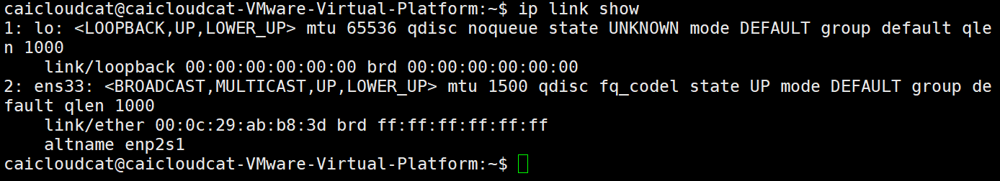
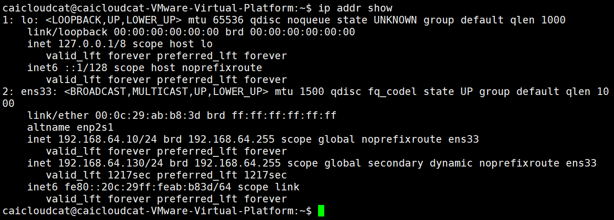
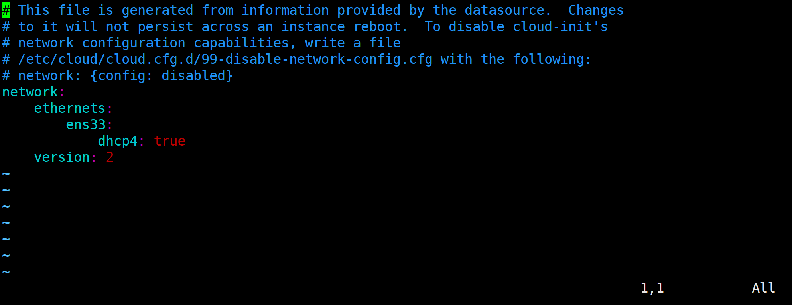

---
date:
    created: 2024-11-26
readtime: 40
categories:
    - Linux
tags:
    - Linux
---

# 专题07-Ubuntu系统配置

## 1 引言

本专题主要介绍了Ubuntu网络配置方法，日期和时间管理方法，使用ps命令查看进程信息，使用top和free命令查看CPU、内存等系统信息的方法。
<!-- more -->
 

## 2 网络配置

### 2.1 关于网络的基础知识（IP地址、子网掩码、网关、NAT等）

感兴趣可以学习《计算机网络》课程或者书籍，这里不再赘述。

 

### 2.2 查看Ubuntu网络配置

#### 1、ifconfig命令（network interfaces configuring）

`ifconfig` ：不加任何选项表示只显示接口为up状态的接口信息。

`Ifconfig -a`：表示显示所有接口的接口信息，不管该接口是up还是down都显示。这个用的多。

输入`ifconfig`命令，查看服务器的ip地址：

```shell
ifconfig -a
```

如果有报错，先下载安装`net-tools` ,然后再运行`ifconfig`命令即可看到：

```shell
sudo apt install net-tools
```


从上面可以看到，我这台服务器的网络配置为：

**IPv4：**

ip地址（inet）：`192.168.64.130` ，这是一个保留给内部使用的C类地址。

子网掩码（netmask）：`255.255.255.0`

局域网广播地址（broadcast）：`192.168.64.255`

**IPv6：**

ip地址（inet6）：`fe80::20c:29ff:feab:b83d`

**物理地址**（ether）：`00:0c:29:ab:b8:3d`

!!! info "注意" 
    ether是指ethernet，即以太网，这是我们现在使用的LAN（local area network，局域网）技术。现在局域网都是基于以太网技术。

#### 2、ping命令

使用ping命令，可以和网络上的其他设备打招呼，看彼此之间是否处于连通状态，例如，我想测试一下当前主机和网关是否连通，输入下列命令：

```shell
ping 192.168.64.130
```

> ping之后会一直收到对方主机的回复，可以使用 **组合键Ctrl+Z** 将Ping命令挂起，或者按 **组合键Ctrl+C** 中止命令执行。


??? tip "ping命令说明"
    ping 命令用于测试与目标主机之间的连接。它向目标主机发送一个ICMP（Internet Control Message Protocol）Internet控制报文协议回显请求，并等待它的回应。如果目标主机正常工作并且连接畅通，则会收到一个回显响应。如果没有收到响应，则说明有问题，需要进一步排除故障。ping可以用来测试本机与目标主机是否联通、联通速度如何、稳定性如何。

使用ping命令作用：

- **检测网络连接问题**：如果我们无法访问某个网站或主机，可以使用ping命令来检测网络连接是否正常。如果ping命令能够成功收到目标主机的回复，说明网络连接正常；如果无法收到回复，可能是网络故障或目标主机不可达。

- **测量网络延迟**：通过ping命令可以测量网络延迟，即从发送ICMP请求到接收到回复所需的时间。可以使用ping命令的-c选项指定发送的ICMP请求次数，然后计算平均延迟时间。较高的延迟可能会导致网络连接缓慢，需要进一步排查网络问题。

- **检测丢包率**：ping命令还可以用于检测网络丢包率，即发送的ICMP请求在传输过程中丢失的比例。可以观察ping命令的输出结果中的丢包率字段，如果丢包率较高，可能是网络拥堵或目标主机负载过高。

#### 3、ip命令
Linux ip 命令与 ifconfig 命令类似，但比 ifconfig 命令更加强大，主要功能是用于显示或设置网络设备。
ip 命令是 Linux 加强版的的网络配置工具，用于代替 ifconfig 命令。

其语法结构如下：

```
ip [ OPTIONS ] OBJECT { COMMAND | help }
```

OBJECT 为常用对象，值可以是以下几种：
```
OBJECT={ link | addr | addrlabel | route | rule | neigh | ntable | tunnel | maddr | mroute | mrule | monitor | xfrm | token }
```
常用对象的取值含义如下：

- link：网络设备
- addr（address）：设备上的协议（IP或IPv6）地址
- addrlabel：协议地址选择的标签配置
- route：路由表条目
- rule：路由策略数据库中的规则

OPTIONS 为常用选项，值可以是以下几种：
```
OPTIONS={ -V[ersion] | -s[tatistics] | -d[etails] | -r[esolve] | -h[uman-readable] | -iec | -f[amily] { inet | inet6 | ipx | dnet | link } | -o[neline] | -t[imestamp] | -b[atch] [filename] | -rc[vbuf] [size] }
```
常用选项的取值含义如下：

- V：显示命令的版本信息；
- s：输出更详细的信息；
- f：强制使用指定的协议族；
- 4：指定使用的网络层协议是IPv4协议；
- 6：指定使用的网络层协议是IPv6协议；
- 0：输出信息每条记录输出一行，即使内容较多也不换行显示；
- r：显示主机时，不使用IP地址，而使用主机的域名。

输入以下命令，显示网络接口信息
```shell
ip link show
```



输入下面命令，显示网卡IP信息
```shell
ip addr show
```



输入下面的命令，显示系统路由
```shell
ip route show
```


#### 4、Windows查看网络配置 

在Windows系统中，在命令提示符模式下查看网络配置的命令是

```shell
ipconfig -all
```

以下是我的电脑的部分网络配置截图：


电脑上因为有无线网卡、蓝牙、wmware虚拟机的虚拟网卡等设备，显示信息可能会比上面的截图长很多！

Windows系统同样可以使用ping命令。


### 2.3 修改Ubuntu网络配置

注意：Ubuntu的不同版本网络配置方法差别很大，这里的网络配置方法仅限于ubuntu-24.04版本，其他版本可能会有区别。

我们来给虚拟机设置静态IP地址。在以前使用虚拟机Vmware安装Ubuntu时，网络类型我们设置的是“NAT”模式。


我们来看一下Vmware给Ubuntu分配的IP网段是什么。

打开VMware：编辑 -> 虚拟网络编辑器 -> 更改设置 ，记住子网ip和子网掩码，我这里子网ip是192.168.64.0，C类网络IP地址0是指网络号，子网掩码是255.255.255.0，表示网络号为24位，这表示NAT子网IP地址可以在192.168.64.1~192.168.64.255中分配。


如果需要修改，可以选择“更改设置”。

点击NAT设置，记住网关地址。

**正常情况下VMware的网关IP是以 192.168.x.2结尾的，因为 x.1是绑定在物理机的虚拟网卡上的，而 x.2是用于转发数据的。**

因此我这里网关IP地址是192.168.64.2。


在ubuntu中执行ifconfig，记住网卡名称，我的是ens33。


接下来给Ubuntu配置静态IP地址

注意：Ubuntu18固定IP的方式跟Ubuntu18之前版本的的配置方式不同，Ubuntu18之前在`/etc/network/interfaces`进行配置，Ubuntu18及之后版本在`/etc/netplan/*.yaml`进行配置，如`/etc/netplan/01-network-manager-all.yaml`，如果`/etc/netplan`目录下没有`yaml`文件，则可以新建一个。

可以看到当前目录下没有该文件，默认有一个`50-cloud-init.yaml`：


这里使用Chat基础介绍一下该文件以及其文件相关命名规则：

在 Ubuntu 系统中，`/etc/netplan/50-cloud-init.yaml` 是 Netplan 网络配置工具的一个 YAML 文件，用于定义网络接口的配置。它通常是系统初始安装或配置时由 Cloud-Init 工具生成的，特别是在云环境中部署 Ubuntu 系统时。

`/etc/netplan/50-cloud-init.yaml` 是 Netplan 的配置文件之一，Netplan 用于管理网络接口，抽象出了一种简单的 YAML 配置方式，可以生成适配不同网络后端（如 NetworkManager 或 systemd-networkd）的配置。

**数字优先级** ：`50-cloud-init.yaml` 文件名中的数字 50 表示优先级，Netplan 会按数字顺序加载多个配置文件。如果有多个文件，数字较小的配置文件会被较早解析，后续配置文件可能覆盖前面的设置。

该文件内容通常类似如下：


- `network`：Netplan 配置的顶级键。
- `version: 2`：Netplan 配置的版本号，2 是当前常用版本。
- `ethernets`：定义以太网接口的设置。
- `ens33`：网络接口的名称（如 ens33、eth0 等）。
- `dhcp4`: true：启用 IPv4 的 DHCP。

使用下面命令新建并进行修改：

```shell
sudo vim /etc/netplan/01-network-manager-all.yaml
```

修改成以下形式：

```yaml
# Let NetworkManager manage all devices on this system
network:
  version: 2
  renderer: NetworkManager
  ethernets:
    ens33:
      dhcp4: no
      dhcp6: no
      addresses:
        - 192.168.64.10/24
      routes:
        - to : default
          via : 192.168.64.2
      nameservers:
        addresses:
          - 192.168.64.2
```


修改完成保存退出，执行

```shell
sudo netplan apply
```

出现警告，提醒权限问题，这是文件权限开的太高所致：


执行

```shell
sudo chmod 0600 /etc/netplan/01-network-manager-all.yaml
```

再重新执行：

```shell
sudo netplan apply
```


成功！可以使用`ifconfig`查看新的ip配置：


可以看到ip地址已经变成了192.168.64.10了。

## 3 日期和时间管理

### 3.1 显示当前日期、时间和时区

输入date命令，显示当前日期、时间和时区


其中， CST(China Standard Time) 表示中国标准时间的时区缩写。

### 3.2 设定日期和时间格式

通过使用 + 和格式字符串，可以高度自定义时间的显示格式。格式字符串中的指令以 % 开头，后跟一个字符标识符。常见的格式化选项如下：

- %Y：年（Year），四位数的年份，即YYYY格式，如 2024
- %y：年（year），两位数的年份，即YY格式，如 24
- %m：月（month），两位数的月份，即MM格式，如 09
- %d：日（day），两位数的日期，即DD格式，如 29
- %H：小时（Hour），24小时制，即HH格式，如 14
- %M：分钟（Minute），分钟，即MM格式，如 35
- %S：秒（Second），即SS格式，如 02

输入带格式的date命令，显示日期：

```shell
date +%Y-%m-%d
date +%y-%m-%d
```

可以简化使用下列命令，其中 %F代表 YYYY-MM-DD date format 。

```shell
date +%F
```

输入带格式的date命令，显示时间：

```shell
date +%H:%M:%S
```

可以简化使用下列命令，其中 %T代表 HH:MM:SS time format。

```shell
date +%T
```

输入带格式的date命令，显示日期+时间，注意必须不要忘记命令中的引号：

```shell
date +"%Y-%m-%d %H:%M:%S"
```

可以简化使用下列命令：

```shell
date +"%F %T"
```


### 3.3 把日期和时间写入文件

我们把日期和时间写入文件，输入下列命令

```shell
echo date +"%F %T" >> log.txt
ls -l
cat log.txt
```


可以看到在`log.txt`中保存是命令本身，而不是date的执行结果。

可以使用反引号`` `和` $() `表示执行命令或表达式的值，其中`$()`不仅可以引用命令的输出, 还可以引用变量的值、命令的参数等。

```shell
echo `date +"%F %T"` >> log.txt
```

推荐使用下面的命令：

```shell
echo $(date +"%F %T") >> log.txt
```


可以看到当前时间被保存到`log.txt`文件中了。

## 4 查看进程信息

### 4.1 显示进程信息

进程是指在计算机中正在运行的程序。

在windows系统中，在任务栏的空白处点右键，选择"任务管理器--进程"，可以查看系统的进程信息。


Ubuntu的ps （Process Status）命令可以显示当前终端会话中运行的进程信息。输入下列命令，显示当前终端会话中运行的进程的基本信息：

```shell
ps
```


输入下列命令，显示当前终端会话中运行的进程的详细信息，“-f”参数代表全格式/完整格式<mark>全格式/完整格式</mark>（full format）：

```shell
ps -f
```


其中，

- UID (User ID) ：进程用户ID
- PID (Process ID)： 进程ID
- PPID (Parent Process ID) ：父进程ID
- C(CPU) ：进程占用 CPU 的百分比
- STIME (Start Time) ：进程启动的具体时间
- TTY (Teletypewriter) ：与进程交互的终端设备
- TIME：启动进程花费的 CPU 时间
- CMD：启动进程的命令

输入下列命令，显示系统中所有正在运行的进程的详细信息, 包括系统进程和用户进程，“-e”参数代表every：

```shell
ps -ef
```


注意：这个页面很长，这里没有完全截屏下来。

如果你觉得显示的进程数量太多，可以使用管道符号缩小查找范围。 | 是管道符号，表示 将前一个命令的 "输出" 作为后一个命令的 "输入"。这样就可以一步一步缩小范围了。`grep ps` 会在 `ps -ef` 命令的 "输出" 中查找包含 ps 的进程信息。

```shell
ps -ef | grep ps
```


输入下列命令，显示当前终端会话中当前用户正在运行的进程信息，“-u”参数代表user：

```shell
ps -u
```


其中，

- USER：用户名
- PID (Process ID)：进程ID
- CPU：CPU使用率
- MEM：(Memory) 内存使用率
- VSZ：(Virtual Size) 虚拟内存大小(以KB为单位)
- RSS：(Resident Set Size) 常驻内存大小(以KB为单位)
- TTY：(Teletypewriter) 与进程交互的终端设备
- STAT：(State) 进程状态
    - `R` 正在运行状态（正在使用CPU）
    - `S` 睡眠状态
    - `D` 不可中断睡眠，即在睡眠的过程中不可以接收信号唤醒=》执行的IO操作得不到硬件设备的响应
    - `T` 停止的进程
    - `Z` 僵尸进程
    - `X` 死掉的进程(几乎看不见，因为死了就立即回收了)
    - `< `代表优先级较高的进程
    - `N` 代表优先级较低的进程
    - `s` 包含子进程
    - `+` 表示在前台运行的进程（前台运行就是指在命令行中运行）
    - `l` 小写字母l，代表以线程的方式运行，即多线程
    - `|` 管道符号代表多进程
- START：进程启动时间
- TIME：启动进程花费的 CPU 时间
- COMMAND：启动进程的命令


`ps`命令中：

- `-a` 显示一个终端的所有进程
- `-u` 选择有效的用户id或者是用户名
- `-x` 显示没有控制终端的进程，同时显示各个命令的具体路径。

aux参数很多情况下可以一起使用，输入下列命令:

```shell
ps -aux
```


!!! note "-ef 和 -aux 之间的区别："
    - `-ef` 会打印出父级PID
    - `-aux` 会打印出CPU、内存相关的使用情况


### 4.2 强制结束进程

强制结束 id=4857 的进程

```shell
kill -9 4857
```

-9 表示发送 SIGKILL[signal kill] 信号给进程 id 为 4857 的进程，SIGKILL 信号是一种强制停止进程的信号


> 我的系统中没有4857的进程，所以提示No such process。但是`kill`命令要记住，以后如果有哪个进程运行出现问题，就可以直接kill掉。

## 5 查看cpu、内存等系统信息

### 5.1 使用top命令查看系统的实时信息

在windows系统中，在任务栏的空白处点右键，选择”任务管理器“--“性能”，可以查看系统CPU、内存、磁盘等设备的实时信息。


在Ubuntu中，top是一个非常实用的动态实时显示系统运行状态的命令行工具。它能够提供系统概览，包括正在运行的进程信息、CPU 使用率、内存使用情况等。输入下列命令：

```shell
top
```


上面显示信息的具体说明如下：

（1）**顶部区域**

top - 11:44:33 up 1:37， 3 users， load average: 0.00， 0.00， 0. 00

`11:44:33`：当前系统时间。

`1:37`：系统运行时间，格式是小时:分钟。

`3 users`：当前登录的用户数量

`load average: 0.00， 0.00， 0. 00`：系统负载平均值，分别是过去1分钟、5分钟和15分钟的平均值。

（2）**任务（进程）区域**

Tasks: 306 total， 1 running， 305 sleeping， 0 stopped， 0 zombie

`306 total`：系统中总的任务（进程）数。

`1 running`：正在运行的任务数。

`305 sleeping`：处于睡眠状态的任务数。

`0 stopped`：被停止的任务数。

`0 zombie`：僵尸进程数。僵尸进程是指在进程已经结束运行但其相关资源（如内存空间等）尚未被释放的情况下，该进程的状态是一个已经死亡但仍然存在于系统中的进程。

（3）**CPU 状态**

%Cpu(s): 0.2 us， 0.5 sy， 0.0 ni， 99.3 id， 0.0 wa， 0.0 hi， 0.0 si， 0.0 st

`us`：user，用户空间占用CPU的百分比。

`sy`：system，内核空间占用CPU的百分比。

`ni`：nice，改变过优先级的进程占用CPU的百分比。nice 是指优先级调整值,用于调整进程的优先级，当一个进程被赋予较高的nice值时,它将以较低的优先级运行，从而使其他进程能够获得更多的 CPU 资源。

`id`：idle，空闲CPU百分比。99.3 id表示CPU大部分时间处于空闲状态，说明系统负载较低。

`wa`：wait，等待输入输出（I/O）的CPU时间百分比。I/O[Input/Output] 操作是指系统中的输入和输出操作，常见的 I/O 操作有：读取和写入文件、键盘输入、打印机输出等.

`hi`：hardware interrupt，处理硬件中断的时间百分比。**硬中断** 是由硬件设备(如键盘、鼠标等)   发出的信号，会打断 CPU 正在执行的任务,使其跳转到中断处进行处理。0.0 hi 表示没有硬中断发生。

`si`：software interrupt，处理软件中断的时间百分比。**软中断** 是由软件程序发出的信号,会打断CPU正在执行的任务，使其跳转到中断处进行处理，0.0 si 表示没有软中断发生。

`st`：被虚拟机偷去的时间百分比。0.0 st 表示没有虚拟机从物理机中窃取CPU时间，即虚拟化对 CPU 的占用为0.0%。

（4）**内存状态**

MiB Mem : 3868.2 total， 1587.7 free， 1183.2 used， 1365.9 buff/ cache

MiB Mem（Megabytes of Memory），内存的兆字节数。

total：总内存。

free：空闲内存。

used：已使用的内存。

buff/cache：用作缓冲和缓存的内存。

（5）**交换空间（Swap）状态**

MiB Swap: 3769.0 total， 3769.0 free，0.0 used. 2685.0 avail Mem

MiB Swap（Megabytes of Swap），交换空间兆字节数。**交换空间** (Swap Space) 是系统中的虚拟内存技术,用于在物理内存不足时，将部分内存数据暂时存储到磁盘上。

total：总交换空间。

free：空闲交换空间。

used：已使用的交换空间。

avail Mem：可用于启动新应用的内存量。

（6）**进程信息区**

| PID  | USER | PR   | NI   | VIRT | RES  | SHR  | %CPU | %MEM | TIME+ | COMMAND |


- PID：进程编号

- USER：用户名

- PR(Priority)：优先级

- NI(Nice)：优先级调整值,用于调整进程的优先级

- VIRT(Virtual Memory)：虚拟内存大小

- RES(Resident Memory)：物理内存大小

- SHR(Shared Memory)：共享内存大小

- %CPU(CPU Usage)：CPU使用率

- %MEM(Memory Usage)：内存使用率

- TIME+(Time Elapsed)：进程使用的CPU时间

- COMMAND：命令


在 top 命令的交互模式下：

按键盘上1键, 切换CPU显示模式, 显示每个CPU的使用情况


按键盘上大写字母M, 按照物理内存(RES)使用率对进程进行排序。


按键盘上大写字母P, 按照CPU占用率对进程进行排序，用来查看CPU占用率最高的进程。


输入下列命令，查看指定PID的进程信息：

```shell
top -p 1
```


### 5.2 使用free命令显示系统内存

如果只需要显示内存信息，可以使用free命令。free 命令是 Linux 和类 Unix 操作系统中用于显示内存使用情况的工具。通过 free 命令，可以查看系统中物理内存（RAM）、交换空间（swap）以及缓存和缓冲区的使用情况。输入下列命令显示内存的使用情况：

```shell
free
```


这里默认以 KB 为单位显示内存使用情况，各字段的说明如下：

- total 总内存大小
- used 已使用的内存大小
- free 空闲内存大小
- shared 共享内存大小
- buff/cache 缓冲和缓存区内存大小
- available 可用的内存大小 = 空闲内存 + 缓冲和缓存区内存

在输入free命令时，常用选项如下：

- `-b`：以字节为单位显示内存使用情况。
- `-k`：以 KB 为单位显示内存使用情况（默认）。
- `-m`：以 MB 为单位显示内存使用情况。
- `-g`：以 GB 为单位显示内存使用情况。
- `-h`：以人类可读的格式显示内存使用情况（自动选择合适的单位，如 KB、MB、GB）。
- `-t`：显示总计行，即在输出的开头显示内存和交换空间的总计。
- `-s [秒]`：每隔指定的秒数重复显示内存使用情况。
- `-c 计数`：重复显示内存使用情况指定的次数。

例如，输入下列命令，以兆为单位显示内存的使用情况：

```shell
free -m
```


上图中，虽然空闲内存为1598MB，缓冲和缓存区内存为 1375 MB，但实际可用的内存大小只有2705MB，这是因为还有其他一些内存区域被占用, 不能立即用于新的进程。