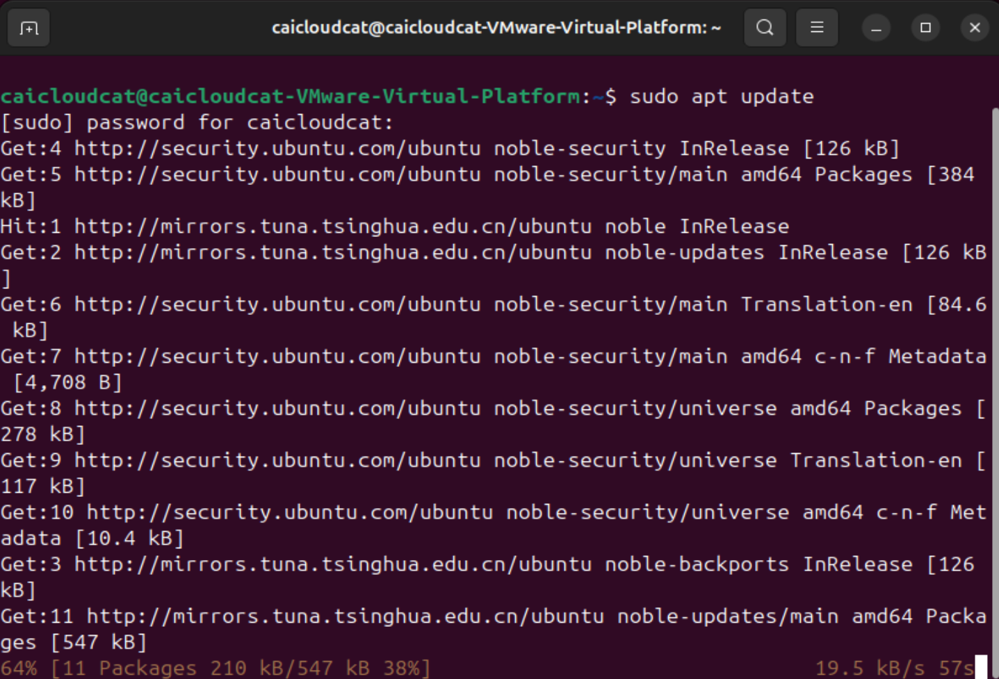
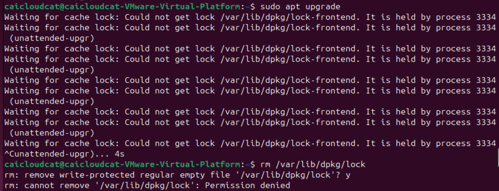
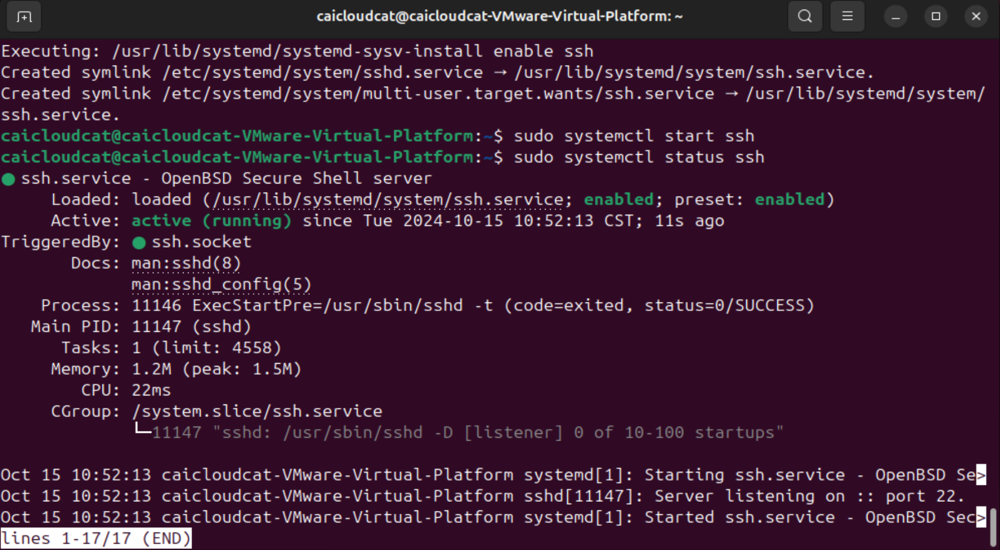
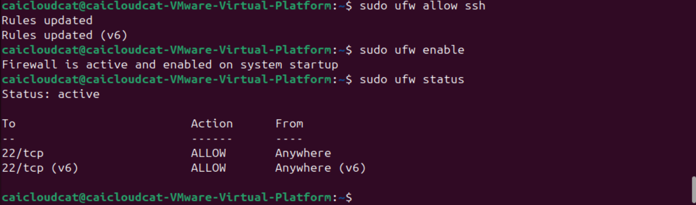
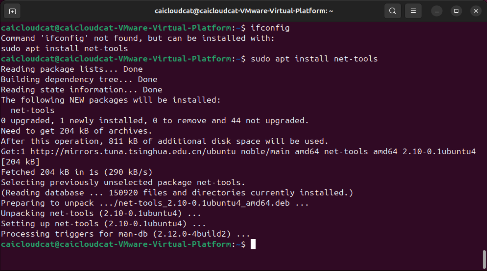
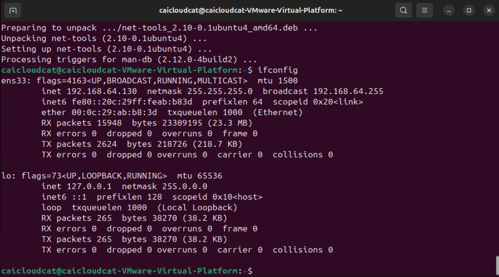
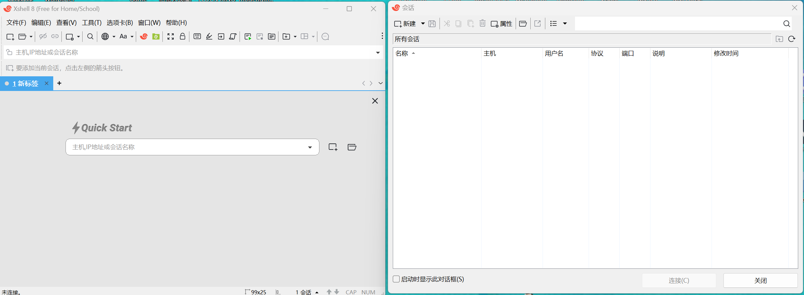
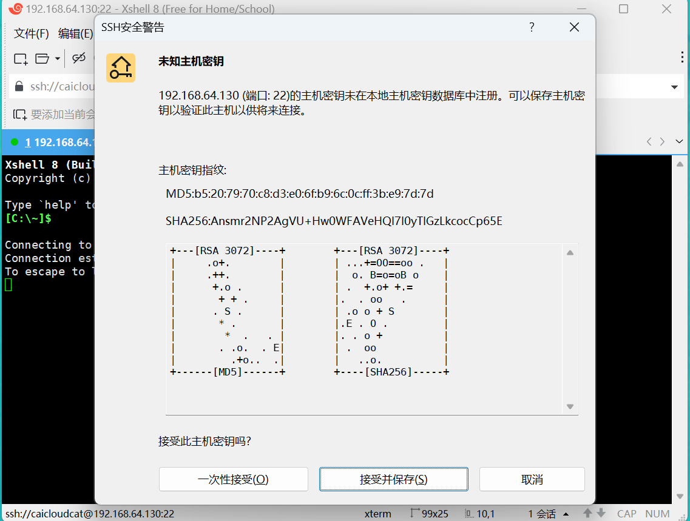
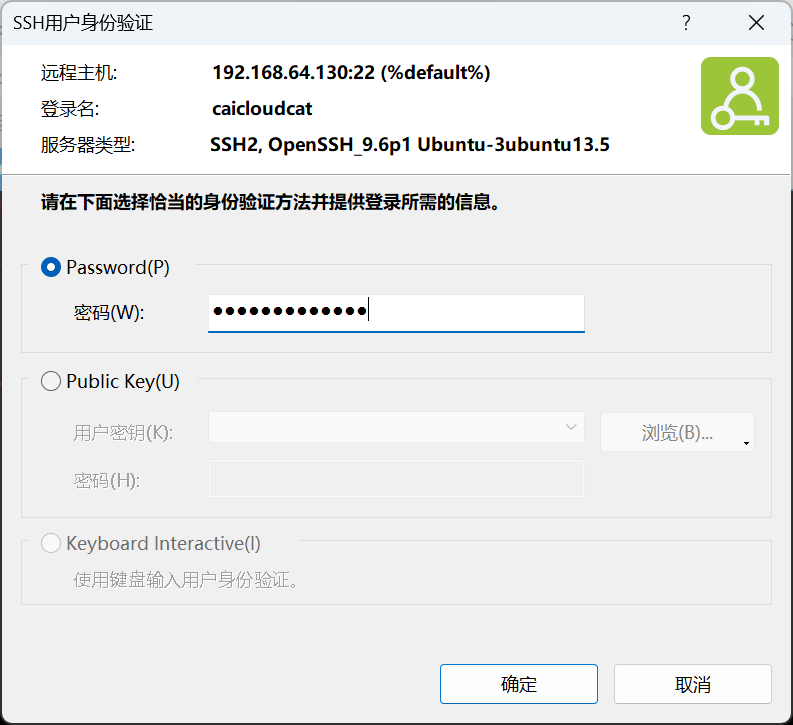

---
date:
    created: 2024-10-15
reatime: 20
categories:
    - Linux
tags:
    - Linux
---

# 专题3-Ubuntu软件安装和远程连接

Ubuntu软件安装以及相关的远程连接介绍。

<!-- more -->

## 1 引言

本专题主要介绍在Linux中如何安装软件，以及如何远程连接到Linux系统。

 

## 2 Linux安装软件的几种模式

### 2.1 源码安装

- 优点：开源，可以二次开发；编译安装，与系统适配性高，更加稳定；卸载方便。
- 缺点：安装步骤多，容易出错；编译时间长；报错时新手难以解决。
- 步骤：
  - (1) 准备源码包，通常是以.tar.gz等格式存在。
  - (2) 安装编译过程中需要的依赖环境。
  - (3) 编译安装，包括解压源码包、配置安装路径、编译安装等步骤。
  - (4) 设置权限和系统管理配置，如做软连接、设置系统控制等。

 

### 2.2 使用包管理器在线安装

使用包管理器如 apt-get、yum、dnf等来从**软件仓库**中直接安装软件。这是大多数用户最常用的方法，因为它简单方便，而且可以自动处理依赖关系。

- Debian/**Ubuntu** 使用 ==apt (Advanced Package Tool)==：

更新软件包列表：`sudo apt update`

安装软件包：`sudo apt install [package_name]`

删除软件包：`sudo apt remove [package_name]`

> 在Ubuntu系统中，使用管理员权限通常涉及到使用sudo命令。这是因为Ubuntu默认情况下不直接允许root用户（Linux系统的超级用户）登录，而是通过sudo命令来执行需要管理员权限的任务。

 

- Fedora/**CentOS**/RHEL 使用 dnf 或 yum 命令：

更新软件包列表：`sudo dnf check-update` 或者 `sudo yum install package_name`

安装软件包：`sudo dnf install [package_name]`

删除软件包：`sudo dnf remove [package_name]`

 

- Arch Linux 及其衍生版使用 pacman：

同步数据库并更新系统：`sudo pacman -Syu`

安装软件包：`sudo pacman -S [package_name]`

删除软件包：`sudo pacman -R [package_name]`

 

### 2.3 使用软件中心

许多Linux发行版提供了**图形界面的软件中心**，如Ubuntu的“Ubuntu Software”。

 

### 2.4 使用Snap或Flatpak

Snap和Flatpak是两种流行的**跨平台**包管理系统。

`sudo snap install package_name`

或者

`sudo flatpak install flathub com.package_name`


## 3 远程连接

### 3.1 Linux远程连接模式

==1、SSH==

SSH（Secure Shell）：SSH是一种网络协议，用于在不安全的网络中安全地操作远程计算机。它是Linux系统中最常用的远程登录协议，几乎所有的Linux发行版都默认安装了SSH客户端和服务器。SSH模式使用的最多。

2、Telnet

Telnet：Telnet是一种早期的远程登录协议，但由于它传输的数据未加密，因此存在安全风险。在现代系统中，Telnet已经被SSH所取代。

3、VNC

VNC（Virtual Network Computing）：VNC允许你通过图形界面远程控制另一台计算机。它主要用于需要远程桌面访问的场景。

4、RDP

RDP（Remote Desktop Protocol）：虽然RDP主要是Windows系统使用的远程桌面协议，但也有一些Linux系统支持RDP，可以通过它来进行远程桌面连接。

 

### 3.2 Linux使用SSH创建远程连接

要远程访问一台Linux机器，通常会使用SSH（Secure Shell）协议。以下是基本步骤：

1、确保目标远程服务器上已经安装并启用了SSH服务

参考视频：https://www.bilibili.com/video/BV1rz4y1R7DA/?spm_id_from=333.337.search-card.all.click&vd_source=1be27cbe131b9c3024ff27667bbda481

在大多数Linux发行版中，可以通过包管理器安装 OpenSSH 服务器。

**Debian/Ubuntu**：

```shell
sudo apt update
sudo apt upgrade
sudo apt install openssh-server
```

>  sudo apt update：更新软件包列表，检查可用的软件包更新。apt update 命令只会获得系统上所有包的最新信息，并不会下载或者安装任何一个包。
>
>  sudo apt upgrade：安装可用的软件包更新，这个步骤第一次执行时需要的时间比较长。apt upgrade 命令来把这些包下载和升级到最新版本。
>
>  第一次执行上述两个命令需要较长的下载和更新时间。
>
>  sudo apt install openssh-server：安装openssh-server
>
>  中间需要确认的时候选择 y，安装完成

`sudo apt update`：



`sudo apt upgrade`：


遇到的下载问题：

在Ubuntu中，执行`apt install`后，出现以下类似问题：

```shell
Waiting for cache lock: Could not get lock /var/lib/dpkg/lock-frontend. It is held by process 3334 (unattended-upgr)
```

看着描述就是有3334的进程进行占用了source文件。

解决方法：

删除锁定的文件`rm /var/lib/dpkg/lock`

实在没办法解除，直接进行个干掉进程`kill -9 3334`

> 注意：这里的3334是占用文件的进程号



> 具体参考：[Ubuntu Linux处理Waiting for cache lock: Could not get lock /var/lib/dpkg/lock-frontend. It is held by process 3365 (unattended-upgr)问题](https://www.cnblogs.com/cqpanda/p/16247871.html)


### 3.3 让服务器上的 ssh service 运行起来

依次输入三行命令

```shell
sudo systemctl enable ssh	让SSH服务在系统启动时自动启动，这样以后就不用每次手工启动了

sudo systemctl start ssh	启用 Linux 系统中的SSH服务

sudo systemctl status ssh	验证SSH服务是否正在运行
```

> Systemctl (system control) 简介
>
> Systemctl是一个systemd工具，主要负责控制systemd系统和服务管理器。
>
> Systemd是一个系统管理守护进程、工具和库的集合，用于取代System V初始进程。 Systemd的功能是用于集中管理和配置类UNIX系统。
>
> 在Linux生态系统中， Systemd被部署到了大多数的标准Linux发行版中，只有为数不多的几 个发行版尚未部署。 Systemd通常是所有其它守护进程的父进程，但并非总是如此。
>
> Systemctl的参数可以参考：https://www.sysgeek.cn/systemctl-command/



注意：显示ssh状态后，如果无法继续输入shell命令，可以按q键退出查看状态。

### 3.4 配置服务器的防火墙

配置服务器的防火墙，允许22号端口通过，依次输入三行命令

```shell
sudo ufw allow ssh	----让防火墙ufw允许ssh通过

sudo ufw enable		----启动防火墙

sudo ufw status		----查看防火墙状态
```

>  说明：ufw 是指 ubuntu firewall，即Ubuntu自带的防火墙。因为我们现在是在配置服务器，必须确保网络安全，所以要启动网络防火墙。 



>  备注： ssh的默认端口号是22，所以从防火墙状态可以看出，ssh协议被允许通过22号端口和外部建立TCP连接。

另外，如果有规则以前已经加入防火墙了，在执行` sudo ufw allow ssh`这条命令时，系统提示会这条规则已经存在了

### 3.5 检查你的电脑的IP地址

检查你的电脑的IP地址，然后就可以从其他机器远程登录，输入命令

```shell
ifconfig
```

> `ifconfig`：`configure a network interface`，配置网络信息

在输入这个命令的时候，如果提示没有这个命令可以安装命令包，输入

```shell
sudo apt install net-tools  ----非必须
```



安装完命令包后，输入`ifconfig`就可以查看网络配置了。如果直接`ifconfig`可以执行，就不用重新安装命令包了。



从这一段信息可以看出，我的Ubuntu的ip是 **192.168.64.130**。注意：你的虚拟服务器的ip地址可能不一样！

> 在网络配置中，`inet` 192.168.64.130 `netmask` 255.255.255.0 `broadcast` 192.168.64.255 这几个概念分别代表了：
>
> 1. **inet (Internet Protocol Address)**:
>    - 这是分配给网络接口的IP地址。在这个例子中，`inet 192.168.64.130` 表示该网络接口的IP地址是192.168.64.130。
>
> 2. **netmask (Network Mask)**:
>    - 网络掩码用于区分IP地址中的网络部分和主机部分。在这个例子中，`netmask 255.255.255.0` 表示网络部分是前24位（即前三个点分十进制数），主机部分是最后8位。这意味着该网络的子网掩码是255.255.255.0，它定义了网络的范围。
>
> 3. **broadcast (Broadcast Address)**:
>    - 广播地址是用于发送数据包给网络中所有设备的特定地址。在这个例子中，`broadcast 192.168.64.255` 表示该网络的广播地址是192.168.64.255。任何发送到这个地址的数据包都会被该网络中的所有设备接收。
>
> 这些概念共同定义了一个子网：
>
> - **网络地址**：通过将IP地址与网络掩码进行逻辑与操作（AND）得到。在这个例子中，网络地址是192.168.64.0（通过192.168.64.130 AND 255.255.255.0计算得到）。
> - **子网范围**：由网络地址和广播地址定义。在这个例子中，子网的范围是从192.168.64.1到192.168.64.254（不包括广播地址，因为广播地址用于广播消息，不分配给单个设备）。
> - **可用的IP地址**：在子网范围内，除去网络地址和广播地址后，剩下的IP地址可以分配给网络中的设备。在这个例子中，可用的IP地址范围是从192.168.64.1到192.168.64.254。
> - **子网掩码的作用**：它不仅定义了网络的大小，还帮助路由器决定如何处理数据包。如果数据包的目的地在子网内，它会被直接发送到局域网；如果不在，数据包会被发送到默认网关，由网关决定下一步的路由。
>
> Made By Kimi.ai

### 3.6 在客户端使用SSH工具连接Ubuntu服务器

从我的主系统 windows11中，使用SSH工具连接Ubuntu服务器，这里先下载SSH的客户端软件XShell。下载地址：

[https://www.xshell.com/zh/free-for-home-school/](https://www.xshell.com/zh/free-for-home-school/#tdsub)

安装完成后，打开XShell



使用方式：

以 ssh username@ip地址 的格式输入，进行远程访问服务器，我使用的便是 ssh caicloudcat@192.168.64.130

> 注意：如果你使用XShell的Quick Start窗口，默认使用ssh协议，所以输入的是 caicloudcat@192.168.64.130


提示接受密钥，并输入密码，密码正确后，成功登录。






这样就可以进行远程控制，例如输入`ls`命令

