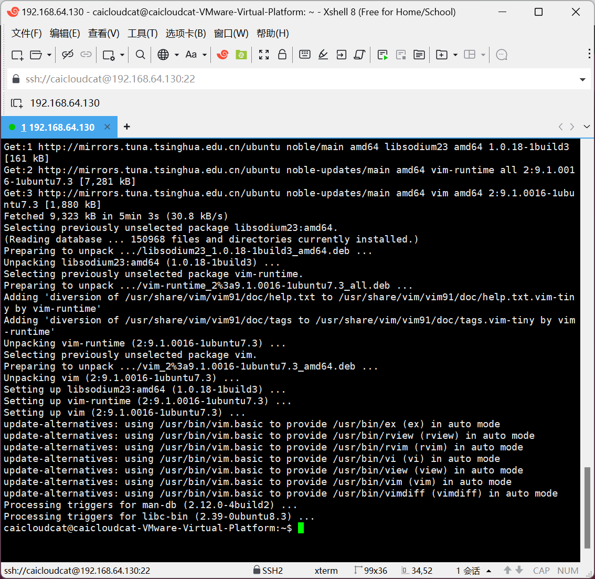
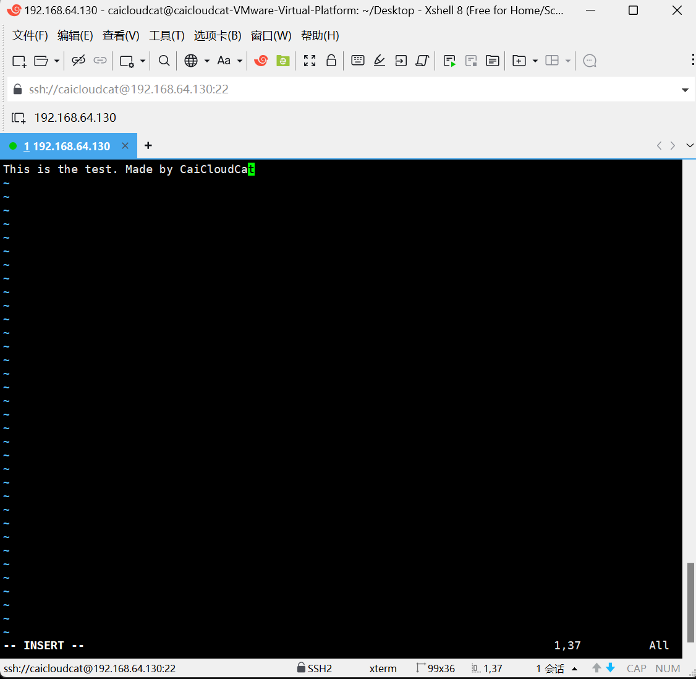
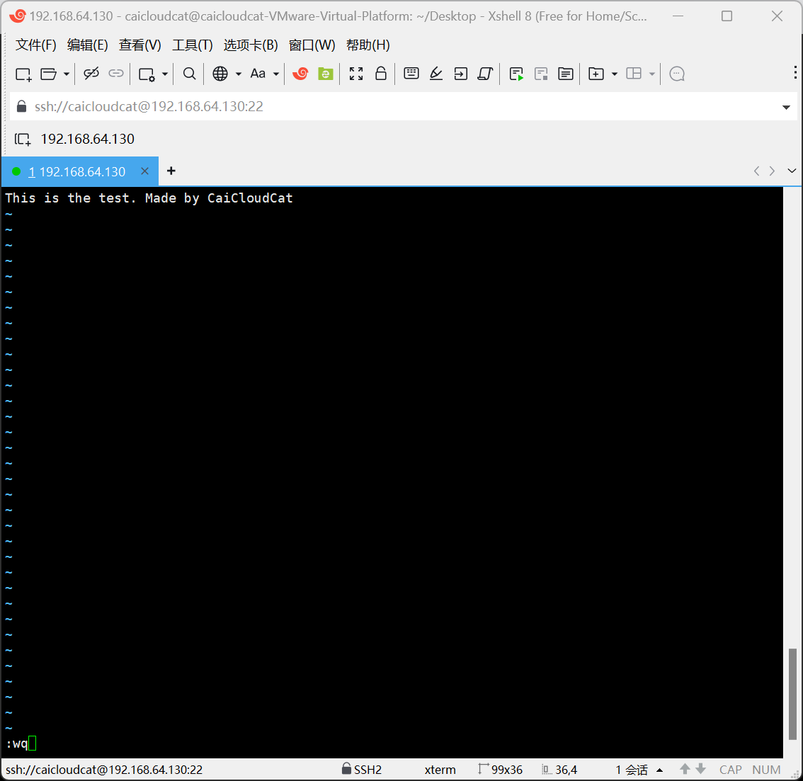

---
date:
    created: 2024-10-24
categories:
    - Linux
tags:
    - Linux
    - vim
---

# 专题04-使用vim编辑器

使用vim编辑器进行文本编辑Linux系统中的文件。
<!-- more -->

## 1 引言

Vim编辑器是一个功能强大且高度可定制的文本编辑器，最初由Bram Moolenaar在80年代末基于vi编辑器开发而来，是 vi 编辑器的增强版本。

vi 最初是为 Unix 系统设计的，而 Vim（Vi IMproved）则增加了更多功能，如语法高亮、多级撤销树、图形界面支持等，使其成为类Unix系统用户以及程序员中最受欢迎的文本编辑器之一。

我们在安装和配置Ubuntu服务器时，经常需要修改各种配置文件，因此需要掌握vim的使用方法。

 

## 2 Vim概述

### 2.1 基本特点

- 多模式设计：Vim具有多种操作模式，包括命令模式（Normal mode）、插入模式（Insert mode）和末行模式（Ex mode/Command-line mode）等。每种模式都有其特定的操作方式和快捷键，使得Vim能够快速切换和执行各种文本编辑任务。
- 高度可定制性：Vim允许用户通过配置文件（如.vimrc）进行个性化设置，包括快捷键、插件、语法高亮、代码折叠等。这种高度可定制性使得Vim能够满足不同用户的需求和偏好。
- 跨平台支持：Vim可以在Unix、Linux、macOS和Windows等多个操作系统上运行，为用户提供一致的编辑体验。

 

### 2.2 主要功能

- 文本编辑：Vim提供了丰富的文本编辑功能，如移动光标、复制粘贴、删除文本、撤销与重做等。这些功能在命令模式下通过快捷键实现，大大提高了编辑效率。
- 代码编辑：Vim特别适合于程序员使用，它支持代码补全、编译及错误跳转等编程功能。此外，Vim还提供了代码折叠、语法高亮等特性，帮助程序员更好地理解和编辑代码。
- 文件操作：在末行模式下，Vim支持文件的保存、退出、查找与替换、显示行号等操作。用户可以通过输入相应的命令来快速完成这些任务。

 

### 2.3 安装Vim

Ubuntu中并没有自带vim，先要安装：`sudo apt install vim`

apt模式安装vim需要几分钟时间。



## 3 Vim使用方法

### 3.1 用vim打开和关闭文件

使用 vim编辑器 打开 test.txt

```shell
vim test.txt  
```

> ！！！若打开后异常退出(`ctrl+z`)，可手动删除**交换文**件（即vim创建的临时文件），如果是正常保存则不用删除，因为**交换文件**被保存为了你需要的那个文件了。

```shell
rm -rf .test.txt.swp
```

- `i `  进入编辑模式` [i:insert 插入]`，这样就可以编辑文件了。



- `Esc键` 退出编辑模式，进入命令模式，这样就可以输入各种vim命令了，注意命令模式下光标会跑到编辑器的最左下方去。

> 备注：在命令模式下，可以输入命令了，例如输入`“:wq”`命令后敲回车来保存文件并退出vim。



vim命令模式下的几个文件保存命令：

- `:q`   退出不保存` [q:quit 退出]`
- `:q!`   强制退出不保存
- `:w`   保存文件` [w:write 写入]`
- `:wq`   保存退出 ------ 这个用的很多

 在图形环境下，从桌面上看新创建了一个文件`test.txt`，并且内容已经修改，双击可以打开这个文件，这个界面类似于Windows中的记事本程序。


既然我们可以在图形界面中用可视化的方式编辑文件内容，为什么还要用vim呢？

这是因为很多服务器只安装了Shell模式，没有安装图形化的桌面环境，所以需要掌握vim的用法。


### 3.2 vim中的文本操作

#### 复制多行

（1）移动光标到要开始复制的第一行（在命令模式下或编辑模式下均可）。

（2）按`esc`键，进入命令模式，输入 `v`   进入可视模式` [v:visual 可视]`，这样就可以按行选择需要的文本了。


（3）使用方向键上下移动选择多行。


（4）按下` y `复制选择的文本。此时 vim 会自动将光标定位到选中文本的开始的地方，并退出可视模式。

（5）移动光标到要粘贴的位置，按`p`粘贴。


#### 删除多行

（1）移动光标到要开始复制的第一行（在命令模式下或编辑模式下均可）。

（2）按`esc`键，进入命令模式，输入 `v`   进入可视模式 `[v:visual 可视]`，这样就可以按行选择需要的文本了。

（3）使用方向键上下移动选择多行。

（4）按下` d `删除选择的文本。此时 vim 会自动将光标定位到选中文本的开始的地方，并退出可视模式。


#### 快捷键

我们在使用windows系统时，经常使用`ctrl+z`用于撤销，使用`ctrl+y`用于重做，在vim中对应的快捷键如下：

```shell
u     撤消
ctrl+r   重做
```

>  注意使用这些快捷键需要在 命令模式 下

### 3.3 vim其他常用命令

#### 查找文本

`/xxx `   ：从光标所在位置==向前==查找字符串`xxx`


`/^xxx`：查找以xxx为行首的行


`/abc$`：查找以xxx为行尾的行


`?xxx`：从光标所在为主==向后==查找字符串xxx


> 注意?和/的区别

`n`：向同一方向重复上次的查找指令

`N`：向相反方向重复上次的查找指定


#### 快速定位

当你的文件打开后页数很多时，在命令模式下通过这几个快捷键可以快速定位

- `ctrl+f`   `[f:forward 向前] `       向下翻一页

- `ctrl+b`  ` [b:backward 向后]`    向上翻一页 

- `[[`                跳转到文件开头

- `]]`                跳转到文件结尾

- `数字gg`   跳转到指定行 

  > 示例：跳转到第10行 10gg 
  >
  > gg 是 go to line 的缩写形式 "跳 转到指定的行"

- `0`     移动到行首

- `$`     移动到行尾` [$:shift+4]`

#### 行号

有时候行数很多，为了方便定位，我们可以显示行号，在命令模式下输入

`:set nu`   显示行号 [nu 是 number 的缩写形式]

`:set nonu`  取消显示行号 [nu 是 number 的缩写形式]


#### 替换文本

如果需要替换文本，则使用在命令模式下输入：

```shell
:%s/要被替换的文本/用来替换的文本/g
```

示例： `:%s/test/test1/g` （将文档中所有的单词 test 替换成 test1）

- %表示对整个文档进行操作 
- s表示替换操作 
- g表示全局替换,若不加g,则只会替换每行中第一个匹配到的文本

执行前：


执行后：


|      快捷键       |                           功能描述                           |
| :---------------: | :----------------------------------------------------------: |
|    `/old/new`     |                   用new替换当前行第一个old                   |
|    `/a1/a2/g`     |            将当前光标所在行中的所有 a1 用 a2 替换            |
| `:n1,n2s/a1/a2/g` |          将文件中 n1 到 n2 行中所有 a1 都用 a2 替换          |
|   `:%s/a1/a2/g`   |                将文件中所有的 a1 都用 a2 替换                |
|   `:%s/^/xxx/g`   |              在每一行的行首插入xxx，`^`表示行首              |
|   `:%s//xxx/g`    | −在每一行的行尾插入xxx，`/xxx/g`在每一行的行尾插入xxx，表示行尾 |


#### 删除文本

|  快捷键   |                功能描述                |
| :-------: | :------------------------------------: |
|    `x`    |         删除光标所在位置的字符         |
|   `dd`    |             删除光标所在行             |
|   `ndd`   |   删除当前行（包括此行）后 n 行文本    |
|   `dG`    | 删除光标所在行一直到文件末尾的所有内容 |
|    `D`    |        删除光标位置到行尾的内容        |
| `:a1,a2d` |     函数从 a1 行到 a2 行的文本内容     |


#### 复制粘贴文本

|   快捷键    |                          功能描述                          |
| :---------: | :--------------------------------------------------------: |
|     `p`     |                将剪贴板中的内容粘贴到光标后                |
| `P`（大写） |                将剪贴板中的内容粘贴到光标前                |
|     `y`     |                  复制已选中的文本到剪贴板                  |
|    `yy`     | 将光标所在行复制到剪贴板，此命令前可以加数字 n，可复制多行 |
|    `yw`     |                将光标位置的单词复制到剪贴板                |


## 4 grep 命令用法介绍

### 4.1 grep 命令简介

`grep(Global Regular Expression Print[全局正则表达式打印]) `命令是一个强大的文本搜索工具，它能使用正则表达式搜索文本，并把匹配的行打印出来。我们在检索文本内容时，常使用这个命令。

> 关于正则表达式：https://www.bilibili.com/video/BV1da4y1p7iZ/?spm_id_from=333.337.search-card.all.click&vd_source=1be27cbe131b9c3024ff27667bbda481
>
> 正则表达式在线测试工具：https://regex101.com/

 

`grep`命令的基本格式为 `grep [options] pattern [file]`

`grep`命令的主要参数有：

- `-i`：忽略大小写
- `-v`：显示不包含匹配文本的所有行（相当于求反）
- `-r`：递归搜索
- `-l`：只列出匹配的文件名
- `-n`：显示匹配行及行号
- `-c`：只输出匹配行的计数
- `-w`：只匹配整个单词，而不是字符串的一部分
- `-x`：只匹配整行
- `-e`：可以指定多个搜索模式
- `-f`：从文件获取模式

 

### 4.2 grep 命令使用范例

首先使用vim在Desktop下创建两个文件`web1.txt`和`web2.txt`

`vim web1.txt`

在`web1.txt`里面写上这些内容，等会儿我们测试用，注意区分大小写，保存并退出。


`vim web2.txt`

在`web2.txt`里面写上这些内容，等会儿我们测试用，注意区分大小写，保存并退出。


***

输入下列命令，在 `web1.txt` 文件中查找包含` ubuntu`字符串的所有行并打印出来

`grep ubuntu web1.txt`


输入下列命令，在` web1.txt `文件中查找包含` ubuntu`字符串的所有行并打印出来，同时输出匹配行的行号

> 其中` -n `的全称是 `"line-number" `

`grep -n ubuntu web1.txt`


输入下列命令，在` web1.txt `文件中查找包含` ubuntu`字符串的所有行并打印出来，注意忽略了字母的大小写

> 其中` -i `的全称是` "ignore-case" `

`grep -i ubuntu web1.txt`


输入下列命令，在` web1.txt `文件中查找包含` ubuntu`字符串的所有行并打印出来，注意忽略了字母的大小写并输出匹配行的行号，下面两种写法都可以 

`grep -i -n ubuntu web1.txt`

`grep -in ubuntu web1.txt`


输入下列命令，在` web1.txt `文件中查找包含`ubuntu2024`字符串的所有行并打印出来，注意同时显示了匹配行后1行的内容

> 其中` -A `全称` "after-context"`
>
> `-A1 `表示显示匹配行后1行的内容

`grep -n -A1 ubuntu2024 web1.txt`


输入下列命令，在` web1.txt `文件中查找包含` ubuntu2024`字符串的所有行并打印出来，注意同时显示了匹配行前1行的内容

> 其中` -B `全称` "before-context"`
>
> `-B1 `表示显示匹配行前1行的内容

`grep -n -B1 ubuntu2024 web1.txt`


输入下列命令，在` web1.txt `文件中查找包含` ubuntu2024`字符串的所有行并打印出来，注意同时显示了匹配行前后1行的内容

> 其中` -C `全称` "context"`
>
> `-C1` 表示显示匹配行上下各1行的内容

`grep -n -C1 ubuntu2024 web1.txt`


输入下列命令，在` web1.txt `和`web2.txt`文件中查找包含`ubuntu`字符串的所有行并打印出来

`grep -n ubuntu web1.txt web2.txt`


输入下列命令，在` web1.txt `和`web2.txt`文件中查找包含` ubuntu`字符串的所有行并打印出来，注意这次使用全词匹配, 即只有匹配到整个单词才算匹配成功

> 其中` -w `的全称是` "word-regexp”`，即全词匹配。

`grep -n -w ubuntu web1.txt web2.txt`


## 5 具体参考资料

浙江理工大学——姜毅
[Linux Vim操作看这篇文章就够了](https://www.cnblogs.com/Wayne123/p/17201671.html)
 
[Linux vi/vim](https://www.runoob.com/linux/linux-vim.html)