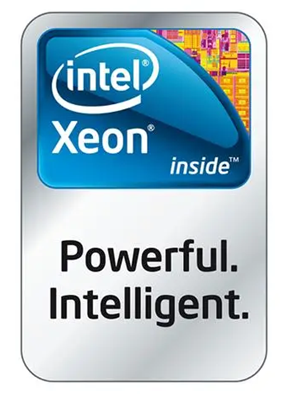
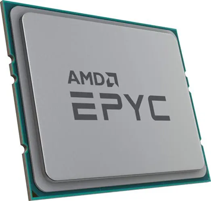
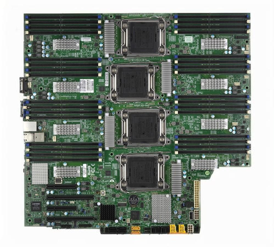
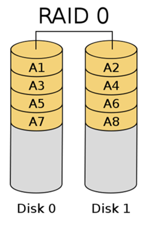
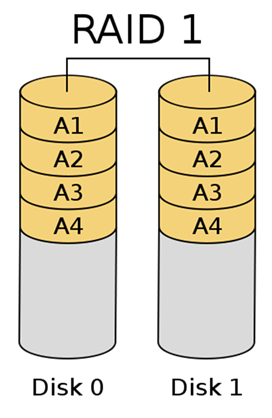
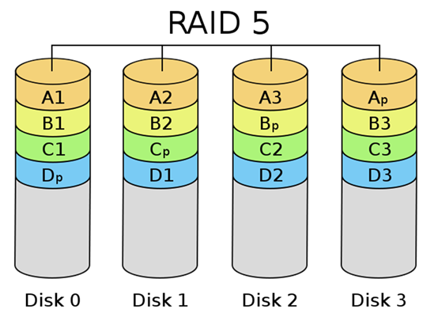
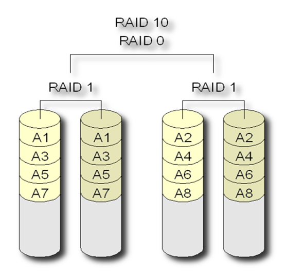
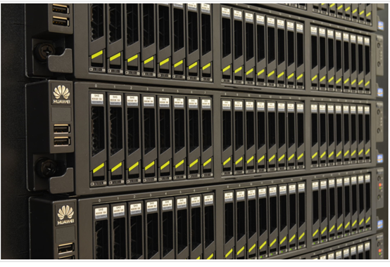

---
date:
    created: 2024-10-07
    updated: 2024-11-16
categories:
    - Linux
tags:
    - Linux
---

# 专题01—服务器技术专题

在了解Linux之前，首先了解一下需要了解一下服务器技术。

<!-- more -->

## 1 引言

大数据一般存储在IDC（Internet Data Center，互联网数据中心）中，IDC有很多的服务器，Linux是使用最为广泛的服务器操作系统，所以我们先来弄清楚服务器相关的知识。

 

## 2 定义

**服务器（Server）是什么？是硬件还是软件？**

定义1：服务器是在网络环境中**提供计算能力并运行软件应用程序的特定IT设备**，它在网络中为其他客户机（如个人计算机、智能手机、ATM机等终端设备）提供计算或者应用服务, 一般来说服务器都具备承担响应服务请求、承担服务、保障服务的能力。服务器相比普通计算机具有高速的CPU运算能力；长时间可靠运行能力；强大的I/O数据吞吐能力以及具备高扩展性。服务器作为电子设备，其内部的结构十分的复杂，服务器主要构件有：CPU、内存、芯片组、I/O设备、存储器、外围设备、稳压器、电源和冷却系统。

来源：[百度百科—服务器](https://baike.baidu.com/item/%E6%9C%8D%E5%8A%A1%E5%99%A8/100571?fr=ge_ala) 

定义2：从广义上讲，服务器是指网络中能对其它机器提供某些服务的**计算机系统，软件或者设备**（如果一个PC对外提供ftp服务，也可以叫服务器）。打印服务器就是专门为网络上共享打印机而提供的设备，文件服务器是专门为共享文件而提供的一台PC机，数据库服务器就是专门共享数据库而提供的。DNS(域名服务器）就是负责把互联网址翻译成IP地址，这也是一种服务。我们发送电子邮件靠的就是邮件服务器。

定义3：服务器指一个管理资源并为用户提供服务的**计算机软件**，通常分为文件服务器、数据库服务器和应用程序服务器。**运行以上软件的计算机或计算机系统也被称为服务器**。相对于普通PC来说，服务器在稳定性、安全性、性能等方面都要求更高，因此CPU、芯片组、内存、磁盘系统、网络等硬件和普通PC有所不同。

小结：**服务器既可以指硬件设备，也可以指软件系统，或者指安装了某些软件的硬件设备，具体含义要看使用情境**。

## 3 服务器硬件

**普通PC机硬件**

视频：[【装机教程】全网最好的装机教程，没有之一](https://www.bilibili.com/video/BV1BG4y137mG/?spm_id_from=333.337.search-card.all.click&vd_source=1be27cbe131b9c3024ff27667bbda481) 0:52~6:30

**服务器器硬件**

视频：[为什么它被称为互联网之魂？服务器硬件知识科普](https://www.bilibili.com/video/BV1D3411i7RD/?spm_id_from=333.337.search-card.all.click&vd_source=1be27cbe131b9c3024ff27667bbda481)

**数据中心**

视频：[美国俄勒冈州数据中心是如何建成的（城域网）](https://www.bilibili.com/video/BV1tx411B7ab/?spm_id_from=333.337.search-card.all.click&vd_source=1be27cbe131b9c3024ff27667bbda481)

### 3.1 服务器架构分类

- 非x86服务器：包括 **大型机**、**小型机** 等。它们是使用RISC（精简指令集）或EPIC（并行指令代码）处理器，并且主要采用UNIX和其它专用操作系统的服务器。现在有些服务器已经开始采用ARM架构了。

- x86服务器：又称CISC（复杂指令集）架构服务器，即通常所讲的 **PC服务器**（**PC Server**），它是基于PC机体系结构，使用Intel或其它兼容x86指令集的处理器芯片和Windows、Linux操作系统的服务器。

### 3.2 处理器

服务器处理器通常采用高性能的多核处理器，如Intel Xeon（至强系列）和AMD EPYC系列。

特点：速度快（缓存大）、稳定性高。

问题：台式机/笔记本的CPU性能是否足够承担服务器的作用？

### 3.3 主板

服务器主板稳定性更高，支持多颗CPU、ECC内存等。

### 3.4 内存

服务器内存具有大容量和高速度的特点，常见的有DDR4和DDR5内存，具备ECC功能。

ECC：Error Correcting Code（错误检查和纠正）。ECC是一种能够实现”错误检查和纠正”的技术，ECC内存就是应用了这种技术的内存。

ECC内存特点：能够自动纠错，稳定性高。

### 3.5 存储

服务器存储包括硬盘驱动器（HDD）、固态驱动器（SSD）和存储区域网络（SAN）等。

<mark>RAID：Redundant Array of Independent Disk，独立冗余磁盘阵列</mark>。该技术诞生于1987年，由美国加州大学伯克利分校提出。简单地解释，就是将N台硬盘通过RAID Controller（分Hardware，Software）结合成虚拟单台大容量的硬盘使用。RAID的采用为存储系统（或者服务器的内置存储）带来巨大利益，其中提高传输速率和提供容错功能是最大的优点。

1. **RAID 0 (条带化)**

- **工作原理**：RAID 0将数据分成多个块，交替存储在多个硬盘上（称为条带化）。所有硬盘**同时**读写数据。
- **优点**：通过并行存储和读取，提供非常高的读写速度。
- **缺点**：没有数据冗余或备份，一旦一个硬盘损坏，所有数据都将丢失。
- **应用场景**：适用于对性能要求很高但数据安全性要求不高的场景，如视频编辑或大文件传输。

2. **RAID 1 (镜像)**

- **工作原理**：RAID 1将数据完全复制到两个或多个硬盘上，形成镜像。每个硬盘存储相同的数据。
- **优点**：具有高数据安全性，任何一个硬盘损坏都不会影响数据，系统可以从另一块磁盘读取数据。
- **缺点**：存储效率低，因为每写入1个单位的数据会在多个磁盘上重复存储，存储空间利用率为50%。
- **应用场景**：适用于数据安全性高于性能需求的场合，如财务系统或重要数据库。

3. **RAID 5 (条带化 + 奇偶校验)**

- **工作原理**：RAID 5通过条带化技术将数据分布在多个硬盘上，并在每次写入时计算奇偶校验数据，将校验数据存储在不同的硬盘上。即使某一个硬盘损坏，也可以通过校验数据重建丢失的数据。
- **优点**：提供了较好的读取性能，同时节省存储空间。数据在单个硬盘故障时不会丢失。
- **缺点**：写入性能相对较差，尤其是校验数据计算会带来一定的开销。在修复故障硬盘时，重建数据的过程比较耗时。
- **应用场景**：适合需要较高存储效率、可靠性和读取性能的应用，如文件服务器和数据存储系统。

4. **RAID 10 (RAID 1+0)**

- **工作原理**：RAID 10结合了RAID 0和RAID 1的优点，先将数据条带化分布在多个硬盘上，再对每个条带进行镜像。这种结构既提升了性能又提供了数据冗余。
- **优点**：同时提供了高读写性能和高数据冗余能力，允许一个条带中的硬盘损坏而不会丢失数据。
- **缺点**：存储效率和RAID 1相同，仅为50%，因为每写入的数据都会被镜像复制。
- **应用场景**：适用于既需要高性能又需要高数据可靠性的场合，如数据库服务器和高性能计算环境。

计算：

1、RAID0、RAID1、RAID5、RAID10的有效容量；

2、 RAID0、RAID1、RAID5、RAID10的速度；

3、 RAID0、RAID1、RAID5、RAID10的可靠性。

### 3.6 网络接口卡（NIC）

NIC用于服务器与网络的连接，支持高速数据传输。

万兆网络、光纤接口等

### 3.7 机箱

机箱：主要分为塔式机箱、机架式机箱、刀片式机箱。

塔式服务器

1U服务器

2U服务器

4U服务器

机架式机箱部署更方便，机架标准高度单位U。

***

1U 机架高度（高x 宽x 厚）：

1.68 英寸/ 4.2 厘米x 16.7 英寸/ 42.42 厘米x 21.9 英寸/ 55.5 厘米

### 3.8 电源

电源：冗余电源设计

 

 

图片浏览：机房、机架、服务器等。

**一个小问题，我们的台式机或笔记本能不能当成服务器来用？**

## 4 如何购买服务器

### 4.1 物理服务器

物理服务器是指具有独立硬件资源的服务器，包括机架式服务器、刀片式服务器和塔式服务器。[京东购买服务器](https://search.jd.com/Search?keyword=服务器&enc=utf-8&wq=服务器&pvid=7a0c10f85a314c529a51d116a5155485)

> 注意：服务器很多配件（如内存、硬盘等）需要额外购买

 

### 4.2 虚拟服务器

虚拟服务器是通过虚拟化技术在物理服务器上创建的多个独立的服务器实例，能够提高资源利用率。

 

#### 4.2.1 IT设备应用现状

> 《报告》显示，通过政府网站发布公告、新闻、政策等信息比例超过60%的网站，仅占全部政府网站的44.5%，发布比例低于20%的网站占全部政府网站的21.7%，政府网站的利用率不足50％。
>
> ——国务院信息化工作办公室 

 尽管我们需要越来越多数量及功能强大的计算机，可是我们却不得不承认，现有的计算机资源利用率是非常低的。且不说机器在晚上基本上是闲置，就是工作的时间里，我们的计算机的资源利用率也是非常低的

> 全球最过剩的资源是计算资源，计算机利用率严重不足，全球计算资源的平均利用率仅为9％。
>
> ——计算机调查研究 

==991现象==： 90%的服务器 90%的时间 cpu占用率不足10%

#### 4.2.2 虚拟化技术简介

之前单个节点运行着唯一的操作系统实例，通过在这个系统上加装虚拟化平台，可以将系统划分为多个独立隔离的容器，每个容器是一个虚拟的操作系统，这样可以将一台服务器当做N台服务器来使用。

虚拟化的主要应用：

#### 4.2.3 虚拟化架构

虚拟化架构常见的分为两类: 

- 一、宿主虚拟化
- 二、裸机虚拟化

1、==宿主虚拟化==

很好理解，就是你想装虚拟化软件，需要先装一个操作系统，然后安装虚拟化软件，

比如 Windows系统上的` VMware Workstation \ VirtualBox `软件 ，Mac OS 上的` Parallels Desktop `软件

宿主虚拟化的 hypervisor 就像是安装在子操作系统上的一个应用，这种方式比裸机虚拟化的 hypervisor 提供更好的硬件兼容性，因为调用硬件的流程是：虚拟机内核 -> Hypervisor -> 操作系统 -> 硬件，但这也导致了宿主虚拟化的性能是要比裸机虚拟化差很多的

优点：

（1）硬件兼容性好

（2）使用方便，附加功能比较丰富

缺点：

（1）性能差

2、==裸机虚拟化==

这个不需要操作系统, 虚拟管理程序本身就是一个操作系统，例如：VMware ESXI 、Proxmox VE、Microsoft Hyper-V， 裸机虚拟化的性能是要优于宿主虚拟化的，一般IDC都是运行的这类系统

裸机型在虚拟化中Hypervisor直接管理访问硬件资源，不需要底层操作系统，也可以将Hypervisor看作是一个很薄的操作系统， hypervisor直接访问硬件资源，这个使得虚拟机能够获得更好的性能、扩展性与稳定性。

调用的流程是：虚拟机内核 -> Hypervisor -> 硬件

优点：

（1）性能好，损耗极低

（2）一般拥有资源管理、高可用性和安全方面的功能，比较适合企业数据中心

缺点：

1、硬件支持有限，因为hypervisor通常内置的设备驱动很有限，比如esxi

#### 4.2.4 虚拟化软件

服务器虚拟化软件包括VMware ESXi、Hyper-V、Citrix XenServer等，各有优势和劣势。开源软件如KVM免费，而商业软件如VMware ESXi和Red Hat Virtualization (RHV)提供付费版本。部分软件有GitHub地址，例如Xen开源项目和oVirt开源项目。[虚拟化软件大比拼，你知道几款？](https://baijiahao.baidu.com/s?id=1792041095275126956&wfr=spider&for=pc)

**我们使用vmware的虚拟化软件。**

（1）关于vmware

VMware总部位于美国加州帕洛阿尔托（Palo Alto），是全球云基础架构和移动商务解决方案厂商，提供基于VMware的解决方案，企业通过数据中心改造和公有云整合业务，借助企业安全转型维系客户信任 [3]，实现任意云端和设备上运行、管理、连接及保护任意应用。

VMware（威睿） 是全球桌面到数据中心虚拟化解决方案的领导厂商。全球不同规模的客户依靠VMware来降低成本和运营费用、确保业务持续性、加强安全性并走向绿色。VMware使企业可以采用能够解决其独有业务难题的云计算模式。

（2）关于Vmware 版本

‌VMware提供了多个版本，以满足不同用户的需求。‌

- `VMware Workstation Pro‌`：这是VMware的个人版本产品，允许用户在一台物理机上同时运行多个操作系统，支持Windows、Linux和其他操作系统。它适合专业技术人员进行软件开发、测试、演示和部署。VMware Workstation Pro支持的功能包括复制服务器、桌面和平板电脑环境，并为每个虚拟机分配多个处理器内核、千兆字节的主内存和显存‌。
- `VMware Fusion Pro‌`：专为Mac用户设计，提供与`VMware Workstation Pro`类似的功能，但界面和用户体验针对Mac平台进行了优化。Fusion Pro允许用户在Mac上运行不同的操作系统，进行开发、测试和部署‌
- ` ‌VMware ESXi‌`：这是VMware的企业级产品，设计用于服务器环境，不需要额外的操作系统支持。ESXi是一个独立的虚拟机，可以直接在一台裸机上安装，然后安装虚拟机。它是一个基于hypervisor的虚拟化技术，能够将物理服务器转换为多个虚拟服务器。ESXi具有较小的安装体积和较少的资源需求，适合在较小的硬件配置上运行‌。
- ` ‌VMware vSphere‌`：这是一个完整的虚拟化和云管理解决方案，包括ESXi hypervisor以及其他管理和监控工具。vSphere企业版支持企业级虚拟化部署，并提供更多的管理和安全功能。它还支持容器管理和扩展存储等高级功能‌。

这些版本覆盖了从个人用户到企业用户的广泛需求，提供了灵活的虚拟化解决方案。

以前`VMware Workstation`需要收费，2023年11月VMware被博通收购，据说现在「Workstation Pro」与「Fusion Pro」产品免费提供给个人用户使用了。

***

==实验1 虚拟机安装==

实验要求：安装虚拟机，可以使用Vmware WorkStation或其他虚拟机软件。

实验说明：详见《实验手册1：安装Vmware WorkStation》

备注：

>  请把你电脑的VT功能打开，让CPU支持虚拟化。
>
>  在安装虚拟机之前，需要重启电脑后「按下Delete键或F1/F2/F12」，具体根据不同电脑型号而定，进入BIOS界面后「选择高级设置（Advanced）」-「点击处理器配置（CPU Configuration）」-「点击开启虚拟化（Virtualization Technology）」选项即可。
>
>  对应视频： [怎么在BIOS里把CPU虚拟化功能打开？](https://www.bilibili.com/video/BV1xc411x746/?spm_id_from=333.337.search-card.all.click)

### 4.3 云服务器

云服务器是基于云计算技术的服务器，用户可以通过互联网访问和管理，具有弹性扩展和高可用性的特点。

IaaS：Infrastructure as a Service，基础设施即服务

本质上：IaaS就是你选好配置并付费，云服务商在其IDC（Internet Data Center，互联网数据中心）创建一台虚拟服务器，然后你就可以**远程使用**这台虚拟服务器了（所以我们有一个实验是远程使用Linux服务器）。

云服务商：亚马逊、阿里云、腾讯云、华为云、京东云等。地址：[阿里云官网](https://www.aliyun.com/benefit/select/promo?utm_content=se_1018765465)

## 5 服务器操作系统

操作系统英文原称Operating System（简称OS），主要功能是实现计算机硬件与软件的直接控制，并进行管理协调。

服务器操作系统主要分为三大流派：Windows Server、Linux（如Ubuntu Server、CentOS）和Unix等。这些操作系统提供了服务器管理、安全性和网络服务等功能。

### 5.1 Windows Server

优点：和Windows11/Windows10操作方法接近，操作直观，易于使用，功能实用。

缺点：图形界面对系统资源消耗大，稳定性一般，贵。

版本：Windows Server 2022、Windows Server 2019、Windows Server 2016等

### 5.2 UNIX

诞生于1971年美国AT&T公司的贝尔实验室，主要开发者是丹尼斯.里奇、肯.汤普逊。

该系统的主要特点是支持多用户、多任务，并支持多种处理器架构，同时具有高安全性、高可靠性、高稳定性，既可以构建大型关键业务系统的商业服务器，也可以构建面向移动终端、手持设备、可穿戴设备的嵌入式应用。

Unix家谱

CSDN相关博客：[unix介绍](https://blog.csdn.net/weixin_34208283/article/details/86339942)

==Aix==：（ Advanced Interactive eXecutive）是 IBM开发的一套 UNIX操作系统。 它符合Open group的UNIX 98行业标准（The Open Group UNIX 98 Base Brand），通过全面集成对32-位和64-位应用的并行运行支持，为这些应用提供了全面的可扩展性。它可以在所有的IBM ~ p系列和IBM RS/6000 工作站、服务器和大型并行超级计算机上运行。AIX的一些流行特性例如chuser、mkuser、rmuser命令以及相似的东西允许如同管理文件一样来进行用户管理。AIX级别的逻辑卷管理正逐渐被添加进各种自由的UNIX风格操作系统中。

==Solaris==：是 SUN公司研制的类Unix操作系统。直至2013年，Solaris的最新版为 Solaris 11。早期的Solaris是由BSDUnix发展而来。

这是因为升阳公司的创始人之一，比尔·乔伊（Bill Joy）来自 加州大学伯克莱分校（U.C.Berkeley）。但是随着时间的推移，Solaris在接口上正在逐渐向System V靠拢，但至今Solaris仍旧属于私有软件。2005年6月14日，Sun公司将正在开发中的Solaris 11的源代码以 CDDL许可开放，这一开放版本就是OpenSolaris。

Sun的操作系统最初叫做SunOS。SunOS 5.0开始，SUN的操作系统开发开始转向System V4，并且有了新的名字叫做Solaris 2.0。Solaris 2.6以后，SUN删除了版本号中的"2"，因此，SunOS 5.10就叫做Solaris 10。Solaris的早期版本后来又被重新命名为Solaris 1.x. 所以"SunOS"这个词被用做专指Solaris操作系统的内核，因此Solaris被认为是由SunOS，图形化的桌面计算环境，以及它网络增强部分组成。

Solaris运行在两个平台：Intel x86及SPARC/UltraSPARC。后者是升阳工作站使用的处理器。因此，Solaris在SPARC上拥有强大的处理能力和硬件支援，同时 Intel x86上的性能也正在得到改善。对这两个平台，Solaris屏蔽了底层平台差异，为用户提供了尽可能一样的使用体验。

<mark>HP-UX</mark>：取自 Hewlett Packard UniX，是 惠普公司（ HP,Hewlett-Packard）以 SystemV为基础所研发成的类UNIX操作系统。 HP-UX可以在HP的 PA-RISC处理器、Intel的Itanium处理器的电脑上运行，另外过去也能用于后期的 阿波罗电脑（Apollo/Domain）系统上。较早版本的HP-UX也能用于HP 9000系列200型、300型、400型的电脑系统（使用Motorola的68000处理器）上，和HP-9000系列500型电脑（使用HP专属的FOCUS 处理器架构）。

**如果你使用Unix系统，除了Free-BSD以外，大部分是和专门厂家的大型机/小型机配套的。在PC Server占主流的今天，Unix使用范围是很小的。**

### 5.3 Linux

Linux，Linux Is Not UniX 的递归缩写，一般指GNU/Linux（单独的Linux内核并不可直接使用，一般搭配GNU套件，故得此称呼），是一种免费使用和自由传播的**类UNIX**操作系统，其内核由林纳斯·本纳第克特·托瓦兹（Linus Benedict Torvalds，芬兰赫尔辛基大学）于1991年10月5日首次发布，它主要受到Minix和Unix思想的启发，是一个基于POSIX的多用户、多任务、支持多线程和多CPU的操作系统。它支持32位和64位硬件，能运行主要的Unix工具软件、应用程序和网络协议。

Linux继承了Unix以网络为核心的设计思想，是一个性能稳定的多用户网络操作系统。Linux是一套**免费使用**和**自由传播**的类Unix操作系统，具有**开放源码**、没有版权、技术社区用户多等特点，开放源码使得用户可以自由裁剪，灵活性高，功能强大，成本低。

Linux是一款免费（或自由，即free）的操作系统，用户可以通过网络或其他途径免费获得，并可以任意修改其源代码。这是其他的操作系统所做不到的。正是由于这一点，来自全世界的无数程序员参与了Linux的修改、编写工作，程序员可以根据自己的兴趣和灵感对其进行改变，这让Linux吸收了无数程序员的精华，不断壮大。

注意：Linux是一种**UNIX-Like**系统，继承了UNIX的特性，有许多相似处，但也有不少差别。

#### 5.3.1 Linux发行版本

Linux发行版本可以大体分为两类，一类是商业公司维护的发行版本，一类是社区组织维护的发行版本：

- n**商业版本**：**RHEL**（Redhat Enterprise Linux，也就是所谓的Redhat Advance Server，收费版本）、SUSE、Oracle Linux
- **社区版本**：**CentOS**（RHEL的社区克隆版本，免费）、Debian、**Ubuntu**等。

Linux族谱：[linux 版本介绍](https://blog.csdn.net/wudashuang/article/details/102074867)

**常用的大数据服务组件都是运行在Linux系统之上，所以我们要学习Linux系统。**

!!! not "注意"
    注意：我们上课使用Ubuntu发行版，各种教材中选择CentOS（《鸟哥的 linux 私房菜》）和Ubuntu都很多，CentOS的优点是和RHEL完全兼容，方便以后去企业做（当）运（网）维（管），Ubuntu的优点是各种资源多、教程多、软件多、GUI（Graphical User Interface，图形用户接口）好、社区友好，对Linux入门方便。
    
    ！！！可是，2024年6月30 日开始CentOS 停止更新和维护，意味着从此以后不再会有更新和补丁，包括安全漏洞的修复，统统没了。所以我们这门课就用Ubuntu发行版吧，而且Ubuntu属于Debian分支，Debian也是一个非常主流的Linux发行版。

<mark>实验2 在虚拟机中安装Linux</mark>

实验要求：在虚拟机中安装Linux，可以使用Unbuntu发行版，或者CentOS等发行版。

实验说明：详见《实验手册2：在虚拟机中安装Ubuntu》

## 6 结论

服务器技术是现代信息技术的基石，其发展直接影响着企业的运营效率和数据安全。通过深入了解服务器的类型、架构、硬件组件、操作系统、网络连接以及安全性等方面的知识，企业可以更好地选择和管理服务器资源，满足不断变化的业务需求。

