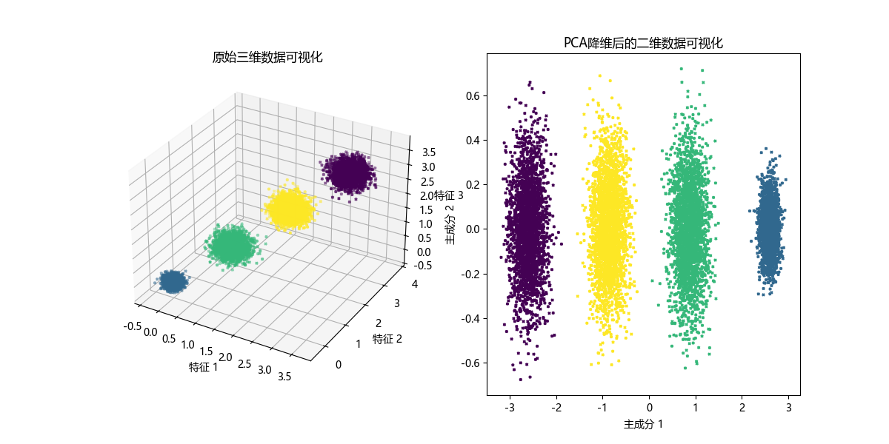

---
date:
    created: 2024-11-21
    updated: 2024-11-29
categories:
    - ML
tags:
    - Algorithm
    - Math
---
# 主成分分析（PCA）

## 引言

在互联网大数据场景下，我们经常需要面对高维数据，在对这些数据做分析和可视化的时候，我们通常会面对「高维」这个障碍。在数据挖掘和建模的过程中，高维数据也同样带来大的计算量，占据更多的资源，而且许多变量之间可能存在相关性，从而增加了分析与建模的复杂性。

我们希望找到一种方法，在对数据完成降维「压缩」的同时，尽量减少信息损失。由于各变量之间存在一定的相关关系，因此可以考虑将关系紧密的变量变成尽可能少的新变量，使这些新变量是两两不相关的，那么就可以用较少的综合指标分别代表存在于各个变量中的各类信息。机器学习中的降维算法就是这样的一类算法。

PCA（Principal Component Analysis，主成分分析）是一种常用的降维方法，主要用于处理高维数据，减少数据维度的同时保留尽可能多的信息。

<!-- more -->

它的目标是通过某种线性投影，将高维的数据映射到低维的空间中表示，并期望在所投影的维度上数据的方差最大，以此使用较少的数据维度，同时保留住较多的原数据点的特性。通俗的理解，如果把所有的点都映射到一起，那么几乎所有的信息（如点和点之间的距离关系）都丢失了，而如果映射后方差尽可能的大，那么数据点则会分散开来，以此来保留更多的信息。可以证明，PCA是丢失原始数据信息最少的一种线性降维方式。

比如说下面这种情况：


其目标简易的说就是“找坐标系”，目标就是只保留一个轴的时候，信息保持的比较完整。


!!! note "注意"
    **降维就意味着信息的丢失**，这一点一定要明确，如果用 **原始数据** 在模型上没有效果，期望通过降维来进行改善这是不现实的，不过鉴于实际数据本身常常存在的相关性，我们可以想办法在降维的同时将信息的损失尽量降低。当你在原数据上跑了一个比较好的结果，又嫌它太慢模型太复杂时候才可以采取PCA降维。

根据 `PCA` 的目标，它有这两个重要的性质：

- **最近重构性**：样本点到超平面的距离足够近，即尽可能在超平面附近；
- **最大可分性**：样本点在超平面上的投影尽可能地分散开来，即投影后的坐标具有区分性。满足 **最大方差理论** 。

## 涉及到的数学知识

!!! note "主要参考"
    来自于[图解机器学习 | 降维算法详解](https://www.showmeai.tech/article-detail/198)这篇文章中的数学讲解。

### 基变换

要获得原始数据 $X$ 新的表示空间 $Y$ ，最简单的方法是对原始数据进行线性变换（也叫做基变换）$Y = PX$ 。其中，$X$ 是原始样本，$P$ 是基向量，$Y$ 是新表达。

其中数学表达：

$$
\left[\begin{array}{c}
p_1 \\
p_2 \\
\vdots \\
p_r
\end{array}\right]_{r \times n}\left[\begin{array}{llll}
x_1 & x_2 & \cdots & x_m
\end{array}\right]_{n \times m}=\left[\begin{array}{cccc}
p_1 x_1 & p_1 x_2 & \cdots & p_1 x_m \\
p_2 x_1 & p_2 x_2 & \cdots & p_2 x_m \\
\vdots & \vdots & \ddots & \vdots \\
p_r x_1 & p_r x_2 & \cdots & p_r x_m
\end{array}\right]_{r \times m}
$$

其中 $p_i$ 是行向量，表示第 $i$ 个基；

$x_j$ 是一个列向量，表示第 $j$ 个原始数据记录。

当 $r < n$ 时，即 **基的维度<数据维度** 时，可以达到降维的目的。

以直角坐标系下的点 $(3, 2)$ 为例，要把点 $(3, 2)$ 变换为新基上的坐标，就是用 $(3, 2)$ 与第一个基做内积运算，作为第一个新的坐标分量，然后用 $(3, 2)$ 与第二个基做内积运算，作为第二个新坐标的分量。

$$
\begin{bmatrix}\frac1{\sqrt2}&\frac1{\sqrt2}\\-\frac1{\sqrt2}&\frac1{\sqrt2}\end{bmatrix}\begin{bmatrix}3\\2\end{bmatrix}=\begin{bmatrix}\frac5{\sqrt2}\\-\frac1{\sqrt2}\end{bmatrix}
$$

再稍微推广一下，假如我们有 $m$ 个二维向量，只要将二维向量按列排成一个两行 $m$ 列矩阵，然后用「基矩阵」乘以这个矩阵，就得到了所有这些向量在新基下的值。例如 $(1, 1)$ 、$(2, 2)$ 、$(3, 3)$，想变换到刚才那组基上，可以如下这样表示：

$$
\begin{bmatrix}\frac{1}{\sqrt{2}}&\frac{1}{\sqrt{2}}\\-\frac{1}{\sqrt{2}}&\frac{1}{\sqrt{2}}\end{bmatrix}\begin{bmatrix}1&2&3\\1&2&3\end{bmatrix}=\begin{bmatrix}2\sqrt{2}&4\sqrt{2}&6\sqrt{2}\\0&0&0\end{bmatrix}
$$

### 方差

用方差来定义样本的间距，方差越大表示样本分布越稀疏，方差越小表示样本分布越密集。

**方差** 的公式如下：
$$
Var(x) = \frac{1}{m}\sum_{i=1}^{m}(x_i-\mu)^2
$$

去中心化（把坐标原点放在数据中心）

$$
Var(x) = \frac{1}{m}\sum_{i=1}^{m}x_i^2
$$

为了后续处理方便，我们首先将每个字段内所有值都减去字段均值，其结果是将每个字段都变为均值为 0。

举个例子，$x_1=\begin{bmatrix}1\\1\end{bmatrix}$、$x_2=\begin{bmatrix}1\\3\end{bmatrix}$、$x_3=\begin{bmatrix}2\\3\end{bmatrix}$、$x_4=\begin{bmatrix}4\\4\end{bmatrix}$、$x_5=\begin{bmatrix}2\\4\end{bmatrix}$，将他们表示成矩阵形式：$X=\begin{bmatrix}1&1&2&4&2\\1&3&3&4&4\end{bmatrix}$。

我们看这些数据，设第一个特征为$a$， 第二个特征为$b$，则某个样本可以写作 $x_i=\begin{bmatrix}a\\b\end{bmatrix}$。

且特征$a$的均值为2，特征$b$的均值为3。所以，变换后:

$$
\begin{gathered}X=\begin{bmatrix}-1&-1&0&2&0\\-2&0&0&1&1\end{bmatrix}\\Var(a)=\frac{\sqrt{6}}5Var(b)=\frac{\sqrt{6}}5\end{gathered}
$$

### 协方差

协方差（Covariance）在概率和统计学中用于衡量两个变量的总体误差。

比如，对于二维随机变量：$x_i=\begin{bmatrix}a\\b\end{bmatrix}$，特征$a$、$b$还需要讨论两者互相关系的数学特征。

定义协方差：

$$Cov(a,b)=E[(a-\mu_a)(b-\mu_b)]$$

当 $Cov(a, b) = 0$ 时，两者完全独立，这也是我们希望达到的优化目标。方差是协方差的一种特殊情况，即当两个变量是相同的情况 $Cov(a, a) = Var(a)$ 。

### 协方差矩阵

对于 $n$ 维随机变量

$$
x_i=\begin{bmatrix}x_1\\x_2\\\vdots\\x_n\end{bmatrix}C=\begin{bmatrix}Var(x_1)&Cov(x_1,x_2)&\cdots&Cov(x_1,x_n)\\Cov(x_2,x_1)&Var(x_2)&\cdots&Cov(x_1,x_n)\\\vdots&\vdots&\ddots&\vdots\\Cov(x_n,x_1)&Cov(x_n,x_2)&\cdots&Var(x_n)\end{bmatrix}
$$

我们可以看到，协方差矩阵是 $n$ 行 $n$ 列的对称矩阵，主对角线上是方差，而协对角线上是协方差。

如果有$m$个样本的话，$X=\begin{bmatrix}a_1&a_2&\cdots&a_m\\b_1&b_2&\cdots&b_m\end{bmatrix}$ 。对 $X$ 做一些变换，用 $X$ 乘以 $X$ 的转置，并乘上系数 $\frac{1}{m}$：

$$
\frac{1}{m}XX^{T}=\frac{1}{m}\begin{bmatrix}a_{1}&a_{2}&\cdots&a_{m}\\b_{1}&b_{2}&\cdots&b_{m}\end{bmatrix}\begin{bmatrix}a_{1}&b_{1}\\a_{2}&b_{2}\\\vdots&\vdots\\a_{m}&b_{m}\end{bmatrix}==\begin{bmatrix}\frac{1}{m}\sum_{i=1}^{m}a_{i}^{2}&\frac{1}{m}\sum_{i=1}^{m}a_{i}b_{i}\\\frac{1}{m}\sum_{i=1}^{m}a_{i}b_{i}&\frac{1}{m}\sum_{i=1}^{m}b_{i}^{2}\end{bmatrix}
$$

这正是协方差矩阵！我们归纳得到：

设我们有 $m$ 个 $n$ 维数据记录，将其按列排成 $n$ 乘 $m$ 的矩阵 $X$，设 $C=\frac{1}{m}XX^T$，则 $C$ 是一个 **对称矩阵** ，其对角线分别个<mark>各个特征的方差</mark>，而第 $i$ 行 $j$ 列和 $j$ 行 $i$ 列元素相同，表示 $i$ 和 $j$ 两个特征之间的<mark>协方差</mark>。

### 协方差矩阵对角化

再回到我们的场景和目标：

现在我们有 $m$ 个样本数据，每个样本有 $n$ 个特征，那么设这些原始数据为 $X$ ，$X$ 为 $n$ 行 $m$ 列的矩阵。

**设 $X$ 的协方差矩阵为 $C$ ，$Y$ 的协方差矩阵为 $D$，且 $Y = PX$。**

我们的目的变为：对原始数据 $X$ 做 $PCA$ 后，得到的 $Y$ 的协方差矩阵 $D$ 的各个方向方差最大，协方差为 $0$.

那么 $C$ 与 $D$ 是什么关系？

$$
\begin{aligned}
\text{D}& =\frac1mYY^T \\
&=\frac1m(PX)(PX)^T \\
&=\frac1mPXX^TP^T \\
&=\frac1mP\left(XX^T\right)P^T \\
&=PCP^T \\
&=P\begin{bmatrix}\frac1m\sum_{i=1}^ma_i^2&\frac1m\sum_{i=1}^ma_ib_i\\\frac1m\sum_{i=1}^ma_ib_i&\frac1m\sum_{i=1}^mb_i^2\end{bmatrix}P^T
\end{aligned}
$$

我们发现，要找的 $P$ 不是别的，而是能让原始协方差矩阵对角化的 $P$ 。

换句话说，优化目标变成了寻找一个矩阵 $P$，满足 $PCP^T$ 是一个对角矩阵，并且对角元素按从大到小依次排列，那么 $P$ 的前 $K$ 行就是要寻找的基，用 $P$ 的前 $K$ 行组成的矩阵乘以 $X$ 就使得 $X$ 从 $N$ 维降到了 $K$ 维并满足上述优化条件。

最终我们聚焦在 **协方差矩阵对角化** 这个问题上。

由上文知道，协方差矩阵 $C$ 是一个是对称矩阵，在线性代数上，实对称矩阵有一系列非常好的性质：

- 实对称矩阵不同特征值对应的特征向量必然 **正交** 。
- 设特征向量 $\lambda$ 重数为 $r$ ，则必然存在 $r$ 个线性无关的特征向量对应于 $\lambda$，因此可以将这 $r$ 个特征向量单位正交化。

!!! note "涉及概念"
    特征值和特征向量：对于矩阵 $A$, 如果存在一个标量 $\lambda$ 和一个非零向量 $v$ 使得 $Av = \lambda v$，那么 $\lambda$ 被称为特征值， $v$ 被称为对应于 $\lambda$ 的特征向量。

    特征值的重数：特征值 $\lambda$ 的重数是它作为矩阵 $A$ 的特征多项式根出现的次数。特征多项式由 $det(A-\lambda I)$ 给出，其中 $I$ 是单位矩阵。
    

由上面两条可知，一个 $n$ 行 $n$ 列的实对称矩阵一定可以找到  $n$ 个单位正交特征向量，设这 $n$ 个特征向量为
$e_1，e_2, \dots,e_n$， 我们将其按列组成矩阵：
$$
E = [e_1\,e_2\,\dots\,e_n]
$$
则对协方差矩阵$C$有如下结论：

$$
E^T C E = \Lambda = 
\begin{bmatrix}
\lambda_1 &  &  &  \\
 & \lambda_2 &  &  \\
 &  & \ddots &  \\
 &  &  & \lambda_n
\end{bmatrix}
$$

其中 $\Lambda$ 为对角矩阵，其对角元素为各特征向量对应的特征值（可能有重复）。
结合上面的公式：

$$
D = PCP^T
$$

其中，$D$ 为对角矩阵，我们可以得到：

$$
P = E^T
$$

$P$ 是协方差矩阵 $C$ 的特征向量单位化后按行排列出的矩阵，其中每一行都是 $C$ 的一个特征向量。如果设 $P$ 按照 $\Lambda$ 中特征值的从大到小，将特征向量从上到下排列，则用 $P$ 的前 $K$ 行组成的矩阵乘以原始数据矩阵 $X$ ，就得到了我们需要的降维后的数据矩阵 $Y$。


## 算法步骤

假如有 $m$ 条 $n$ 维数据。

1）将原始数据按列组成 $n$ 行 $m$ 列矩阵 $X$

2）将 $X$ 的每一行（代表一个特征）进行零均值化，即减去这一行的均值

3）求出协方差矩阵 $C = \frac{1}{m}XX^T$

4）求出协方差矩阵 $C$ 的特征值及对应的特征向量

5）将特征向量按对应特征值大小从上到下按行排列成矩阵，取前 $k$ 行组成矩阵 $P$ 

6）$Y=PX$ 即为降维到 $k$ 维后的数据

## 算法实现

这里使用Chat跑出来，没有手动进行编程，有空再进行完成。

```python
import numpy as np
import matplotlib.pyplot as plt
from matplotlib import rcParams
from sklearn.datasets import make_blobs

# 设置支持中文的字体
rcParams['font.sans-serif'] = ['Microsoft YaHei']
rcParams['axes.unicode_minus'] = False

# 生成数据，10000个样本，3个特征，4个簇
X, y = make_blobs(n_samples=10000, n_features=3, centers=[[3, 3, 3], [0, 0, 0], [1, 1, 1], [2, 2, 2]],
                  cluster_std=[0.2, 0.1, 0.2, 0.2], random_state=9)

# 数据标准化（去均值处理）
X_centered = X - np.mean(X, axis=0, keepdims=True)

# 计算协方差矩阵
cov_matrix = np.cov(X_centered.T)

# 计算特征值和特征向量
eigenvalues, eigenvectors = np.linalg.eig(cov_matrix)

# 排序特征值并选择前 k 个主成分
k = 2  # 降维到 2 维
sorted_indices = np.argsort(eigenvalues)[::-1]  # 从大到小排序
eigenvectors_sorted = eigenvectors[:, sorted_indices]  # 按特征值排序特征向量
eigenvectors_k = eigenvectors_sorted[:, :k]  # 取前 k 个特征向量

# 数据降维
X_reduced = np.dot(X_centered, eigenvectors_k)

# 绘制降维前的三维数据
fig = plt.figure(figsize=(12, 6))

# 3D 坐标轴，绘制原始三维数据
ax1 = fig.add_subplot(121, projection='3d')
ax1.scatter(X[:, 0], X[:, 1], X[:, 2], c=y, cmap='viridis', marker='x', s=5)
ax1.set_title('原始三维数据可视化')
ax1.set_xlabel('特征 1')
ax1.set_ylabel('特征 2')
ax1.set_zlabel('特征 3')

# 绘制降维后的二维数据
ax2 = fig.add_subplot(122)
ax2.scatter(X_reduced[:, 0], X_reduced[:, 1], c=y, cmap='viridis', marker='x', s=5)
ax2.set_title('PCA降维后的二维数据可视化')
ax2.set_xlabel('主成分 1')
ax2.set_ylabel('主成分 2')

plt.show()

# 输出降维后的数据
print("降维后的数据（前5个样本）：")
print(X_reduced[:5])

```




## 算法应用

[机器学习——PCA（主成分分析）与人脸识别](https://blog.csdn.net/weixin_51426083/article/details/123795028?)


## 参考资料

[图解机器学习 | 降维算法详解](https://www.showmeai.tech/article-detail/198)（非常推荐看，主要参考资料之一，其ShowMeAI对介绍机器学习方面非常通俗易懂，推荐！）

[A Tutorial on Principal Component Analysis](https://www.cs.cmu.edu/~elaw/papers/pca.pdf)

[PCA（主成分分析）原理详解与Python实现](https://blog.csdn.net/litt1e/article/details/112614366)

[PCA原理及Python实现](https://lguduy.github.io/2016/11/21/PCA/)

[三种方法实现PCA算法（Python）](https://www.cnblogs.com/jclian91/p/8024101.html)

[机器学习算法-降维算法-PCA](https://jintang.github.io/2019/08/27/%E6%9C%BA%E5%99%A8%E5%AD%A6%E4%B9%A0%E7%AE%97%E6%B3%95%E2%80%94%E9%99%8D%E7%BB%B4%E7%AE%97%E6%B3%95%E2%80%94PCA/)

视频：[用最直观的方式告诉你：什么是主成分分析PCA](https://www.bilibili.com/video/BV1E5411E71z/)
