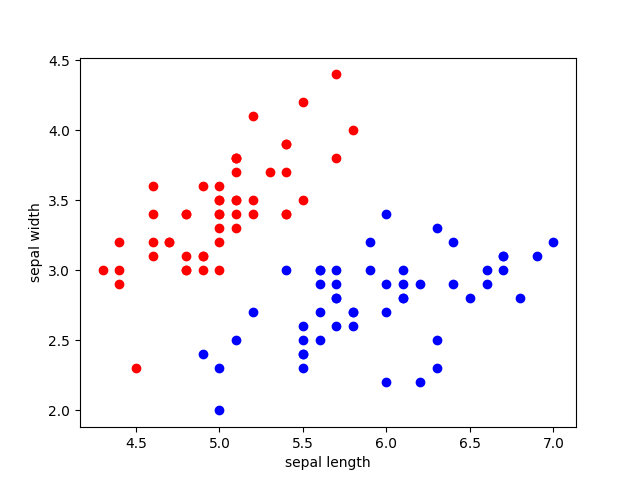
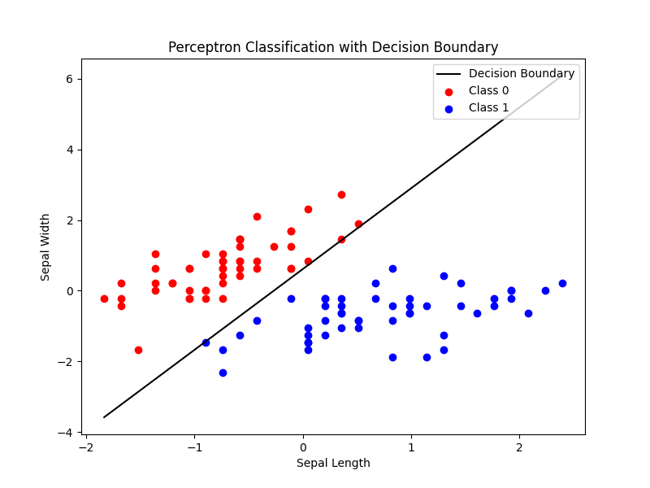

---
date:
    created: 2024-11-29
    updated: 2024-12-06
categories:
    - ML
tags:
    - Algorithm

---
# 感知机 Perceptron

讲解一下机器学习——感知机，一个比较古老的算法。

<!-- more -->

## 概述

它是Frank Rosenblatt在1957年就职于康奈尔航空实验室（Cornell Aeronautical Laboratory）时所发明的一种简单的 **人工神经网络** 。

Frank Rosenblatt给出了相应的感知机学习算法，常用的有感知机学习、最小二乘法和梯度下降法。譬如，感知机利用梯度下降法对损失函数进行极小化，求出可将训练数据进行线性划分的分离超平面，从而求得感知机模型。

感知机是生物神经细胞的简单抽象。神经细胞结构大致可分为：树突、突触、细胞体及轴突。

单个神经细胞可被视为一种只有两种状态的机器——激活时为‘是’，而未激活时为‘否’。神经细胞的状态取决于从其它的神经细胞收到的输入信号量，及突触的强度（抑制或加强）。当信号量总和超过了某个阈值时，细胞体就会激活，产生电脉冲。电脉冲沿着轴突并通过突触传递到其它神经元。

为了模拟神经细胞行为，与之对应的感知机基础概念被提出，如权量（突触）、偏置（阈值）及激活函数（细胞体）。

早期的感知机结构和 MCP 模型相似，由一个输入层和一个输出层构成，因此也被称为“单层感知机”（Single Layer Perceptron）。感知机的输入层负责接收实数值的输入向量，输出层则为1或-1两个值。单层感知机可作为一种二分类线性分类模型，结构如下：


单层感知机的模型可以简单表示为：

$$
f(x)=sign(w*x+b)
$$

对于具有 $n$ 个输入 $x_i$ 以及对应连接权重系数为 $w_j$ 的感知机，首先通过线性加权得到输入数据的累加结果（weighted sum）： $z=w_1x_1+w_2x_2+\ldots+b = X^TW$。这里 $x_1,x_2,\ldots,x_n$ 为感知机的输入，$w_1,w_2,\ldots,w_n$ 为网络的 **权重系数** ，$b$ 为偏置项(bias)。

然后将 $z$ 作为激活函数 $\Phi(\cdot)$ 的输入，这里激活函数 $\Phi(\cdot)$ 为 $sign$ 函数，其表达式为：

$$
sign(x)=\left\{\begin{array}{ll}+1&\quad x\geq0\\-1&\quad x<0\end{array}\right.
$$

$\Phi(\cdot)$ 会将 $z$ 与某一阈值（Threshold） (此例中，阈值为0) 进行比较，如果大于等于该阈值则感知器输出为 1,
否则输出为-1。

通过这样的操作，输入数据被分类为1或-1这两个不同类别。

或者使用激活函数 Heaviside 阶跃函数（Heaviside Step Function）：

$$
h(z)=
\begin{cases}
0 & \mathrm{if}z<\mathrm{Threshold} \\
1 & \mathrm{if}z\geq\mathrm{Threshold} & 
\end{cases}
$$


## 感知机示例

我们用两个输入来分类给定的水果是否是苹果：重量和颜色（0到1范围，1为红色）。

Input 1（Weight）：150 g

Input2 （Color）： 0.9

Weights：`[0.5, 1.0]`

Bias：1.5

那么感知机的加权和为：$(150*0.5)+(0.9*1.0)+1.5=76.4$。

如果激活函数的阈值为 75。 那么感知机将水果分类为苹果（output = 1）。

## 训练模型

给定一个 $n$ 维数据集，如果它可以被一个超平面完全分割，那么我们称这个数据集为线性可分数据集，否则，则为线性不可分的数据集。单层感知机只能处理 **线性可分数据集** ，其任务是寻找一个线性可分的超平面将所有的正类和负类划分到超平面两侧。单层感知机与 $MCP$ 模型在连接权重设置上是不同的，即感知机中连接权重参数并不是预先设定好的，而是通过多次迭代训练而得到的。单层感知机通过构建损失函数来计算模型预测值与数据真实值间的误差，通过最小化代价函数来优化模型参数。

其具体的训练过程为：

定义数据集，变量和参数，其中给定一个$m*n$大小的数据集，$x^0,x^1,\ldots,x^m$ 为训练样本，$x_0^m,x_1^m,\ldots,x_n^m$ 为第 $m$ 条训练样本，$d^m$ 为期望结果， $y^m$ 为实际结果，$\eta$ 为学习率，
$0<\eta<1;$

对权重系数 $w_j$ 进行初始化，初始值为随机值或全零值。同时，设置 $m=0$，读取第 0 条训练样本；

将训练样本输入到单层感知机中，根据模型公式，得到实际输出 $y$ ;

根据如下公式更新权重系数：

$$w^{m+1}=w^m+\eta[d^m-y^m]x^m$$

当满足收敛条件时，算法结束；若不满足收敛条件则输入下一条样本继续训练，即
$m=m+1$。

通常收敛条件可为：

- 误差小于某个预先设定的较小值 $\epsilon$；
- 迭代的权重系数间权值变化小于某个较小值；
- 迭代次数超过设定的最大迭代次数。


## 感知机损失函数

假设训练数据集是线性可分的，为了找出一个能够将训练数据集正实例点和负实例点完全正确分开的超平面，即确定感知机模型参数 $w$、$b$ ，需要确定一个学习策略，即定义（经验）损失函数，并将损失函数极小化。

损失函数的一个自然选择是误分类点的总数，但是这样的函数不是连续可导函数，不易优化。因此感知机采用的损失函数是误分类点到超平面的总距离。

假设直线方程为$Ax+By+C=0$,点$P$的坐标为$(x_0,y_0)$。点到直线的距离公式为

$$
d=\frac{Ax_0+By_0+C}{\sqrt{A^2+B^2}}
$$


我们假设超平面 $S$ 是 $h=w\cdot x+b$ ，样本点 $x\prime$ 到超平面的距离如下：

$$
d=\frac{w\cdot x^{\prime}+b}{\|w\|}
$$
其次，对于误分类的数据 $(x_i,y_i)$ 来说，

$$
d=\begin{cases}\frac{1}{||w||}(w\cdot x_i+b)>0,&y_i<0\\\frac{1}{||w||}(w\cdot x_i+b)<0,&y_i>0\end{cases}
$$

简化为：

$$
d=-\frac1{||w||}y_i(w\cdotp x_i+b)>0
$$

假设超平面 $S$ 的误分类点集合为 $M$ ，那么所有误分类点到超平面 $S$ 的总距离为：

$$-\frac1{\|w\|}\sum_{x_i\in M}y_i\:(w\cdot x_i+b)$$

不考虑$\frac1{\|w\|}$，就得到感知机学习的损失函数：

$$L(w,b)=-\sum_{x_i\in M}y_i\:(w\cdot x_i+b)$$

这个损失函数就是感知机学习的 **经验风险函数** 。


!!! note "为什么可不考虑$\frac1{\|w\|}$?"
    这是因为，偏置 $b$ 可以定义为 $b=w_0x_0$ ，其中 $x_0=1$ ，将 $b$ 吸收进 $w$ 里面。
    这样我们再来看总距离就变成了：

    $$
    TotalDistance = -\frac1{\|w\|}\sum_{x_i\in M}y_iw\cdot x_i
    $$

    分子和分母都含有 $w$ ,当分子的 $w$ 扩大 N 倍时，分母的 L2 范数也会扩大N倍。也就是说，分子和分母有固定的倍数关系。

    那么我们可以固定分子或者分母为 1 ，然后求分母的倒数或者分子自己的最小化作为损失函数，这样可以简化我们的损失函数。
    在感知机模型中，我们采用的是保留分子。


## 感知机学习算法

感知机学习问题就转化为了求解损失函数的最优化问题。

由于感知机学习算法是误分类驱动的，这里基于 **随机梯度下降法** （SGD）进行优化求解。即任意选取一个超平面 $(w_0, b_0)$，然后用梯度下降法不断地极小化损失函数。极小化过程中不是一次使 $M$ 中的所有误分类点的梯度下降，而是一次随机选取一个误分类点使其梯度下降。

这里不能使用基于所有样本的 **批量梯度下降** （BGD）进行优化。这是因为我们的损失函数里面有限制，只有误分类的 $M$ 集合里面的样本才能参与损失函数的优化。所以我们不能用最普通的批量梯度下降，只能采用随机梯度下降或者 **小批量梯度下降** （MBGD）。

损失函数$L(w,b)$的梯度为：

$$
\nabla_wL(w,b)=-\sum_{x_i\in M}y_ix_i
$$

$$
\nabla_bL(w,b)=-\sum_{x_i\in M}y_i
$$

随机选取一个误分类点 $(x_i,y_i)$，对 $w$,$b$ 进行更新，其中 $\eta$ 是学习率：

$$
w\leftarrow w+\eta y_ix_i
$$

$$
b\leftarrow b+\eta y_i
$$

算法步骤：

输入：训练数据集$D=\left\{(x_i,y_i)\right\}_{i=1}^m$，其中，$x_i\in\mathbf{X}\subseteq\mathbf{R}^n,y_i\in\mathbf{Y}=\{+1,-1\};$ 学习率 $\eta(0<\eta\leq1)$ 。

过程：

(1) 选取初值 $w_0,b_0$；

(2) 在训练数据集中选取数据 $(x_i,y_i)$；

(3) 判断该数据点是否为当前模型的误分类点，即判断 $y_i\left(w\cdot x_i+b\right)\leq0$ ，如果成立则是误分类点，并进行更新：

$$
w\leftarrow w+\eta y_ix_i
$$

$$
b\leftarrow b+\eta y_i
$$

(4)转到第 (2)步，直到训练集中没有误分类点。

输出：$w$、$b$；感知机模型 $f(x)=sign(w\cdot x+b)$。


## 代码构建

```python title="single_layer_perceptron.py" linenums="1"

# 构建单层感知机
import numpy as np

class Perceptron:
    def __init__(self, num_inputs, learning_rate=0.01, tol=1e-3):
        # 初始化权重，将偏置b也放入
        self.weights = np.random.rand(num_inputs + 1)
        self.learning_rate = learning_rate
        self.tol = tol

    def linear(self, inputs):
        # Z = XW + b
        Z = inputs @ self.weights[1:].T + self.weights[0]
        return Z

    @staticmethod
    def Heaviside_step_fn(z):
        return 1 if z >= 0 else -1

    def predict(self, inputs):
        Z = self.linear(inputs)
        return np.where(Z >= 0, 1, -1)

    def loss(self, X, y):
        loss = -np.sum(y * (np.dot(X, self.weights[1:]) + self.weights[0]))
        return loss

    def fit(self, X, y, num_epochs):
        for epoch in range(num_epochs):
            errors = 0  # 对误分类点计数
            for inputs, target in zip(X, y):
                prediction = self.predict(inputs)
                if prediction != target:  # 对误分类点进行更新
                    errors += 1
                    self.weights[1:] += self.learning_rate * target * inputs
                    self.weights[0] += self.learning_rate * target

            current_loss = self.loss(X, y)
            print(f"Epoch {epoch + 1}/{num_epochs}, Loss: {current_loss:.4f}, errors: {errors}")

            if errors == 0:
                print("已经没有误分类点")
                break

```

## 代码测试

通过使用比较经典的鸢尾花数据集来测试感知机模型。

```python title="single_layer_perceptron.py" linenums="1"
from sklearn.datasets import load_iris
import pandas as pd
import matplotlib.pyplot as plt
from sklearn.preprocessing import StandardScaler


if __name__ == "__main__":
    # 加载鸢尾花数据集
    iris = load_iris()
    df = pd.DataFrame(iris.data, columns=iris.feature_names)
    df['label'] = iris.target

    # 行列数据标注
    df.columns = ['sepal length', 'sepal width', 'petal length', 'petal width', 'label']
    # print (df.label.value_counts())
    print(df.head(10))

    # 数据可视化
    plt.scatter(df[:50]['sepal length'], df[:50]['sepal width'], c='red', label='0')
    plt.scatter(df[50:100]['sepal length'], df[50:100]['sepal width'], c='blue', label='1')
    plt.xlabel('sepal length')
    plt.ylabel('sepal width')
    plt.show()

    # 选择特征和标签
    data = np.array(df.iloc[:100, [0, 1, -1]])
    X, y = data[:, :-1], data[:, -1]
    y = np.array([1 if i == 1 else -1 for i in y])  # 将label中的0标签替换为-1

    # 标准化特征
    scaler = StandardScaler()
    X = scaler.fit_transform(X)

    # 创建并训练感知机模型
    perceptron = Perceptron(num_inputs=X.shape[1])
    perceptron.fit(X, y, num_epochs=100)

    # 使用整个数据集进行预测
    pred = perceptron.predict(X)

    # 计算准确度
    accuracy = np.mean(pred == y)
    print("Accuracy:", accuracy)

    # 可视化超平面
    x_points = np.linspace(X[:, 0].min(), X[:, 0].max(), 10)

    # 使用感知机权重w和偏置b计算超平面y
    y_ = -(perceptron.weights[1] * x_points + perceptron.weights[0]) / perceptron.weights[2]

    # 可视化原始数据分布和分类超平面
    plt.figure(figsize=(8, 6))
    plt.plot(x_points, y_, label="Decision Boundary", color='black')
    plt.scatter(X[:50, 0], X[:50, 1], c='red', label='Class 0')
    plt.scatter(X[50:100, 0], X[50:100, 1], c='blue', label='Class 1')
    plt.xlabel('Sepal Length')
    plt.ylabel('Sepal Width')
    plt.title('Perceptron Classification with Decision Boundary')
    plt.legend(loc='upper right')
    plt.show()
```

这是初始的鸢尾花的原始数据分布：



通过标准化后，感知机绘制成的超平面，在这里是一条直线：



且输出为：
```
Epoch 1/100, Loss: -55.4678, errors: 35
Epoch 2/100, Loss: -74.2797, errors: 20
Epoch 3/100, Loss: -84.6516, errors: 12
Epoch 4/100, Loss: -87.7660, errors: 5
Epoch 5/100, Loss: -90.3630, errors: 4
Epoch 6/100, Loss: -92.4116, errors: 3
Epoch 7/100, Loss: -92.4116, errors: 0
已经没有误分类点
Accuracy: 1.0
```
从图片也可以看出是完全将两个类区分开来了。


## 参考

[感知器](https://www.jiqizhixin.com/graph/technologies/f9849d6c-6262-4c1f-8f42-6d976be17161)

[【机器学习】感知机原理详解](https://blog.csdn.net/pxhdky/article/details/86360535)

[机器学习算法之感知机算法](https://cloud.tencent.com/developer/article/1548821)

[感知机算法-经典的二分类算法](https://juejin.cn/post/6930083353206980622)

[单层感知机](https://paddlepedia.readthedocs.io/en/latest/tutorials/deep_learning/basic_concepts/single_layer_perceptron.html)

[What is Perceptron | The Simplest Artificial neural network](https://www.geeksforgeeks.org/what-is-perceptron-the-simplest-artificial-neural-network/)

[感知机](http://www.tup.tsinghua.edu.cn/upload/books/yz/094645-01.pdf)
