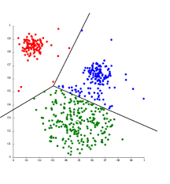
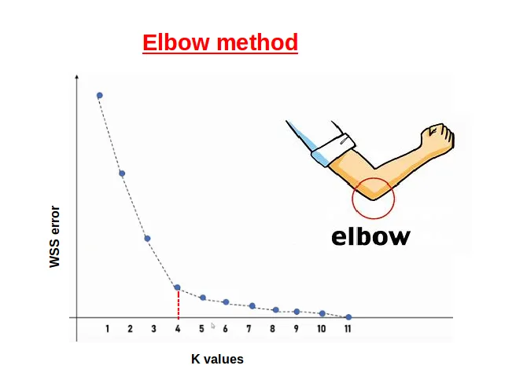
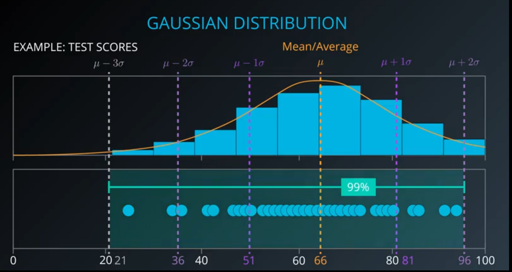
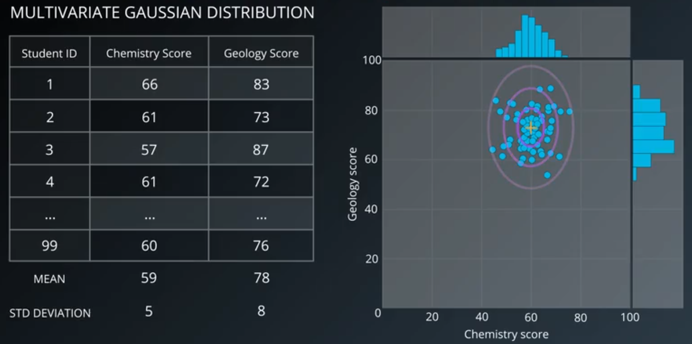
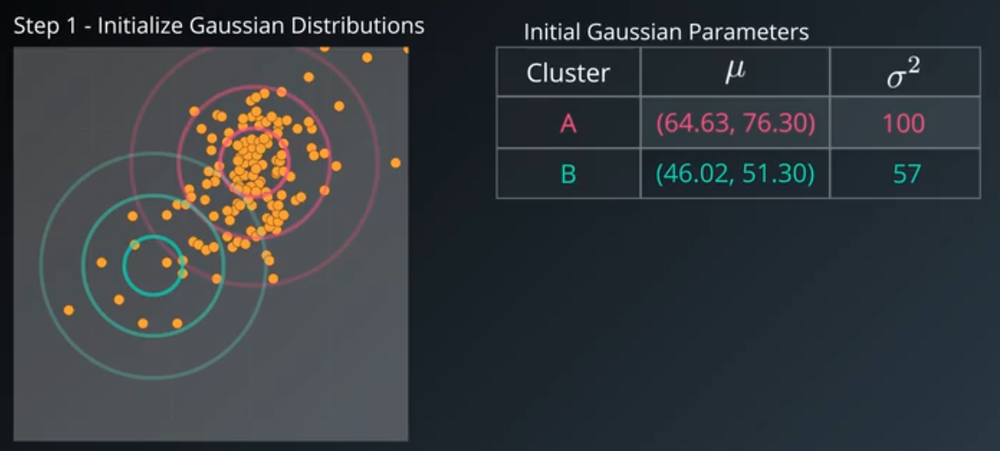
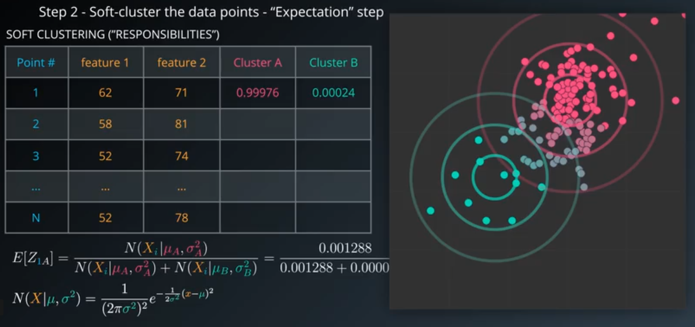
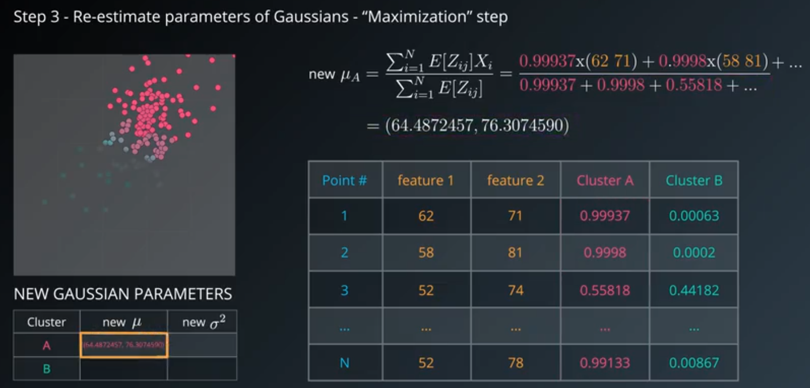
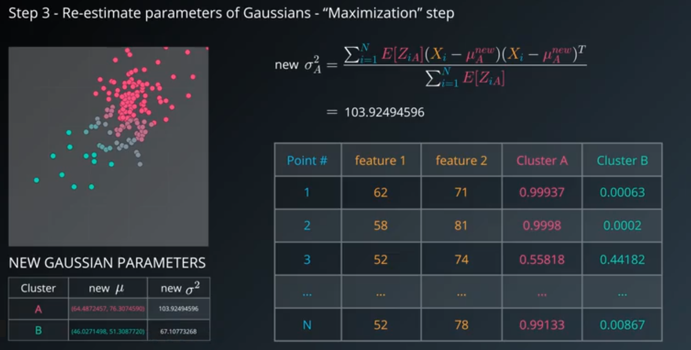

---
date:
    created: 2024-11-18
    updated: 2024-11-23
categories:
    - ML
tags:
    - ML
    - Math
    - Algorithm
---
# 聚类算法及数据处理系统的设计与实现

以混合算法GMM与K-Means算法为例，了解聚合算法，以及对数据处理系统的相关设计与处理。
<!-- more -->

## 聚类算法

聚类是一种<mark>无监督</mark>的机器学习算法，可根据相似性或模式将不同的对象、数据点或观察结果组织和分类为不同的组或聚类。

按照某一个特定的标准将一个数据集分割成不同的类或者簇，使得同一个簇内的数据对象的特征相似度尽可能大，同时不在一个簇中的数据对象的差异性也尽可能大。

如图，聚类将下面的数据分为三类，以不同的颜色标出：



主流聚类算法：

- 划分聚类（Partitioning Clustering）

划分聚类算法会给出一系列扁平结构的簇（分开的几个类），他们之间没有任何显式的结构来表明彼此的相关性。
常见的算法有：K-Means/K-Medoids、Gaussian Mixture Model（高斯混合模型）、Spectral Clustering（谱聚类）、Centroid-based Clustering

- 层次聚类（Hierarchical Clustering）

层次聚类会输出一个具有层次结构的簇集合，因此能够比划分聚类输出的无结构簇集合提供更丰富的信息。层次聚类可以认为是是嵌套的划分聚类。
常见的算法有：Single-linkage、Complete-linkage、Connectivity-based Clustering等。

## K-means算法

K-means(k均值)算法是聚类算法中一个非常基础的算法，同时应用也十分广泛。

### 核心概念
聚类算法要把$n$个数据点按照分布分成$K$类（很多算法的K是人为提前设定的）。我们希望通过聚类算法，而得到$K$个中心点，以及每个数据点属于哪个中心点的范围内。
- 中心点可以通过迭代算法来找到，满足条件：所有的数据点到聚类中心的距离之和是最小的。
- 中心点确定后，每个数据点属于离它最近的中心点。

!!! info "要解决的几个前置小问题"
    1.数据点到中心点的距离如何计算？
    
    一般选择几何距离，L2距离的平方。
    > L2距离即欧几里得距离

    2.中心点是否唯一，也就是说是否存在全局唯一最优解？

    对于多个中心点的情况，全局最优是一个相当难的问题。理论上存在一个全局最优解，但是不一定能找到。既然全局最优解不好找，那我们退而求其次，看能不能找到局部最优解。

    3.聚类结果该如何表示？

    采用空间分割的方式：将空间分割成多个多边形，每个多边形对应一个 cluster中心。

### 算法步骤
K-means采用的是 **EM算法** 迭代确定中心点（cluster centroids），具体流程分两步：

1. **更新中心点**：初始化的时候以随机取点作为起始点；迭代过程中，取同一类的所有数据点的重心（或质心）作为新中心点。
2. **分配数据点**：把所有的数据点分配到离它最近的中心点。

重复上述的两个步骤，直到中心点不再改变为止。

### 损失函数
K-means最小化问题，是要最小化所有数据点与其所关联的中心点之间的距离之和，因此K-means的代价函数（又称畸变函数Distortion Function）为：

$$
\text{SSE} = \sum_{i=1}^{K} \sum_{x \in S_i} ||x - \mu_i||^2
$$

其中：

- $K$ 是簇的数量。
- $S_i$ 是第 $i$ 个簇中的数据点集合。
- $x$ 是簇 $S_i$ 中的一个数据点。
- $\mu_i$ 是簇 $S_i$ 的中心（质心）。
- $||x - \mu_i||$ 是数据点 $x$ 与簇中心 $\mu_i$ 之间的欧氏距离。

> K-means算法的损失函数是簇内平方误差之和（Sum of Squared Errors, SSE），也称为簇内距离之和

### k值的选择
在进行K-means算法之前，我们首先要进行随机初始化所有的中心点。

而有个问题在于，它有可能会停留在一个局部最优值，这取决于初始化的状况。

为了解决这个问题，我们通常需要多次运行 K-means 算法，每一次都重新进行随机初始化，最后再比较多次运行 K-means 的结果，选择代价函数最小的结果。这种方法在k较小的时候（2–10）还是可行的，但是如果k较大，这么做也可能不会有明显地改善。

接下来讲解一下 **肘部法则(Elbow Method)** 方法来选择k：

这是一种直观的方法，通过观察SSE随k值增加而减少的变化趋势来选择k。

对不同的k值运行K-means算法，计算每一个k值对应的SSE。

绘制k值与SSE的关系图，选择SSE下降速度明显减缓的点作为k的值，而这个点通常看起来像一个“肘部”。




### 总代码
```python title="k-means.py" linenums="1"
import numpy as np
from collections import defaultdict
import random
import matplotlib.pyplot as plt
import pandas as pd
from sklearn.metrics import adjusted_rand_score


def load_data(file_path):
    df = pd.read_csv(file_path)
    if 'class' in df.columns:
        labels = df['class']  # 提取标签
        features = df.drop(columns=['class'])  # 去除class列
    else:
        labels = df.iloc[:, -1]
        features = df.iloc[:, :-1]
    return features.to_numpy(), labels.to_numpy()


class KMeans:
    def __init__(self, k, max_iter=100, tol=1e-4):
        self.k = k
        self.max_iter = max_iter
        self.tol = tol
        self.centroids = []
        self.clusters = defaultdict(list)
        self.labels = []

    def init_centroids(self, data):
        self.centroids = random.sample(list(data), self.k)

    def assign_clusters(self, data):
        self.clusters = defaultdict(list)
        self.labels = []
        for point in data:
            distances = [np.linalg.norm(point - centroid) for centroid in self.centroids]
            closest_centroid = np.argmin(distances)
            self.clusters[closest_centroid].append(point)
            self.labels.append(closest_centroid)

    def update_centroids(self):
        new_centroids = []
        for cluster in self.clusters.values():
            if cluster:
                new_centroids.append(np.mean(cluster, axis=0))
            else:
                new_centroids.append(random.choice(self.centroids))

        return new_centroids

    def calculate_sse(self):
        sse = 0
        for idx, cluster in self.clusters.items():
            sse += sum(np.linalg.norm(point - self.centroids[idx])**2 for point in cluster)
        return sse

    def fit(self, data):
        self.init_centroids(data)
        previous_sse = float('inf')  # 初始设置为无穷大
        for _ in range(self.max_iter):
            self.assign_clusters(data)  # 更新数据点的簇分配
            new_centroids = self.update_centroids()  # 计算新的中心点
            self.centroids = new_centroids  # 更新中心点

            current_sse = self.calculate_sse()  # 计算当前的 SSE
            print(f"Iteration {_ + 1}, SSE: {current_sse:.4f}")

            # 检查 SSE 是否减少
            if abs(previous_sse - current_sse) < self.tol:  # 如果 SSE 收敛
                print("Converged based on SSE.")
                break
            previous_sse = current_sse  # 更新 SSE

        return self.centroids, self.labels

# 可视化
def plot_clusters(data, labels, centroids):
    colors = ['r', 'g', 'b', 'c', 'm', 'y', 'k']
    data = np.array(data)
    for idx in range(len(centroids)):
        cluster_points = data[np.array(labels) == idx]
        plt.scatter(cluster_points[:, 0], cluster_points[:, 1], color=colors[idx % len(colors)], alpha=0.5)
    centroids = np.array(centroids)
    plt.scatter(centroids[:, 0], centroids[:, 1], color='black', marker='x', s=100)
    plt.title("K-means Clustering")
    plt.show()


def plot_elbow_method(data, max_k=7):
    sse_values = []
    for k in range(1, max_k + 1):
        kmeans = KMeans(k=k)
        kmeans.fit(data)
        sse = kmeans.calculate_sse()
        sse_values.append(sse)
        print(f"k={k}, SSE={sse:.2f}")

    plt.figure(figsize=(8, 5))
    plt.plot(range(1, max_k + 1), sse_values, marker='o', linestyle='--')
    plt.title("Elbow Method for Optimal k")
    plt.xlabel("Number of Clusters (k)")
    plt.ylabel("Sum of Squared Errors (SSE)")
    plt.xticks(range(1, max_k + 1))
    plt.grid()
    plt.show()


# 主程序
file_path = '../data/dataset/Aggregation.csv'
data, true_labels = load_data(file_path)

plot_elbow_method(data, max_k=6)

kmeans = KMeans(k=3)  # 假设有6个簇
centroids, predicted_labels = kmeans.fit(data)

# 计算聚类质量
adjusted_rand = adjusted_rand_score(true_labels, predicted_labels)
print(f"Adjusted Rand Index (ARI): {adjusted_rand:.2f}")

# 可视化结果（仅二维数据适用）
if data.shape[1] == 2:
    plot_clusters(data, predicted_labels, centroids)


```

## 高斯混合模型(GMM)

### 高斯分布

高斯分布（Gaussian Distribution），又称 **正态分布** （Normal Distribution），是概率统计中最重要的一种分布，因德国数学家 **卡尔·弗里德里希·高斯** 而得名。它是许多自然现象和统计过程的理论基础，常用于描述数据的分布特性。

#### 高斯分布的 **概率密度函数**（PDF）

高斯分布的概率密度函数定义如下：

$$
f(x | \mu, \sigma^2) = \frac{1}{\sqrt{2 \pi \sigma^2}} \exp\left(-\frac{(x - \mu)^2}{2 \sigma^2}\right)
$$

- $x$：随机变量
- $\mu$：均值，决定分布的中心位置
- $\sigma^2$：方差，决定分布的宽度
- $\sigma$：标准差（标准差是方差的平方根）

#### 特性

1. **对称性**：正态分布是关于均值 $\mu$ 对称的。
2. **单峰性**：在均值处达到最大值，是一个单峰分布。
3. **68-95-99.7 法则**：对于标准正态分布，数据分别有约 68%、95% 和 99.7% 的概率落在 $[ \mu \pm \sigma ]$、$[ \mu \pm 2\sigma ]$、$[ \mu \pm 3\sigma ]$ 范围内。
4. **无界性**：正态分布的值域是整个实数轴，虽然概率密度远离均值时会趋于零，但理论上并不为零。

一维高斯分布




多维高斯分布（Multivariate gaussian distribution）




#### 标准正态分布

标准正态分布是正态分布的一种特殊情况，均值 $\mu = 0$，标准差 $\sigma = 1$。其概率密度函数为：

$$
f(x) = \frac{1}{\sqrt{2 \pi}} \exp\left(-\frac{x^2}{2}\right)
$$

通常用 $Z$ 表示标准正态分布中的随机变量。

#### 应用

1. **数据建模**：描述实际数据的分布，例如身高、体重等。
2. **统计推断**：假设检验、区间估计等。
3. **机器学习**：用于生成随机数据、特征标准化（归一化）、高斯朴素贝叶斯等。
4. **信号处理**：噪声通常假设为高斯分布。

### 算法步骤

高斯混合模型聚类（Gaussian Mixture Model Clustering）


**Step #1: 初始化K个高斯分布（Initialize K Gaussian Distributions）**

协方差类型（Covariance_type）:

- Spherical
- Full

初始化（Initialization）:

- Manual
- k-means



**Step #2： Soft-Cluster Data - “Expection”**



**Step #3： Re-Estimate The Gaussians - “Manximization”**






**Step #4： Evaluate Log-likelihood to check for convergence**

$$
\ln p\left(X \mid \mu, \sigma^2\right)=\sum_{i=1}^N \ln \left(\sum_{k=1}^K \pi_k N\left(X_i \mid \mu_k, \sigma_k^2\right)\right)
$$

**Repeat from Step #2 until converged**


### 算法实现


### 概况
优势

- 软聚类Soft-clustering(样本可以属于多个簇sample membership of multiple clusters)
- 簇形状的灵活性Cluster shape flexibility

缺点

- 对初始值敏感 Sensitive to initialization values
- 可能会收敛到局部最优解 Possible to coverge to a local optimum
- 收敛速度慢 Slow convergence rate


## 两种聚类算法的性能比较


## 数据处理系统的设计与实现

目的：编写一个数据接受功能，能够接受`json`、`excel`、`csv`的功能。

### 数据存储格式

一、Excel

Excel是一种电子表格软件，以`.xlsx/.xls`格式存储数据。它通过行和列的交叉点来组织和存储数据，支持公式、图表和格式选项等功能，提供了强大的数据分析和处理功能。Excel的可视化程度高，支持图表和图像的生成，方便数据可视化和展示。在实际应用中，Excel广泛应用于办公和数据处理，如财务分析、销售报表等。

**文件格式**

`.xls`文件底层是二进制组成，基于Compound Binary File Format（CBF）的封闭文件格式，`.xlsx`文件底层是由各个`xml`文件组成的，以便更好地与其他软件和平台进行互操作。

**文件大小**

由于xlsx文件使用基于ZIP的压缩技术，因此它通常比xls文件更小。这意味着在传输和存储方面，xlsx文件更具优势。然而，在Excel2003及更早版本中，xls文件的处理速度通常比xlsx文件更快。

**兼容性**

xlsx文件具有更好的兼容性，因为它是基于开放标准的文件格式。这意味着它可以在其他支持XML和ZIP的应用程序中打开和编辑。然而，xls文件仅限于在Microsoft Excel中打开和编辑，在其他应用程序中可能会遇到兼容性问题。


示例：

|  name   |   age   |  department    |
| ---- | ---- | ---- |
|   John   |   30   |   Engineering   |
|    Jane   |   25   |   Marketing   |
|   Alice   |   35   |   Human Resources   |
|   Bob   |   40   |   Finance   |

二、CSV

CSV（Comma-Separated Values，逗号分隔值）格式是一种以纯文本形式存储表格数据的简单文件格式。其中逗号作为字段分隔符，不支持多个表格和复杂数据类型，常用扩展名为.csv。CSV格式直接以文本文件形式存储数据，没有特殊类型、格式和样式，因此文件体积小、读取速度快、易读易写、跨平台通用，适合存储简单数据和进行数据迁移等操作。在实际应用中，CSV格式常用于数据交换和备份。

示例：
```csv title="example.csv"
name,age,department
John Doe,30,Engineering
Jane Smith,25,Marketing
Alice Brown,35,Human Resources
Bob White,40,Finance
```


三、JSON

JSON（JavaScript Object Notation，JavaScript 对象表示法）是一种轻量级的数据交换格式。它常用于前后端数据传输，其数据格式为键值对，常用扩展名为.json。JSON具有语法简单、易于读写和跨平台兼容等优点，因此在Web开发中广泛使用。在实际应用中，JSON可以用于数据交换、配置文件和数据持久化等场景。

示例：
```json title="example.json"
{
    "employees": [
        {
            "name": "John Doe",
            "age": 30,
            "department": "Engineering"
        },
        {
            "name": "Jane Smith",
            "age": 25,
            "department": "Marketing"
        }
    ],
    "company": "TechCorp",
    "location": "New York"
}
```

### 算法实现

```python title="data_loader.py"
class DataLoader:
    @staticmethod
    def read_json(file_path):
        """读取JSON文件"""
        data = {}
        try:
            with open(file_path, "r", encoding='utf-8') as f:
                content = f.read()
                data = DataLoader.parse_json(content)
        except Exception as e:
            print(f"Error reading JSON file {file_path}: {e}")
        return data

    @staticmethod
    def parse_json(content):
        """实现一个简单的JSON解析器"""
        import re
        import ast
        content = re.sub(r'//.*', '', content)  # 删除注释
        return ast.literal_eval(content)

    @staticmethod
    def read_excel(file_path):
        """读取简单Excel文件"""
        import pandas as pd
        try:
            df = pd.read_excel(file_path)
            data = df.values.tolist()
            return data
        except Exception as e:
            print(f"Error reading Excel file {file_path}: {e}")

    @staticmethod
    def read_csv(file_path):
        """读取CSV文件"""
        data = []
        try:
            with open(file_path, "r", encoding='utf-8') as f:
                for line in f:
                    line = line.strip()
                    if line:
                        data.append(line.split(','))
        except Exception as e:
            print(f"Error reading CSV file {file_path}: {e}")

        return data

    @staticmethod
    def load_data(file_path):
        """根据文件类型加载数据"""
        if file_path.endswith('.json'):
            return DataLoader.read_json(file_path)
        if file_path.endswith('.xls') or file_path.endswith('.xlsx'):
            return DataLoader.read_excel(file_path)
        if file_path.endswith('.csv'):
            return DataLoader.read_csv(file_path)


if __name__ == '__main__':
    json_data = DataLoader.load_data('../data/example.json')
    print(json_data)
    xls_data = DataLoader.load_data('../data/example.xls')
    print(xls_data)
    xlsx_data = DataLoader.load_data('../data/example.xlsx')
    print(xlsx_data)
    csv_data = DataLoader.load_data('../data/example.csv')
    print(csv_data)

```

## 资料参考与数据来源

[图解机器学习|聚类算法详解](https://www.showmeai.tech/article-detail/197)

[聚类算法数据集资源](https://gitcode.com/open-source-toolkit/f4a24/overview)

- Iris鸢尾花数据集
- Wine葡萄酒数据集
- Seed小麦种子数据集
- glass数据集
- WDBD乳腺癌数据集
- 人工数据集（Flame、Spiral等）

[XLSX vs XLS：了解Excel文件格式的差异与优势](https://cloud.tencent.com/developer/news/1224037)

[.xls 和 .xlsx的区别是什么？底层原理是什么？](https://blog.csdn.net/qq_36777143/article/details/131087742)

[非监督学习之高斯混合模型GMM](https://www.bilibili.com/video/BV1KJ411U7cP)