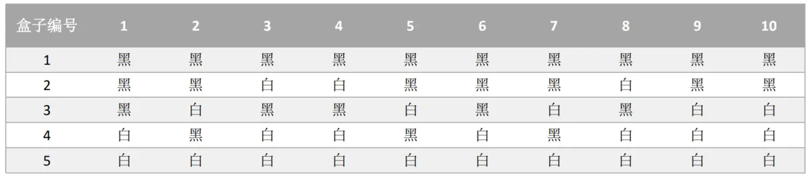
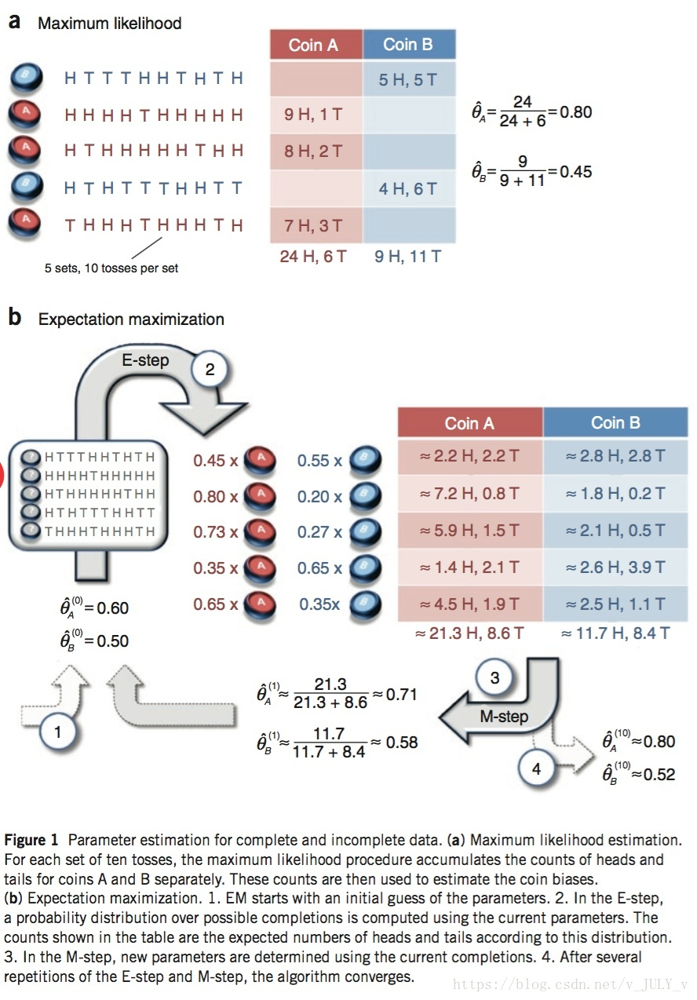
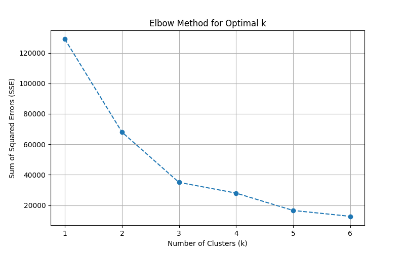
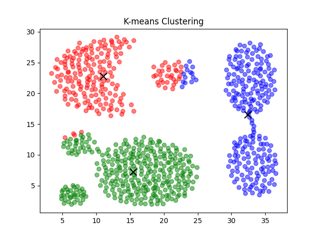
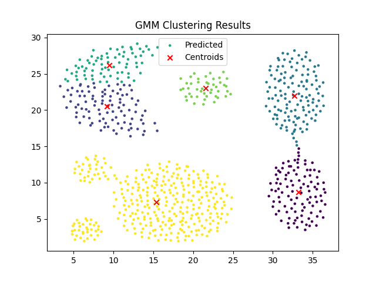

---
date:
    created: 2024-11-18
    updated: 2024-11-23
readtime: 120
categories:
    - ML
tags:
    - ML
    - Math
    - Algorithm
---
# 聚类算法及数据处理系统的设计与实现

以混合算法GMM与K-Means算法为例，了解聚合算法，以及对数据处理系统的相关设计与处理。
<!-- more -->

## 聚类算法

聚类是一种<mark>无监督</mark>的机器学习算法，可根据相似性或模式将不同的对象、数据点或观察结果组织和分类为不同的组或聚类。

按照某一个特定的标准将一个数据集分割成不同的类或者簇，使得同一个簇内的数据对象的特征相似度尽可能大，同时不在一个簇中的数据对象的差异性也尽可能大。

如图，聚类将下面的数据分为三类，以不同的颜色标出：


主流聚类算法：

- 划分聚类（Partitioning Clustering）

划分聚类算法会给出一系列扁平结构的簇（分开的几个类），他们之间没有任何显式的结构来表明彼此的相关性。
常见的算法有：K-Means/K-Medoids、Gaussian Mixture Model（高斯混合模型）、Spectral Clustering（谱聚类）、Centroid-based Clustering

- 层次聚类（Hierarchical Clustering）

层次聚类会输出一个具有层次结构的簇集合，因此能够比划分聚类输出的无结构簇集合提供更丰富的信息。层次聚类可以认为是是嵌套的划分聚类。
常见的算法有：Single-linkage、Complete-linkage、Connectivity-based Clustering等。

## 最大似然估计/极大似然估计（MLE）

### 似然函数

似然函数（Likelihood Function）是统计学中的一个基本概念，它描述了在给定一组参数下，观测到特定数据的概率。似然函数是概率密度函数（或概率质量函数）的函数，但其参数和数据的角色是互换的。具体来说，似然函数 $L(\theta; x)$ 是在参数 $\theta$ 下，观测数据 $x$ 出现的概率，即 $L(\theta; x) = f(x; \theta)$，其中 $f(x; \theta)$ 是概率密度函数（或概率质量函数）。

在最大似然估计中，我们通过最大化似然函数来找到最有可能产生观测数据的参数值。似然函数的值越大，表示在给定参数下，观测到当前数据的概率越高。

似然函数的定义如下：

$$
L(\theta; x) = f(x; \theta)
$$

其中 $x$ 是观测到的数据，$\theta$ 是模型的参数，$f(x; \theta)$ 是概率密度函数（或概率质量函数）。

似然函数举例：已知样本 $X$ ,求参数 $\theta$

自从Google的围棋机器人AlphaGo通过4:1战胜人类世界冠军李世石之后，人工智能的大潮便一发不可收拾，在无人驾驶、人脸识别、安防监控、医疗影像等各领域掀起浪潮，而专注教育的七月在线也已于2017年年底累积了10万AI学员。

假定我们需要统计七月在线10万学员中男生女生的身高分布，怎么统计呢？考虑到10万的数量巨大，所以不可能一个一个的去统计。那么自然而然想到随机抽样，从10万学员中随机抽取100个男生，100个女生，然后依次统计他们各自的身高。

对于这个问题，我们通过数学建模抽象整理下：

1.首先我们从10万学员中抽取到100个男生/女生的身高，组成样本集 $X$，$X=\{x1,x2,...,x^N\}$,其中 $xi$ 表示抽到的第 $i$ 个人的身高，$N$ 等于100，表示抽到的样本个数。

2.假定男生的身高服从正态分布$N(\mu_1,\sigma_1^2)$，女生的身高则服从另一个正态分布：$N(\mu_2,\sigma_2^2)$

3.但是这两个分布的均值 $u$ 和方差$\sigma^2$都不知道,设为未知参数$θ=[u, \sigma]T$

4.现在需要用极大似然法(MLE),通过这100个男生或100个女生的身高结果，即样本集X来估计两个正态分布的未知参数 $θ$,问题定义相当于已知 $X$ ，求 $θ$ ,换言之就是求 $p(θ|x)$

因为这些男生的身高是服从同一个高斯分布 $p(x|\theta)$的。 那么抽到男生A的身高的概率是 $p(x_A|\theta)$，抽到男生B的概率是 $p(x_B|\theta)$，考虑到他们是独立的，所以同时抽到男生A和男生B的概率是 $p(x_A|\theta) * p(x_B|\theta)$。

同理，我从分布是 $p(x|\theta)$ 的总体样本中同时抽到这100个男生样本的概率，也就是样本集 $X$ 中100个样本的联合概率（即它们各自概率的乘积），用下式表示：

$$
L(\theta)=L(x_1,\cdots,x_n;\theta)=\prod_{i=1}^np(x_i;\theta),\theta\in\Theta.
$$

有的文章中会使用这个表示 $p(x|\theta)$，有的是文章会使用 $p(x;\theta)$，两者含义是一样的。如果使用Bayes公式的话，用前者表示 $p(x|\theta)$ 更好。

在七月在线那么多男学员中，我一抽就抽到这100个男生，而不是其他人，那说明在整个学校中这100个人（的身高）出现的概率最大，这个概率就是上面这个似然函数 $L(\theta)$，怎么做到的呢？换言之， 怎样的 $\theta$ 能让 $L(\theta)$ 最大？

假定我们找到一个参数 $\hat{\theta}$，能使似然函数 $L(\theta)$ 最大(也就是说抽到这100个男生的身高概率最大),则 $\hat{\theta}$ 应该是“最可能”的参数值，相当于 $\theta$ 的极大似然估计量。记为：

$$
\hat{\theta}=\arg\max l(\theta)
$$


这里的 $L(\theta)$ 是连乘的，为了便于分析，我们可以定义 **对数似然函数** ，将其变成连加的：

$$
H(\theta)=\ln L(\theta)=\ln\prod_{i=1}^np(x_i;\theta)=\sum_{i=1}^n\ln p(x_i;\theta)
$$

现在需要使 $\theta$ 的似然函数 $L(\theta)$ 极大化，然后极大值对应的θ就是我们的估计。

对于求一个函数的极值，通过我们在本科所学的微积分知识，最直接的设想是求导，然后让导数为 $0$，那么解这个方程得到的 $θ$ 就是了（当然，前提是函数 $L(θ)$ 连续可微）。

但，如果θ是包含多个参数的向量那怎么处理呢？当然是求 $L(θ)$ 对所有参数的偏导数，也就是梯度了，从而 n 个未知的参数，就有 n 个方程，方程组的解就是似然函数的极值点了，最终得到这 n 个参数的值。


### 定义

最大似然估计(Maximum Likelihood Estimati) 就是利用已知的样本结果，反推最有可能(最大概率)导致这样结果的参数值的计算过程。

直白来讲，就是给定了一定的数据，假定知道数据是从某种分布中随机抽取出来的，但是不知道这个分布具体的参数值，即“模型已定，参数未知”，MLE就可以用来估计模型的参数。

MLE的目标是找出一组参数(模型中的参数)，使得模型产出观察数据的概率最大。


### 例子

假定盒子中有黑白两种球，数目未知，黑白球比例也未知，现只知道随机的十次有放回的抽样情况，求各个盒子中抽取出白球的概率？



MLE求解过程：

1、编写似然函数(即联合概率函数) 

2、对似然函数取对数，并整理

3、求导数

4、解似然方程


盒子中只有黑球和白球，假定白球的比例为p，那么黑球的比例为1-p。

因为采取的是有放回的随机抽取，那么每次抽取出来的球的颜色服从同一独立分布情况，即每次抽取之间是独立互不影响的。

$$
\begin{aligned}
 & L\left(X;p\right)=P\left(x_{1},x_{2},x_{3},x_{4},x_{5},x_{6},x_{7},x_{8},x_{9},x_{10};p\right)=\prod_{i=1}^{10}P\left(x_{i};p\right) 
\end{aligned}
$$

$$
l\left(p\right)=\ln\left(L\left(X;p\right)\right)=\sum_{i=1}^{10}\ln P\left(x_{i};p\right)
$$

$$
\frac{\partial l}{\partial p}=0 -> p=?
$$

求解盒子1中抽取出白球的概率：

左—求联合概率 中-取对数 右-求极值

$$
L(X;p)=
\begin{pmatrix}
1-p
\end{pmatrix}^{10}\quad l
\begin{pmatrix}
p
\end{pmatrix}=10\ln
\begin{pmatrix}
1-p
\end{pmatrix}\xrightarrow{0\leq p\leq1}p=0
$$

求解盒子2中抽取出白球的概率：

左-求联合概率 中-取对数 右-求导并求极值

$$
\begin{aligned}
L(X;p) & =p^{3}\left(1-p\right)^{7}\quad l\left(p\right)=3\ln p+7\ln\left(1-p\right)\quad\frac{\partial l}{\partial p}=\frac{3}{p}-\frac{7}{1-p} \\
 & \xrightarrow{\frac{\partial l}{\partial p}=0}p=0.3
\end{aligned}
$$

同理，求解出其他盒子的抽出白球的概率，盒子3、盒子4和盒子5的p分别为0.5、0.7、1。

## EM 算法

最大期望算法(Expectation Maximization Algorithm，又译期望最大化算法)，是一种迭代算法，用于含有隐变量(hidden variable)的概率参数模型的最大似然估计或极大后验概率估计。

在统计计算中，最大期望(EM)算法是在概率(probabilistic)模型中寻找参数最大似然估计或者最大后验估计的算法，其中概率模型依赖于无法观测的隐藏变量(Latent Variable)。

最大期望经常用在机器学习和计算机视觉的数据聚类(Data Clustering)领域。

### 隐变量

未观测变量的学名是“隐变量”（latent variable）。

EM算法是常用的估计参数隐变量的利器，它是一种迭代式的方法，其基本思想是：

若参数θ已知，则可根据训练数据推断出最优隐变量Z的值(E步)；反之，若Z的值已知，则可以方便地对参数θ做极大似然估计(M步)。

于是，以初始值 $\theta_0$ 为起点，可迭代执行以下步骤直至收敛：

1.基于 $\theta_t$ 推断隐变量Z的期望，记为 $Z_t$ ;

2.基于已观测变量 $X$ 和 $Z_t$ 对参数 $θ$ 做极大似然估计，记为 $θ_{t+1}$

### 抛硬币例子

Nature Biotech在他的一篇EM tutorial文章 《Do， C. B.，& Batzoglou， S. (2008). What is the
expectation maximization algorithm？. Nature biotechnology，26（8)，897.》 中，用了一个投硬币的例子来讲EM算法的思想。




我们现在考虑两个抛硬币的例子：

给定两个硬币A和B，随机抛掷后正面朝上概率分别记为 ‘p’ 和 ‘q’。每次随机选择一个硬币并投掷。

有以下观察序列：

```
HA HA TB TA TB HB HB TA HB HA TA TA HA HB HA TB
```
从给定数据估计出’p’和’q’的值”。

我们很容易计算出

p = 所有A的正面/所有A的投掷 = 5/9，

同理

q = 所有B的正面/所有B的投掷 = 4/7

这很容易计算，因为计算未知参数所需的所有信息都是可获得的。

但是，如果硬币上的标签(A和B)被隐藏起来,不知道每次投掷哪个硬币。

鉴于A和B硬币同样可能被选中，那我们如何估计未知参数’p’和’q’?

我们将尝试通过多次迭代计算来解决问题。

在每次迭代中，我们有两个步骤，’E’步骤和’M’步骤。

“E”步骤（期望）：

- 首先初始化p和q的值(初始猜测)。

- 我们不是说掷硬币来自特定的硬币，而是说它以概率为’x’来自硬币A，来自硬币B概率’1-x’。

- 计算每枚硬币的正反期望数量。

“M”步骤（最大化）：

- 从“E”步骤计算步骤3中每个硬币的正反期望的对数似然，类似于MLE计算。

- 最大似然估计出隐变量，并重新估计p和q的新值

- 使用新的p和q值重复“E”步骤，直到它收敛为止。

### 隐藏变量

现在我们抹去每轮投掷时使用的硬币标记，如下：

| 硬币    | 结果       | 统计    |
| :------ | :--------- | :------ |
| Unknown | 正正反正反 | 3正-2反 |
| Unknown | 反反正正反 | 2正-3反 |
| Unknown | 正反反反反 | 1正-4反 |
| Unknown | 正反反正正 | 3正-2反 |
| Unknown | 反正正反反 | 2正-3反 |

好了，现在我们的目标没变，还是估计P1和P2，要怎么做呢？

显然，此时我们多了一个隐变量z，可以把它认为是一个5维的向量（z1,z2,z3,z4,z5)，代表每次投掷时所使用的硬币，比如z1，就代表第一轮投掷时使用的硬币是1还是2。但是，这个变量z不知道，就无法去估计P1和P2，所以，我们必须先估计出z，然后才能进一步估计P1和P2。

但要估计z，我们又得知道P1和P2，这样我们才能用最大似然概率法则去估计z，这不是鸡生蛋和蛋生鸡的问题吗，如何破？

答案就是先随机初始化一个P1和P2，用它来估计z，然后基于z，还是按照最大似然概率法则去估计新的P1和P2，如果新的P1和P2和我们初始化的P1和P2一样，请问这说明了什么？

这说明我们初始化的P1和P2是一个相当靠谱的估计！

就是说，我们初始化的P1和P2，按照最大似然概率就可以估计出z，然后基于z，按照最大似然概率可以反过来估计出P1和P2，当与我们初始化的P1和P2一样时，说明是P1和P2很有可能就是真实的值。

这里面包含了两个交互的最大似然估计。

如果新估计出来的P1和P2和我们初始化的值差别很大，怎么办呢？就是继续用新的P1和P2迭代，直至收敛。

> 我们先预估一个值，如果我们用最大似然概率计算，发现符合说明我们就猜对了。如果不对，迭代到收敛。

### EM初级版

**E-假设阶段**

先随便给P1和P2赋一个值，比如：

P1 = 0.2 P2 = 0.7

然后，我们看看第一轮抛掷最可能是哪个硬币。

如果是硬币1，得出3正2反的概率为 `0.2*0.2*0.2*0.8*0.8 = 0.00512`

如果是硬币2，得出3正2反的概率为 `0.7*0.7*0.7*0.3*0.3 = 0.03087`

然后依次求出其他4轮中的相应概率。

<table>
	<tbody>
		<tr>
			<th>轮数</th>
			<th>若是硬币1</th>
			<th>若是硬币2</th>
		</tr>
		<tr>
			<td>1</td>
			<td>0.00512</td>
			<td>0.03087</td>
		</tr>
		<tr>
			<td>2</td>
			<td>0.02048</td>
			<td>0.01323</td>
		</tr>
		<tr>
			<td>3</td>
			<td>0.08192</td>
			<td>0.00567</td>
		</tr>
		<tr>
			<td>4</td>
			<td>0.00512</td>
			<td>0.03087</td>
		</tr>
		<tr>
			<td>5</td>
			<td>0.02048</td>
			<td>0.01323</td>
		</tr>
	</tbody>
</table>

**M-ELM 重新计算概率阶段**

按照最大似然法则：

第1轮中最有可能的是硬币2
第2轮中最有可能的是硬币1
第3轮中最有可能的是硬币1
第4轮中最有可能的是硬币2
第5轮中最有可能的是硬币1

我们就把上面的值作为z的估计值。

然后按照最大似然概率法则来估计新的P1和P2。

```
P1 = （2+1+2）/ 15 = 0.33 
P2 =（3+3）/ 10 = 0.6
```
设想我们是全知的神，知道每轮抛掷时的硬币就是如本文第001部分标示的那样，那么，P1和P2的最大似然估计就是0.4和0.5（下文中将这两个值称为P1和P2的真实值）。

那么对比下我们初始化的P1和P2和新估计出的P1和P2：

```
初始化的P1 0.2 
估计出的P1      0.33 
真实的P1 0.4 
初始化的P2      0.7 
估计出的P2      0.6 
真实的P2        0.5
```
我们估计的P1和P2相比于它们的初始值，更接近它们的真实值了！

可以期待，我们继续按照上面的思路，用估计出的P1和P2再来估计z，再用z来估计新的P1和P2，反复迭代下去，就可以最终得到P1 = 0.4，P2=0.5，此时无论怎样迭代，P1和P2的值都会保持0.4和0.5不变，于是乎，我们就找到了P1和P2的最大似然估计。

!!! note "反思"
    Question1：新估计出的P1和P2一定会更接近真实的P1和P2？
    没错，一定会更接近真实的P1和P2，数学可以证明，参见 [EM 完整推导过程](https://www.cnblogs.com/jerrylead/archive/2011/04/06/2006936.html)。
    Question2:迭代一定会收敛到真实的P1和P2吗？
    不一定，取决于P1和P2的初始化值，上面我们之所以能收敛到P1和P2，是因为我们幸运地找到了好的初始化值。

### EM进阶版

下面，我们思考下，上面的方法还有没有改进的余地？

我们是用最大似然概率法则估计出的z值，然后再用z值按照最大似然概率法则估计新的P1和P2。

也就是说，我们使用了一个最可能的z值，而不是所有可能的z值。

如果考虑所有可能的z值，对每一个z值都估计出一个新的P1和P2，将每一个z值概率大小作为权重，将所有新的P1和P2分别加权相加，这样的P1和P2应该会更好一些。

所有的z值有多少个呢？

显然，有2^5=32种，需要我们进行32次估值？？

**期望简化**

不需要这指数级的计算估值，可以用 **期望** 来简明化运算。

<table>
	<tbody>
		<tr>
			<th>轮数</th>
			<th>若是硬币1</th>
			<th>若是硬币2</th>
		</tr>
		<tr>
			<td>1</td>
			<td>0.00512</td>
			<td>0.03087</td>
		</tr>
		<tr>
			<td>2</td>
			<td>0.02048</td>
			<td>0.01323</td>
		</tr>
		<tr>
			<td>3</td>
			<td>0.08192</td>
			<td>0.00567</td>
		</tr>
		<tr>
			<td>4</td>
			<td>0.00512</td>
			<td>0.03087</td>
		</tr>
		<tr>
			<td>5</td>
			<td>0.02048</td>
			<td>0.01323</td>
		</tr>
	</tbody>
</table>

利用上面这个表，我们可以算出每轮抛掷中使用硬币1或者使用硬币2的概率。

比如第1轮，使用硬币1的概率是：`0.00512/(0.00512+0.03087)=0.14`

使用硬币2的概率是： `1-0.14=0.86`

依次可以算出其他4轮的概率，如下：

<table>
	<tbody>
		<tr>
			<th>轮数</th>
			<th>z_i=硬币1</th>
			<th>z_i=硬币2</th>
		</tr>
		<tr>
			<td>1</td>
			<td>0.14</td>
			<td>0.86</td>
		</tr>
		<tr>
			<td>2</td>
			<td>0.61</td>
			<td>0.39</td>
		</tr>
		<tr>
			<td>3</td>
			<td>0.94</td>
			<td>0.06</td>
		</tr>
		<tr>
			<td>4</td>
			<td>0.14</td>
			<td>0.86</td>
		</tr>
		<tr>
			<td>5</td>
			<td>0.61</td>
			<td>0.39</td>
		</tr>
	</tbody>
</table>

上表中的右两列表示期望值。

看第一行，0.86表示，从期望的角度看，这轮抛掷使用硬币2的概率是0.86。

相比于前面的方法，我们按照最大似然概率，直接将第1轮估计为用的硬币2，此时的我们更加谨慎，我们只说，有0.14的概率是硬币1，有0.86的概率是硬币2，不再是非此即彼。

这样我们在估计P1或者P2时，就可以用上全部的数据，而不是部分的数据，显然这样会更好一些。

这一步，我们实际上是估计出了z的概率分布，这步被称作E步。

结合下表

| 硬币    | 结果       | 统计    |
| :------ | :--------- | :------ |
| Unknown | 正正反正反 | 3正-2反 |
| Unknown | 反反正正反 | 2正-3反 |
| Unknown | 正反反反反 | 1正-4反 |
| Unknown | 正反反正正 | 3正-2反 |
| Unknown | 反正正反反 | 2正-3反 |

我们按照期望最大似然概率的法则来估计新的P1和P2：

以P1估计为例，第1轮的3正2反相当于：
```
0.14*3=0.42正 
0.14*2=0.28反
```
依次算出其他四轮，列表如下：

<table>
	<tbody>
		<tr>
			<th>轮数</th>
			<th>正面</th>
			<th>反面</th>
		</tr>
		<tr>
			<td>1</td>
			<td>0.42</td>
			<td>0.28</td>
		</tr>
		<tr>
			<td>2</td>
			<td>1.22</td>
			<td>1.83</td>
		</tr>
		<tr>
			<td>3</td>
			<td>0.94</td>
			<td>3.76</td>
		</tr>
		<tr>
			<td>4</td>
			<td>0.42</td>
			<td>0.28</td>
		</tr>
		<tr>
			<td>5</td>
			<td>1.22</td>
			<td>1.83</td>
		</tr>
		<tr>
			<td>总计</td>
			<td>4.22</td>
			<td>7.98</td>
		</tr>
	</tbody>
</table>

P1=4.22/(4.22+7.98)=0.35

可以看到，改变了z值的估计方法后，新估计出的P1要更加接近0.4。

原因就是我们使用了所有抛掷的数据，而不是之前只使用了部分的数据。

这步中，我们根据E步中求出的z的概率分布，依据最大似然概率法则去估计P1和P2，被称作M步。

## K-means算法

K-means(k均值)算法是聚类算法中一个非常基础的算法，同时应用也十分广泛。

### 核心概念

聚类算法要把 $n$ 个数据点按照分布分成 $K$ 类（很多算法的K是人为提前设定的）。我们希望通过聚类算法，而得到 $K$ 个中心点，以及每个数据点属于哪个中心点的范围内。

- 中心点可以通过迭代算法来找到，满足条件：所有的数据点到聚类中心的距离之和是最小的。
- 中心点确定后，每个数据点属于离它最近的中心点。

!!! info "要解决的几个前置小问题"
    **数据点到中心点的距离如何计算？**
    
    一般选择几何距离，L2距离的平方。
    > L2距离即欧几里得距离

    **中心点是否唯一，也就是说是否存在全局唯一最优解?**

    对于多个中心点的情况，全局最优是一个相当难的问题。理论上存在一个全局最优解，但是不一定能找到。既然全局最优解不好找，那我们退而求其次，看能不能找到局部最优解。

    **聚类结果该如何表示？**

    采用空间分割的方式：将空间分割成多个多边形，每个多边形对应一个 cluster中心。

### 算法步骤

K-means采用的是 **EM算法** 迭代确定中心点（cluster centroids），具体流程分两步：

1. **更新中心点**：初始化的时候以随机取点作为起始点；迭代过程中，取同一类的所有数据点的重心（或质心）作为新中心点。
2. **分配数据点**：把所有的数据点分配到离它最近的中心点。

重复上述的两个步骤，直到中心点不再改变为止。

### 损失函数

K-means最小化问题，是要最小化所有数据点与其所关联的中心点之间的距离之和，因此K-means的代价函数（又称畸变函数Distortion Function）为：

$$
\text{SSE} = \sum_{i=1}^{K} \sum_{x \in S_i} ||x - \mu_i||^2
$$

其中：

- $K$ 是簇的数量。
- $S_i$ 是第 $i$ 个簇中的数据点集合。
- $x$ 是簇 $S_i$ 中的一个数据点。
- $\mu_i$ 是簇 $S_i$ 的中心（质心）。
- $||x - \mu_i||$ 是数据点 $x$ 与簇中心 $\mu_i$ 之间的欧氏距离。

> K-means算法的损失函数是簇内平方误差之和（Sum of Squared Errors, SSE），也称为簇内距离之和

### k值的选择
在进行K-means算法之前，我们首先要进行随机初始化所有的中心点。

而有个问题在于，它有可能会停留在一个局部最优值，这取决于初始化的状况。

为了解决这个问题，我们通常需要多次运行 K-means 算法，每一次都重新进行随机初始化，最后再比较多次运行 K-means 的结果，选择代价函数最小的结果。这种方法在k较小的时候（2–10）还是可行的，但是如果k较大，这么做也可能不会有明显地改善。

接下来讲解一下 **肘部法则(Elbow Method)** 方法来选择k：

这是一种直观的方法，通过观察SSE随k值增加而减少的变化趋势来选择k。

对不同的k值运行K-means算法，计算每一个k值对应的SSE。

绘制k值与SSE的关系图，选择SSE下降速度明显减缓的点作为k的值，而这个点通常看起来像一个“肘部”。


### 总代码
```python title="k-means.py" linenums="1"
import numpy as np
from collections import defaultdict
import random
import matplotlib.pyplot as plt
import pandas as pd
from sklearn.metrics import adjusted_rand_score


def load_data(file_path):
    df = pd.read_csv(file_path)
    if 'class' in df.columns:
        labels = df['class']  # 提取标签
        features = df.drop(columns=['class'])  # 去除class列
    else:
        labels = df.iloc[:, -1]
        features = df.iloc[:, :-1]
    return features.to_numpy(), labels.to_numpy()


class KMeans:
    def __init__(self, k, max_iter=100, tol=1e-4):
        self.k = k
        self.max_iter = max_iter
        self.tol = tol
        self.centroids = []
        self.clusters = defaultdict(list)
        self.labels = []

    def init_centroids(self, data):
        self.centroids = random.sample(list(data), self.k)

    def assign_clusters(self, data):
        self.clusters = defaultdict(list)
        self.labels = []
        for point in data:
            distances = [np.linalg.norm(point - centroid) for centroid in self.centroids]
            closest_centroid = np.argmin(distances)
            self.clusters[closest_centroid].append(point)
            self.labels.append(closest_centroid)

    def update_centroids(self):
        new_centroids = []
        for cluster in self.clusters.values():
            if cluster:
                new_centroids.append(np.mean(cluster, axis=0))
            else:
                new_centroids.append(random.choice(self.centroids))

        return new_centroids

    def calculate_sse(self):
        sse = 0
        for idx, cluster in self.clusters.items():
            sse += sum(np.linalg.norm(point - self.centroids[idx])**2 for point in cluster)
        return sse

    def fit(self, data):
        self.init_centroids(data)
        previous_sse = float('inf')  # 初始设置为无穷大
        for _ in range(self.max_iter):
            self.assign_clusters(data)  # 更新数据点的簇分配
            new_centroids = self.update_centroids()  # 计算新的中心点
            self.centroids = new_centroids  # 更新中心点

            current_sse = self.calculate_sse()  # 计算当前的 SSE
            print(f"Iteration {_ + 1}, SSE: {current_sse:.4f}")

            # 检查 SSE 是否减少
            if abs(previous_sse - current_sse) < self.tol:  # 如果 SSE 收敛
                print("Converged based on SSE.")
                break
            previous_sse = current_sse  # 更新 SSE

        return self.centroids, self.labels

# 可视化
def plot_clusters(data, labels, centroids):
    colors = ['r', 'g', 'b', 'c', 'm', 'y', 'k']
    data = np.array(data)
    for idx in range(len(centroids)):
        cluster_points = data[np.array(labels) == idx]
        plt.scatter(cluster_points[:, 0], cluster_points[:, 1], color=colors[idx % len(colors)], alpha=0.5)
    centroids = np.array(centroids)
    plt.scatter(centroids[:, 0], centroids[:, 1], color='black', marker='x', s=100)
    plt.title("K-means Clustering")
    plt.show()


def plot_elbow_method(data, max_k=7):
    sse_values = []
    for k in range(1, max_k + 1):
        kmeans = KMeans(k=k)
        kmeans.fit(data)
        sse = kmeans.calculate_sse()
        sse_values.append(sse)
        print(f"k={k}, SSE={sse:.2f}")

    plt.figure(figsize=(8, 5))
    plt.plot(range(1, max_k + 1), sse_values, marker='o', linestyle='--')
    plt.title("Elbow Method for Optimal k")
    plt.xlabel("Number of Clusters (k)")
    plt.ylabel("Sum of Squared Errors (SSE)")
    plt.xticks(range(1, max_k + 1))
    plt.grid()
    plt.show()


# 主程序
file_path = '../data/dataset/Aggregation.csv'
data, true_labels = load_data(file_path)

plot_elbow_method(data, max_k=6)

kmeans = KMeans(k=3)  # 假设有6个簇
centroids, predicted_labels = kmeans.fit(data)

# 计算聚类质量
adjusted_rand = adjusted_rand_score(true_labels, predicted_labels)
print(f"Adjusted Rand Index (ARI): {adjusted_rand:.2f}")

# 可视化结果（仅二维数据适用）
if data.shape[1] == 2:
    plot_clusters(data, predicted_labels, centroids)


```

结果如下：

```
Converged based on SSE.
k=1, SSE=128981.35
Converged based on SSE.
k=2, SSE=68003.96
Converged based on SSE.
k=3, SSE=35007.04
Converged based on SSE.
k=4, SSE=27976.72
Converged based on SSE.
k=5, SSE=16590.97
Converged based on SSE.
k=6, SSE=12752.52
Converged based on SSE.
Adjusted Rand Index (ARI): 0.68
```






## 高斯混合模型(GMM)

### 高斯分布

高斯分布（Gaussian Distribution），又称 **正态分布** （Normal Distribution），是概率统计中最重要的一种分布，因德国数学家 **卡尔·弗里德里希·高斯** 而得名。它是许多自然现象和统计过程的理论基础，常用于描述数据的分布特性。

#### 高斯分布的 **概率密度函数**（PDF）

高斯分布的概率密度函数（Probability Density Funciton, PDF）定义如下：

$$
f(x | \mu, \sigma^2) = \frac{1}{\sqrt{2 \pi \sigma^2}} \exp\left(-\frac{(x - \mu)^2}{2 \sigma^2}\right)
$$

- $x$：随机变量
- $\mu$：均值，决定分布的中心位置
- $\sigma^2$：方差，决定分布的宽度
- $\sigma$：标准差（标准差是方差的平方根）
- $\text{exp}(\cdot)$：表示指数函数$e^{(\cdot)}$


#### 特性

1. **对称性**：正态分布是关于均值 $\mu$ 对称的。
2. **单峰性**：在均值处达到最大值，是一个单峰分布。
3. **68-95-99.7 法则**：对于标准正态分布，数据分别有约 68%、95% 和 99.7% 的概率落在 $[ \mu \pm \sigma ]$、$[ \mu \pm 2\sigma ]$、$[ \mu \pm 3\sigma ]$ 范围内。
4. **无界性**：正态分布的值域是整个实数轴，虽然概率密度远离均值时会趋于零，但理论上并不为零。
5. **积分归一性**：概率密度函数在整个范围内的积分为1：$\int_{-\infty}^{\infty} f(x) dx = 1$


#### 1. **一维高斯分布**
对于一维高斯分布（单变量），概率密度函数为：
$$
f(x) = \frac{1}{\sqrt{2\pi \sigma^2}} \exp\left(-\frac{(x-\mu)^2}{2\sigma^2}\right)
$$


在这种情况下，只有一个变量 $x$，方差 $\sigma^2$ 描述该变量的分布宽度。因此，只需要一个标量方差即可描述分布。


#### 2. **多维高斯分布**
对于多维高斯分布（多变量）（（Multivariate gaussian distribution）），概率密度函数为：

$$
f(\mathbf{X}) = \frac{1}{\sqrt{(2\pi)^d |\Sigma|}} \exp\left(-\frac{1}{2} (\mathbf{X} - \boldsymbol{\mu})^T \Sigma^{-1} (\mathbf{X} - \boldsymbol{\mu})\right)
$$

从上面的式子可以看出，高斯分布完全由均值向量$\mu$和协方差矩阵$\Sigma$这两个参数确定。常常将高斯分布的概率密度函数记为$\mathcal{N}(\boldsymbol{x} \mid \boldsymbol{\mu}, \Sigma)$。


#### 3. **高斯混合分布**
根据上面的可以定义 **高斯混合分布:**

$$
\begin{aligned}
p_{\mathcal{M}}(\boldsymbol{x}) & =\sum_{k=1}^K \pi_k \cdot \mathcal{N}\left(\boldsymbol{x} \mid \boldsymbol{\mu}_{\boldsymbol{k}}, \Sigma_k\right) \\
\sum_{k=1}^K \pi_k & =1, \quad \pi_k>0
\end{aligned}
$$

该分布由 $K$ 个混合成分(component)组成，每个混合成分对应一个高斯分布。其中 $\mu_k$ 与 $\Sigma_k$ 是第 $k$ 个高斯混合成分的参数，而 $\pi_k$ 为相应的“混合系数”(mixture coefficient)。

**这里协方差矩阵的作用：**

1. **多变量的分布宽度**：协方差矩阵 $\Sigma$ 的对角线元素 $\Sigma_{ii}$ 表示每个变量的方差，用于刻画每个变量的分布范围。
2. **变量之间的相关性**：协方差矩阵的非对角线元素 $\Sigma_{ij}$ 表示变量 $i$ 和变量 $j$ 的协方差，用于描述变量之间的线性相关性。

#### 为什么需要协方差矩阵？
- 在多维情况下，变量之间可能不是独立的，因此不能仅用方差描述分布。
- 协方差矩阵不仅提供每个变量的分布信息，还提供它们之间的交互信息。
- 协方差矩阵允许描述 **分布的方向性和形状**：
  - 如果协方差矩阵是对角矩阵（变量独立），分布是对称的。
  - 如果协方差矩阵包含非零的非对角线元素，分布会倾斜，反映变量之间的线性关系。


#### 标准正态分布

标准正态分布是正态分布的一种特殊情况，均值 $\mu = 0$，标准差 $\sigma = 1$。其概率密度函数为：

$$
f(x) = \frac{1}{\sqrt{2 \pi}} \exp\left(-\frac{x^2}{2}\right)
$$

通常用 $Z$ 表示标准正态分布中的随机变量。

#### 应用

1. **数据建模**：描述实际数据的分布，例如身高、体重等。
2. **统计推断**：假设检验、区间估计等。
3. **机器学习**：用于生成随机数据、特征标准化（归一化）、高斯朴素贝叶斯等。
4. **信号处理**：噪声通常假设为高斯分布。

### 算法步骤

高斯混合模型聚类（Gaussian Mixture Model Clustering）


#### 步骤一：初始化
**Step #1: 初始化K个高斯分布（Initialize K Gaussian Distributions）**

协方差类型（Covariance_type）:

- Spherical
- Full

初始化（Initialization）:

- Manual
- k-means


#### 步骤二：E-Step
**Step #2： Soft-Cluster Data - “Expection”**


#### 步骤三：M-Step
**Step #3： Re-Estimate The Gaussians - “Manximization”**


**Step #4： 对数似然函数 Evaluate Log-likelihood to check for convergence**
具体公式如下：

$$
\ln p\left(X \mid \mu, \sigma^2\right)=\sum_{i=1}^N \ln \left(\sum_{k=1}^K \pi_k \mathcal{N}\left(X_i \mid \mu_k, \sigma_k^2\right)\right)
$$

**混合高斯模型的生成机制**

数据 $X_i$ 是从 $K$ 个高斯分布中随机生成的，每个高斯分布 $k$ 的选择概率是 $\pi_k$。因此，单个数据点 $X_i$ 的概率可以表示为：

$$
p(X_i \mid \mu, \sigma^2) = \sum_{k=1}^K \pi_k \mathcal{N}(X_i \mid \mu_k, \sigma_k^2)
$$

这里的 **加和** 反映了 $X_i$ 的分布是由 $K$ 个高斯分布加权混合而成。

**观测数据的总似然**

对于整个数据集 $X$，假设样本是 **独立同分布** 的（i.i.d.），则其联合似然为：

$$
p(X \mid \mu, \sigma^2) = \prod_{i=1}^N p(X_i \mid \mu, \sigma^2) = \prod_{i=1}^N \sum_{k=1}^K \pi_k \mathcal{N}(X_i \mid \mu_k, \sigma_k^2)
$$

**对数似然函数**

为了方便计算（乘法变为加法），对联合似然取对数：

$$
\ln p(X \mid \mu, \sigma^2) = \sum_{i=1}^N \ln \left(\sum_{k=1}^K \pi_k \mathcal{N}(X_i \mid \mu_k, \sigma_k^2)\right)
$$

#### 步骤四：重复前两步

**Repeat from Step #2 until converged**

重复E步和M步，直到模型收敛或者达到最大迭代次数。

### 算法实现

```python title="GMM.py" linenums='1'
import numpy as np
import pandas as pd
from sklearn.metrics import adjusted_rand_score
import matplotlib.pyplot as plt


class GaussianMixtureModel:
    def __init__(self, n_components=3, max_iter=30, tol=1e-3):
        self.n_components = n_components
        self.max_iter = max_iter
        self.tol = tol
        self.means = None
        self.covars = None
        self.weights = None

    def fit(self, X):
        n_samples, n_features = X.shape
        # 随机初始化均值
        self.means = X[np.random.choice(n_samples, self.n_components, replace=False)]
        # 初始化协方差矩阵为单位矩阵
        self.covars = np.array([np.eye(n_features) for _ in range(self.n_components)])
        # 初始化混合系数，每个高斯分布的权重相等
        self.weights = np.ones(self.n_components) / self.n_components
        for _ in range(self.max_iter):
            r = self._e_step(X)
            self._m_step(X, r)

    @staticmethod
    def _pdf(X, mean, cov):
        """
        计算高斯分布的概率密度函数
        :param X: 输入数据
        :param mean: 高斯分布的均值
        :param cov: 高斯分布的协方差矩阵
        :return: pdf_values 每个数据点的概率密度函数值
        """
        det = np.linalg.det(cov)

        n_features = X.shape[1]  # 获取特征数
        norm = 1.0 / np.sqrt((2 * np.pi) ** n_features * det)
        inv_cov = np.linalg.inv(cov)

        diff = X - mean
        # 使用爱因斯坦求和约定逐行计算
        z = np.einsum('ij,jk,ik->i', diff, inv_cov, diff)
        return norm * np.exp(-0.5 * z)

    def _e_step(self, X):
        """
        EM算法的E-step
        :param X:
        :return:
        """
        r = np.zeros((X.shape[0], self.n_components))
        for i in range(self.n_components):
            r[:, i] = self.weights[i] * self._pdf(X, self.means[i], self.covars[i])
        responsibilities = r / r.sum(axis=1, keepdims=True)
        return responsibilities

    def _m_step(self, X, r):
        """
        EM算法的M-step
        :param X:
        :param r:
        :return:
        """
        for i in range(self.n_components):
            N_i = r[:, i].sum()
            # 更新均值
            self.means[i] = (r[:, i].reshape(-1, 1) * X).sum(axis=0) / N_i
            # 更新协方差矩阵
            diff = X - self.means[i]
            self.covars[i] = (r[:, i].reshape(-1, 1) * diff).T @ diff / N_i
            # 更新混合系数
            self.weights[i] = r[:, i].sum() / X.shape[0]

    def predict(self, X):
        """
        预测输入数据的聚类标签
        :param X:
        :return:
        """
        r = self._e_step(X)
        return np.argmax(r, axis=1)


if __name__ == '__main__':
    data = pd.read_csv('../data/dataset/Aggregation.csv')
    X = data.iloc[:, :-1].values
    true_labels = data.iloc[:, -1].values

    gmm = GaussianMixtureModel(n_components=6, max_iter=30, tol=1e-3)
    gmm.fit(X)

    predicted_labels = gmm.predict(X)

    ari_score = adjusted_rand_score(true_labels, predicted_labels)
    print(f"Adjusted Rand Index: {ari_score}")

    if X.shape[1] == 2:  # Only plot if the data is 2D
        plt.scatter(X[:, 0], X[:, 1], c=predicted_labels, cmap='viridis', s=5, label='Predicted')
        plt.scatter(gmm.means[:, 0], gmm.means[:, 1], color='red', marker='x', label='Centroids')
        plt.title("GMM Clustering Results")
        plt.legend()
        plt.show()
```

结果显示：

```
Adjusted Rand Index: 0.7591755057371145
```




### 概况

优势

- 软聚类Soft-clustering(样本可以属于多个簇sample membership of multiple clusters)

- 簇形状的灵活性Cluster shape flexibility

缺点

- 对初始值敏感 Sensitive to initialization values

- 可能会收敛到局部最优解 Possible to coverge to a local optimum

- 收敛速度慢 Slow convergence rate


## 两种聚类算法的性能比较

算法没有绝对意义上的谁的性能比另外的性能好，只能说在解决某个问题上面，该算法比其他算法性能更好，这里来讨论下这两种聚类算法。

K-means 和高斯混合模型 (GMM, Gaussian Mixture Model) 是两种常用的聚类算法。它们的性能和适用场景存在显著差异，下面从多个方面进行比较：

---

**1. 基本原理**

**K-means**  

- 假设簇是球形分布的。

- 目标是最小化样本到其所属簇中心的平方距离之和 (即最小化 SSE, Sum of Squared Errors)。

- 硬聚类：每个样本严格属于一个簇。

**GMM**  

- 假设数据来自若干高斯分布的混合。

- 目标是通过最大化似然估计找到最佳参数（使用期望最大化算法, EM）。

- 软聚类：每个样本属于每个簇的概率由模型输出。

---

**2. 数据分布的适用性**

**K-means**  

- 适合簇形状为球形或近似对称的情况。
- 对于复杂形状的簇或非球形分布（如月牙形），表现较差。

**GMM**  

- 可以拟合不同形状的分布（例如椭圆形、高维空间中的复杂形状）。
- 更适合数据分布具有较强的统计结构或不同维度间相关性时。

---

**3. 参数估计和模型复杂度**

**K-means**  

- 参数较少，仅需指定簇数 $K$。
- 计算复杂度低，适合大规模数据。
- 对初始中心点敏感，可能收敛到局部最优解。

**GMM** 

- 参数较多，需要估计每个簇的均值、协方差矩阵和权重。
- 计算复杂度高，特别是数据维度高时。
- 收敛性可能受初始值影响，但通过多次运行或更好的初始化方法可改善。

---

**4. 结果解释**

**K-means**  

- 提供每个样本所属的簇（离散标签）。
- 结果解释简单直接。

**GMM**  

- 输出每个样本属于每个簇的概率分布（软划分）。
- 能更准确地表示样本的不确定性。

---

**5. 对噪声和异常值的鲁棒性**

**K-means**  

- 对噪声和异常值敏感，异常点可能显著拉动簇中心。
- 数据预处理和归一化对结果影响较大。

**GMM**  

- 对噪声的鲁棒性略强，异常点会被视为低概率事件，不严重影响模型参数。
- 但如果数据中的噪声很复杂，可能导致模型拟合异常。

!!! tip "鲁棒性"
    鲁棒性是 robustness 的音译，在中文中常常也被表达为健壮性和强壮性，总体来说其可以用于反映一个系统在面临着内部结构或外部环境的改变时也能够维持其功能稳定运行的能力。

---

**6. 性能和精度**

**K-means**  

- 速度快，适合快速粗略聚类。
- 性能较差时，可能需要多次运行选取最佳结果。

**GMM**  

- 精度通常高于 K-means，特别是在数据分布复杂或簇形状多样时。
- 性能取决于样本数量、维度和簇数。

---

**7. 算法应用场景**

**K-means**  

- 应用于初步数据分组、大规模数据快速聚类。
- 适用于具有明确分割界限的任务（如图像分割、文档分类）。

**GMM**  

- 应用于复杂分布建模、概率密度估计。
- 适用于更精细的聚类分析和统计推断（如异常检测、生成模型）。

---

**总结**

- 如果数据简单、球形且需要快速结果，**选择 K-means**。
- 如果数据分布复杂或需要软划分和概率信息，**选择 GMM**。

> 可以通过实验和性能评估（如轮廓系数、AIC/BIC准则）判断哪种算法更适合特定场景。


## 数据处理系统的设计与实现

目的：编写一个数据接受功能，能够接受`json`、`excel`、`csv`的功能。

### 数据存储格式

一、Excel

Excel是一种电子表格软件，以`.xlsx/.xls`格式存储数据。它通过行和列的交叉点来组织和存储数据，支持公式、图表和格式选项等功能，提供了强大的数据分析和处理功能。Excel的可视化程度高，支持图表和图像的生成，方便数据可视化和展示。在实际应用中，Excel广泛应用于办公和数据处理，如财务分析、销售报表等。

**文件格式**

`.xls`文件底层是二进制组成，基于Compound Binary File Format（CBF）的封闭文件格式，`.xlsx`文件底层是由各个`xml`文件组成的，以便更好地与其他软件和平台进行互操作。

**文件大小**

由于xlsx文件使用基于ZIP的压缩技术，因此它通常比xls文件更小。这意味着在传输和存储方面，xlsx文件更具优势。然而，在Excel2003及更早版本中，xls文件的处理速度通常比xlsx文件更快。

**兼容性**

xlsx文件具有更好的兼容性，因为它是基于开放标准的文件格式。这意味着它可以在其他支持XML和ZIP的应用程序中打开和编辑。然而，xls文件仅限于在Microsoft Excel中打开和编辑，在其他应用程序中可能会遇到兼容性问题。


示例：

<table>
	<tbody>
		<tr>
			<th>name</th>
			<th>age</th>
			<th>department</th>
		</tr>
		<tr>
			<td>John</td>
			<td>25</td>
			<td>Engineering</td>
		</tr>
		<tr>
			<td>Jane</td>
			<td>25</td>
			<td>Marketing</td>
		</tr>
		<tr>
			<td>Alice</td>
			<td>35</td>
			<td>Human Resources</td>
		</tr>
		<tr>
			<td>Bob</td>
			<td>40</td>
			<td>Finance</td>
		</tr>
	</tbody>
</table>


二、CSV

CSV（Comma-Separated Values，逗号分隔值）格式是一种以纯文本形式存储表格数据的简单文件格式。其中逗号作为字段分隔符，不支持多个表格和复杂数据类型，常用扩展名为.csv。CSV格式直接以文本文件形式存储数据，没有特殊类型、格式和样式，因此文件体积小、读取速度快、易读易写、跨平台通用，适合存储简单数据和进行数据迁移等操作。在实际应用中，CSV格式常用于数据交换和备份。

示例：

```csv title="example.csv"
name,age,department
John Doe,30,Engineering
Jane Smith,25,Marketing
Alice Brown,35,Human Resources
Bob White,40,Finance
```


三、JSON

JSON（JavaScript Object Notation，JavaScript 对象表示法）是一种轻量级的数据交换格式。它常用于前后端数据传输，其数据格式为键值对，常用扩展名为.json。JSON具有语法简单、易于读写和跨平台兼容等优点，因此在Web开发中广泛使用。在实际应用中，JSON可以用于数据交换、配置文件和数据持久化等场景。

示例：

```json title="example.json"
{
    "employees": [
        {
            "name": "John Doe",
            "age": 30,
            "department": "Engineering"
        },
        {
            "name": "Jane Smith",
            "age": 25,
            "department": "Marketing"
        }
    ],
    "company": "TechCorp",
    "location": "New York"
}
```

### 算法实现

```python title="data_loader.py"
class DataLoader:
    @staticmethod
    def read_json(file_path):
        """读取JSON文件"""
        data = {}
        try:
            with open(file_path, "r", encoding='utf-8') as f:
                content = f.read()
                data = DataLoader.parse_json(content)
        except Exception as e:
            print(f"Error reading JSON file {file_path}: {e}")
        return data

    @staticmethod
    def parse_json(content):
        """实现一个简单的JSON解析器"""
        import re
        import ast
        content = re.sub(r'//.*', '', content)  # 删除注释
        return ast.literal_eval(content)

    @staticmethod
    def read_excel(file_path):
        """读取简单Excel文件"""
        import pandas as pd
        try:
            df = pd.read_excel(file_path)
            data = df.values.tolist()
            return data
        except Exception as e:
            print(f"Error reading Excel file {file_path}: {e}")

    @staticmethod
    def read_csv(file_path):
        """读取CSV文件"""
        data = []
        try:
            with open(file_path, "r", encoding='utf-8') as f:
                for line in f:
                    line = line.strip()
                    if line:
                        data.append(line.split(','))
        except Exception as e:
            print(f"Error reading CSV file {file_path}: {e}")

        return data

    @staticmethod
    def load_data(file_path):
        """根据文件类型加载数据"""
        if file_path.endswith('.json'):
            return DataLoader.read_json(file_path)
        if file_path.endswith('.xls') or file_path.endswith('.xlsx'):
            return DataLoader.read_excel(file_path)
        if file_path.endswith('.csv'):
            return DataLoader.read_csv(file_path)


if __name__ == '__main__':
    json_data = DataLoader.load_data('../data/example.json')
    print(json_data)
    xls_data = DataLoader.load_data('../data/example.xls')
    print(xls_data)
    xlsx_data = DataLoader.load_data('../data/example.xlsx')
    print(xlsx_data)
    csv_data = DataLoader.load_data('../data/example.csv')
    print(csv_data)

```

## 资料参考与数据来源

[图解机器学习|聚类算法详解](https://www.showmeai.tech/article-detail/197)

[聚类算法数据集资源](https://gitcode.com/open-source-toolkit/f4a24/overview)

该数据集资源包括：

- Iris鸢尾花数据集
- Wine葡萄酒数据集
- Seed小麦种子数据集
- glass数据集
- WDBD乳腺癌数据集
- 人工数据集（Flame、Spiral等）

[XLSX vs XLS：了解Excel文件格式的差异与优势](https://cloud.tencent.com/developer/news/1224037)

[.xls 和 .xlsx的区别是什么？底层原理是什么？](https://blog.csdn.net/qq_36777143/article/details/131087742)

[非监督学习之高斯混合模型GMM](https://www.bilibili.com/video/BV1KJ411U7cP)

[GMM(Gaussian Mixture Model)](https://aandds.com/blog/gmm.html#50a124ac)

[Expectation–maximization algorithm](https://aandds.com/blog/expectation-maximization.html)

[EM Algorithm 最大期望算法(Expectation Maximization)](https://houbb.github.io/2020/01/28/math-08-em)

[『我爱机器学习』高斯混合模型(GMM)](https://www.hrwhisper.me/machine-learning-guassian-mixed-model/)

[4.3 - 非监督学习之高斯混合模型GMM](https://www.bilibili.com/video/BV1KJ411U7cP/)

[如何通俗理解EM算法](https://blog.csdn.net/v_JULY_v/article/details/81708386)

[K Means Clustering vs Gaussian Mixture](https://medium.com/@amit25173/k-means-clustering-vs-gaussian-mixture-bec129fbe844)

[GMM-EM-Python](https://github.com/mr-easy/GMM-EM-Python)

[gmm](https://github.com/tsmatz/gmm)
