---
date:
    created: 2024-11-29
    updated: 2024-12-21
categories:
    - ML
tags:
    - Algorithm

---
# 逻辑回归

逻辑回归是用来解决二分类问题

<!-- more -->

## 概述

逻辑回归（Logistic Regression， LR）是一种用于分类任务的统计模型，其核心思想是利用线性回归模型的输出通过 **逻辑函数（sigmoid函数）** 进行映射，将预测值限制在 [0, 1] 区间，以便可以解释为概率。根据输出概率，逻辑回归可用于二分类、多分类任务。

逻辑回归是线性回归的一种扩展，用来处理分类问题。

先讲解线性回归与分类

**分类问题和回归问题有一定的相似性，都是通过对数据集的学习来对未知结果进行预测，区别在于输出值不同**。

- 分类问题的输出值是离散值（如垃圾邮件和正常邮件）。
- 回归问题的输出值是连续值（例如房子的价格）。

**既然分类问题和回归问题有一定的相似性，那么我们能不能在回归的基础上进行分类呢**？

可以想到的一种尝试思路是，先用线性拟合，然后对线性拟合的预测结果值进行量化，即将连续值量化为离散值——即 **使用『线性回归+阈值』解决分类问题** 。

## 核心思想

因为「线性回归+阈值」的方式很难得到鲁棒性好的分类器，我们对其进行拓展得到鲁棒性更好的逻辑回归（ Logistic Regression，也叫「对数几率回归」）。逻辑回归将数据拟合到一个logit函数中，从而完成对事件发生概率的预测。

如果线性回归的结果输出是一个 **连续值** ，而值的范围是无法限定的，这种情况下我们无法得到稳定的判定阈值。那是否可以把这个结果映射到一个固定大小的区间内（比如  [0, 1]之间）。

当然可以，这就是逻辑回归做的事情，而其中用于对连续值压缩变换的函数叫做 **Sigmoid 函数**（也称 Logistic 函数，S函数）。

**Sigmoid 函数** 是一个常见的S型数学函数，在信息科学中，由于其单增以及反函数单增等性质，Sigmoid函数常被用作神经网络的阈值函数，将变量映射到0,1之间。在逻辑回归、人工神经网络中有着广泛的应用。Sigmoidi函数的数学形式是：

$$
f(z) = \frac{1}{1+e^{-z}}
$$

$$
z = W^TX + b \qquad (其中W为权重,b为偏移量)
$$

对x求导可以推出如下结论：
$$
f'(z) = \frac{e^{-z}}{(1+e^{-z})^2} = f(z)(1-f(z))
$$


因此，为了实现 Logistic 回归分类器，我们可以在每个特征上都乘以一个回归系数，然后把所有结果值相加，将这个总和代入 Sigmoid 函数中，进而得到一个范围在 0~1 之间的数值。

Sigmoid 函数的输入记为 z ，则其为：

$$
z = w_0x_0 + w_1x_1 +\dots + w_nx_n
$$

如果采用向量的写法，那么公式可以写成向量形式，其为：$z = W^Tx$。其中向量 $x$ 是分类器的输入数据，向量 $w$ 也是我们需要找到的最佳参数。

!!! note "为什么 Sigmoid 函数在神经网络中很重要？
    如果我们在神经网络中使用线性激活函数，那么这个模型只能学习线性可分问题。然而，只要在隐藏层中增加一个隐藏层和一个 Sigmoid 激活函数，神经网络就可以很容易地学习一个非线性可分问题。使用非线性函数产生非线性边界，因此，Sigmoid函数可以用于神经网络学习复杂的决策函数。

    在神经网络中，可以用作激活函数的非线性函数必须是一个单调递增 的函数。例如，$sin (x)$ 或 $cos (x)$ 不能用作激活函数。另外，激活函数应该定义为任意处，并且在实数空间中任意处都是连续的。这个函数还要求在整个实数空间上是可微的。
    
    通常，反向传播算法使用梯度下降法学习神经网络的权重。为了得到这个算法，需要对激活函数进行求导数。而由于Sigmoid函数是单调的，连续的，到处可微的 ，再加上它的导数可以用它自己来表示 的特性，使得当使用反向传播算法时，很容易推导出学习神经网络中的权重的更新方程。

## Sigmoid 函数与决策边界

下面我们来讲讲它和线性拟合的结合，如何能够完成分类问题，并且得到清晰可解释的分类器判定「决策边界」。

1）分类与决策边界

决策边界就是分类器对于样本进行区分的边界，主要有线性决策边界（linear decision boundaries）和非线性决策边界（non-linear decision boundaries）

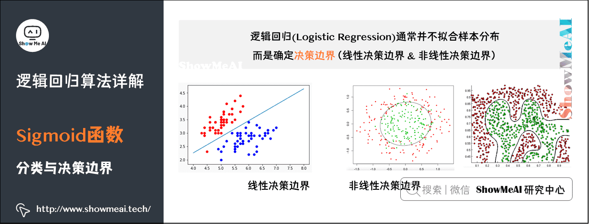

2）线性决策边界生成

那么，逻辑回归是怎么得到决策边界的呢，它与 Sigmoid 函数又有什么关系呢？

如下图中的例子：

如果我们用函数 $g$  表示 Sigmoid 函数，逻辑回归的输出结果由假设函数 $h_{\theta}(x) = g (\theta_0 + \theta_1x_1+\theta_2x_2)$ 得到。

对于图中的例子，我们暂时取参数 $\theta_0$、$\theta_1$、$\theta_2$ 分别为 -3 、1 和 1，那么对于图上的两类样本点，我们代入一些坐标到 $h_{\theta}(x)$ ，会得到什么结果值呢。

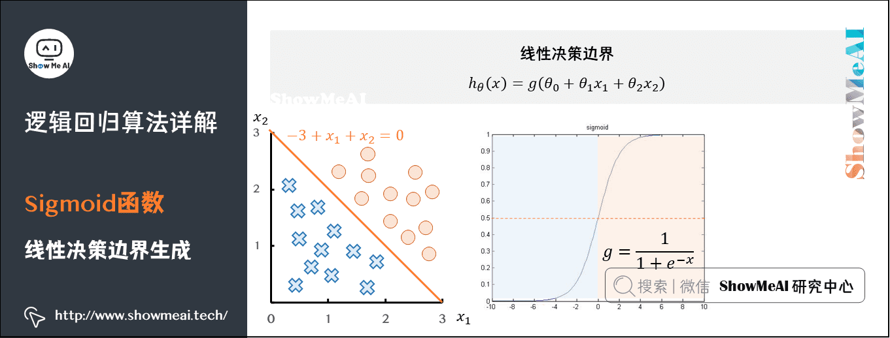

- 对于直线上方的点 $(x_1,x_2)$ (例如(100,100)),代入 $-3+x_1+x_2$ ,得到大于0的取值，经过
Sigmoid 映射后得到的是大于0.5的取值。

- 对于直线下方的点 $(x_1,x_2)$ (例如(0,0)),代入 $-3+x_1+x_2$ ,得到小于0的取值，经过 Sigmoid 映射后得到的是小于0.5的取值。

如果我们以0.5为判定边界，则线性拟合的直线 $-3+x_1+x_2=0$ 变换成了一条决策边界 (这里是线性决策边界)。

3）非线性决策边界生成

其实，我们不仅仅可以得到线性决策边界，当 $h_\theta(x)$ 更复杂的时候，我们甚至可以得到对样本非线性切分的非线性决策边界 (这里的非线性指的是无法通过直线或者超平面把不同类别的样本很好地切分开)。

如下图中另外一个例子：如果我们用函数$g$表示 Sigmoid 函数，逻辑回归的输出结果由假设函数 $h_\theta(x)=g\left(\theta_0+\theta_1x_1+\theta_2x_2+\theta_3x_1^2+\theta_4x_2^2\right)$ 得到。
对于图中的例子，我们暂时取参数 $\theta_0$、$\theta_1$、$\theta_2$、$\theta_3$、$\theta_4$ 分别为-1、0、0、1 和 1,那么对于图上
的两类样本点，我们代入一些坐标到 $h_\theta(x)$,会得到什么结果值呢。

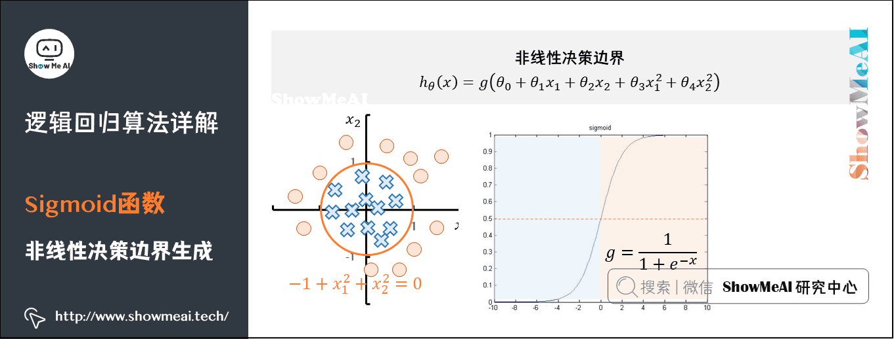

- 对于圆外部的点 $(x_1,x_2)$ (例如(100,100) ),代入 $\theta_0+\theta_1x_1+\theta_2x_2+\theta_3x_1^2+\theta_4x_2^2$,得到大于0的取值，经过 Sigmoid 映射后得到的是大于0.5的取值。

- 对于圆内部的点 $(x_1,x_2)$ (例如(0,0) ),代入 $\theta_0+\theta_1x_1+\theta_2x_2+\theta_3x_1^2+\theta_4x_2^2$,得到小于0的取值，经过 Sigmoid 映射后得到的是小于0.5的取值。

如果我们以0.5为判定边界，则线性拟合的圆曲线 $-1+x_1^2+x_2^2=0$ 变换成了一条决策边界 (这里是非线性决策边界)。

## 梯度下降与优化

### 1）损失函数

前一部分的例子中，我们手动取了一些参数  的取值，最后得到了决策边界。但大家显然可以看到，取不同的参数时，可以得到不同的决策边界。

**哪一条决策边界是最好的呢** ？我们需要定义一个能量化衡量模型好坏的函数——损失函数（有时候也叫做「目标函数」或者「代价函数」）。我们的目标是使得损失函数最小化。

如何衡量预测值和真实值的差值？最简单直接的方式就是使用均方误差，也就是均方误差损失（MSE）

$$
MSE=\frac{1}{m}\sum_{i=1}^m\left(f\left(x_i\right)-y_i\right)^2
$$

但是在Sigmoid函数的变换使得我们最终得到的损失函数，是非常不光滑凹凸不平的，即非凸的损失函数，我们要找到最优参数（使得函数取值最小的参数）是很困难的。

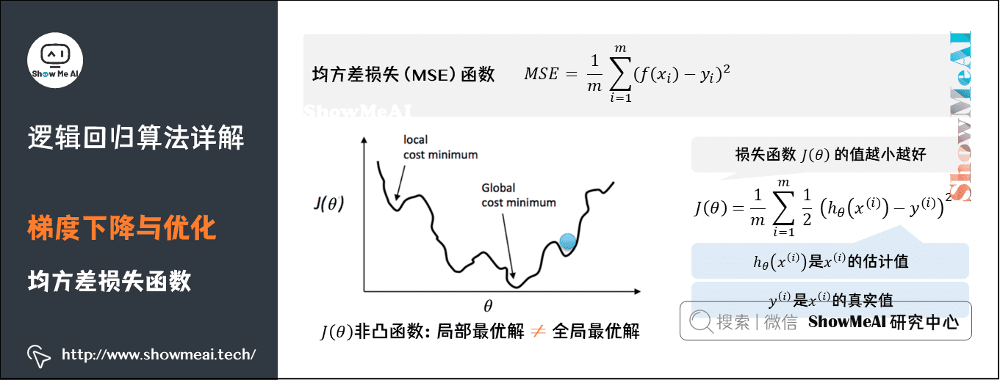

> 在逻辑回归模型场景下，使用MSE得到的损失函数是非凸的，数学特性不太好，我们希望损失函数如下的凸函数。凸优化问题中，局部最优解同时也是全局最优解，这一特性使得凸优化问题在一定意义上更易于解决，而一般的非凸最优化问题相比之下更难解决。

我们更希望我们的损失函数如下图所示，是凸函数，我们在数学上有很好优化方法可以对其进行优化。

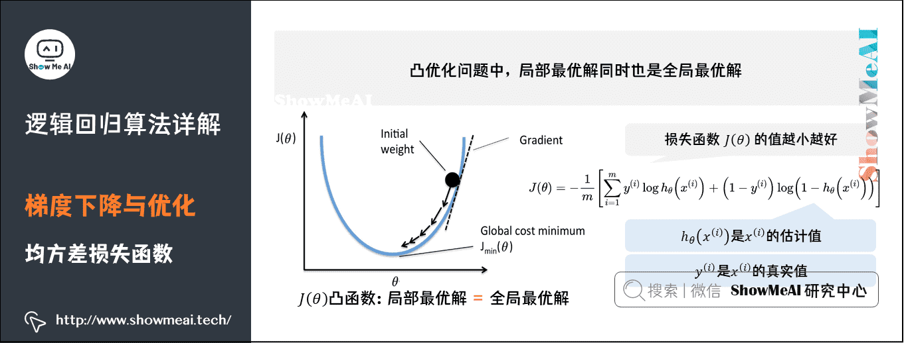

在逻辑回归模型场景下，我们会改用 **对数损失函数(Log Loss)** （二元交叉熵损失），这个损失函数同样能很好地衡量参数好坏，又能保证凸函数的特性。

假设有 $N$ 个样本，样本的特征为 $X$，标签为 $y \in \{0, 1\}$，模型预测的概率为 $\hat{y} = P(y=1|X)$。对数损失函数定义为：

$$
J(\theta)=-\frac{1}{m}\left[\sum_{i=1}^my^{(i)}\log h_\theta\left(x^{(i)}\right)+\left(1-y^{(i)}\right)\log\left(1-h_\theta\left(x^{(i)}\right)\right)\right]
$$

其中 $y^{(i)}$ 表示样本取值，在其为正样本时取值为 ，负样本时取值为0，我们分这两种情况来看看：

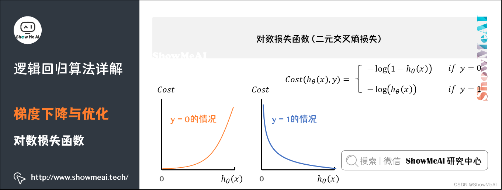

$$
\left.\mathrm{Cost}(h_\theta(x),y)=\left\{\begin{aligned}&-\log(1-h_\theta(x))&&\mathrm{if~}y=0\\&-\log(h_\theta(x))&&\mathrm{if~}y=1\end{aligned}\right.\right.
$$

- $y^{(i)}=0$：当一个样本为负样本时，若 $h_\theta(x)$ 的结果接近 1 (即预测为正样本),那么 $-\log(1-h_\theta\left(x\right))$ 的值很大，那么得到的惩罚就大。

- $y^{(i)}=1$：当一个样本为正样本时，若 $h_\theta(x)$ 的结果接近 0 (即预测为负样本),那么 $-\log(h_\theta\left(x\right))$
 的值很大，那么得到的惩罚就大。


!!! note "为什么损失函数不用MSE而是用交叉熵？"
    具体可以参考：[面试题解答6：逻辑斯蒂回归为什么使用交叉熵而不是MSE](https://zhuanlan.zhihu.com/p/453411383)
    （1）损失函数的凸性，前面介绍过
    （2）MSE的损失小于交叉熵的损失，导致对分类错误的点的惩罚不够


### 2）梯度下降

损失函数可以用于衡量模型参数好坏，但我们还需要一些优化方法找到最佳的参数（使得当前的损失函数值最小）。最常见的算法之一是「梯度下降法」，逐步迭代减小损失函数（在凸函数场景下非常容易使用）。如同下山，找准方向（斜率），每次迈进一小步，直至山底。

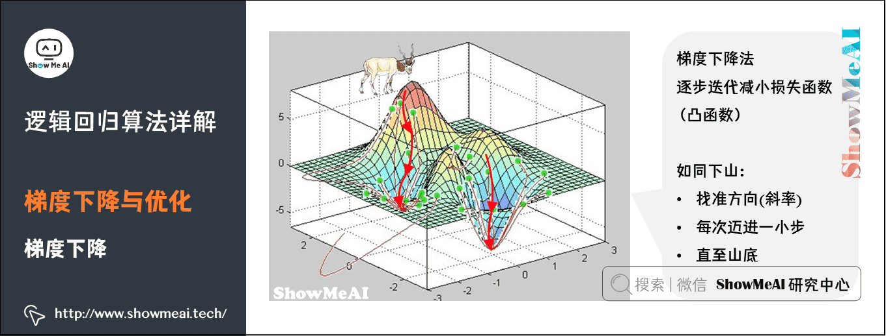

梯度下降（Gradient Descent）法，是一个一阶最优化算法，通常也称为最速下降法。要使用梯度下降法找到一个函数的局部极小值，必须向函数上当前点对应梯度（或者是近似梯度）的反方向的规定步长距离点进行迭代搜索。

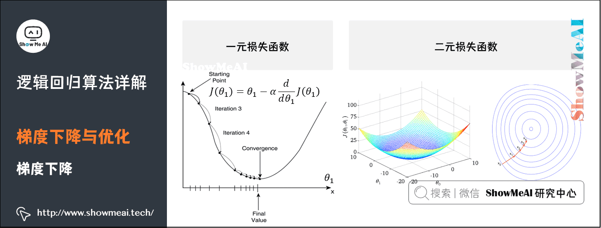

上图中，$\alpha$ 称为学习率（learning rate），直观的意义是，在函数向极小值方向前进时每步所走的步长。太大一般会错过极小值，太小会导致迭代次数过多。


> 具体内容可见：[图解AI数学基础|微积分与最优化](https://www.showmeai.tech/article-detail/165)

## 正则化与缓解过拟合

### 1）过拟合现象

在训练数据不够多，或者模型复杂又过度训练时，模型会陷入过拟合（Overfitting）状态。如下图所示，得到的不同拟合曲线（决策边界）代表不同的模型状态：

- 拟合曲线1能够将部分样本正确分类，但是仍有较大量的样本未能正确分类，分类精度低，是「欠拟合」状态。

- 拟合曲线2能够将大部分样本正确分类，并且有足够的泛化能力，是较优的拟合曲线。

- 拟合曲线3能够很好的将当前样本区分开来，但是当新来一个样本时，有很大的可能不能将其正确区分，原因是该决策边界太努力地学习当前的样本点，甚至把它们直接「记」下来了。

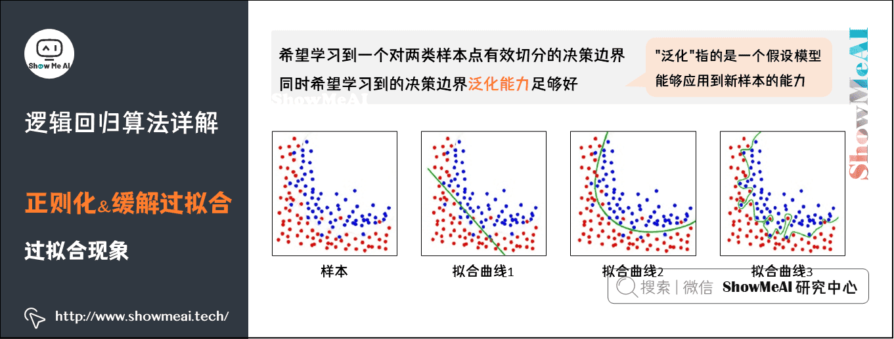

拟合曲线中的「抖动」，表示拟合曲线不规则、不光滑（上图中的拟合曲线3），对数据的学习程度深，过拟合了。

### 2）正则化处理

过拟合的一种处理方式是正则化，我们通过对损失函数添加正则化项，可以约束参数的搜索空间，从而保证拟合的决策边界并不会抖动非常厉害。如下图为对数损失函数中加入正则化项（这里是一个L2正则化项）

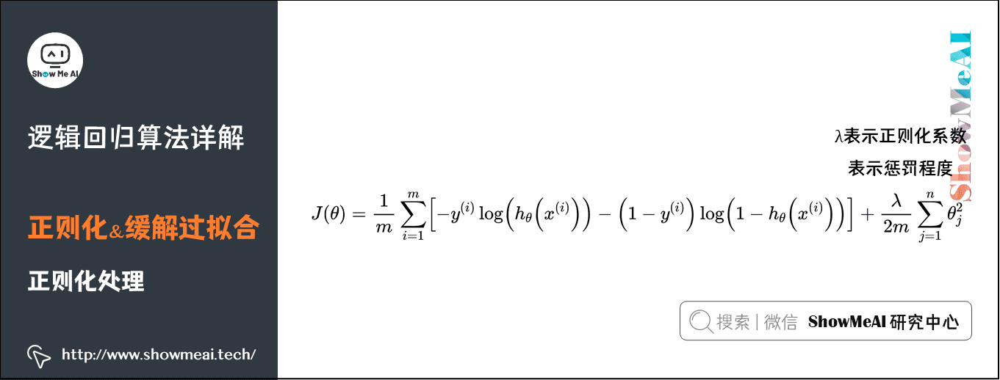

$$
J(\theta)=\frac1m\sum_{i=1}^m\left[-y^{(i)}\log\left(h_\theta\left(x^{(i)}\right)\right)-\left(1-y^{(i)}\right)\log\left(1-h_\theta\left(x^{(i)}\right)\right)\right]+\frac\lambda{2m}\sum_{j=1}^n\theta_j^2
$$

其中 $\lambda$ 表示正则化系数，表示惩罚程度，$\lambda$ 的值越大，为使 $J(\theta)$ 的值小，则参数 $\theta$ 的绝对值就得越小，通常对应于越光滑的函数，也就是更加简单的函数，因此不易发生过拟合的问题。我们依然可以采用梯度下降对加正则化项的损失函数进行优化。

!!! note "正则化"
    在逻辑回归中，常见的正则化方法有 L1 正则化和 L2 正则化：

    L1 正则化（Lasso）：在损失函数中添加参数绝对值的和作为惩罚项。公式为： 
    $$ 
    J(\theta) = \frac{1}{m} \sum_{i=1}^m \left[ -y^{(i)} \log(h_\theta(x^{(i)})) - (1 - y^{(i)}) \log(1 - h_\theta(x^{(i)})) \right] + \lambda \sum_{j=1}^n |\theta_j| 
    $$ 
    L1 正则化可以导致一些参数变为零，即产生稀疏值矩阵，产生一个稀疏模型，从而实现特征选择。
    
    L2 正则化（Ridge）：在损失函数中添加参数平方和的一半作为惩罚项。公式为： 
    $$
    J(\theta) = \frac{1}{m} \sum_{i=1}^m \left[ -y^{(i)} \log(h_\theta(x^{(i)})) - (1 - y^{(i)}) \log(1 - h_\theta(x^{(i)})) \right] + \frac{\lambda}{2m} \sum_{j=1}^n \theta_j^2 
    $$ 
    L2 正则化会使参数趋向于零，但不会完全变为零，从而使模型更加平滑。

## 特征变换与非线性表达

### 1）多项式特征

对于输入的特征，如果我们直接进行线性拟合再给到 Sigmoid 函数，得到的是线性决策边界。但添加多项式特征，可以对样本点进行多项式回归拟合，也能在后续得到更好的非线性决策边界。

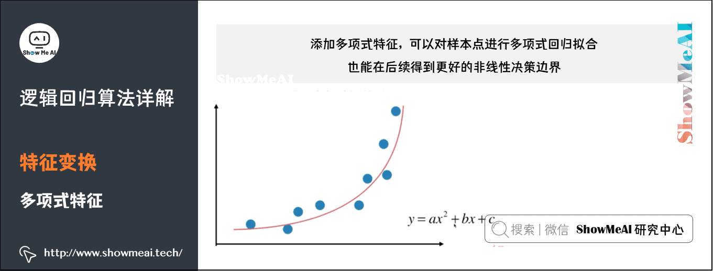

多项式回归，回归函数是回归变量多项式。多项式回归模型是线性回归模型的一种，此时回归函数关于回归系数是线性的。

在实际应用中，通过增加一些输入数据的非线性特征来增加模型的复杂度通常是有效的。一个简单通用的办法是使用多项式特征，这可以获得特征的更高维度和互相间关系的项，进而获得更好的实验结果。

### 2）非线性切分

如下图所示，在逻辑回归中，拟合得到的决策边界，可以通过添加多项式特征，调整为非线性决策边界，具备非线性切分能力。

- $Z_\theta(x)$ 中 $\theta$ 是参数，当 $Z_\theta(x)=\theta_0+\theta_1x$ 时，此时得到的是线性决策边界；

- $Z_\theta(x)=\theta_0+\theta_1x+\theta_2x^2$ 时，使用了多项式特征，得到的是非线性决策边界。

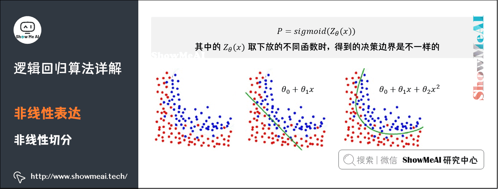

目的是低维线性不可分的数据转化到高维时，会变成线性可分。得到在高维空间下的线性分割参数映射回低维空间，形式上表现为低维的非线性切分。

## 如何用逻辑回归处理多标签问题

逻辑回归本身只能用于二分类问题，如果实际情况是多分类的，那么就需要对模型进行一些改动，以下是三种比较常用的将逻辑回归用于多分类的方法：

### One vs One

训练过程：从多个类别中每次抽取两个类别，将对应的样本输入到一个逻辑回归模型中，学习得到一个针对这两个类别的分类器。如此重复，直到所有类别两两之间都有一个分类器。例如有四个类别时，分类器数量为 $C_4^2=6$ 个，具体组合如表格所示：

| | 0 | 2 | 3 |
| --- | --- | --- | --- |
| 0 | | 0 vs 2 | 0 vs 3 |
| 1 | | 1vs 2 | 1vs 3 |
| 2 | | | 2 vs 3 |
| 3 | | |

预测过程：需要运行每一个训练好的模型，记录每个分类器的预测结果，每个分类器相当于进行一次投票，最终取获得票数最多的类别作为多分类的结果。比如在上述四个类别的例子中，若 6 个分类器有 3 个投票给类别 3，1 个投票给类别 2，1 个投票给类别 1，1 个投票给类别 0，则取类别 3 为最终预测结果。

优缺点：当类别增多时，训练的分类器数量会大幅增加，提高了训练开销，但每个训练器只需要输入两个类别对应的训练样本，又减少了一定开销；从预测角度看，这种方式需要运行的分类器多，且无法降低每个分类器的预测时间复杂度，所以预测开销较大。

### One vs All

针对问题：一个样本对应多个标签。

训练过程：从所有类别中依次选择一个类别作为 1，其他所有类别作为 0，来训练分类器。例如对于四个类别，分类器数量为 4 个，具体如下：


| 作为1的类别 | 作为0的类别 |
| ----------- | ----------- |
| 0           | 1；2；3     |
| 1           | 0；2；3     |
| 2           | 0；1；3     |
| 3           | 0；1；2     |

预测过程：根据每个分类器对其对应的类别 1 的概率进行排序，选择概率最高的那个类别作为最终的预测类别。

优缺点：分类器数量比 One vs One 少，但是每个分类器训练时需要输入所有训练数据，所以每个分类器的训练时间复杂度高于 One vs One；从预测方面来说，分类器数量少且每个分类器预测时间复杂度不变，总体预测时间复杂度小于 One vs One。


### 从 Sigmoid 函数到 Softmax 函数的推导

针对问题：一个样本对应一个标签

原理：当面对多个分类时，让 $k - 1$ 个类别分别对剩下的那个类别做回归，得到 $k - 1$ 个 logit 公式：

$$
\log\frac{P(Y = c_{i}|x)}{P(Y = c_{k}|x)} = w_{i}x(i = 1,2,\cdots,k - 1)
$$

然后变形可得:

$$
P(Y = c_{i}|x)=P(Y = c_{k}|x)\exp(w_{i}x)(i = 1,2,\cdots,k - 1)
$$

由于所有类别的可能性相加为 1，即

$$
P(Y = c_{k}|x)=1-\sum_{i = 1}^{k - 1}P(Y = c_{i}|x)=1-\sum_{i = 1}^{k - 1}P(Y = c_{k}|x)\exp(w_{i}x)
$$

通过解方程可得到关于某个样本被分类到类别 $c_{k}$ 的概率:

$$
P(Y = c_{k}|x)=\frac{1}{1+\sum_{i = 1}^{k - 1}\exp(w_{i}x)}
$$

这就是 softmax 函数。    

 与逻辑回归的关系：softmax 函数是 sigmoid 函数的更一般化表示，sigmoid 函数是 softmax 函数的特殊情况。在逻辑斯蒂回归中，通过上述推导将其推广到多分类问题，利用 softmax 函数得到最终的分类结果。 


## 算法

```python
import numpy as np
import matplotlib.pyplot as plt
from sklearn.metrics import confusion_matrix, ConfusionMatrixDisplay, roc_curve, auc, classification_report

# Sigmoid 函数
def sigmoid(z):
    return 1 / (1 + np.exp(-z))

# 损失函数
def compute_loss(y, y_pred):
    epsilon = 1e-15
    y_pred = np.clip(y_pred, epsilon, 1 - epsilon)
    return -np.mean(y * np.log(y_pred) + (1 - y) * np.log(1 - y_pred))

# 梯度下降更新参数
def gradient_descent(X, y, weights, learning_rate):
    m = X.shape[0]
    y_pred = sigmoid(np.dot(X, weights))
    gradient = np.dot(X.T, (y_pred - y)) / m
    weights -= learning_rate * gradient
    return weights

# 逻辑回归模型类
class LogisticRegression:
    def __init__(self, learning_rate=0.01, iterations=1000):
        self.learning_rate = learning_rate
        self.iterations = iterations
        self.weights = None
        self.loss_history = []

    def fit(self, X, y):
        self.weights = np.zeros(X.shape[1])
        for i in range(self.iterations):
            self.weights = gradient_descent(X, y, self.weights, self.learning_rate)
            y_pred = sigmoid(np.dot(X, self.weights))
            loss = compute_loss(y, y_pred)
            self.loss_history.append(loss)
            if i % 100 == 0:
                print(f"Iteration {i}, Loss: {loss}")

    def predict(self, X):
        y_pred = sigmoid(np.dot(X, self.weights))
        return (y_pred >= 0.5).astype(int)

    def predict_proba(self, X):
        return sigmoid(np.dot(X, self.weights))

# 可视化函数
def plot_decision_boundary(X, y, model):
    x_min, x_max = X[:, 1].min() - 1, X[:, 1].max() + 1
    y_min, y_max = X[:, 2].min() - 1, X[:, 2].max() + 1
    xx, yy = np.meshgrid(np.arange(x_min, x_max, 0.01),
                         np.arange(y_min, y_max, 0.01))
    grid = np.c_[np.ones(xx.ravel().shape), xx.ravel(), yy.ravel()]
    predictions = model.predict(grid).reshape(xx.shape)

    plt.contourf(xx, yy, predictions, alpha=0.8, cmap=plt.cm.coolwarm)
    plt.scatter(X[:, 1], X[:, 2], c=y, edgecolors='k', cmap=plt.cm.coolwarm)
    plt.xlabel("Feature 1")
    plt.ylabel("Feature 2")
    plt.title("Decision Boundary")
    plt.show()

def plot_learning_curve(model):
    plt.plot(range(len(model.loss_history)), model.loss_history)
    plt.xlabel("Iteration")
    plt.ylabel("Loss")
    plt.title("Learning Curve")
    plt.show()

def plot_confusion_matrix(y_true, y_pred):
    cm = confusion_matrix(y_true, y_pred)
    disp = ConfusionMatrixDisplay(confusion_matrix=cm, display_labels=[0, 1])
    disp.plot(cmap=plt.cm.Blues)
    plt.title("Confusion Matrix")
    plt.show()

def plot_roc_curve(y_true, y_pred_prob):
    fpr, tpr, _ = roc_curve(y_true, y_pred_prob)
    roc_auc = auc(fpr, tpr)

    plt.figure()
    plt.plot(fpr, tpr, color='darkorange', lw=2, label=f"ROC curve (area = {roc_auc:.2f})")
    plt.plot([0, 1], [0, 1], color='navy', lw=2, linestyle='--')
    plt.xlabel("False Positive Rate")
    plt.ylabel("True Positive Rate")
    plt.title("Receiver Operating Characteristic (ROC)")
    plt.legend(loc="lower right")
    plt.show()


# 示例数据
X = np.array([[0.5, 1.2],
              [1.5, 2.3],
              [3.1, 4.0],
              [2.0, 1.0],
              [0.8, 0.5]])
y = np.array([0, 0, 1, 1, 0])

# 添加偏置项
X = np.c_[np.ones(X.shape[0]), X]

# 创建并训练模型
model = LogisticRegression(learning_rate=0.1, iterations=1000)
model.fit(X, y)

# 可视化模型性能
print("Classification Report:")
y_train_pred = model.predict(X)
print(classification_report(y, y_train_pred))

plot_decision_boundary(X, y, model)  # 决策边界
plot_learning_curve(model)           # 学习曲线
plot_confusion_matrix(y, y_train_pred)  # 混淆矩阵

# 预测概率，用于 ROC 曲线
y_train_pred_prob = model.predict_proba(X)
plot_roc_curve(y, y_train_pred_prob)

```

## 参考

[大白话深度学习中的 Sigmoid 函数](https://www.cvmart.net/community/detail/5701)

[机器学习算法（一）：逻辑回归模型（Logistic Regression, LR）](https://blog.csdn.net/weixin_39910711/article/details/81607386)

[逻辑回归(logistics regression)原理-让你彻底读懂逻辑回归](https://cloud.tencent.com/developer/article/1694338)

[一步步教你轻松学逻辑回归模型算法](https://bainingchao.github.io/2018/09/19/%E4%B8%80%E6%AD%A5%E6%AD%A5%E6%95%99%E4%BD%A0%E8%BD%BB%E6%9D%BE%E5%AD%A6%E9%80%BB%E8%BE%91%E5%9B%9E%E5%BD%92%E6%A8%A1%E5%9E%8B%E7%AE%97%E6%B3%95/)

视频：

[逻辑回归系列汇总 Logistic Regression-零基础入门](https://www.bilibili.com/video/BV1qnUdYmEc8/)

[MIT 6.036 | 机器学习导论(2020·完整版)](https://www.bilibili.com/video/BV1y44y187wN/?p=4)