---
date:
    created: 2024-12-09
categories:
    - Linux
    - OpenStack
draft: True
tags:
    - Linux
    - 私有云
---

# OpenStack基本概念及环境准备

讲解Openstack的一些基本概念以及环境的基本准备。

<!-- more -->

## Openstack基础概念讲解

IaaS平台：主要来提供基础设施：

1.计算资源：以虚拟机的形式来提供 OpenStack将其叫做实例 instance，提供CPU和内存资源

2.存储资源

3.网络资源

概念架构（Conceptual architecture）

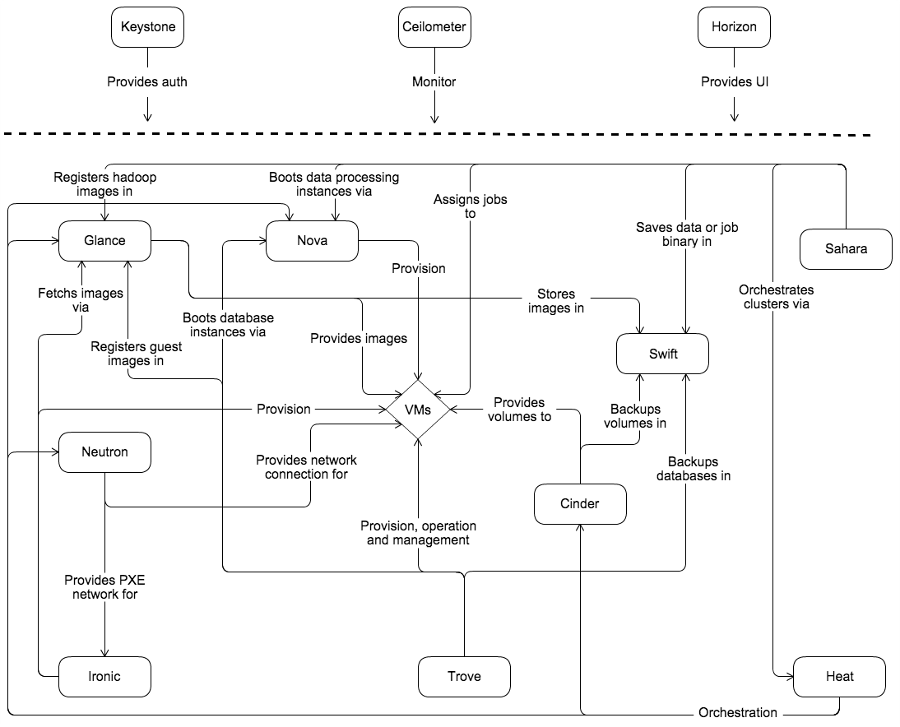

## OpenStack组件

身份验证和授权的KeyStone

Glance组件，提供image（镜像）即虚拟机的模版的上传、下载和搜索。需要对接存储资源，比如Ceph，本地目录等。

Nova组件，对instance的生命周期管理。KVM/FusionCompute/EXSI

Cinder组件，为instance提供永久存储，通过Cinder对接Ceph、LVM、，用Driver对接，其本身不提供永久存储。

Neutron组件，为我们的实例提供网络资源：子网、DHCP、Port、security rule、Route等

Horizon组件，Web的管理。

逻辑架构（Logical architecture）：

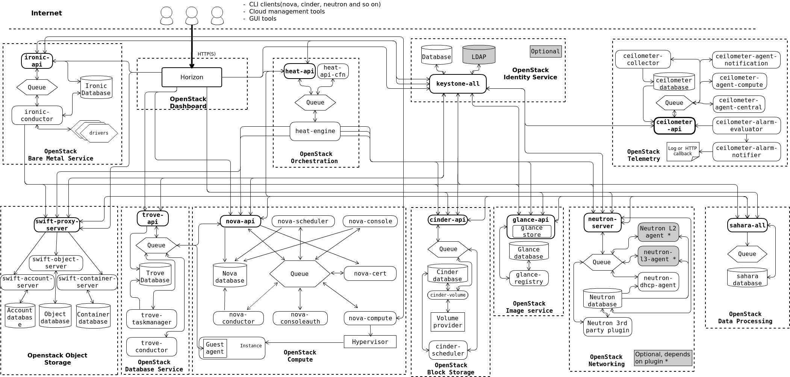

组件与组件之间通讯，通过api进行通讯。
组件内则通过Queue通讯队列进行通讯。


架构规划

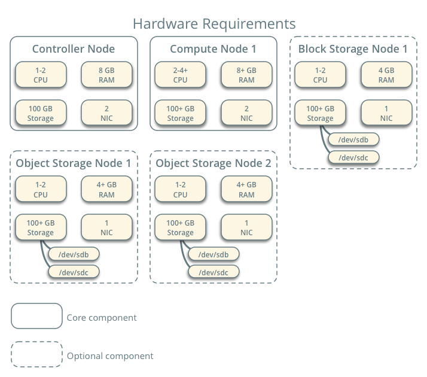


## 虚拟机安装与环境准备

### 操作系统

CentOS7

### 节点类型

**控制Controller节点**

- 内存Mem：8G+
- CPU：2+
- NIC：2
- disk：100G

运行的服务：KeyStone，Glance，RabbitMQ，MySQL，MemCache，Redis以及其他组件的API服务（例如nova-api,cinder-api）

有个网卡需要连接外网

例如：

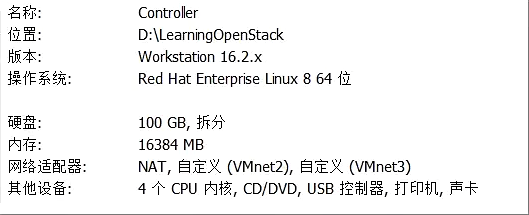

SOFTWARE SELECTION：安装Server with GUI

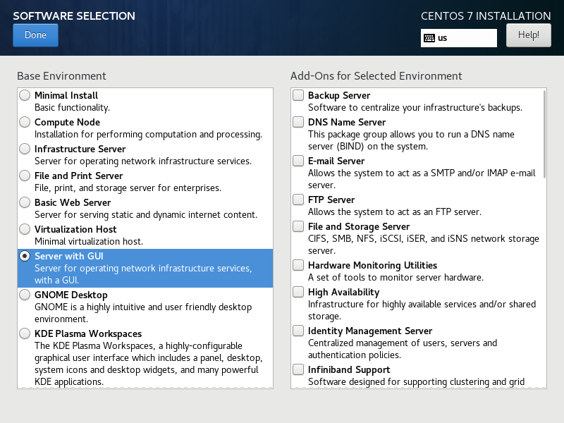


网卡分配：

- Nat：DHCP

- ManageNetWork：10.10.10.0/24 10.10.10.10，不需要配置Gateway

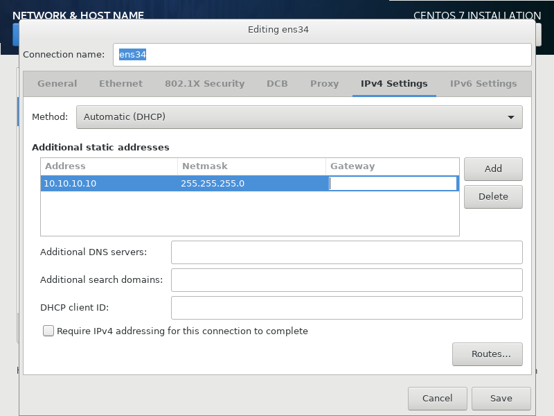

- Tenant Network：不需要配配置IP，做隧道VXLAN

controller.example.com


分区：

- /boot：1G

- /：99G

选择自定义分区：

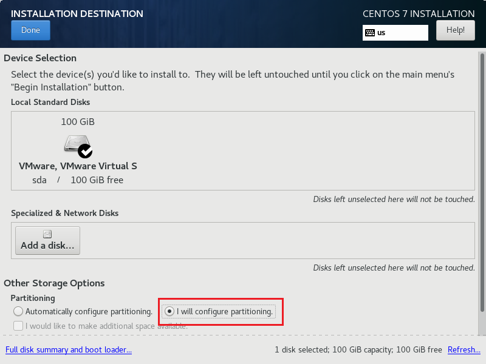


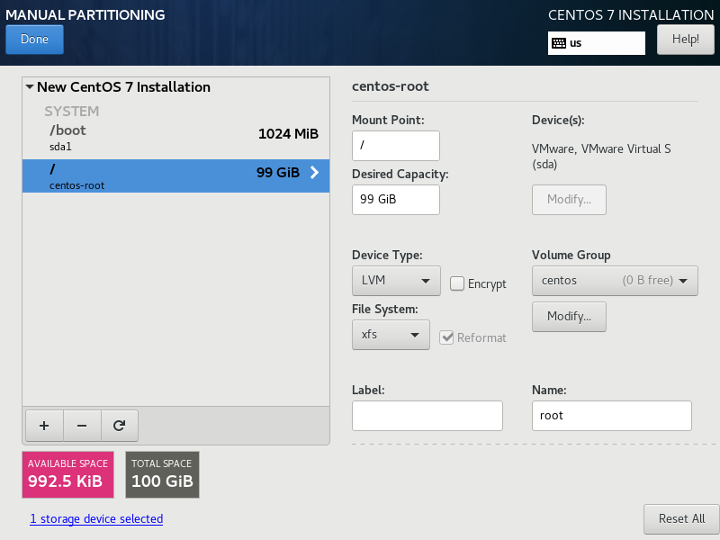

Root密码：caicloudcat

用户名：caicloudcat，密码也是caicloudcat


**计算Compute节点**

- 内存Mem：8G以上
- CPU：2+
- NIC：2
- disk：100G

运行服务：nova-compute，计算节点必须要支持虚拟化技术，比如KVM。

Windows11下可能会出现无法虚拟化，解决方式参考以下的文章：

- [解决win11 vmvare虚拟化问题（此平台不支持虚拟化的 Intel VT-x/EP）](https://blog.csdn.net/qq_45301716/article/details/131782732)

- [VMware Workstation 16平台不支持虚拟化的Intel VT-x/EPT解决方法](https://cloud.baidu.com/article/3061397)

例如：

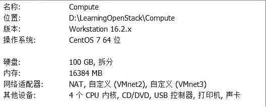


网卡分配

- Nat：DHCP

- ManageNetWork：10.10.10.0/24 10.10.10.10，不需要配置Gateway

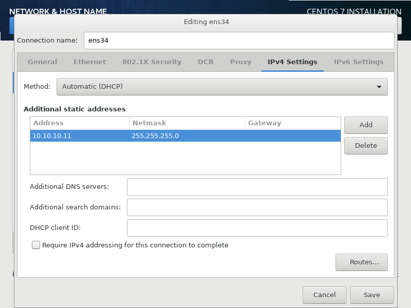


分区和密码与Controller节点一致


存储节点：

- Mem：4g
- NIC：1
- CPU：1

运行服务：Cinder-Volume的服务，通过Driver对接存储

比如：

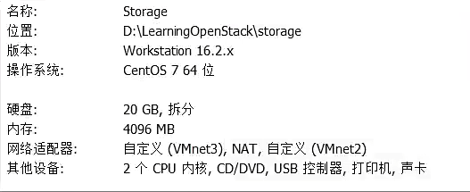


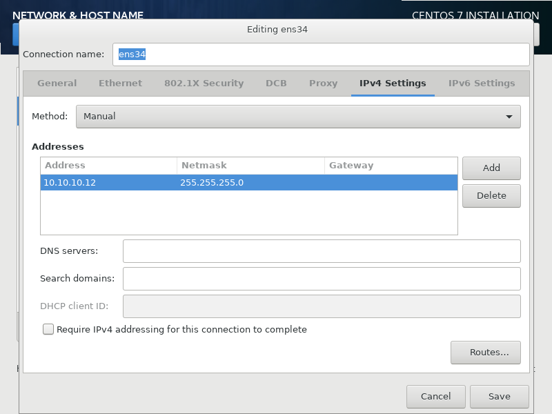

**网络类型**

Networking Option： Self-service networks


The following minimum requirements should support a proof-of-concept environment with core services and several CirrOS instances:

- Controller Node: 1 processor, 4 GB memory, and 5 GB storage

- Compute Node: 1 processor, 2 GB memory, and 10 GB storage


### 网络配置

Controller节点：


```shell
su -

nmcli connection show

nmcli connection modify ens34 autoconnection yes

nmcli connection show

nmcli connection modify ens34 autoconnect yes ipv4.method manual
```

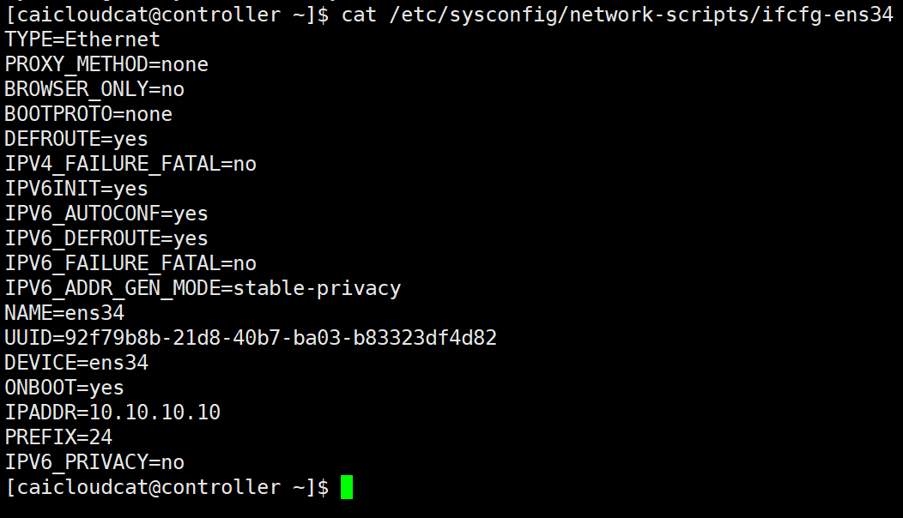


其余节点也一样：

```shell
nmcli connection modify ens34 autoconnect yes ipv4.method manual
```

这是未修改之前：

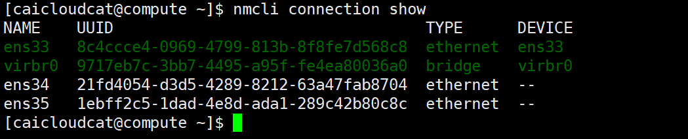

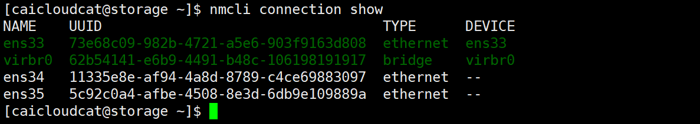


检查各个节点是否可以连接：

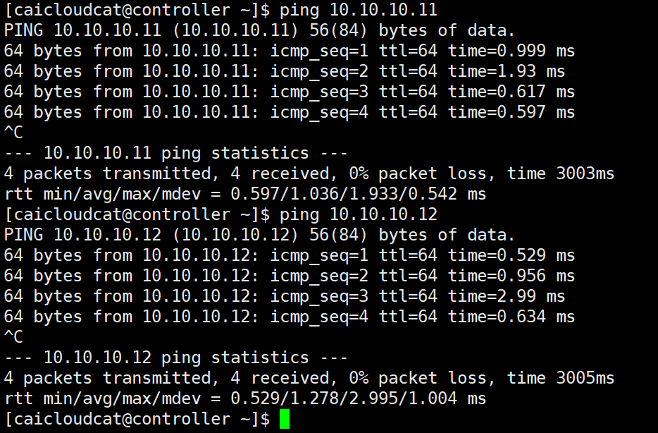


然后配置`hosts`，在Controller节点下使用该命令：

```bash
vim /etc/hosts
```

添加下面的内容：

```bash
10.10.10.10 controller.example.com controller
10.10.10.11 compute.example.com compute
10.10.10.12 storage.example.com storage
```

然后将其传给其他的节点：

```bash
cp /etc/hosts root@compute:/etc/
cp /etc/hosts root@storage:/etc/
```

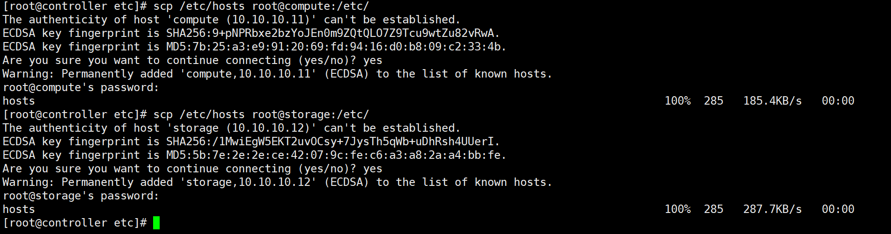


## 关闭防火墙

在所有的节点进行关闭防火墙操作：

```shell
systemctl disable firewalld.service
systemctl stop firewalld.service
```


```shell
setenforce 0    # 临时关闭selinux防火墙，0表示关闭，1表示开启
getenforce      # 查看selinux防火墙的状态

# 如果要永久关闭，则修改内容
vim /etc/selinux/confi
# 将SELINUX修改为permissive
SELINUX=permissive
```

## 配置网卡

配置所有节点的网卡


查看VM虚拟机网段：

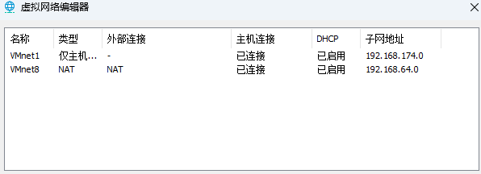

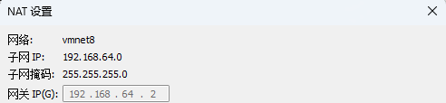

Controller的IP地址

- 第一块网卡`ens33：192.168.64.129`
- 第二块网卡`ens34：10.10.10.10`

Compute的IP地址

- 第一块网卡`ens33：192.168.64.132`

- 第二块网卡`ens34：10.10.10.11`

配置两张网卡，以Controller节点为例：

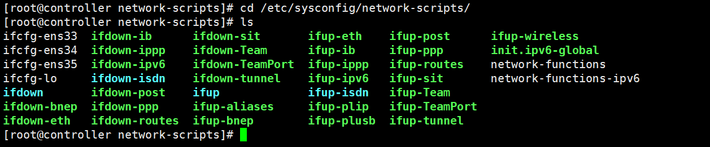


**ens33**

```bash
vim /etc/sysconfig/network-scripts/ifcfg-ens33
```

```bash
IPADDR=192.168.64.129
GATEWAY=192.168.64.2
NETMASK=255.255.255.0
DNS1=8.8.8.8
```


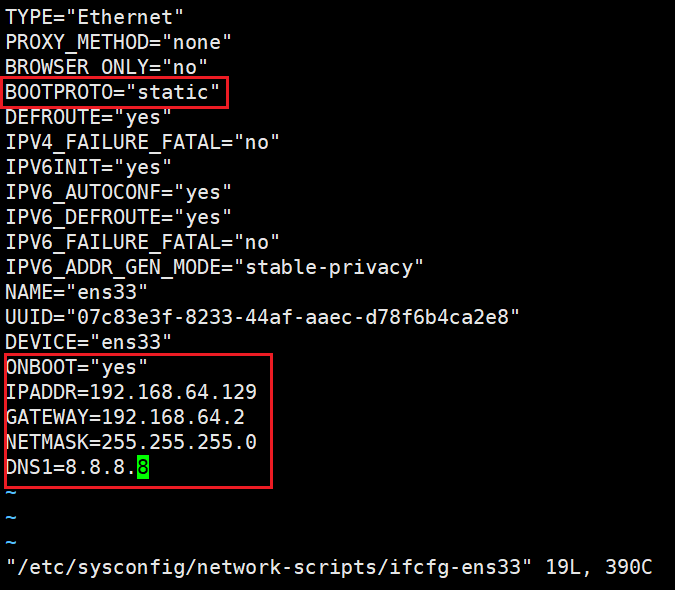


**ens34**

```bash
vim /etc/sysconfig/network-scripts/ifcfg-ens34
```

与上面的类似，将IPADDR改为：`10.10.10.10`


而其他的节点也做同样的处理。


在修改上述网卡配置文件后，进行 **重启网卡** ，并测试是否可以访问：

```shell
systemctl restart network
ping www.baidu.com
```


### 硬盘分区

```shell
fdisk /dev/sdb
```

如果之前没有初始就分区硬盘，就可以采取上面的命令进行硬盘分区，根据自己划分的硬盘进行大小分配。

```shell
lsblk # 查看分区
```

以Controller节点为例：

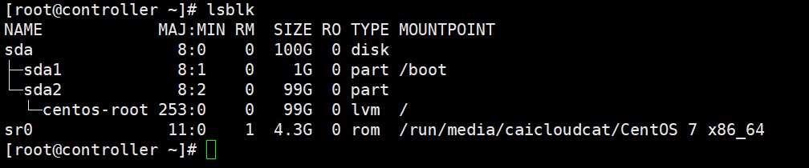

1. 在这个输出中：
   - `sda`是一个 100G 的磁盘。
   - `sda1`是`sda`的一个 1G 分区，挂载在`/boot`。
   - `sda2`是`sda`的一个 99G 分区。
   - `centos - root`是一个逻辑卷管理（LVM）设备，大小为 99G，挂载在`/`。
   - `sr0`是一个 4.3G 的只读设备，挂载在`/run/media/caicloud/CentOS 7 x86_64`。


## Controller配置

### 挂载镜像

上传镜像文件到Controller控制节点（使用Xftp8），上传至root用户根目录下。

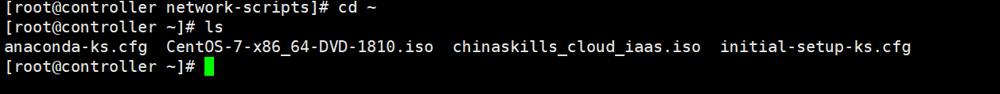

```shell
[root@controller ~]# ls
anaconda-ks.cfg  CentOS-7-x86_64-DVD-1810.iso  chinaskills_cloud_iaas.iso  initial-setup-ks.cfg
[root@controller ~]# mount -o loop CentOS-7-x86_64-DVD-1804.iso /mnt/
mount: /dev/loop0 is write-protected, mounting read-only
[root@controller ~]# mkdir /opt/centos
[root@controller ~]# mkdir /opt/openstack
[root@controller ~]# cp -rf /mnt/* /opt/centos/
[root@controller ~]# umount /mnt/
[root@controller ~]# mount -o loop chinaskills_cloud_iaas.iso /mnt/
mount: /dev/loop0 is write-protected, mounting read-only
[root@controller ~]# cp -rf /mnt/* /opt/openstack
[root@controller ~]# umount /mnt/
[root@controller ~]# 

```

### yum源文件处理

```shell
[root@controller ~]# cd /etc/yum.repos.d/
[root@controller yum.repos.d]# ls
=2.0.0  CentOS-Base-ali.repo  CentOS-OpenStack-stein.repo  epel.repo          yumcentos7.sh
bak     CentOS-Base.repo.bak  CentOS-Vault.repo            epel-testing.repo
[root@controller yum.repos.d]# mv * /media/
[root@controller yum.repos.d]# ls
[root@controller yum.repos.d]#
```

### 写入yum源文件

```shell
[root@controller yum.repos.d]# vim local.repo 
[root@controller yum.repos.d]# cat local.repo 
[centos]
name=centos
baseurl=file:///opt/centos
gpgcheck=0
enabled=1
 
[iaas]
name=iaas
baseurl=file:///opt/openstack/iaas-repo
gpgcheck=0
enabled=1
```

```shell
yum clean all
yum repolist
```


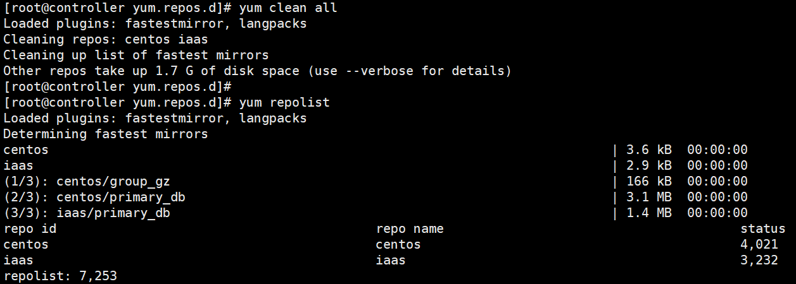


```shell
yum install -y vim vsftpd iaas-xiandian   #安装所需的软件包
```


### 配置vsftpd服务

```shell
yum install -y vsftpd
vim /etc/vsftpd/vsftpd.conf
在最后添加 anon_root=/opt/
systemctl start vsftpd
systemctl enable vsftpd
```


### 修改脚本

在Linux的`vim`编辑器中，在非插入模式下按下`Ctrl+v`，然后按`Shift+g`选中到文件末尾，再按`D`来删除从当前光标位置到文件末尾的内容，包括注释符号等。以下是对这一系列操作的详细解释： 

`Ctrl+v` ：在`vim`的非插入模式下按下`Ctrl+v`进入可视块模式（Visual Block mode）。在这种模式下，可以通过移动光标来选择一个矩形区域的文本，方便进行批量操作，如删除、复制、粘贴等。 

`Shift+g`：在可视块模式下按下`Shift+g`，会将光标快速定位到文件的末尾，并选中从当前光标位置到文件末尾的所有行。这是一种快速选择大量文本的方法，在处理长文件时非常有用。 

`D` ：在可视块模式下选中文本后，按下`D`键会删除所选中的文本。

这一系列操作就会删除从当前光标位置到文件末尾的所有内容，包括注释符号以及其他任何文本。 

```shell
[root@controller yum.repos.d]# cd /etc/xiandian/
[root@controller xiandian]# ls -l
total 4
-rwxr-xr-x. 1 root root 3617 Jan 19  2020 openrc.sh

[root@controller xiandian]# vim openrc.sh 
```

在非插入模式下按下Ctrl+v——shift+g——D可删除注释符号，推荐直接复制：

```shell

#--------------------system Config--------------------##
#Controller Server Manager IP. example:x.x.x.x
HOST_IP=192.168.64.129        #controller节点的IP地址
 
#Controller HOST Password. example:000000 
HOST_PASS=caicloudcat
 
#Controller Server hostname. example:controller
HOST_NAME=controller
 
#Compute Node Manager IP. example:x.x.x.x
HOST_IP_NODE=192.168.64.132        #compute节点的IP地址
 
#Compute HOST Password. example:000000 
HOST_PASS_NODE=caicloudcat
 
#Compute Node hostname. example:compute
HOST_NAME_NODE=compute
 
#--------------------Chrony Config-------------------##
#Controller network segment IP.  example:x.x.0.0/16(x.x.x.0/24)
network_segment_IP=192.168.64.0/24        #controller节点所在的网段
 
#--------------------Rabbit Config ------------------##
#user for rabbit. example:openstack
RABBIT_USER=openstack
 
#Password for rabbit user .example:000000
RABBIT_PASS=caicloudcat
 
#--------------------MySQL Config---------------------##
#Password for MySQL root user . exmaple:000000
DB_PASS=caicloudcat
 
#--------------------Keystone Config------------------##
#Password for Keystore admin user. exmaple:000000
DOMAIN_NAME=demo        
ADMIN_PASS=caicloudcat
DEMO_PASS=caicloudcat
 
#Password for Mysql keystore user. exmaple:000000
KEYSTONE_DBPASS=caicloudcat
 
#--------------------Glance Config--------------------##
#Password for Mysql glance user. exmaple:000000
GLANCE_DBPASS=caicloudcat
 
#Password for Keystore glance user. exmaple:000000
GLANCE_PASS=caicloudcat
 
#--------------------Nova Config----------------------##
#Password for Mysql nova user. exmaple:000000
NOVA_DBPASS=caicloudcat
 
#Password for Keystore nova user. exmaple:000000
NOVA_PASS=caicloudcat
 
#--------------------Neturon Config-------------------##
#Password for Mysql neutron user. exmaple:000000
NEUTRON_DBPASS=caicloudcat
 
#Password for Keystore neutron user. exmaple:000000
NEUTRON_PASS=caicloudcat
 
#metadata secret for neutron. exmaple:000000
METADATA_SECRET=caicloudcat
 
#Tunnel Network Interface. example:x.x.x.x
INTERFACE_IP=192.168.64.129      #本机IP地址
 
#External Network Interface. example:eth1
INTERFACE_NAME=eth1
 
#External Network The Physical Adapter. example:provider
Physical_NAME=provider
 
#First Vlan ID in VLAN RANGE for VLAN Network. exmaple:101
minvlan=101
 
#Last Vlan ID in VLAN RANGE for VLAN Network. example:200
maxvlan=200
 
#--------------------Cinder Config--------------------##
#Password for Mysql cinder user. exmaple:000000
CINDER_DBPASS=caicloudcat
 
#Password for Keystore cinder user. exmaple:000000
CINDER_PASS=caicloudcat
 
#Cinder Block Disk. example:md126p3
BLOCK_DISK=sdb2        #compute节点的存储块
 
#--------------------Swift Config---------------------##
#Password for Keystore swift user. exmaple:000000
SWIFT_PASS=caicloudcat
 
#The NODE Object Disk for Swift. example:md126p4.
OBJECT_DISK=sdb2        #compute节点的存储块
 
#The NODE IP for Swift Storage Network. example:x.x.x.x.
STORAGE_LOCAL_NET_IP=192.168.64.132   #compute节点的IP地址
 
#--------------------Heat Config----------------------##
#Password for Mysql heat user. exmaple:000000
HEAT_DBPASS=caicloudcat
 
#Password for Keystore heat user. exmaple:000000
HEAT_PASS=caicloudcat
 
#--------------------Zun Config-----------------------##
#Password for Mysql Zun user. exmaple:000000
ZUN_DBPASS=caicloudcat
 
#Password for Keystore Zun user. exmaple:000000
ZUN_PASS=caicloudcat
 
#Password for Mysql Kuryr user. exmaple:000000
KURYR_DBPASS=caicloudcat
 
#Password for Keystore Kuryr user. exmaple:000000
KURYR_PASS=caicloudcat
 
#--------------------Ceilometer Config----------------##
#Password for Gnocchi ceilometer user. exmaple:000000
CEILOMETER_DBPASS=caicloudcat
 
#Password for Keystore ceilometer user. exmaple:000000
CEILOMETER_PASS=caicloudcat
 
#--------------------AODH Config----------------##
#Password for Mysql AODH user. exmaple:000000
AODH_DBPASS=caicloudcat
 
#Password for Keystore AODH user. exmaple:000000
AODH_PASS=caicloudcat
 
#--------------------Barbican Config----------------##
#Password for Mysql Barbican user. exmaple:000000
BARBICAN_DBPASS=caicloudcat
 
#Password for Keystore Barbican user. exmaple:000000
BARBICAN_PASS=caicloudcat
```


## Compute配置

### yum 源文件处理

```shell
cd /etc/yum.repos.d/
mv * /media/
ls
```


### 创建yum源文件

```shell
[root@compute ~]# vim /etc/yum.repos.d/local.repo
[centos]
name=centos
baseurl=ftp://192.168.64.129/centos
gpgcheck=0
enabled=1
[iaas]
name=iaas
baseurl=ftp://192.168.64.129/openstack/iaas-repo
gpgcheck=0
enabled=1
```

清理软件源下载软件包（Compute在做yum repolist之前一定要先在Controller中做vsftp）

```shell
[root@compute yum.repos.d]# yum clean all
Loaded plugins: fastestmirror, langpacks
Cleaning repos: centos iaas
Cleaning up list of fastest mirrors
[root@compute yum.repos.d]# yum repolist
Loaded plugins: fastestmirror, langpacks
Determining fastest mirrors
centos              					| 3.6 kB  00:00:00     
iaas                					| 2.9 kB  00:00:00     
(1/3): centos/group_gz                  | 166 kB  00:00:00     
(2/3): iaas/primary_db                  | 1.4 MB  00:00:00     
(3/3): centos/primary_db                | 3.1 MB  00:00:00     
repo id                           repo name                                status
centos                            centos                                   4,021
iaas                              iaas                                     3,232
repolist: 7,253
[root@compute yum.repos.d]# yum install -y vim iaas-xiandian
```

### 修改脚本

```shell
[root@compute yum.repos.d]# scp 10.10.10.10:/etc/xiandian/openrc.sh /etc/xiandian/openrc.sh
[root@compute yum.repos.d]# vim /etc/xiandian/openrc.sh
```

修改`/etc/xiandian/openrc.sh`：

```shell
#Tunnel Network Interface. example:x.x.x.x
INTERFACE_IP=192.168.64.132      #本机IP地址
```

在刷脚本之前，建议创建快照

### 刷脚本

#### Controller

```shell
[root@controller ~]# iaas-pre-host.sh
......
 
[root@controller ~]# iaas-install-mysql.sh
......
 
[root@controller ~]# iaas-install-keystone.sh
......
[root@controller ~]# source /etc/keystone/admin-openrc.sh         #使环境生效
 
[root@controller ~]# iaas-install-glance.sh
......
 
[root@controller ~]# iaas-install-nova-controller.sh
......
 
[root@controller ~]# iaas-install-neutron-controller.sh
# 如果出现问题则运行该两个命令

# yum remove net-snmp-libs#卸载当前版本
# yum install 1:net-snmp-1ibs-5.7.2-37.el7.x86_64 # 安装指定版本

# yum remove1 ibxslt#卸载当前版本
# yum insta111ibxs1t-1.1.28-5.e17.x8664#安装符合依赖要求的版本
......
 
[root@controller ~]# iaas-install-dashboard.sh
......
```

#### Compute

```shell
[root@compute ~]# iaas-pre-host.sh
......
 
[root@compute ~]# iaas-install-nova-compute.sh
......
# yum remove rdma-core
# yum install rdma-core-17.2-3.el7.x86_64
# yum remove libvirt-libs
# yum install libvirt-libs-4.5.0-10.el7_6.12.x86_64
#
 
[root@compute ~]# iaas-install-neutron-compute.sh
......
```


**注意，刷完该脚本后需要重启reboot重启**


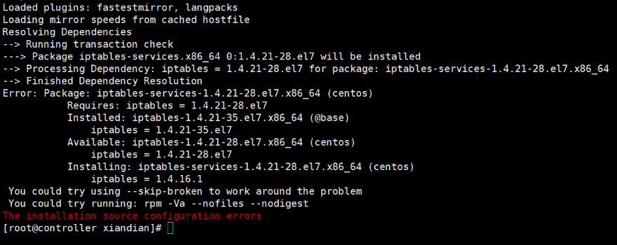


```shell
yum downgrade iptables-1.4.21-28.el7.x86_64
```

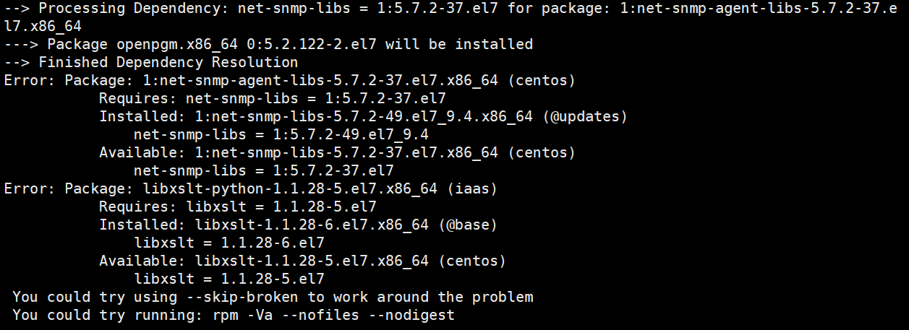

```shell
yum remove net-snmp-libs # 卸载当前版本
yum install 1:net-snmp-1ibs-5.7.2-37.el7.x86_64 # 安装指定版本

yum remove1 ibxslt # 卸载当前版本
yum insta111ibxs1t-1.1.28-5.e17.x8664 # 安装符合依赖要求的版本
```


## 登录

可打开浏览器输入：

`http://192.168.140.14/ dashboard` 

`http://192.168.140.14/dashboard/auth/login/  `

即：`http: ip(controller的ip) /dashboard`


Domian：demo
用户名：admin
密码：caicloudcat

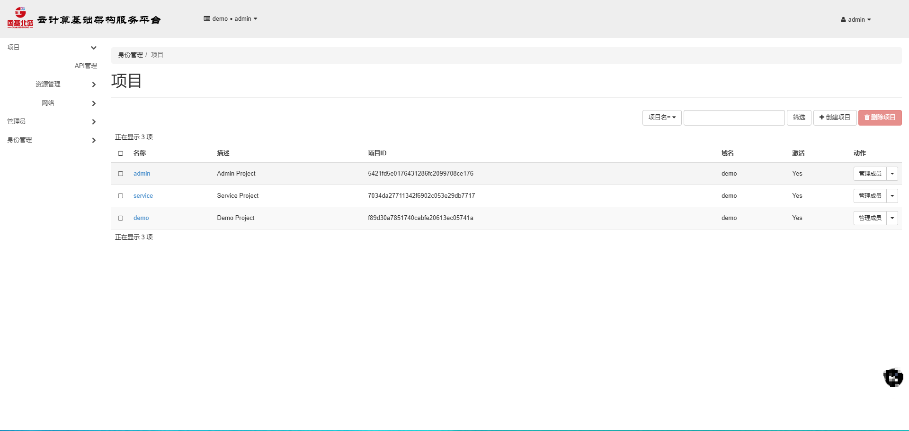


## 配置Chronyd

在Controller节点中编辑`chrony.conf`：

```bash
vim /etc/chrony.conf
```

```bash
# Allow NTP client access from local network.
#al1ow192.168.0.0/16
al1ow10.10.10.0/24

# Serve time even if not synchronized to a time source.
#local stratum 10
```

并重启服务：

```bash
systemctl restart chronyd
systemctl enable chronyd
```

在另外的两个节点也编辑`chrony.conf`，与Controller节点不同：

```bash
# Please consider joining the pool (http://www.pool.ntp.org/join.html)
server controller.example.com iburst
```


## 版本选择

**由于CentOS已经停止支持，因此yum源已经失效了，下面的已经无法正常操作**

由于用的是CentOS7，所以使用的是T版(Train)

首先更换国内镜像源：推荐使用阿里云、清华大学、网易等国内知名的 CentOS 镜像源。例如，阿里云镜像源的配置方法如下：

```bash
cd /etc/yum.repos.d/
mkdir yum.repos.d.backup # 备份旧镜像
mv *.repo yum.repos.d.backup/
wget -O /etc/yum.repos.d/CentoOS7.aliyun.repo http://mirrors.aliyun.com/repo/Centos-7.repo
yum clean all
```

更新镜像源缓存：执行`yum makecache`命令，重新生成 yum 缓存，使新的镜像源配置生效。

Enable the OpenStack repository：

```bash
yum install centos-release-openstack-train
```

```bash
yum install python-openstackclient
yum install openstack-selinux
yum upgrade
```


## 参考

核心参考：[openstack平台搭建详细教程](https://blog.csdn.net/2301_77513251/article/details/143653901?spm=1001.2014.3001.5501)