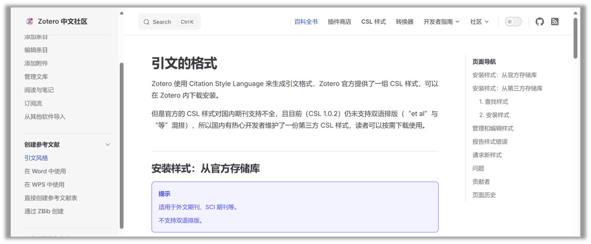

---
date:
    created: 2024-12-05
draft: True
categories:
    - Tools
tags:
    - Zotero

---

# Zotero7 讲解

简单和介绍Zotero 7的简单的安装以及基本的操作知识，提高文献管理。

<!-- more -->

## Zotero 7 下载及安装

### 软件安装

Zotero官网：https:/www.zotero.org/

Zotero中文社区网站：https://www.zotero.org/

## Zotero 7 介绍及零基础操作

### Zotero 7 工作栏介绍

Zotero 7 的工具栏可以划分为五个区域

### 文献导入与阅读

Zotero文献导入可以分为本地文件导入和网页文献导入

Zotero中PDF文献阅读视图

### 笔记功能介绍

Zotero7 中的笔记分为独立笔记和条目笔记

### 标签功能介绍

标签的作用是为了实现分类归纳

能够添加标签的对象：条目、笔记和标注

根据标签进行筛选

Zotero 的标签是一个非常重要的功能。以上介绍的只是Zotero自带的标签功能。很多插件对标签功能进行了丰富和完善，可以极大的提高生产力。

### 账号注册与同步

Zotero的同步分为“数据的同步”和“文件的同步”

Zotero中文社区的同步参考文档：https://zotero-chinese.com/user-guide/sync

### 参考文献引用

通过插件可以实现更便捷更快速的参考文献引用方式（之后会介绍）

本节仅介绍Zotero软件自带的参考文献引用方式

Zotero中文社区的创建参考文献文档：https://zotero-chinese.com/user-guide/sync

## Zotero 7 宝藏插件及使用教程

### Translate for Zotero

#### 基本用法

#### 插件设置

#### 翻译API申请

免费申请翻译API的平台：百度、阿里、腾讯、有道

申请教程参考文档：https://blog.csdn.net/weixin_44253490/article/details/126365385

百度免费额度：每月100万token

腾讯免费额度：每月500万token

阿里免费额度：每月100万token

有道免费额度：50元体验金，用完即收费

> 用国内免费翻译AP最大的优点：
> 快速和方便

#### 进阶用法

### Better Notes for Zotero

### Ethereal Style

### Jasminum

### Awesome GPT