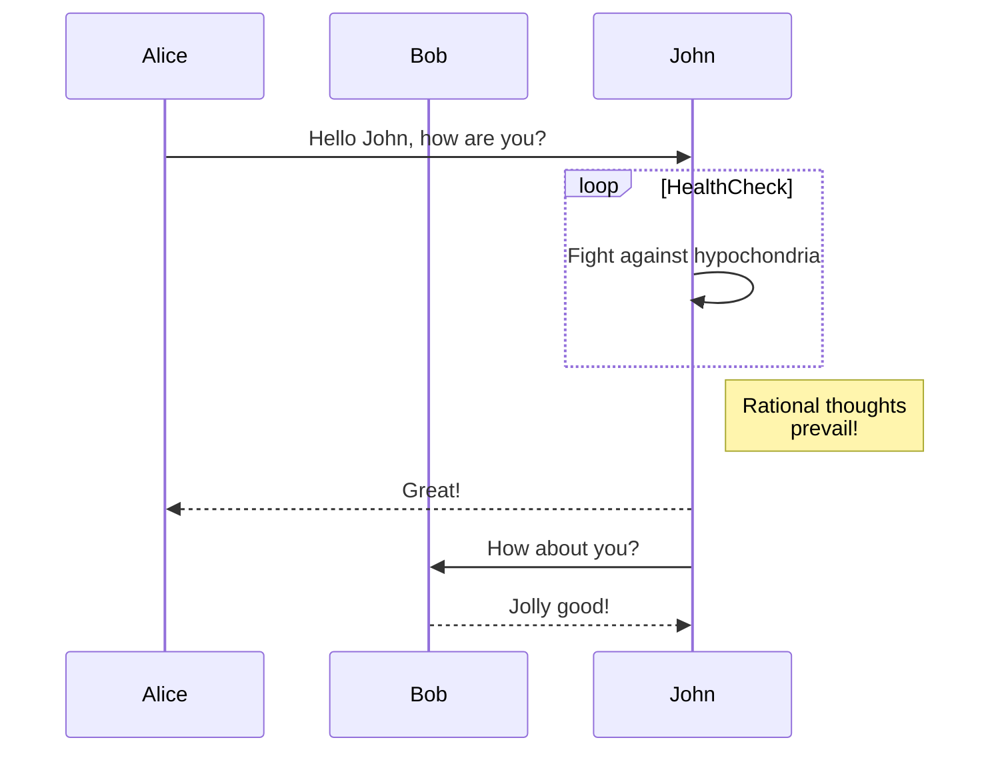

---
date:
    created: 2024-11-16
    updated: 2024-11-16
readtime: 15
---

# Mkdocs for material 的语法测试

Mkdocs的相关语法测试功能
<!-- more -->

## Part1

Example of an admonition/callout with a title:

!!! not "Title of the callout"

    Lorem ipsum dolor sit amet, consectetur adipisicing elit.
    Nulla et eusimod nulla.
    Curabitur gawgea , taeag.

??? info "Collapsible callout"

    Lorem ipsum dolor sit amet, consectetur adipisicing elit.
    Nulla et eusimod nulla.
    Curabitur gawgea , taeag.

!!! tip "提示"
    This is a tip.

!!! warning "警告"
    This is a warning.

## Part2

An Example of a codeBlock for Python:

```python title="add_numbers.py" linenums="1"
# Function to add two numbers
def add_two_numbers(num1, num2):
    return num1 + num2

# Example usage
result = add_two_numbers(5, 3)
print('The sum is:', result)
```

```js title="concatenate_strings.js" linenums="1" hl_lines="2-4"
// Function to concatenate two strings
function concatenateStrings(str1, str2) {
    return str1 + str2;
}
// Example usage
const result = concatenateStrings("Hell0,", "World!")
console.log("The concenate string is " + result)
```

## Part3

### Content Tabs

#### Generic Content

=== "Plain text"

    This is some plain text

=== "Unordered list"

    * First item 
    * Second item
    * Third item 

=== "Ordered list"

    1. First item
    2. Second item 
    3. Third item

#### Code Blocks in Content Tabs

<div class="annotate" markdown>
=== "Python"

    ```py
    def main():
        print("Hello world!") # (1)

    if __name__ == "__main__":
        main()
    ```

=== "JavaScript"

    ```java
    function main() {
        console.log("Hello world!")
    }

    main();
    ```
</div>
1.  打印Hello World！

## Part4 Diagram Example

### Flowcharts


### Sequence Diagrams



## Part5 Annotations

Lorem ipsum dolor sit amet, (1) consectetur adipiscing elit.
{ .annotate }

1. :man_raising_hand: I'm an annotation! I can contain `code`, __formatted
    text__, images, ... basically anything that can be expressed in Markdown.

Lorem ipsum dolor sit amet, (1) consectetur adipiscing elit.
{ .annotate }

1. :man_raising_hand: I'm an annotation! (1)
    { .annotate }

    1. :woman_raising_hand: I'm an annotation as well!
