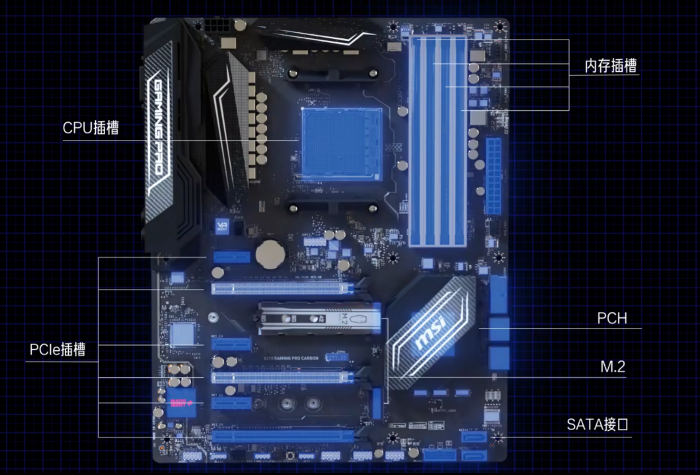

---
date:
    created: 2024-12-27
    updated: 2024-12-27
readtime: 45
categories:
    - 硬盘
tags:
    - 硬盘
---

# 详解硬盘的总线协议与接口

这里是基于B站UP主的[【硬核科普】硬盘的SATA M.2 NGFF NVME是什么意思，详解硬盘的总线协议与接口](https://www.bilibili.com/video/BV1Qv411t7ZL)的笔记，仅用于学习，侵权联系我删除。

<!-- more -->

## 总线和协议

这是一块主板。主板是计算机硬件系统的核心部件，它连接了计算机的各个重要组件。

总线是主板上的一个重要组成部分，它连接了主板上的各个组件，使得它们能够相互通信。

总线单位时间内能传输的数量称为 **总线带宽**。

固态硬盘的接口以及相容性，取决于总线协议。

协议（protocol）也就是一种标准，一种规范。

- 如何识别对方
- 如何建立链接
- 使用的讯号类型
- 数据编码解码方式
- 数据传输的类型
- 数据传输的方式
- 物理层电压电流
- 保持和截止时间

推荐阅读的书籍：编码，隐匿在计算机软硬件背后的语言

硬盘如果要和其他组件进行交互数据，进行数据交互需要：

- 数据协议做沟通
- 传输总线做媒介
- 物理接口硬盘接入

硬件数据协议有四种：

民用

- IDE（淘汰）
- AHCI
- NVMe

服务器

- SCSI

传输总线：

- SATA
- PCIe
- SAS

物理接口：

- SATA
- mSATA
- SATA Express
- M.2
  - B-Key：Socket2，支持SATA总线、PCIex2
  - M-Key：Socket3，支持SATA总线、PCIex4
- PCIe
- U.2
- SAS

