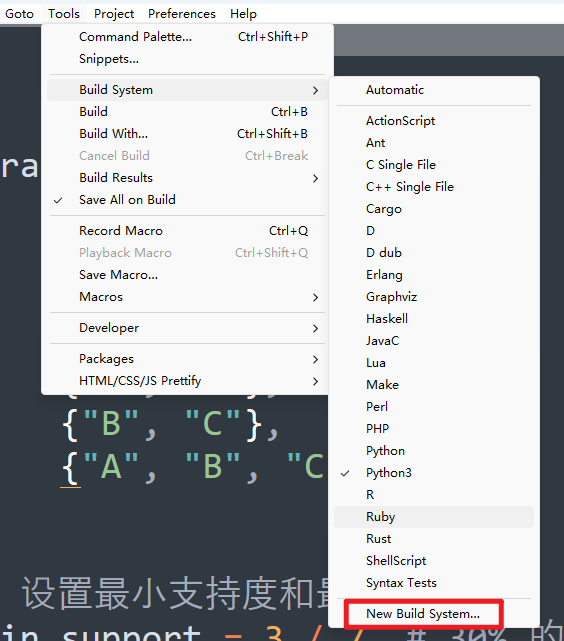
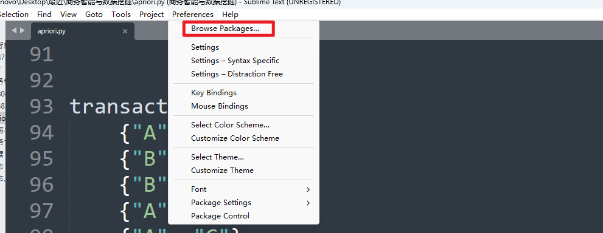

---
date:
    created: 2024-11-16
    updated: 2024-11-16
catgegories:
    - Ohters
---
# 功能技巧
这里是一些功能技巧，提高效率。
<!-- more -->

## Sublime Text3 通过HTML-CSS-JS Prettify 自动格式化代码

具体参考下面的教程:

[Sublime Text3通过HTML-CSS-JS Prettify自动格式化代码](https://blog.csdn.net/qq331300729/article/details/87889710)


## juypter文档转Markdown

起因是，由于使用jupyter notebook编辑器使用进行调试和学习代码比较方便，而且比较可视化，但是其保存的格式为`.ipynb`，不能够被Markdown识别，因此寻求如何进行转换。

!!! info "分享"
    找到的相关文档进行分享

    - [Jupyter Notebook文件转markdown](https://zhuanlan.zhihu.com/p/371132826)

    - [jupyter文档转markdown](https://cloud.tencent.com/developer/article/2308623)

### 步骤

首先安装依赖库
```shell
pip install nbconvert pandoc
```

基本命令
```shell
jupyter nbconvert --to FORMAT notebook.ipynb
```
> FORMAT 可以是 markdown html等等


## Subline配置python环境(安装第三方库)



创建 New Build System，并复制下面的内容到该文件去：

```sublime-build
{
	"cmd": ["C:/Users/lenovo/AppData/Local/Programs/Python/Python312/python.exe", "-u", "$file"],
	"path": "C:/Users/lenovo/AppData/Local/Programs/Python/Python312/",
	"file_regex": "^[ ]*File \"(...*?)\", line ([0-9]*)",
	"env": {"PYTHONIOENCODING": "utf8"}, 
	"selector": "source.python",
}

```
将该文件命名为Python3.sublime-build，如此就配置好了，点击build System就可以看到Python3

那么下次该如何看这个文件呢，其放置在



跳出来的文件夹User夹内。

下面的配置
```
"env": {"PYTHONIOENCODING": "utf8"}, 
```
用于配置pyton在sublime中输入输出的编码， **中文乱码** 可以用这条配置。

参考：

[sublime如何导入python库](https://docs.pingcode.com/baike/740028)

[sublime运行python后如何终止](https://docs.pingcode.com/baike/859476)


## 快速批量取消python的注释快捷键

一般来说是：`Ctrl` + `/`的组合快捷键

详细参考：[如何批量取消python的注释快捷键](https://docs.pingcode.com/baike/924441)
